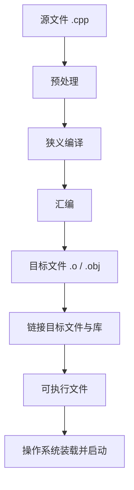

# C++ 36 个学习单元：基础重建、完整模型与工程实践

修订日期：2026-07-31  
语言标准：C++17

## 课程定位

- 适合基础：能够大致判断程序逻辑，但语法、术语、对象模型和构建过程还不扎实
- 单元时长：通常为 90～120 分钟；知识密度较高的单元允许拆成两次完成
- 学习节奏：教材可以每日发布，但个人学习进度以理解和订正结果为准
- 核心目标：既照顾初学者的前置知识，也保留真实、完整的技术模型

本课程覆盖 C++17 的核心语言、常用标准库、对象与资源管理、多文件构建、调试测试和并发入门。模板元编程、编译器实现细节、ABI、跨平台动态库部署等更高级主题不假装已经覆盖；它们会被明确标为课程外延，而不是悄悄省略。

## 为什么修订

旧版第 1 天把：

> `.cpp` 源代码 → 使用编译器编译 → 可执行文件

称作“完整过程”。这在命令层面可以帮助第一次运行程序，但在技术模型上隐藏了预处理、狭义编译、汇编和链接，也没有区分“编译器驱动程序”和“狭义的编译阶段”。这种讲法容易让学习者形成错误的单步模型。

修订后的原则是：

> 可以分层学习，但不能把局部模型冒充完整模型；可以暂时不深入，但必须说明省略了什么以及何时补齐。

## 教学契约

### 1. 先展示全图，再逐层放大

遇到复杂过程时，先给出完整路线和每个节点的一句话解释。当天只深入其中一部分时，也不会删除其他节点。

例如，源码到程序的主线始终写成：

其中，一条 `g++ main.cpp -o main` 命令通常由 **编译器驱动程序**组织多个阶段，并不表示内部只有一步。

### 2. 每个暂缓内容都必须标注去向

讲义中使用以下三类标签：

- **今天掌握**：本单元需要理解、练习并能够解释
- **先看全貌**：今天知道它存在和所处位置，不要求立即掌握细节
- **后续深入**：明确写出对应单元，不使用含糊的“以后再说”

所有已经产生的知识缺口统一登记在 [COVERAGE_MAP.md](COVERAGE_MAP.md)。

### 3. 初学者解释不能牺牲准确性

第一次出现的重要词语，按照以下顺序展开：

> 新手直觉 → 专业定义 → 最小例子 → 易混概念对比 → 执行、内存或构建位置 → 常见错误

“新手友好”只改变解释顺序和语言难度，不删除构成真实模型所必需的环节。

#### 3.1 先分清关键字、标识符和术语

- **C++ 关键字（keyword）**：语言保留并赋予固定语法意义的记号，例如 <code>if</code>、<code>return</code>、<code>class</code>。
- **标识符（identifier）**：用于命名实体的记号，例如 <code>main</code>、<code>joint_count</code>、<code>vector</code>。
- **专业术语（term）**：用于表达概念的名称，例如对象、生命周期、重定位、重载决议。

不能因为某个词重要，就把它统称为“C++ 关键字”。例如 <code>std::vector</code> 是标准库类模板名称，不是 C++ 关键字；“链接”是构建术语，也不是关键字。

#### 3.2 每个重要术语的最低讲解标准

1. **先给一句可复述的直观解释**：让初学者知道它解决什么问题或位于哪一层。
2. **紧接准确专业定义**：明确语言规则或工程边界，不能只留类比。
3. **不循环解释**：不能用另一个尚未解释的术语完成定义；若无法避免，必须立即补充该术语或链接到已经讲过的位置。
4. **标注术语身份**：区分 C++ 标准术语、工具链术语、操作系统术语和常见工程口语，不能把实现习惯冒充语言保证。
5. **给出最小代码或真实产物**：术语必须能落到代码、编译诊断、内存状态或构建文件上。
6. **指出易混概念**：优先成对比较，例如声明与定义、初始化与赋值、作用域与生命周期、程序与进程、形参与实参。
7. **必要时给出英文原词**：便于阅读编译器诊断、标准文档和英文面试资料，但不要求死背英文。
8. **说明当前学习边界**：今天只掌握入门层时，要写明完整模型和后续补全单元。

每份讲义在正文前设置“关键术语导航”，至少包含：

| 栏目 | 作用 |
|---|---|
| 术语 | 给出中文名称，必要时附英文名称或实际 C++ 拼写 |
| 新手先这样理解 | 用一句话建立正确直觉 |
| 专业上更准确地说 | 给出可继续深化、不会在后续被推翻的定义和边界 |

#### 3.3 禁止的解释方式

类比、近似说法和伪代码必须明确标注，且不能代替专业定义。不会把：

- 变量直接等同于“装数据的盒子”
- 作用域等同于生命周期
- <code>g++</code> 命令等同于单一编译阶段
- <code>std::cout</code> 简单说成普通函数
- <code>static</code> 简单说成“让变量一直存在”
- 引用绝对化地说成“没有任何自身规则的另一个名字”
- 函数调用栈、栈帧或容量翻倍等常见实现说成 C++ 标准强制要求

### 4. 同一个概念采用螺旋式学习

完整并不等于第一次就塞入全部细节。同一概念会依次经历：

1. 在全图中定位
2. 掌握最小可用方法
3. 观察真实中间产物
4. 学习语言规则和边界
5. 在工程中综合使用

每次深入都会链接到前一次内容，最终闭合知识链。

### 5. 每个单元必须说明边界

每份讲义固定包含：

- 今日目标
- 完整知识地图
- 今天掌握 / 先看全貌 / 后续深入
- 关键术语导航（新手直觉、专业定义和易混边界）
- 核心规则与准确表述
- 最小示例
- 执行、内存或构建过程跟踪
- 常见错误与失败实验
- 动手练习与深度思考
- 完成标准
- 本单元新增或偿还的知识缺口

### 6. 练习验证真实行为

每个单元尽量包含：

> 预测 → 编译 → 运行 → 观察中间结果或错误 → 修改 → 脱离示例重写 → 用自己的话解释

练习的作答区直接放在题目下方，只保留空白，不写“在这里作答”等占位文字。

---

## 第一阶段：读懂程序，并建立完整构建全图

目标：掌握基本语法，同时修正“源码一步变成可执行文件”的错误模型。

| 单元 | 学习主题 | 学完必须做到 |
|---|---|---|
| 第 1 天 | 程序、源码、构建命令与运行 | 看懂最小程序；知道一条构建命令背后仍有多个阶段 |
| 第 2 天 | 变量、基本类型、初始化与表达式 | 区分值、对象、变量、初始化和赋值的入门含义 |
| 第 3 天 | 条件、循环、代码块与作用域 | 写出分支和循环；知道作用域不等于生命周期 |
| 第 4 天 | **补全课：源码到可执行文件的完整链路** | 区分预处理、狭义编译、汇编、目标文件、链接、装载和运行；使用 `-E`、`-S`、`-c` 或等价方法观察中间产物 |
| 第 5 天 | 函数（一）：声明、定义、调用、参数与返回值 | 看懂并独立编写函数，分清声明、定义和调用 |
| 第 6 天 | 函数（二）：传参、重载、默认参数与递归 | 比较值传递和引用传递，理解重载选择和递归边界 |
| 第 7 天 | 原生数组、`std::string` 与 `std::vector` | 保存和遍历一组数据，理解大小、下标和越界 |
| 第 8 天 | 枚举、类型别名、命名空间、`struct`、`class` 与对象 | 理解自定义类型、对象、成员和命名空间的基本作用 |
| 第 9 天 | 第一阶段综合训练 | 完成多函数、多类型的机器人关节状态小程序，并解释其构建过程 |

## 第二阶段：内存、翻译单元与链接模型

目标：建立对象、内存、生命周期和多文件程序的准确模型。

| 单元 | 学习主题 | 学完必须做到 |
|---|---|---|
| 第 10 天 | 地址、指针与引用 | 分清对象、地址、指针和引用；正确使用 `&`、`*`、`nullptr` |
| 第 11 天 | 对象、存储期、生命周期、栈与堆 | 区分作用域、存储期和生命周期；知道栈/堆是常见实现与内存区域术语，不能代替语言规则 |
| 第 12 天 | 动态存储、`new`、`delete` 与所有权问题 | 识别泄漏、悬空指针、重复释放和越界，并理解手动管理为何危险 |
| 第 13 天 | `const`、`constexpr`、初始化形式、类型转换与显式转换 | 分清只读与编译期常量，识别窄化和常见隐式转换 |
| 第 14 天 | 表达式求值、短路、求值顺序、值类别入门与未定义行为 | 不只计算结果，还能判断副作用、顺序和行为是否受语言保证 |
| 第 15 天 | 预处理、头文件、宏、包含保护与翻译单元 | 解释 `#include` 实际做什么，正确组织 `.h` 与 `.cpp` |
| 第 16 天 | 分离编译、汇编、目标文件、符号、重定位、链接与库 | 观察 `.s`、`.o/.obj`，理解链接器如何解析符号并修正地址，区分静态库与动态库的入门含义 |
| 第 17 天 | 声明、定义、名称查找、命名空间、链接、ODR、`static`、`extern` 与 `inline` | 分清作用域、存储期和链接；诊断重复定义与未定义引用 |
| 第 18 天 | 编译警告、调试器、Sanitizer 与错误分类 | 区分预处理、编译、汇编、链接、装载和运行期问题，并用工具定位错误 |

## 第三阶段：类、对象生命周期与资源管理

目标：理解 C++ 对象模型以及 RAII 的设计逻辑。

| 单元 | 学习主题 | 学完必须做到 |
|---|---|---|
| 第 19 天 | 封装、访问权限、构造函数、成员初始化列表与 `this` | 设计简单类并准确解释对象如何初始化 |
| 第 20 天 | 析构函数与 RAII | 解释对象销毁时资源为何能够自动释放 |
| 第 21 天 | 拷贝构造、拷贝赋值与 Rule of Three | 分清复制对象和给已有对象赋值，识别浅拷贝问题 |
| 第 22 天 | 左值、右值、移动构造、移动赋值与 `std::move` | 理解移动的前提、效果和被移动对象的有效状态 |
| 第 23 天 | `unique_ptr`、`shared_ptr`、`weak_ptr` 与所有权 | 根据所有权关系选择智能指针，识别引用环 |
| 第 24 天 | 继承、虚函数、多态、对象切片与动态绑定 | 通过基类接口正确使用派生对象 |
| 第 25 天 | 函数重载、运算符重载与 `std::cout <<` 的真实含义 | 理解 `<<` 在流表达式中为何能连续工作，不再把它只当作神秘箭头 |
| 第 26 天 | 第三阶段综合训练 | 编写使用 RAII、智能指针和多态接口的机器人设备模型 |

## 第四阶段：标准库、工程组织与可靠性

目标：能够阅读和编写常见工程代码，并理解构建和验证过程。

| 单元     | 学习主题                                | 学完必须做到                                           |
| ------ | ----------------------------------- | ------------------------------------------------ |
| 第 27 天 | 函数模板、类模板、`auto` 与类型推导               | 看懂常见模板实例化和基本类型推导                                 |
| 第 28 天 | 顺序容器、复杂度与迭代器失效                      | 比较 `vector`、`array`、`deque`、`list` 的特点和代价        |
| 第 29 天 | 关联容器与无序容器                           | 根据查找、顺序和复杂度需求选择 `map`、`set`、`unordered_map` 等    |
| 第 30 天 | 迭代器、标准算法、Lambda 与可调用对象              | 使用算法完成查找、排序、筛选和统计                                |
| 第 31 天 | I/O 流、格式化、流状态与文件读写                  | 正确处理 `std::cin` 失败、整行输入和文本文件                     |
| 第 32 天 | 错误处理：返回值、错误码、断言、异常与 `std::optional` | 根据错误性质选择合适机制，并理解异常的基本传播过程                        |
| 第 33 天 | 多文件工程、CMake、静态/动态库与构建配置             | 写出基本 `CMakeLists.txt`，理解编译选项、链接依赖和 Debug/Release |
| 第 34 天 | 测试、静态分析、代码审查与接口设计                   | 编写基本测试，使用工具检查错误并改进接口                             |
| 第 35 天 | 并发入门：线程、互斥锁、原子变量与数据竞争               | 识别共享状态风险，写出最小同步程序                                |
| 第 36 天 | 机器人综合项目、知识闭环与模拟面试                   | 从源码组织、构建、运行到调试测试完成一个小项目，并解释关键语言机制                |
|        |                                     |                                                  |

## 第 1～3 天知识补全路线

| 已出现但未深入的内容 | 首次补全 | 后续深化 |
|---|---|---|
| 源码如何成为可执行文件 | 第 4 天：观察所有阶段 | 第 15、16、17、33 天 |
| `#include <iostream>` | 第 4 天：定位预处理阶段 | 第 15 天：头文件和翻译单元 |
| `main`、返回值和退出状态 | 第 4 天：装载与启动全图 | 第 5 天：函数与返回值 |
| `std::cout`、`std::cin` 和 `<<` / `>>` | 先作为流对象使用 | 第 25、31 天解释重载、缓冲和状态 |
| 变量、对象与内存 | 第 2 天：最小可用模型 | 第 11、13、19 天 |
| 初始化的不同写法与窄化 | 第 2 天：花括号入门 | 第 13、19 天 |
| 作用域与变量“消失” | 第 3 天：名字可见范围 | 第 11、17 天区分作用域、生命周期和链接 |
| `&&`、`||`、`++` 的精确求值 | 第 3 天：最小用法 | 第 14、25 天 |

更细的逐项状态见 [COVERAGE_MAP.md](COVERAGE_MAP.md)。

## 课程文件命名规则

- 每日讲义使用 `days/第NN天-主题.md`，其中 `NN` 是两位单元编号，`主题` 是根据当日实际学习内容提炼的简洁中文标题。
- 文件名中的主题应与讲义一级标题一致，不能只使用 `day-XX.md` 这类纯编号名称。
- 练习单 `exercises/day-XX.md`、示例目录 `examples/day-XX/` 和批改记录 `reviews/day-XX.md` 继续使用短编号，便于代码命令和路径引用。

## 课程结束时的能力检查

完成 36 个单元后，应当能够：

- 不依赖 AI 独立编写中小型 C++ 控制台程序
- 读懂常见函数、类、容器、模板、指针和资源管理代码
- 对一段代码分别解释名称可见性、对象生命周期、所有权和数据流
- 从 `.cpp` 追踪到预处理结果、汇编、目标文件、链接结果和可执行文件
- 区分并定位编译错误、链接错误、装载问题和运行期错误
- 为机器人相关小项目组织多文件、CMake、库、测试和基本并发
- 明确说出课程已经覆盖、只作概览和尚未覆盖的内容

## 计划调整规则

学习者的反馈、练习错误和理解断点可以改变后续单元的内容与节奏。计划编号提供路线，不构成必须赶进度的期限。若后续又发现被过度简化的内容，应立即登记到 `COVERAGE_MAP.md`，指定补全单元，并在对应课程发布时验证闭环。
