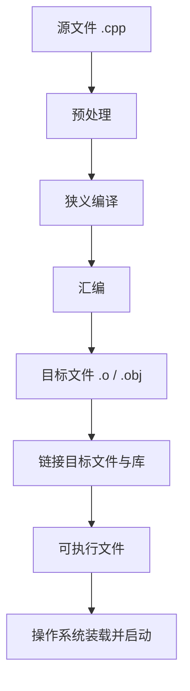

# 第 1 天：程序、源代码、构建命令与运行

预计用时：90～120 分钟  
语言标准：C++17

## 第一遍：先把一个具体问题学会（必学）

> 如果你的基础较弱，今天先只完成这一节和配套练习。下面的“第二遍”是专业细节，不是读懂第一遍的前置条件。

### 1. 今天到底解决什么问题

你写下 `std::cout << "Robot ready\n";` 后，为什么不能直接双击 `.cpp` 让处理器执行？面试官真正想听的不是“因为要编译”，而是源码、构建命令、可执行文件和运行分别是什么。

### 2. 先看这几行代码

```cpp
#include <iostream>

int main() {
    std::cout << "Robot ready\n";
    return 0;
}
```

不要先问“这个术语的完整定义是什么”。先逐行回答：当前已有哪个对象、值或文件；这一行读了什么；这一行改变或生成了什么。

### 3. 沿着同一批对象或文件走一遍

| 顺序 | 你必须能指出的具体变化 |
|---|---|
| 1 | 人能读懂的输入：`hello.cpp` |
| 2 | 构建命令：`g++ ... hello.cpp -o hello` |
| 3 | 磁盘产物：`hello` 或 `hello.exe` |
| 4 | 运行结果：终端输出 `Robot ready`，进程退出状态为 0 |

如果不能复述上表，就修改一个输入、手写预测并运行 [本课可运行示例](../examples/day-01/hello.cpp)；不要靠继续读更多术语解决。

### 4. 只给已经看到的现象命名

| 核心概念 | 先用人话理解 | 回到代码或命令找证据 |
|---|---|---|
| **源代码** | 人写在 `.cpp` 里的 C++ 文本；处理器不会直接按 C++ 语法执行。 | `hello.cpp` |
| **构建** | 工具把源文件变成可执行文件的全过程。 | `g++ ... hello.cpp -o hello` |
| **可执行文件** | 构建产物，包含可由操作系统装载的代码和数据；它不是正在运行的程序。 | `hello` / `hello.exe` |
| **进程** | 操作系统启动可执行文件后形成的一次运行实例。 | 终端输出与退出状态 |

这些解释是第一遍可用模型。第二遍会补边界和专业规则；补细节不等于推翻这里的主线。

### 5. 先形成一个求职可用回答

> 源代码是程序员编写的 C++ 文本，处理器不会直接执行 C++ 语法。日常使用 `g++` 时，它作为驱动程序组织预处理、狭义编译、汇编和链接，生成操作系统可装载的可执行文件。运行时，操作系统创建进程并装载程序，运行时准备完成后调用 `main`。因此“写代码、构建文件、启动进程”是三个不同阶段。

这段话的结构是“具体问题 → 代码/对象/文件发生什么 → 使用哪条规则 → 有什么边界”。不要只背术语。

请直接在问题下写自己的版本：

1. `g++` 为什么既常被叫作编译器，又不只是狭义编译器？

   > 

2. 源文件、可执行文件和正在运行的进程有什么区别？

   > 

### 6. 今天明确不要求什么

不背预处理、IR、符号和重定位；第 4、15～17 天用文件和工具观察。

暂缓不等于删除：第二遍会明确展开，课程计划也标出了对应单元。

### 7. 必须动手完成

- 可运行示例：[hello.cpp](../examples/day-01/hello.cpp)
- 配套练习：[day-01.md](../exercises/day-01.md)
- 编程任务：从空白文件编写程序，依次输出姓名、研究方向和 `C++ Day 1`。
预期结果：

```text
Name: HaoxiangLian
Direction: Robotics
C++ Day 1
```

- 故障实验：先不要修改，判断错误发生在构建的哪个阶段；记录诊断指向的行，再修复并重新构建。

第一遍完成标准：

- [ ] 我实际运行了正常示例，而不是只读代码。
- [ ] 我能不看讲义复述上面的状态变化表。
- [ ] 我完成了概念检查、可运行任务和调试任务，并写下面试口述初稿。
- [ ] 我能说出一个当前方案的限制，不把入门模型说成全部规则。

---

## 第二遍：完整专业细节（完成第一遍后再读）

这一部分保留完整语言模型、工具边界和深入实验。第一遍已经能跑、能调试、能口述后再进入；一次只读一个小节，并继续把术语落回代码、对象、文件或诊断。

## 今日目标

学完今天的内容，你应该能够：

1. 用自己的话解释“程序、源代码、编译器、可执行文件和运行”
2. 看懂一段最小 C++ 程序的基本结构
3. 使用编译器驱动命令完成一次端到端构建，并知道它会组织多个阶段
4. 修改输出内容并独立重写一个简单程序
5. 初步区分编译错误和程序输出

今天仍不会要求你掌握变量、内存、指针和命名空间，但不会再隐藏构建链路。

- **今天掌握**：写出、构建并运行最小程序
- **先看全貌**：预处理、狭义编译、汇编、链接、装载分别位于哪里
- **后续深入**：第 4 天实际观察各阶段产物；第 15～17 天深入翻译单元、符号、重定位和链接

对应补全项目：[`G01`～`G05`](../COVERAGE_MAP.md)。

---

## 关键术语索引（正文可跳转）

> 本表用于查阅和复习，不要求在学习正文前逐项背诵。正文会在术语真正参与知识推导时直接解释，或链接到对应的完整定义。
>
> 点击第一列术语可跳到文末术语卡。索引只用于查阅；核心概念会在具体代码中重新解释。跳转目标使用真正的 Markdown 六级标题，确保 GitHub 与 Obsidian 均可识别。

| 术语（点击跳转） | 一句话直观解释 |
|---|---|
| [C++ 关键字（keyword）](#术语-d01-01-cpp关键字) | C++ 语法预先占用的单词，例如 <code>int</code>、<code>return</code>、<code>if</code> |
| [标识符（identifier）](#术语-d01-02-标识符) | 程序中给函数、变量或类型等起的名字 |
| [程序（program）](#术语-d01-03-程序) | 为了让计算机完成任务而写的一套步骤 |
| [源代码（source code）](#术语-d01-04-源代码) | 程序员能阅读和修改的代码文字 |
| [源文件（source file）](#术语-d01-05-源文件) | 保存源代码的文件，例如 <code>main.cpp</code> |
| [构建（build）](#术语-d01-06-构建) | 把项目中的代码做成可运行程序的全过程 |
| [编译器驱动程序（compiler driver）](#术语-d01-07-编译器驱动程序) | 接收一条命令并替你调度整套工具的总指挥 |
| [狭义编译（compilation）](#术语-d01-08-狭义编译) | 检查 C++ 代码并把它翻译得更接近机器语言 |
| [汇编语言与汇编阶段（assembly）](#术语-d01-09-汇编语言与汇编阶段) | 汇编语言是接近机器指令的文字；汇编阶段再把它变成目标文件 |
| [目标文件（object file）](#术语-d01-10-目标文件) | 已有部分机器指令、但通常还不能直接运行的中间文件 |
| [链接（linking）](#术语-d01-11-链接) | 把分别处理好的代码接起来，解决“这个函数到底在哪里” |
| [可执行文件（executable file）](#术语-d01-12-可执行文件) | 可以交给操作系统启动的程序文件 |
| [运行（execution）](#术语-d01-13-运行) | 真正启动程序并让其中的代码执行 |

## 一、实际问题：人写的代码为什么不能直接运行？

你在文件中写下：

```cpp
std::cout << "Hello, C++!\n";
```

这段文字便于人阅读，但处理器并不直接按照 C++ 语法执行它。把 C++ [源代码](#术语-d01-04-源代码)变成操作系统可启动的程序，需要一套[构建](#术语-d01-06-构建)工具链协作完成。

日常通常由 `g++` 这样的[**编译器驱动程序**](#术语-d01-07-编译器驱动程序)接收命令，再组织预处理器、狭义编译器、汇编器和链接器。口语中人们常把整套工具统称为“编译器”，但内部并不是一个单独步骤。

先看完整路线。今天不要求掌握每个内部细节，但需要知道它们真实存在：

在这条路线中，[**汇编语言与汇编阶段**](#术语-d01-09-汇编语言与汇编阶段)要分开理解：前者是接近机器指令的文本表示，后者是汇编器把这种表示转换为目标文件的处理过程。[**目标文件**](#术语-d01-10-目标文件)通常已经含有机器指令，但仍可能留下外部符号引用和待修正地址，所以一般还不能直接运行。



一条 `g++ main.cpp -o main` 命令可以替我们组织这些阶段。这里把“一条命令完成端到端构建”和内部的“[狭义编译阶段](#术语-d01-08-狭义编译)”区分开。

> 本节原先使用的“源代码 → 编译 → [可执行文件](#术语-d01-12-可执行文件)”只是命令层面的缩写，不应被称为内部完整过程。第 4 天会逐步生成并观察中间产物。

---

## 二、核心术语：在讲解中建立定义

### 1. [程序](#术语-d01-03-程序)

通俗理解：让计算机按照一定顺序完成任务的一组指令。

例如，一个程序可以读取机器人关节角度、计算误差，再输出控制结果。

### 2. 源代码

由程序员编写、便于人阅读的代码文本。C++ [源文件](#术语-d01-05-源文件)通常以 `.cpp` 结尾，例如：

```text
hello.cpp
```

源代码只是文本文件，还不是最终可运行的程序。

### 3. 编译器

日常说的“编译器”有时是广义称呼。更准确地分：

- **编译器驱动程序**：接收 `g++` 这类命令，组织预处理器、编译器、汇编器和链接器
- **狭义编译器**：分析 C++ 语法、类型和语义，进行优化并在内部建立便于分析和优化的中间形式，并在本课程的 `-S` 实验中生成目标处理器的汇编文本

常见 C++ 工具链包括 GCC、Clang/LLVM 和 MSVC。第 4、16 天会观察阶段边界。

### 4. 可执行文件

完成必要的编译与链接后生成、采用操作系统可识别格式的程序文件。它通常包含机器指令、数据和装载元信息，也可能依赖外部动态库。

- Windows 上通常以 `.exe` 结尾
- Linux 和 macOS 上通常没有固定扩展名

### 5. [运行](#术语-d01-13-运行)

让操作系统启动可执行文件，使计算机真正执行其中的指令。

---

## 三、第一个完整程序

仓库中的示例文件：[hello.cpp](../examples/day-01/hello.cpp)

```cpp
#include <iostream>

int main() {
    std::cout << "Hello, C++!\n";
    return 0;
}
```

运行结果：

```text
Hello, C++!
```

下面逐行拆解。今天只需要理解每一行的用途，不要求掌握背后的全部机制。

读代码时还要区分两个概念：[**C++ 关键字**](#术语-d01-01-cpp关键字)是语言保留并赋予固定语法含义的词，例如 `int` 和 `return`；[**标识符**](#术语-d01-02-标识符)是程序中用于命名实体的记号，例如 `main` 和 `cout`。

### `#include <iostream>`

今天可以先理解为：

> 让程序能够使用标准输入输出工具，例如 `std::cout`。

它位于预处理阶段。第 4 天先观察预处理结果，第 15 天系统学习头文件、宏和翻译单元。

### `int main()`

`main` 是宿主环境 C++ 程序中约定的指定函数。更准确地说，操作系统先从可执行文件的入口点启动运行时初始化代码，随后运行时再调用 `main`；从 C++ 程序主体的学习视角，可以把 `main` 看作开始位置。

今天先把：

```cpp
int main()
```

整体记作“主函数的开头”。`int` 会在第 2 天学习，函数和返回值会在第 5 天系统学习；程序装载并进入 `main` 前后的全图放在第 4 天。

### `{` 和 `}`

一对花括号包围 `main` 中需要执行的代码：

```cpp
int main() {
    // main 中的代码
}
```

花括号形成的代码区域叫“代码块”，第 3 天会正式学习。

### `std::cout << "Hello, C++!\n";`

这一行把文字输出到终端：

- `std::cout`：标准输出工具
- `<<`：把右边的内容送给输出工具
- `"Hello, C++!\n"`：要输出的文字
- `\n`：换到下一行
- `;`：表示这条语句结束

今天可以把整行先读成：

> 使用 `std::cout` 输出 `Hello, C++!`，然后换行。

### `return 0;`

它表示主函数正常结束，并向操作系统报告成功。

现代 C++ 中，执行到 `main` 末尾时可以省略这行，但初学阶段保留它，有助于理解程序结束和返回值。

---

## 四、亲自编译和运行

如果电脑已经安装 `g++`，在仓库根目录打开终端。

### 1. 编译

```bash
g++ -std=c++17 -Wall -Wextra -pedantic examples/day-01/hello.cpp -o hello
```

这条命令中的内容：

- `g++`：启动编译器驱动程序，由它协调多个构建阶段
- `-std=c++17`：使用 C++17 标准
- `-Wall -Wextra -pedantic`：请编译器报告更多可疑问题
- `examples/day-01/hello.cpp`：要编译的源文件
- `-o hello`：把生成的程序命名为 `hello`

不要求今天背下所有选项。先能复制命令完成编译即可。

### 2. 运行

Windows PowerShell：

```powershell
.\hello.exe
```

Linux 或 macOS：

```bash
./hello
```

看到 `Hello, C++!` 说明你完成了一次端到端构建和运行。命令替你隐藏了中间产物；第 4 天会把这些阶段拆开观察。

---

## 五、编译错误与运行结果

### 正常情况

源代码依次通过预处理、狭义编译、汇编和[链接](#术语-d01-11-链接)，得到可执行文件；操作系统装载并启动后看到输出。

### 编译错误

删除输出语句末尾的分号：

```cpp
std::cout << "Hello, C++!\n"
```

再次编译，编译器会报告错误，而且通常不会生成新的可执行文件。

这叫**编译错误**：编译器发现源代码不符合 C++ 语法或规则。

编译器的错误信息可能暂时看不懂，不要急着猜。先关注：

1. 报错指向哪个文件
2. 报错指向哪一行
3. 自己刚刚改动了什么

---

## 六、动手学习流程

### 第一步：预测

不要运行，先回答下面程序会输出什么：

```cpp
#include <iostream>

int main() {
    std::cout << "Robot\n";
    std::cout << "Learning\n";
    return 0;
}
```

### 第二步：验证

亲自编译并运行，比较实际结果与预测是否一致。

### 第三步：修改

把示例程序改为输出：

```text
Robot learning started!
```

### 第四步：扩展

再让程序分三行输出：

```text
Name: HaoxiangLian
Direction: Robotics
Day: 1
```

### 第五步：脱离示例重写

关闭或遮住示例，从空白文件开始重写一个能输出一句话的完整 C++ 程序。

---

## 七、常见错误诊断

### 错误 1：漏写分号

```cpp
std::cout << "Hello\n"
```

改为：

```cpp
std::cout << "Hello\n";
```

### 错误 2：使用中文标点

错误：

```cpp
std::cout << “Hello”；
```

C++ 代码中的双引号和分号通常必须使用英文半角符号：

```cpp
std::cout << "Hello";
```

### 错误 3：大小写写错

```cpp
std::Cout << "Hello\n";
```

C++ 区分大小写，正确的是：

```cpp
std::cout << "Hello\n";
```

### 错误 4：把源文件当成可执行文件

`hello.cpp` 是源代码。必须先编译，才能运行生成的 `hello.exe` 或 `hello`。

---

## 八、深度思考题

1. `.cpp` 源文件和编译后生成的可执行文件是同一种东西吗？为什么？
2. 修改源代码后，如果不重新编译，旧的可执行文件会自动改变吗？
3. 漏写分号导致的是编译错误，还是程序运行后的错误？
4. `main` 在这个程序中承担什么作用？

---

## 九、今日完成标准

你能够不看答案完成以下事项，就可以认为第 1 天达标：

- 解释程序、源代码、编译器、可执行文件和运行
- 从空白文件写出最小输出程序
- 使用构建命令生成并运行程序，并能说出命令背后仍包含多个阶段
- 根据编译器提示找到一个漏写的分号
- 在对话中回答深度思考题

练习题见：[第 1 天练习单](../exercises/day-01.md)。

下一单元将学习：变量、类型、初始化与表达式。

---

## 附录：关键术语卡（查阅用）

###### 术语-d01-01-cpp关键字

**C++ 关键字（keyword）**

- **新手先这样理解：** C++ 语法预先占用的单词，例如 <code>int</code>、<code>return</code>、<code>if</code>
- **专业上更准确地说：** 关键字是语言保留并具有固定语法意义的记号，不能被程序员重新用作普通标识符。<code>g++</code>、<code>std</code> 和 <code>cout</code> 都不是 C++ 关键字。

###### 术语-d01-02-标识符

**标识符（identifier）**

- **新手先这样理解：** 程序中给函数、变量或类型等起的名字
- **专业上更准确地说：** 标识符是由字母、数字、下划线等按规则组成的记号，可用于命名语言实体。<code>main</code>、<code>joint_count</code> 和 <code>cout</code> 都是标识符。

###### 术语-d01-03-程序

**程序（program）**

- **新手先这样理解：** 为了让计算机完成任务而写的一套步骤
- **专业上更准确地说：** 程序是按某种语言或机器格式组织的指令及相关数据。源代码形式和可执行文件形式是同一程序在不同处理阶段的表示，不是同一种文件。

###### 术语-d01-04-源代码

**源代码（source code）**

- **新手先这样理解：** 程序员能阅读和修改的代码文字
- **专业上更准确地说：** 源代码是使用 C++ 等编程语言写成的文本表示；它需要经过构建工具处理后，才能成为操作系统可启动的程序。

###### 术语-d01-05-源文件

**源文件（source file）**

- **新手先这样理解：** 保存源代码的文件，例如 <code>main.cpp</code>
- **专业上更准确地说：** 源文件是文件系统中的文本文件；“源代码”指其中的内容，“源文件”指承载这些内容的文件，二者不应完全混为一谈。

###### 术语-d01-06-构建

**构建（build）**

- **新手先这样理解：** 把项目中的代码做成可运行程序的全过程
- **专业上更准确地说：** 构建是从源文件、配置和依赖生成目标产物的工程过程。对本课程的简单 C++ 程序，它至少涉及预处理、狭义编译、汇编和链接。

###### 术语-d01-07-编译器驱动程序

**编译器驱动程序（compiler driver）**

- **新手先这样理解：** 接收一条命令并替你调度整套工具的总指挥
- **专业上更准确地说：** <code>g++</code> 通常作为驱动程序，根据命令选项调用或协调预处理器、编译器、汇编器和链接器；它不等同于内部某一个狭义阶段。

###### 术语-d01-08-狭义编译

**狭义编译（compilation）**

- **新手先这样理解：** 检查 C++ 代码并把它翻译得更接近机器语言
- **专业上更准确地说：** 狭义编译阶段会进行词法、语法、类型和语义分析，并可能优化代码，随后产生汇编代码或其他较低层表示。日常口语中的“编译”也可能泛指整个构建链路，使用时要看上下文。

###### 术语-d01-09-汇编语言与汇编阶段

**汇编语言与汇编阶段（assembly）**

- **新手先这样理解：** 汇编语言是接近机器指令的文字；汇编阶段再把它变成目标文件
- **专业上更准确地说：** “汇编语言”是一种与处理器架构相关的符号化低层语言；“汇编阶段”由汇编器把这种表示转换为机器指令及目标文件中的其他记录。不要把语言和处理动作混成一个概念。

###### 术语-d01-10-目标文件

**目标文件（object file）**

- **新手先这样理解：** 已有部分机器指令、但通常还不能直接运行的中间文件
- **专业上更准确地说：** 目标文件通常包含代码段、数据、符号表和重定位信息。它仍可能引用其他文件中的定义，需要链接器继续处理。

###### 术语-d01-11-链接

**链接（linking）**

- **新手先这样理解：** 把分别处理好的代码接起来，解决“这个函数到底在哪里”
- **专业上更准确地说：** 链接器组合目标文件与库，解析跨文件的符号引用，并根据最终布局完成重定位，生成可执行文件或库。链接不只是简单拼接字节。

###### 术语-d01-12-可执行文件

**可执行文件（executable file）**

- **新手先这样理解：** 可以交给操作系统启动的程序文件
- **专业上更准确地说：** 可执行文件采用操作系统认识的格式，包含代码、数据、装载信息、入口信息和可能的动态库依赖；它不保证把运行所需的全部代码都静态装在一个文件中。

###### 术语-d01-13-运行

**运行（execution）**

- **新手先这样理解：** 真正启动程序并让其中的代码执行
- **专业上更准确地说：** 操作系统创建进程并装载程序，运行时环境完成必要初始化后才把控制交给 C++ 程序的 <code>main</code>。磁盘上的程序文件与正在运行的进程不是同一概念。
