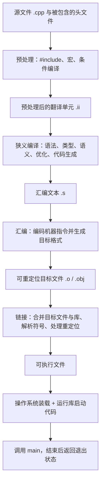

# 第 4 天补全课：源码到可执行文件的完整链路

预计用时：150～180 分钟，可拆成两次完成  
语言标准：C++17  
主要工具：GCC 的 `g++` 驱动程序；Clang 的 `clang++` 可使用近似选项

## 今日目标

学完今天的内容，你应该能够：

1. 按顺序解释预处理、狭义编译、汇编、目标文件、链接、装载和运行
2. 区分“`g++` 驱动整条构建链路”和“狭义编译器只负责其中一段”
3. 使用 `-E`、`-S`、`-c` 分别停在不同阶段并观察中间产物
4. 解释目标文件为什么包含机器指令却通常不能直接运行
5. 初步解释符号和重定位信息为什么是链接所必需的
6. 通过两个目标文件观察“编译成功但链接失败”
7. 准确说明 `main` 是 C++ 程序入口，但通常不是操作系统直接跳转的原始入口地址
8. 区分预处理、编译、汇编、链接、装载和运行期错误
9. 用 30～60 秒回答求职面试中的“C++ 源码怎样变成可执行文件”

## 这一课为什么和求职直接相关

这不是为了让你背编译器内部名词。实际笔试、面试和工作中，经常需要根据错误信息判断：

- 为什么代码语法正确，却出现 `undefined reference`
- 为什么只改了头文件，许多 `.cpp` 都要重新编译
- `-E`、`-S`、`-c` 分别让构建停在哪里
- Debug 和 Release 为什么可能生成不同的指令
- 为什么“编译成功”不等于程序一定能够链接、启动和正确运行

学习时始终追问四件事：**当前阶段拿到什么、具体做了什么、交出什么、怎样亲眼验证。** 面试表达也围绕这四点组织。

## 本单元范围

### 今天必须掌握

- 完整构建与启动链路
- `g++ -E`、`g++ -S`、`g++ -c` 和完整构建命令的边界
- 源文件、汇编文件、目标文件、可执行文件的区别
- 驱动程序、狭义编译器、汇编器、链接器、装载器的分工
- 符号和重定位的入门含义
- `main` 前后仍有启动和退出过程

### 今天先看全貌

- 预处理后为什么形成翻译单元
- 目标文件中的节、符号表和重定位项
- 静态库、动态库和运行时动态链接
- C++ 运行库启动代码
- 不同平台的目标文件与可执行文件格式

### 后续深入

- 第 5 天：函数声明、定义、调用和返回值
- 第 15 天：预处理、头文件、宏、包含保护和翻译单元
- 第 16 天：目标文件、符号、重定位、链接、静态库和动态库
- 第 17 天：声明、定义、名称查找、链接属性和 ODR
- 第 18 天：用警告、调试器和 Sanitizer 定位不同阶段的问题
- 第 33 天：多文件工程、CMake、库和构建配置

本单元首次偿还：`G01`、`G02`、`G03`、`G04`。这些项目已经建立完整第一层模型，后续单元还会继续深化。

---

## 关键术语索引（正文可跳转）

> 本表用于查阅和复习，不要求在学习正文前逐项背诵。正文会在术语真正参与知识推导时直接解释，或链接到对应的完整定义。
>
> 点击第一列术语可跳到文末“关键术语卡”。表格只承担导航和复习功能，不要求先背术语再读正文；核心概念会在实际代码和产物中重新讲解。跳转目标使用真正的 Markdown 六级标题，确保 GitHub 与 Obsidian 均可识别。

| 术语（点击跳转） | 一句话直观解释 |
|---|---|
| [工具链（toolchain）](#术语-d04-01-工具链) | 为了把源码做成程序而协作的一组工具 |
| [<code>g++</code> 驱动程序](#术语-d04-02-gpp驱动程序) | 一条命令背后的调度者 |
| [预处理器（preprocessor）](#术语-d04-03-预处理器) | 先处理井号开头命令和宏的工具 |
| [翻译单元（translation unit）](#术语-d04-04-翻译单元) | 一个 <code>.cpp</code> 连同展开进来的头文件，经过预处理后交给编译器的整体 |
| [狭义编译器（compiler proper）](#术语-d04-05-狭义编译器) | 读取预处理后的 C++，检查是否合法，并把其含义逐步翻译成汇编 |
| [中间表示（intermediate representation，IR）](#术语-d04-21-中间表示) | 编译器内部用来明确记录“计算什么、按什么顺序计算”的过渡形式 |
| [汇编语言（assembly language）](#术语-d04-06-汇编语言) | 用助记符写出的低层指令文本 |
| [汇编器与汇编阶段（assembler）](#术语-d04-07-汇编器与汇编阶段) | 把 <code>.s</code> 变成 <code>.o</code> |
| [机器指令（machine instruction）](#术语-d04-08-机器指令) | 处理器能够解码执行的指令编码 |
| [目标文件（object file）](#术语-d04-09-目标文件) | 某个翻译单元生成的、等待链接的二进制中间产物 |
| [节（section）](#术语-d04-10-节) | 目标文件中按用途分组的一块内容 |
| [符号（symbol）](#术语-d04-11-符号) | 让汇编器或链接器能够指代函数、对象或地址的记录 |
| [符号表（symbol table）](#术语-d04-12-符号表) | 目标文件中记录“有哪些符号、它们在哪里或还缺什么”的目录 |
| [重定位（relocation）](#术语-d04-13-重定位) | 最终地址确定后，把先前留空或暂定的地址修正好 |
| [链接器（linker）](#术语-d04-14-链接器) | 解决跨文件引用并生成最终产物的工具 |
| [库（library）](#术语-d04-15-库) | 可供多个程序复用的已编译代码集合 |
| [可执行文件（executable file）](#术语-d04-16-可执行文件) | 链接后可交给操作系统启动的文件 |
| [装载器（loader）](#术语-d04-17-装载器) | 把磁盘上的程序安排进内存并准备启动 |
| [进程（process）](#术语-d04-18-进程) | 程序运行起来后的一个实例 |
| [程序入口点（entry point）](#术语-d04-19-程序入口点) | 装载完成后最先取得控制的位置 |
| [<code>main</code> 函数](#术语-d04-20-main函数) | C++ 程序主体开始执行的约定入口函数 |

## 一、先看完整知识地图



这张图比：

```text
源文件 → 编译 → 可执行文件
```

多出了真实存在的阶段。后者只能作为“一条驱动命令完成构建”的缩写，不能称为内部完整过程。

还有两个重要边界：

1. C++ 标准描述的是程序语义和一组翻译阶段；`.s`、`.o`、ELF、PE 等是具体[工具链](#术语-d04-01-工具链)和平台的实现形式。
2. 工具链可以把中间结果放在内存或临时文件中，所以一次普通构建不一定在目录中留下 `.ii` 和 `.s`。中间文件没有留下，不代表相应阶段不存在。

---

## 二、`g++` 到底是什么

日常交流中常把 `g++` 叫作“C++ 编译器”。在命令层面这样说通常能沟通，但今天要建立更精确的模型。

执行：

```bash
g++ -std=c++17 pipeline.cpp -o pipeline
```

时，`g++` 主要扮演[**编译器驱动程序**](#术语-d04-02-gpp驱动程序)：

1. 读取命令行选项
2. 根据输入文件类型决定需要哪些阶段
3. 调用或协调预处理、狭义编译、汇编和链接组件
4. 把上一阶段的结果交给下一阶段
5. 传入 C++ 标准库、启动文件和平台所需的链接选项

在 GCC 工具链中，驱动程序内部可能调用名为 `cc1plus`、`as`、`collect2` 或 `ld` 的组件；具体名称和调用方式依版本、平台与配置而变化，不属于 C++ 语言本身。

可以用下面的命令观察当前工具链准备执行或实际执行的子命令：

```bash
g++ -### -std=c++17 examples/day-04/pipeline.cpp -o pipeline
```

或：

```bash
g++ -v -std=c++17 examples/day-04/pipeline.cpp -o pipeline
```

输出很长是正常的。今天只需寻找预处理/编译组件、[汇编器](#术语-d04-07-汇编器与汇编阶段)和[链接器](#术语-d04-14-链接器)的痕迹，不要求记忆全部参数。

### 为什么不直接使用 `ld`

直接调用系统链接器：

```bash
ld pipeline.o -o pipeline
```

通常不会自动补上 C++ 标准库、运行库和启动文件，因此容易出现大量未定义符号或得到不能正常启动的结果。

初学阶段链接 C++ 程序应继续使用：

```bash
g++ pipeline.o -o pipeline
```

让驱动程序准备正确的链接环境。

---

## 三、实验准备

示例文件：

- [`pipeline.cpp`](../examples/day-04/pipeline.cpp)
- [`link_main.cpp`](../examples/day-04/link_main.cpp)
- [`status.cpp`](../examples/day-04/status.cpp)

`pipeline.cpp`：

```cpp
#include <iostream>

#define ROBOT_NAME "Arm-A"

int main() {
    std::cout << "Robot: " << ROBOT_NAME << '\n';
    return 0;
}
```

先建立保存中间产物的目录。

Linux、macOS、Git Bash 或 MSYS2：

```bash
mkdir -p build/day-04
```

Windows PowerShell：

```powershell
New-Item -ItemType Directory -Force build/day-04
```

下面以仓库根目录作为当前目录。

---

## 四、第一阶段：预处理

[**预处理器**](#术语-d04-03-预处理器)是处理 `#include`、宏和条件编译等预处理指令的工具；“预处理阶段”则指它对当前源文件进行这些处理的过程。工具与处理阶段不能混为同一个概念。

执行：

```bash
g++ -std=c++17 -E examples/day-04/pipeline.cpp -o build/day-04/pipeline.ii
```

`-E` 的含义是：

> 完成预处理后停止，不进入狭义编译。

常见预处理工作包括：

- 处理 `#include`
- 展开宏
- 根据 `#if`、`#ifdef` 等决定保留哪些代码
- 处理其他预处理指令

### 观察 1：文件明显变大

原源文件只有几行，但 `pipeline.ii` 可能有成千上万行，因为：

```cpp
#include <iostream>
```

会使相关头文件内容参与当前[翻译单元](#术语-d04-04-翻译单元)的预处理。

“展开头文件”是便于入门的说法。更准确地说，`#include` 指令会把指定头文件的预处理记号序列包含到当前位置，然后继续进行预处理。第 15 天会深入翻译单元、重复包含与包含保护。

### 观察 2：宏名字消失

源文件中写了：

```cpp
#define ROBOT_NAME "Arm-A"
```

预处理结果中，使用位置通常已经变成：

```cpp
std::cout << "Robot: " << "Arm-A" << '\n';
```

搜索 `ROBOT_NAME` 和 `Arm-A`，比较两者是否仍存在。

这里使用宏只是为了清楚观察预处理替换。现代 C++ 中保存有类型的常量通常优先考虑 `constexpr`；宏的完整规则与风险在第 15 天学习。

### 预处理阶段可能出现的错误

例如：

```cpp
#include "missing_file.hpp"
```

如果找不到该头文件，构建会在预处理阶段停止。此时还没有进入 C++ 语法和类型检查。

---

## 五、第二阶段：狭义编译——编译器开始真正“读懂” C++

先直接回答原讲义中最空洞的一句话：

> “生成较低层表示或目标代码”到底是在生成什么？

在本课这条命令里，答案非常具体：

- **输入：** `pipeline.ii`，它仍然是预处理后的 C++ 文本
- **处理：** 判断这些 C++ 代码写得是否合法、每个名字指谁、每个运算能否用于相应类型，并把 C++ 所表达的计算逐步翻译
- **可见输出：** `pipeline.s`，即针对当前处理器平台的汇编文本

所以，本课所说的[**狭义编译器**](#术语-d04-05-狭义编译器)，不是一个只会“把代码变低级”的神秘工具。它是 **真正按 C++ 语法和语言规则理解代码，再把合法代码翻译成更接近处理器操作的表示** 的那部分编译工具。

| 当前问题 | 这一步的具体答案 |
|---|---|
| 它拿到什么？ | 预处理后的一个翻译单元，例如 `pipeline.ii` |
| 它先判断什么？ | 代码能否按 C++ 语法组成合法结构，各名称和类型是否满足规则 |
| 它再做什么？ | 把变量初始化、算术、分支、循环、函数调用等含义改写成更明确的计算与控制流程 |
| 本实验交出什么？ | 汇编文本 `pipeline.s` |
| 怎样验证？ | 使用 `g++ -S`，然后打开并比较 `.cpp` 与 `.s` |

### 5.1 先用一个没有 `iostream` 干扰的最小例子

`pipeline.cpp` 适合观察完整构建链路，但 `#include <iostream>` 会带入大量库声明，使汇编文件很长。为了看清狭义编译本身，新增一个更小的例子：[`compile_stage.cpp`](../examples/day-04/compile_stage.cpp)。

```cpp
int main() {
    int target_position{10};
    int current_position{4};
    int error{target_position - current_position};
    int command{error * 2};
    return command;
}
```

这段代码不输出文字。它算出：

```text
error   = 10 - 4 = 6
command = 6 * 2  = 12
```

最后让 `main` 返回 `12`。选择这个例子的原因是：我们可以追踪“一段带有变量名的 C++”怎样变成“减法、乘法和返回”这些更具体的操作。

先生成不主动开启优化的汇编：

```bash
g++ -std=c++17 -Wall -Wextra -pedantic -O0 -S examples/day-04/compile_stage.cpp -o build/day-04/compile_stage-O0.s
```

`-S` 表示：

> 从当前输入继续完成预处理和狭义编译，在生成汇编文本后停止，不调用汇编器。

这里输入的是 `.cpp`，因此 `g++` 仍会先完成预处理；`-S` 只规定“停在汇编文本”，不是“只执行一个名叫 S 的阶段”。

### 5.2 编译器怎样理解其中一行代码

看这一行：

```cpp
int error{target_position - current_position};
```

编译器不会把整行当成一串普通文字直接翻译。可以用下面的顺序理解它的工作。

#### 第一步：语法分析——这行代码由什么结构组成

编译器根据 C++ 语法识别出：

- `int` 表示声明对象的类型
- `error` 是新声明的名字
- 花括号中是初始化表达式
- 初始化表达式是一次减法
- 减法左右两边分别是 `target_position` 和 `current_position`

这类似于把一句话分出主干和成分，但真正依据的是 C++ 的形式语法，而不是自然语言感觉。

如果写成：

```cpp
int error{target_position - current_position
```

缺少 `};`，编译器无法组成完整声明，通常会给出语法诊断。

#### 第二步：名称查找——每个名字究竟指谁

编译器会在当前作用域及语言规则允许的位置寻找：

- `target_position` 指向前面声明的那个局部 `int` 对象
- `current_position` 也指向前面声明的局部 `int` 对象

如果误写：

```cpp
int error{target_postion - current_position};
```

`target_postion` 少了一个字母，编译器找不到这个名字，通常会报告“未声明”之类的错误。

**名称查找不是程序运行时在硬盘里搜索名称。** 它是编译阶段根据作用域、声明位置、命名空间等规则，确定源代码里的名字与哪个声明对应。第 17 天会深入。

#### 第三步：类型与语义检查——这个操作在 C++ 中是否合法

编译器已经知道两边都是 `int`，因此内置减法可用，结果也是整数，可以用来初始化 `error`。

如果写成：

```cpp
int error{"too far"};
```

字符串不能按这里的规则初始化 `int`，编译器会在这一阶段拒绝代码。

“语义”可以先理解为：**代码即使形状像 C++，它所表达的操作也必须符合 C++ 规则。** 例如在循环外写 `break;`，单词和分号都能识别，但这种用法在该位置没有合法的 C++ 含义。

语法分析、名称查找和类型检查在真实编译器中可能交织进行。这里把它们分开，是为了帮助定位问题，不表示它们一定由三个独立程序依次完成。

### 5.3 “中间表示”不是一句神秘黑话

通过检查后，编译器通常不会直接从复杂 C++ 一步跳到最终汇编，而会先变成一种或多种[**中间表示**](#术语-d04-21-中间表示)，英文常写作 **IR**。

对上面的计算，可以先用教学伪代码建立直觉：

```text
t1 = target_position - current_position
t2 = t1 * 2
return t2
```

这段伪代码只是在说明思想，**不是 GCC 真实 IR 的原样输出**。它比原 C++“更低一层”的具体含义是：

- 不再强调花括号初始化等 C++ 表面写法
- 把运算的数据来源、结果和顺序表达得更明确
- 便于后续分析：某个结果是否恒定、某次计算是否多余、哪些操作可以安全改写
- 但它通常仍不是处理器可以直接执行的机器指令

不同编译器有不同 IR，甚至同一个编译器内部也有多层 IR。求职入门阶段只需掌握它的作用，不需要背 GCC 或 LLVM 的内部数据结构。

### 5.4 优化究竟优化了什么

编译器可以改变内部实现方式，使代码更快、更小或更适合目标处理器，但不能因此改变程序按照 C++ 规则本应呈现的结果，例如输出内容和返回值。

上例中所有初始值在编译时都已知，所以优化器可能提前算出：

```text
(10 - 4) * 2 = 12
```

再生成优化版本：

```bash
g++ -std=c++17 -Wall -Wextra -pedantic -O2 -S examples/day-04/compile_stage.cpp -o build/day-04/compile_stage-O2.s
```

比较：

- `compile_stage-O0.s` 往往还能看到保存局部值、减法和乘法相关操作
- `compile_stage-O2.s` 可能直接准备返回值 `12` 后返回

实际指令、寄存器名和文本格式会因 x86-64、ARM、操作系统和编译器版本而不同。`-O0` 也不等于编译器绝不做任何内部变换；这里要观察的是两种优化级别造成的明显差异。

这类优化叫 **常量折叠**：编译器在构建程序时就把能够确定的常量表达式计算出来。今天理解现象即可，第 33 天再结合 Debug/Release 构建配置学习。

### 5.5 代码生成——把计算映射到目标处理器

狭义编译的后端需要针对目标处理器选择：

- 使用哪些机器操作，例如加载、减法、加法、跳转和返回
- 临时结果放在哪些寄存器或内存位置
- 分支和函数调用怎样组织
- 最终采用当前汇编器能够接受的汇编语法

例如，`error * 2` 不保证一定生成一条“乘法指令”。编译器也可能使用加法或移位，只要结果符合 C++ 规则。

这里的“目标”指 **准备在哪一种处理器与平台上运行**。为 x86-64 生成的汇编通常不能直接交给 ARM 处理器执行，因为两者的指令集和寄存器不同。

### 5.6 “目标代码”这个词为什么容易造成误解

编译原理材料中的 **target code** 是泛称，可能指编译器最终要生成的汇编代码，也可能指机器码或某种目标平台表示；不同上下文用法不完全相同。

因此，本讲义后文不再用“生成较低层表示或目标代码”一笔带过，而会明确说：

- 编译器内部可能生成 IR
- 使用 `g++ -S` 时，我们实际看见的产物是汇编文本 `.s`
- 下一阶段的汇编器再把 `.s` 编码进目标文件 `.o`

### 5.7 这一阶段能发现什么，不能发现什么

通常能在狭义编译阶段发现：

- 漏分号、括号不匹配等语法错误
- 名称不存在或使用位置不合法
- 类型不匹配
- 某些违反语言规则的表达式或语句

通常不能仅靠这一阶段确认：

- 另一个 `.cpp` 是否真的提供了已声明函数的定义——这是链接阶段的问题
- 动态库在目标机器上是否存在——这是装载或运行环境问题
- 算法是否符合真实需求——合法代码仍可能有逻辑错误
- 所有越界、悬空指针等问题是否会发生——许多问题要到运行期并结合工具观察

### 5.8 用命令完成本阶段

对完整链路中的预处理结果执行：

```bash
g++ -std=c++17 -Wall -Wextra -pedantic -S build/day-04/pipeline.ii -o build/day-04/pipeline.s
```

打开 `build/day-04/pipeline.s` 后，不要求看懂每条指令。今天只验证：

1. 输入 `.ii` 仍是 C++ 文本，输出 `.s` 已是汇编文本
2. `main` 和字符串通常还能以标签、符号或数据形式找到
3. C++ 的声明、类型和表达式已经不再保持原来的源代码形式
4. 汇编与目标处理器、平台、编译器及优化级别有关

### 5.9 求职面试中的 30 秒回答

> 日常说“编译”常指整套构建，但狭义编译是其中一段。它接收预处理后的 C++ 翻译单元，完成语法分析、名称查找、类型和语义检查，并在内部经过中间表示和可能的优化，最后为目标处理器生成汇编。`g++ -S` 可以让流程停在汇编文件；汇编器随后才生成目标文件，链接器再解决跨文件符号和地址问题。

如果你能结合 `compile_stage.cpp` 解释 `-O0` 与 `-O2` 可能有什么不同，这个回答就不再是背定义，而是有实验依据。

---

## 六、第三阶段：汇编

把汇编文本转换为可[重定位](#术语-d04-13-重定位)[目标文件](#术语-d04-09-目标文件)：

```bash
g++ -c build/day-04/pipeline.s -o build/day-04/pipeline.o
```

这里的 `-c` 表示：

> 生成目标文件后停止，不执行链接。

因为输入已经是 `.s`，这条命令主要让驱动程序调用汇编器。

如果直接对 `.cpp` 使用：

```bash
g++ -std=c++17 -Wall -Wextra -pedantic \
    -c examples/day-04/pipeline.cpp \
    -o build/day-04/pipeline-direct.o
```

则驱动程序会完成：

```text
预处理 → 狭义编译 → 汇编
```

然后停在目标文件，不链接。

### 目标文件不是“只有机器码”

可重定位目标文件通常包含：

- [机器指令](#术语-d04-08-机器指令)，例如常见的 [`.text` 节](#术语-d04-10-节)
- 只读常量，例如字符串
- 已初始化和未初始化的数据描述
- [符号表](#术语-d04-12-符号表)
- 重定位信息
- 平台与目标架构信息
- 如果启用了调试选项，还可能包含调试信息

具体节名和组织方式由目标文件格式与工具链决定。

常见格式：

| 平台 | 常见目标/可执行格式 |
|---|---|
| Linux | ELF |
| Windows | PE/COFF |
| macOS | Mach-O |

`.o` 或 `.obj` 只是常见扩展名，不能单靠扩展名判断内部格式。

### 为什么目标文件通常不能直接运行

目标文件中的部分地址还没有最终确定，它还可能包含对外部定义的引用。例如本例使用了标准输出设施，其实现来自其他目标文件或库。

目标文件的意思更接近：

> 我已经有机器指令，但其中一些位置还需要链接器根据最终组合结果填写或调整。

尝试运行：

```bash
./build/day-04/pipeline.o
```

通常会得到“权限不足”或“格式错误”，因为它是可重定位目标文件，不是完整[可执行文件](#术语-d04-16-可执行文件)。

---

## 七、符号与重定位：用两个 `.o` 文件把问题说清楚

原讲义中“用名字记录某些实体”虽然不算错，但它没有回答最关键的问题：**为什么已经生成机器指令，还要记录名字？**

答案来自“每个 `.cpp` 通常先独立编译”这件事。

### 7.1 在本实验的普通分离编译中，两个 `.cpp` 分别处理

`link_main.cpp`：

```cpp
void report_status();

int main() {
    report_status();
    return 0;
}
```

`status.cpp`：

```cpp
#include <iostream>

void report_status() {
    std::cout << "Robot ready\n";
}
```

分别编译：

```bash
g++ -std=c++17 -Wall -Wextra -pedantic -c examples/day-04/link_main.cpp -o build/day-04/link_main.o
g++ -std=c++17 -Wall -Wextra -pedantic -c examples/day-04/status.cpp -o build/day-04/status.o
```

编译 `link_main.cpp` 时，编译器只看到了 `report_status` 的**声明**：

```cpp
void report_status();
```

这条声明已经足够让编译器检查：

- 这个名字代表一个函数
- 调用时不应传参数
- 函数没有返回值可供使用

但当前文件没有函数体，所以编译器不知道 `report_status` 的机器指令最终放在哪里。它仍然可以生成 `link_main.o`，只是要在目标文件里留下两类信息：

1. 调用 `report_status` 的指令位置目前还不能填入最终地址
2. 当前目标文件需要外部提供一个与 `report_status()` 对应的定义

### 7.2 符号可以理解为目标文件里的“供需记录”

[**符号**](#术语-d04-11-符号)不是源代码函数本身，而是目标文件中供汇编器、链接器和调试工具使用的一条名称及属性记录。

对这两个目标文件，可以先建立下表：

| 目标文件 | 与 `report_status()` 有关的记录 | 直观含义 |
|---|---|---|
| `link_main.o` | 未定义符号 | “我调用了它，但我这里没有函数体，需要别处提供” |
| `status.o` | 已定义符号 | “函数体在我这里，我可以提供它的代码位置” |

`main` 则通常在 `link_main.o` 中是已定义符号，因为它的函数体就在该文件里。

如果提供 `nm`，执行：

```bash
nm -C build/day-04/link_main.o
nm -C build/day-04/status.o
```

常见输出中：

- `U report_status()`：`U` 表示该目标文件使用了它，但没有定义
- `T report_status()`：`T` 常表示它已在代码节中定义
- `T main`：`main` 已在代码节中定义

实际字母和格式与平台有关。`-C` 会尝试把 C++ **名称改编**后的符号还原为较易读的形式；名称改编会在后续课程扩展，今天只需知道目标文件中的原始名字可能不是简单的 `report_status`。

### 7.3 为什么还需要重定位

符号解决“要找谁”，[**重定位**](#术语-d04-13-重定位)解决“找到后，把哪个位置改成什么地址”。

`link_main.o` 中已经有一条“调用函数”的机器指令，但两个文件独立编译时，下列信息还没有确定：

- 链接器最后把 `link_main.o` 的代码放到可执行文件哪个位置
- 把 `status.o` 的代码放到哪个位置
- `report_status` 的最终入口地址是多少
- 调用指令应该写入哪个地址或相对距离

因此，汇编器不会胡乱猜一个最终地址。它通常在待修正的位置放入临时值，并建立一条**重定位记录**，其含义近似为：

> 链接器：当你确定 `report_status` 的最终位置后，请回来修正这条调用指令对应的地址字段。

这句话是入门直觉。专业上，重定位项还会记录待修正位置、关联符号、重定位类型以及可能的附加值，链接器按目标平台规则计算最终字段。

如果提供 `objdump`，可观察：

```bash
objdump -r build/day-04/link_main.o
```

你可能看到与 `report_status` 对应的重定位记录。输出格式由平台决定，不要求记忆列名。

### 7.4 链接器怎样把“需求”与“供给”接起来

链接：

```bash
g++ build/day-04/link_main.o build/day-04/status.o -o build/day-04/link_demo
```

链接器可以完成：

1. 从 `link_main.o` 看到对 `report_status()` 的未定义引用
2. 从 `status.o` 找到兼容的已定义符号
3. 安排两个目标文件中的代码在最终程序中的布局
4. 算出 `report_status` 的最终位置
5. 按重定位记录修正调用指令
6. 生成可由操作系统装载的可执行文件

如果故意漏掉 `status.o`：

```bash
g++ build/day-04/link_main.o -o build/day-04/broken_link
```

编译器此前已经确认“这种函数可以这样调用”，所以 `link_main.o` 能生成；但链接器始终找不到函数体，最终报告 `undefined reference` 或 `unresolved external symbol`。

一句话区分：

> **符号记录要找谁或谁能提供；重定位记录找到以后要回到哪里修正地址。**

### 7.5 求职面试中的常见追问

**为什么声明存在，编译还会成功？**

因为声明已经提供名称、参数和返回类型等信息，足以检查当前翻译单元里的调用是否合法；函数体可以位于另一个翻译单元或库中。

**为什么最后链接失败？**

因为所有参与链接的目标文件和库中都没有提供匹配的定义。

**为什么不能在生成 `link_main.o` 时就写死函数地址？**

因为各目标文件会被怎样组合、最终放在哪里，此时尚未确定；这些地址要在链接布局确定后通过重定位处理。

---

## 八、第四阶段：链接

执行：

```bash
g++ build/day-04/pipeline.o -o build/day-04/pipeline
```

Windows 上也可以明确写：

```powershell
g++ build/day-04/pipeline.o -o build/day-04/pipeline.exe
```

链接器的主要工作包括：

1. 读取一个或多个目标文件和库
2. 合并代码、只读数据和其他节
3. 把符号引用与对应定义匹配
4. 决定或参与决定最终布局
5. 根据最终布局处理重定位
6. 记录动态库依赖或选取[静态库](#术语-d04-15-库)中的所需内容
7. 生成平台认可的可执行文件或库

### 静态库和动态库的边界

“链接库”不一定表示把库的全部代码复制进可执行文件：

- 使用静态库时，链接器通常把所需目标模块或内容纳入最终结果
- 使用动态库时，可执行文件通常会记录依赖和导入信息，真正的库代码由[装载器](#术语-d04-17-装载器)/动态链接器在运行时映射

第 16、33 天会正式比较两者。

---

## 九、证明“编译成功”不等于“链接成功”

`link_main.cpp`：

```cpp
void report_status();

int main() {
    report_status();
    return 0;
}
```

第一行只告诉编译器：

> 存在一个名为 `report_status` 的函数，它不接收参数，也不返回值。

函数会在第 5 天正式学习。今天只把它当作一个需要链接器寻找定义的符号。

分别生成两个目标文件：

```bash
g++ -std=c++17 -Wall -Wextra -pedantic \
    -c examples/day-04/link_main.cpp \
    -o build/day-04/link_main.o

g++ -std=c++17 -Wall -Wextra -pedantic \
    -c examples/day-04/status.cpp \
    -o build/day-04/status.o
```

两个 `.cpp` 都能独立通过编译。

现在故意只链接第一个：

```bash
g++ build/day-04/link_main.o -o build/day-04/broken_link
```

链接器通常会报告类似：

```text
undefined reference to `report_status()`
```

Windows 工具链可能使用：

```text
unresolved external symbol
```

这不是 C++ 语法错误。`link_main.cpp` 已经成功生成目标文件；错误发生在链接器找不到 `report_status` 的定义。

加入第二个目标文件：

```bash
g++ build/day-04/link_main.o build/day-04/status.o \
    -o build/day-04/link_demo
```

Windows PowerShell 单行写法：

```powershell
g++ build/day-04/link_main.o build/day-04/status.o -o build/day-04/link_demo.exe
```

现在链接成功，因为：

- `link_main.o` 引用了 `report_status`
- `status.o` 定义了 `report_status`
- 链接器把引用与定义匹配起来，并修正相关位置

运行结果：

```text
Robot ready
```

如果有 `nm`：

```bash
nm -C build/day-04/link_main.o
nm -C build/day-04/status.o
```

可以比较同一个名字在一个目标文件中是未定义引用，在另一个目标文件中是已定义符号。

---

## 十、可执行文件内部仍不只是机器指令

链接得到的可执行文件通常包含：

- 文件格式头
- 目标架构和平台信息
- 可装载代码与数据
- 程序入口地址
- 内存映射所需信息
- 动态库依赖和导入信息
- 可能保留的符号、重定位或调试信息

它与目标文件的关键差异不是“一个有机器码、一个没有”。两者都可能包含机器指令。

更关键的区别是：

- 目标文件仍主要是可重定位、等待组合的构建产物
- 可执行文件已经形成操作系统装载器能够识别和启动的程序映像

---

## 十一、第五阶段：操作系统装载与程序启动

运行：

Linux 或 macOS：

```bash
./build/day-04/pipeline
```

Windows PowerShell：

```powershell
.\build\day-04\pipeline.exe
```

输出：

```text
Robot: Arm-A
```

从双击或命令启动，到执行 `main`，中间仍有过程。在常见的托管操作系统环境中，可以建立下面的第一层模型：

1. 操作系统读取可执行文件头，确认格式和目标架构
2. 创建[进程](#术语-d04-18-进程)及其虚拟地址空间
3. 把程序的代码和数据映射到内存
4. 装载所需动态库，并完成必要的动态符号解析和重定位
5. 准备栈、命令行参数和环境信息
6. 把控制权交给可执行文件记录的[入口点](#术语-d04-19-程序入口点)
7. 运行库启动代码完成必要准备，并按照语言和实现规则安排初始化
8. 启动代码调用 C++ 的 `main`
9. `main` 返回后，运行库完成必要清理并把退出状态交还给操作系统

具体顺序和实现细节依操作系统、ABI、链接方式和运行库而变化。

### `main` 到底是不是入口

需要同时保留两个层次：

- 从 C++ 程序员和语言规则的角度，`main` 是程序开始执行的入口函数
- 从可执行文件和操作系统的角度，操作系统通常先跳到运行库启动入口，再由启动代码调用 `main`

因此：

> `main` 是 C++ 程序入口，但通常不是操作系统装载后最先执行的那条机器指令。

### `return 0` 去了哪里

```cpp
return 0;
```

表示 `main` 正常返回值 `0`。启动代码和运行库会把它转换为进程退出状态交给操作系统。

在常见命令行中可以观察上一个程序的退出状态。

Bash：

```bash
echo $?
```

PowerShell：

```powershell
$LASTEXITCODE
```

第 5 天会从函数返回值角度再次解释。

---

## 十二、不同选项到底停在哪里

| 命令形式 | 最后完成的阶段 | 常见结果 | 是否链接 |
|---|---|---|---|
| `g++ -E file.cpp -o file.ii` | 预处理 | 预处理文本 | 否 |
| `g++ -S file.cpp -o file.s` | 狭义编译/代码生成 | 汇编文本 | 否 |
| `g++ -c file.cpp -o file.o` | 汇编 | 可重定位目标文件 | 否 |
| `g++ file.cpp -o program` | 链接 | 可执行文件 | 是 |
| `g++ file.o -o program` | 链接 | 可执行文件 | 是 |

注意：

```bash
g++ -S file.cpp
```

仍会先预处理，再完成狭义编译，只是在生成汇编文本后停止。

同样：

```bash
g++ -c file.cpp
```

不是“只汇编”，而是从 `.cpp` 出发完成预处理、狭义编译和汇编，然后在链接前停止。

输入文件的当前形态决定还需要经过哪些阶段。

---

## 十三、错误发生在哪个阶段

| 现象 | 典型阶段 | 原因示例 |
|---|---|---|
| 找不到头文件 | 预处理 | `#include "missing.hpp"` |
| 宏或条件编译结构错误 | 预处理 | 缺少对应的 `#endif` |
| 漏分号、类型不匹配、名称不存在 | 狭义编译 | `int x{"text"};` |
| 汇编文本不符合目标汇编器语法 | 汇编 | 手写 `.s` 指令错误 |
| `undefined reference` | 链接 | 声明并调用函数，但没有链接其定义 |
| `multiple definition` | 链接 | 多个目标文件提供不允许重复的定义 |
| 缺少 DLL/共享对象 | 装载/动态链接 | 可执行文件依赖的动态库不在可搜索位置 |
| 程序崩溃 | 运行期 | 越界、无效指针、未定义行为等 |
| 输出不符合需求 | 运行期逻辑 | 条件或算法写错 |

“编译失败”在日常交流中有时泛指整个构建失败。定位问题时，应继续问：

> 到底是在预处理、狭义编译、汇编还是链接阶段失败？

---

## 十四、一次完整的手动链路

Linux、macOS、Git Bash 或 MSYS2：

```bash
mkdir -p build/day-04

g++ -std=c++17 -E \
    examples/day-04/pipeline.cpp \
    -o build/day-04/pipeline.ii

g++ -std=c++17 -Wall -Wextra -pedantic -S \
    build/day-04/pipeline.ii \
    -o build/day-04/pipeline.s

g++ -c \
    build/day-04/pipeline.s \
    -o build/day-04/pipeline.o

g++ \
    build/day-04/pipeline.o \
    -o build/day-04/pipeline

./build/day-04/pipeline
```

Windows PowerShell：

```powershell
New-Item -ItemType Directory -Force build/day-04
g++ -std=c++17 -E examples/day-04/pipeline.cpp -o build/day-04/pipeline.ii
g++ -std=c++17 -Wall -Wextra -pedantic -S build/day-04/pipeline.ii -o build/day-04/pipeline.s
g++ -c build/day-04/pipeline.s -o build/day-04/pipeline.o
g++ build/day-04/pipeline.o -o build/day-04/pipeline.exe
.\build\day-04\pipeline.exe
```

普通的一步构建：

```bash
g++ -std=c++17 -Wall -Wextra -pedantic \
    examples/day-04/pipeline.cpp \
    -o build/day-04/pipeline
```

两种方式最终目标相同。分步命令的价值是让阶段边界和中间产物可见。

---

## 十五、不要形成的四个新误解

### 误解 1：预处理、编译和汇编一定各自生成磁盘文件

不是。驱动程序可以使用临时文件或管道。逻辑阶段存在，不代表每次都保留可见文件。

### 误解 2：目标文件没有机器码

不是。目标文件通常已经包含机器指令，只是仍需链接和重定位。

### 误解 3：链接只是把几个文件粘在一起

不是。链接还要解析符号、选择库内容、决定布局并处理重定位。

### 误解 4：可执行文件包含程序需要的全部代码

不一定。动态链接程序会保留对共享库的依赖，运行时还需要装载器和动态链接器参与。

---

## 十六、今日完成标准

不看讲义时能够完成以下事项，才算第 4 天达标：

- 画出或写出完整链路：预处理 → 狭义编译 → 汇编 → 目标文件 → 链接 → 可执行文件 → 装载与启动 → `main`
- 解释 `g++` 作为驱动程序的作用
- 说出 `-E`、`-S`、`-c` 分别停在哪里
- 实际生成 `.ii`、`.s`、`.o` 和可执行文件
- 在 `.ii` 中观察一次头文件参与和宏替换
- 解释目标文件为什么通常不能直接运行
- 让 `link_main.o` 单独链接失败，再加入 `status.o` 链接成功
- 区分一个编译错误和一个链接错误
- 解释为什么操作系统通常不是直接从 `main` 的第一条指令开始

练习见：[第 4 天练习单](../exercises/day-04.md)。

下一单元：函数（一）——声明、定义、调用、参数与返回值。

---

## 附录：关键术语卡（查阅用）

###### 术语-d04-01-工具链

**工具链（toolchain）**

- **新手先这样理解：** 为了把源码做成程序而协作的一组工具
- **专业上更准确地说：** 工具链是编译器、汇编器、链接器、调试器及相关运行时和库等工具的集合。这是工程术语，不是一个单独的 C++ 语法概念。

###### 术语-d04-02-gpp驱动程序

**<code>g++</code> 驱动程序**

- **新手先这样理解：** 一条命令背后的调度者
- **专业上更准确地说：** <code>g++</code> 根据选项组织预处理、狭义编译、汇编和链接，并自动加入适合 C++ 的启动文件和标准库依赖；它不表示内部只有一个处理阶段。

###### 术语-d04-03-预处理器

**预处理器（preprocessor）**

- **新手先这样理解：** 先处理井号开头命令和宏的工具
- **专业上更准确地说：** 预处理器处理头文件包含、宏替换、条件编译等预处理指令，并为后续编译形成输入。它主要进行记号层面的处理，并不完成完整的 C++ 类型检查。

###### 术语-d04-04-翻译单元

**翻译单元（translation unit）**

- **新手先这样理解：** 一个 <code>.cpp</code> 连同展开进来的头文件，经过预处理后交给编译器的整体
- **专业上更准确地说：** 更准确地说，翻译单元是一个源文件经过各翻译阶段中的预处理处理后形成的编译单位。一个多文件程序通常包含多个翻译单元。

###### 术语-d04-05-狭义编译器

**狭义编译器（compiler proper）**

- **新手先这样理解：** 它是真正按 C++ 规则读懂预处理后代码，并把合法代码翻译成更接近处理器操作的那部分工具。
- **专业上更准确地说：** 它接收预处理后的翻译单元，完成或参与语法分析、名称查找、类型与语义检查、模板实例化、中间表示、优化，以及面向目标平台的汇编或其他输出生成。在本课 `g++ -S` 实验中，最终可见产物是汇编文本；它与负责调度整条链路的 `g++` 驱动程序、把汇编编码进 `.o` 的汇编器以及跨文件组合产物的链接器不是同一角色。

###### 术语-d04-21-中间表示

**中间表示（intermediate representation，IR）**

- **新手先这样理解：** 编译器把 C++ 改写成更明确的“做哪些计算、数据怎样流动、何时跳转”的内部过渡形式。
- **专业上更准确地说：** IR 是编译器内部用于分析、优化和代码生成的程序表示，通常介于源语言结构与目标机器指令之间。一个编译器可使用多层 IR；它不是 C++ 标准规定的统一文件格式，也不等于最终机器码。

###### 术语-d04-06-汇编语言

**汇编语言（assembly language）**

- **新手先这样理解：** 用助记符写出的低层指令文本
- **专业上更准确地说：** 汇编语言是针对特定指令集架构的符号化表示，例如用指令助记符、寄存器名和标签表达机器操作；不同架构和汇编器语法可能不同。

###### 术语-d04-07-汇编器与汇编阶段

**汇编器与汇编阶段（assembler）**

- **新手先这样理解：** 把 <code>.s</code> 变成 <code>.o</code>
- **专业上更准确地说：** 汇编器把汇编表示编码成机器指令，并生成目标文件所需的节、符号和重定位记录。汇编阶段不只是把文字逐行替换为二进制。

###### 术语-d04-08-机器指令

**机器指令（machine instruction）**

- **新手先这样理解：** 处理器能够解码执行的指令编码
- **专业上更准确地说：** 机器指令是特定处理器指令集规定的编码。目标文件和可执行文件中通常包含机器指令，但还包含数据和大量格式元信息。

###### 术语-d04-09-目标文件

**目标文件（object file）**

- **新手先这样理解：** 某个翻译单元生成的、等待链接的二进制中间产物
- **专业上更准确地说：** 可重定位目标文件通常包含若干节、机器代码、数据、符号表、重定位项和可选调试信息。它通常不是操作系统可直接启动的完整程序。

###### 术语-d04-10-节

**节（section）**

- **新手先这样理解：** 目标文件中按用途分组的一块内容
- **专业上更准确地说：** 节是目标文件格式组织代码、只读数据、可写数据、符号、重定位和调试信息等内容的单位；它与进程装载后的内存段相关但不总是一一对应。

###### 术语-d04-11-符号

**符号（symbol）**

- **新手先这样理解：** 让汇编器或链接器能够指代函数、对象或地址的记录
- **专业上更准确地说：** 符号是目标文件和链接过程使用的名称及属性记录。并非源代码中的每个标识符都会留下链接器可见符号，名称还可能经过改编。

###### 术语-d04-12-符号表

**符号表（symbol table）**

- **新手先这样理解：** 目标文件中记录“有哪些符号、它们在哪里或还缺什么”的目录
- **专业上更准确地说：** 符号表保存符号名称、定义或未定义状态、绑定属性和位置等信息，供链接、调试及分析工具使用。

###### 术语-d04-13-重定位

**重定位（relocation）**

- **新手先这样理解：** 最终地址确定后，把先前留空或暂定的地址修正好
- **专业上更准确地说：** 编译和汇编阶段会为尚不能确定的地址产生重定位项；链接器或装载器根据最终布局把相关指令或数据字段调整为正确值。

###### 术语-d04-14-链接器

**链接器（linker）**

- **新手先这样理解：** 解决跨文件引用并生成最终产物的工具
- **专业上更准确地说：** 链接器选择并组合目标文件和库，解析符号定义与引用，布置输出内容并执行重定位，最终产生可执行文件或共享库。

###### 术语-d04-15-库

**库（library）**

- **新手先这样理解：** 可供多个程序复用的已编译代码集合
- **专业上更准确地说：** 静态库通常是目标文件的归档，所需成员在链接时进入输出；共享库则作为独立二进制在装载或运行时参与地址空间和符号解析。

###### 术语-d04-16-可执行文件

**可执行文件（executable file）**

- **新手先这样理解：** 链接后可交给操作系统启动的文件
- **专业上更准确地说：** 它使用 ELF、PE、Mach-O 等平台格式，包含装载布局、代码、数据、入口信息和依赖。可执行文件仍可能依赖外部共享库。

###### 术语-d04-17-装载器

**装载器（loader）**

- **新手先这样理解：** 把磁盘上的程序安排进内存并准备启动
- **专业上更准确地说：** 操作系统及运行时的装载机制把可执行映像和共享库映射到进程地址空间，处理必要的动态重定位，建立初始运行环境并转移控制。

###### 术语-d04-18-进程

**进程（process）**

- **新手先这样理解：** 程序运行起来后的一个实例
- **专业上更准确地说：** 进程是操作系统管理的运行实体，拥有独立的虚拟地址空间、资源和至少一个执行线程。一个可执行文件可以同时产生多个进程。

###### 术语-d04-19-程序入口点

**程序入口点（entry point）**

- **新手先这样理解：** 装载完成后最先取得控制的位置
- **专业上更准确地说：** 入口点是可执行文件格式中指定给装载器的启动地址，通常指向运行时启动代码，而不一定直接指向 C++ 的 <code>main</code>。

###### 术语-d04-20-main函数

**<code>main</code> 函数**

- **新手先这样理解：** C++ 程序主体开始执行的约定入口函数
- **专业上更准确地说：** 在宿主环境的 C++ 程序中，<code>main</code> 是标准规定的指定函数；运行时启动代码完成初始化后调用它，并处理其返回结果。它通常不是操作系统装载器直接跳转的第一条用户可见函数。
