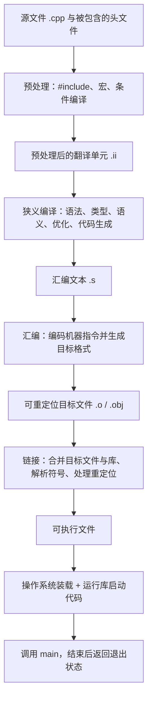

# 第 4 天补全课：源码到可执行文件的完整链路

预计用时：120～150 分钟  
语言标准：C++17  
主要工具：GCC 的 `g++` 驱动程序；Clang 的 `clang++` 可使用近似选项

## 今日目标

学完今天的内容，你应该能够：

1. 按顺序解释预处理、狭义编译、汇编、目标文件、链接、装载和运行
2. 区分“`g++` 驱动整条构建链路”和“狭义编译器只负责其中一段”
3. 使用 `-E`、`-S`、`-c` 分别停在不同阶段并观察中间产物
4. 解释目标文件为什么包含机器指令却通常不能直接运行
5. 初步解释符号和重定位信息为什么是链接所必需的
6. 通过两个目标文件观察“编译成功但链接失败”
7. 准确说明 `main` 是 C++ 程序入口，但通常不是操作系统直接跳转的原始入口地址
8. 区分预处理、编译、汇编、链接、装载和运行期错误

## 本单元范围

### 今天必须掌握

- 完整构建与启动链路
- `g++ -E`、`g++ -S`、`g++ -c` 和完整构建命令的边界
- 源文件、汇编文件、目标文件、可执行文件的区别
- 驱动程序、狭义编译器、汇编器、链接器、装载器的分工
- 符号和重定位的入门含义
- `main` 前后仍有启动和退出过程

### 今天先看全貌

- 预处理后为什么形成翻译单元
- 目标文件中的节、符号表和重定位项
- 静态库、动态库和运行时动态链接
- C++ 运行库启动代码
- 不同平台的目标文件与可执行文件格式

### 后续深入

- 第 5 天：函数声明、定义、调用和返回值
- 第 15 天：预处理、头文件、宏、包含保护和翻译单元
- 第 16 天：目标文件、符号、重定位、链接、静态库和动态库
- 第 17 天：声明、定义、名称查找、链接属性和 ODR
- 第 18 天：用警告、调试器和 Sanitizer 定位不同阶段的问题
- 第 33 天：多文件工程、CMake、库和构建配置

本单元首次偿还：`G01`、`G02`、`G03`、`G04`。这些项目已经建立完整第一层模型，后续单元还会继续深化。

---

## 先读：关键术语导航

> 第 4 天涉及多种工具和文件。下面的术语表先给你一张“翻译地图”，正文再用真实命令观察每个阶段。

| 术语 | 新手先这样理解 | 专业上更准确地说 |
|---|---|---|
| **工具链（toolchain）** | 为了把源码做成程序而协作的一组工具 | 工具链是编译器、汇编器、链接器、调试器及相关运行时和库等工具的集合。这是工程术语，不是一个单独的 C++ 语法概念。 |
| **<code>g++</code> 驱动程序** | 一条命令背后的调度者 | <code>g++</code> 根据选项组织预处理、狭义编译、汇编和链接，并自动加入适合 C++ 的启动文件和标准库依赖；它不表示内部只有一个处理阶段。 |
| **预处理器（preprocessor）** | 先处理井号开头命令和宏的工具 | 预处理器处理头文件包含、宏替换、条件编译等预处理指令，并为后续编译形成输入。它主要进行记号层面的处理，并不完成完整的 C++ 类型检查。 |
| **翻译单元（translation unit）** | 一个 <code>.cpp</code> 连同展开进来的头文件，经过预处理后交给编译器的整体 | 更准确地说，翻译单元是一个源文件经过各翻译阶段中的预处理处理后形成的编译单位。一个多文件程序通常包含多个翻译单元。 |
| **狭义编译器（compiler proper）** | 真正理解 C++ 语法和类型规则的部分 | 它分析预处理后的 C++ 程序，执行语义与类型检查并可能优化，然后生成汇编代码或其他低层中间表示。它与驱动程序和链接器不是同一角色。 |
| **汇编语言（assembly language）** | 用助记符写出的低层指令文本 | 汇编语言是针对特定指令集架构的符号化表示，例如用指令助记符、寄存器名和标签表达机器操作；不同架构和汇编器语法可能不同。 |
| **汇编器与汇编阶段（assembler）** | 把 <code>.s</code> 变成 <code>.o</code> | 汇编器把汇编表示编码成机器指令，并生成目标文件所需的节、符号和重定位记录。汇编阶段不只是把文字逐行替换为二进制。 |
| **机器指令（machine instruction）** | 处理器能够解码执行的指令编码 | 机器指令是特定处理器指令集规定的编码。目标文件和可执行文件中通常包含机器指令，但还包含数据和大量格式元信息。 |
| **目标文件（object file）** | 某个翻译单元生成的、等待链接的二进制中间产物 | 可重定位目标文件通常包含若干节、机器代码、数据、符号表、重定位项和可选调试信息。它通常不是操作系统可直接启动的完整程序。 |
| **节（section）** | 目标文件中按用途分组的一块内容 | 节是目标文件格式组织代码、只读数据、可写数据、符号、重定位和调试信息等内容的单位；它与进程装载后的内存段相关但不总是一一对应。 |
| **符号（symbol）** | 让汇编器或链接器能够指代函数、对象或地址的记录 | 符号是目标文件和链接过程使用的名称及属性记录。并非源代码中的每个标识符都会留下链接器可见符号，名称还可能经过改编。 |
| **符号表（symbol table）** | 目标文件中记录“有哪些符号、它们在哪里或还缺什么”的目录 | 符号表保存符号名称、定义或未定义状态、绑定属性和位置等信息，供链接、调试及分析工具使用。 |
| **重定位（relocation）** | 最终地址确定后，把先前留空或暂定的地址修正好 | 编译和汇编阶段会为尚不能确定的地址产生重定位项；链接器或装载器根据最终布局把相关指令或数据字段调整为正确值。 |
| **链接器（linker）** | 解决跨文件引用并生成最终产物的工具 | 链接器选择并组合目标文件和库，解析符号定义与引用，布置输出内容并执行重定位，最终产生可执行文件或共享库。 |
| **库（library）** | 可供多个程序复用的已编译代码集合 | 静态库通常是目标文件的归档，所需成员在链接时进入输出；共享库则作为独立二进制在装载或运行时参与地址空间和符号解析。 |
| **可执行文件（executable file）** | 链接后可交给操作系统启动的文件 | 它使用 ELF、PE、Mach-O 等平台格式，包含装载布局、代码、数据、入口信息和依赖。可执行文件仍可能依赖外部共享库。 |
| **装载器（loader）** | 把磁盘上的程序安排进内存并准备启动 | 操作系统及运行时的装载机制把可执行映像和共享库映射到进程地址空间，处理必要的动态重定位，建立初始运行环境并转移控制。 |
| **进程（process）** | 程序运行起来后的一个实例 | 进程是操作系统管理的运行实体，拥有独立的虚拟地址空间、资源和至少一个执行线程。一个可执行文件可以同时产生多个进程。 |
| **程序入口点（entry point）** | 装载完成后最先取得控制的位置 | 入口点是可执行文件格式中指定给装载器的启动地址，通常指向运行时启动代码，而不一定直接指向 C++ 的 <code>main</code>。 |
| **<code>main</code> 函数** | C++ 程序主体开始执行的约定入口函数 | 在宿主环境的 C++ 程序中，<code>main</code> 是标准规定的指定函数；运行时启动代码完成初始化后调用它，并处理其返回结果。它通常不是操作系统装载器直接跳转的第一条用户可见函数。 |

## 一、先看完整知识地图



这张图比：

```text
源文件 → 编译 → 可执行文件
```

多出了真实存在的阶段。后者只能作为“一条驱动命令完成构建”的缩写，不能称为内部完整过程。

还有两个重要边界：

1. C++ 标准描述的是程序语义和一组翻译阶段；`.s`、`.o`、ELF、PE 等是具体工具链和平台的实现形式。
2. 工具链可以把中间结果放在内存或临时文件中，所以一次普通构建不一定在目录中留下 `.ii` 和 `.s`。中间文件没有留下，不代表相应阶段不存在。

---

## 二、`g++` 到底是什么

日常交流中常把 `g++` 叫作“C++ 编译器”。在命令层面这样说通常能沟通，但今天要建立更精确的模型。

执行：

```bash
g++ -std=c++17 pipeline.cpp -o pipeline
```

时，`g++` 主要扮演**编译器驱动程序**：

1. 读取命令行选项
2. 根据输入文件类型决定需要哪些阶段
3. 调用或协调预处理、狭义编译、汇编和链接组件
4. 把上一阶段的结果交给下一阶段
5. 传入 C++ 标准库、启动文件和平台所需的链接选项

在 GCC 工具链中，驱动程序内部可能调用名为 `cc1plus`、`as`、`collect2` 或 `ld` 的组件；具体名称和调用方式依版本、平台与配置而变化，不属于 C++ 语言本身。

可以用下面的命令观察当前工具链准备执行或实际执行的子命令：

```bash
g++ -### -std=c++17 examples/day-04/pipeline.cpp -o pipeline
```

或：

```bash
g++ -v -std=c++17 examples/day-04/pipeline.cpp -o pipeline
```

输出很长是正常的。今天只需寻找预处理/编译组件、汇编器和链接器的痕迹，不要求记忆全部参数。

### 为什么不直接使用 `ld`

直接调用系统链接器：

```bash
ld pipeline.o -o pipeline
```

通常不会自动补上 C++ 标准库、运行库和启动文件，因此容易出现大量未定义符号或得到不能正常启动的结果。

初学阶段链接 C++ 程序应继续使用：

```bash
g++ pipeline.o -o pipeline
```

让驱动程序准备正确的链接环境。

---

## 三、实验准备

示例文件：

- [`pipeline.cpp`](../examples/day-04/pipeline.cpp)
- [`link_main.cpp`](../examples/day-04/link_main.cpp)
- [`status.cpp`](../examples/day-04/status.cpp)

`pipeline.cpp`：

```cpp
#include <iostream>

#define ROBOT_NAME "Arm-A"

int main() {
    std::cout << "Robot: " << ROBOT_NAME << '\n';
    return 0;
}
```

先建立保存中间产物的目录。

Linux、macOS、Git Bash 或 MSYS2：

```bash
mkdir -p build/day-04
```

Windows PowerShell：

```powershell
New-Item -ItemType Directory -Force build/day-04
```

下面以仓库根目录作为当前目录。

---

## 四、第一阶段：预处理

执行：

```bash
g++ -std=c++17 -E examples/day-04/pipeline.cpp -o build/day-04/pipeline.ii
```

`-E` 的含义是：

> 完成预处理后停止，不进入狭义编译。

常见预处理工作包括：

- 处理 `#include`
- 展开宏
- 根据 `#if`、`#ifdef` 等决定保留哪些代码
- 处理其他预处理指令

### 观察 1：文件明显变大

原源文件只有几行，但 `pipeline.ii` 可能有成千上万行，因为：

```cpp
#include <iostream>
```

会使相关头文件内容参与当前翻译单元的预处理。

“展开头文件”是便于入门的说法。更准确地说，`#include` 指令会把指定头文件的预处理记号序列包含到当前位置，然后继续进行预处理。第 15 天会深入翻译单元、重复包含与包含保护。

### 观察 2：宏名字消失

源文件中写了：

```cpp
#define ROBOT_NAME "Arm-A"
```

预处理结果中，使用位置通常已经变成：

```cpp
std::cout << "Robot: " << "Arm-A" << '\n';
```

搜索 `ROBOT_NAME` 和 `Arm-A`，比较两者是否仍存在。

这里使用宏只是为了清楚观察预处理替换。现代 C++ 中保存有类型的常量通常优先考虑 `constexpr`；宏的完整规则与风险在第 15 天学习。

### 预处理阶段可能出现的错误

例如：

```cpp
#include "missing_file.hpp"
```

如果找不到该头文件，构建会在预处理阶段停止。此时还没有进入 C++ 语法和类型检查。

---

## 五、第二阶段：狭义编译

把预处理结果交给狭义编译阶段：

```bash
g++ -std=c++17 -Wall -Wextra -pedantic \
    -S build/day-04/pipeline.ii \
    -o build/day-04/pipeline.s
```

Windows PowerShell 可以把命令写成一行：

```powershell
g++ -std=c++17 -Wall -Wextra -pedantic -S build/day-04/pipeline.ii -o build/day-04/pipeline.s
```

`-S` 的含义是：

> 完成到汇编文本生成后停止，不调用汇编器。

狭义编译阶段会完成或参与：

- 语法分析
- 名称查找
- 类型检查
- 语义规则检查
- 模板实例化等 C++ 处理
- 中间表示生成
- 优化
- 面向目标处理器的代码生成

不同编译器的内部阶段划分并不完全相同，所以这里描述的是准确的职责地图，不把某个编译器的内部实现当成 C++ 标准规定。

### 汇编文件 `.s`

打开：

```text
build/day-04/pipeline.s
```

你会看到与处理器架构和平台相关的汇编文本。可能出现：

- `main` 对应的标签或符号
- 数据段中的字符串
- 调用输出函数的指令
- 栈和寄存器操作

不要求今天看懂每条汇编指令。今天只需确认：

1. 它已经不再是 C++ 源代码
2. 它仍然是可以阅读的文本
3. 它描述了更接近处理器的指令和数据
4. 不同处理器、操作系统、编译器与优化级别会生成不同汇编

### 编译阶段可能出现的错误

```cpp
int value{"robot"};
```

这里涉及不允许的类型转换，通常会在狭义编译阶段被诊断。

漏写分号、名称不存在、参数类型不匹配等，也通常在这一阶段发现。

---

## 六、第三阶段：汇编

把汇编文本转换为可重定位目标文件：

```bash
g++ -c build/day-04/pipeline.s -o build/day-04/pipeline.o
```

这里的 `-c` 表示：

> 生成目标文件后停止，不执行链接。

因为输入已经是 `.s`，这条命令主要让驱动程序调用汇编器。

如果直接对 `.cpp` 使用：

```bash
g++ -std=c++17 -Wall -Wextra -pedantic \
    -c examples/day-04/pipeline.cpp \
    -o build/day-04/pipeline-direct.o
```

则驱动程序会完成：

```text
预处理 → 狭义编译 → 汇编
```

然后停在目标文件，不链接。

### 目标文件不是“只有机器码”

可重定位目标文件通常包含：

- 机器指令，例如常见的 `.text` 节
- 只读常量，例如字符串
- 已初始化和未初始化的数据描述
- 符号表
- 重定位信息
- 平台与目标架构信息
- 如果启用了调试选项，还可能包含调试信息

具体节名和组织方式由目标文件格式与工具链决定。

常见格式：

| 平台 | 常见目标/可执行格式 |
|---|---|
| Linux | ELF |
| Windows | PE/COFF |
| macOS | Mach-O |

`.o` 或 `.obj` 只是常见扩展名，不能单靠扩展名判断内部格式。

### 为什么目标文件通常不能直接运行

目标文件中的部分地址还没有最终确定，它还可能包含对外部定义的引用。例如本例使用了标准输出设施，其实现来自其他目标文件或库。

目标文件的意思更接近：

> 我已经有机器指令，但其中一些位置还需要链接器根据最终组合结果填写或调整。

尝试运行：

```bash
./build/day-04/pipeline.o
```

通常会得到“权限不足”或“格式错误”，因为它是可重定位目标文件，不是完整可执行文件。

---

## 七、符号与重定位的入门模型

### 符号

目标文件需要用名字记录某些可由其他目标文件或库提供、或者供其他文件引用的实体。

例如：

```cpp
int main()
```

可能在目标文件中产生一个已定义的 `main` 符号。

而标准输出相关实现可能在当前目标文件中只是未定义引用，等待链接器从库中找到定义。

如果工具链提供 `nm`，可观察：

```bash
nm -C build/day-04/pipeline.o
```

常见输出标记中：

- `T` 常表示符号在代码节中有定义
- `U` 常表示当前目标文件引用了符号，但定义不在本文件

`-C` 尝试把 C++ 修饰后的符号名还原为较易读的形式。输出与平台有关，不要求完全一致。

### 重定位

编译一个目标文件时，编译器和汇编器通常还不知道：

- 这个目标文件最终放到可执行文件的哪个地址
- 被调用的外部函数最终位于哪里
- 某个全局数据最终如何布局

因此目标文件会留下重定位项，告诉链接器：

> 最终地址确定后，请修正这里的指令或数据。

如果工具链提供 `objdump`，可以尝试：

```bash
objdump -r build/day-04/pipeline.o
```

今天只需知道重定位项是“待链接器修正位置的记录”，不要求读懂每一项。

---

## 八、第四阶段：链接

执行：

```bash
g++ build/day-04/pipeline.o -o build/day-04/pipeline
```

Windows 上也可以明确写：

```powershell
g++ build/day-04/pipeline.o -o build/day-04/pipeline.exe
```

链接器的主要工作包括：

1. 读取一个或多个目标文件和库
2. 合并代码、只读数据和其他节
3. 把符号引用与对应定义匹配
4. 决定或参与决定最终布局
5. 根据最终布局处理重定位
6. 记录动态库依赖或选取静态库中的所需内容
7. 生成平台认可的可执行文件或库

### 静态库和动态库的边界

“链接库”不一定表示把库的全部代码复制进可执行文件：

- 使用静态库时，链接器通常把所需目标模块或内容纳入最终结果
- 使用动态库时，可执行文件通常会记录依赖和导入信息，真正的库代码由装载器/动态链接器在运行时映射

第 16、33 天会正式比较两者。

---

## 九、证明“编译成功”不等于“链接成功”

`link_main.cpp`：

```cpp
void report_status();

int main() {
    report_status();
    return 0;
}
```

第一行只告诉编译器：

> 存在一个名为 `report_status` 的函数，它不接收参数，也不返回值。

函数会在第 5 天正式学习。今天只把它当作一个需要链接器寻找定义的符号。

分别生成两个目标文件：

```bash
g++ -std=c++17 -Wall -Wextra -pedantic \
    -c examples/day-04/link_main.cpp \
    -o build/day-04/link_main.o

g++ -std=c++17 -Wall -Wextra -pedantic \
    -c examples/day-04/status.cpp \
    -o build/day-04/status.o
```

两个 `.cpp` 都能独立通过编译。

现在故意只链接第一个：

```bash
g++ build/day-04/link_main.o -o build/day-04/broken_link
```

链接器通常会报告类似：

```text
undefined reference to `report_status()`
```

Windows 工具链可能使用：

```text
unresolved external symbol
```

这不是 C++ 语法错误。`link_main.cpp` 已经成功生成目标文件；错误发生在链接器找不到 `report_status` 的定义。

加入第二个目标文件：

```bash
g++ build/day-04/link_main.o build/day-04/status.o \
    -o build/day-04/link_demo
```

Windows PowerShell 单行写法：

```powershell
g++ build/day-04/link_main.o build/day-04/status.o -o build/day-04/link_demo.exe
```

现在链接成功，因为：

- `link_main.o` 引用了 `report_status`
- `status.o` 定义了 `report_status`
- 链接器把引用与定义匹配起来，并修正相关位置

运行结果：

```text
Robot ready
```

如果有 `nm`：

```bash
nm -C build/day-04/link_main.o
nm -C build/day-04/status.o
```

可以比较同一个名字在一个目标文件中是未定义引用，在另一个目标文件中是已定义符号。

---

## 十、可执行文件内部仍不只是机器指令

链接得到的可执行文件通常包含：

- 文件格式头
- 目标架构和平台信息
- 可装载代码与数据
- 程序入口地址
- 内存映射所需信息
- 动态库依赖和导入信息
- 可能保留的符号、重定位或调试信息

它与目标文件的关键差异不是“一个有机器码、一个没有”。两者都可能包含机器指令。

更关键的区别是：

- 目标文件仍主要是可重定位、等待组合的构建产物
- 可执行文件已经形成操作系统装载器能够识别和启动的程序映像

---

## 十一、第五阶段：操作系统装载与程序启动

运行：

Linux 或 macOS：

```bash
./build/day-04/pipeline
```

Windows PowerShell：

```powershell
.\build\day-04\pipeline.exe
```

输出：

```text
Robot: Arm-A
```

从双击或命令启动，到执行 `main`，中间仍有过程。在常见的托管操作系统环境中，可以建立下面的第一层模型：

1. 操作系统读取可执行文件头，确认格式和目标架构
2. 创建进程及其虚拟地址空间
3. 把程序的代码和数据映射到内存
4. 装载所需动态库，并完成必要的动态符号解析和重定位
5. 准备栈、命令行参数和环境信息
6. 把控制权交给可执行文件记录的入口点
7. 运行库启动代码完成必要准备，并按照语言和实现规则安排初始化
8. 启动代码调用 C++ 的 `main`
9. `main` 返回后，运行库完成必要清理并把退出状态交还给操作系统

具体顺序和实现细节依操作系统、ABI、链接方式和运行库而变化。

### `main` 到底是不是入口

需要同时保留两个层次：

- 从 C++ 程序员和语言规则的角度，`main` 是程序开始执行的入口函数
- 从可执行文件和操作系统的角度，操作系统通常先跳到运行库启动入口，再由启动代码调用 `main`

因此：

> `main` 是 C++ 程序入口，但通常不是操作系统装载后最先执行的那条机器指令。

### `return 0` 去了哪里

```cpp
return 0;
```

表示 `main` 正常返回值 `0`。启动代码和运行库会把它转换为进程退出状态交给操作系统。

在常见命令行中可以观察上一个程序的退出状态。

Bash：

```bash
echo $?
```

PowerShell：

```powershell
$LASTEXITCODE
```

第 5 天会从函数返回值角度再次解释。

---

## 十二、不同选项到底停在哪里

| 命令形式 | 最后完成的阶段 | 常见结果 | 是否链接 |
|---|---|---|---|
| `g++ -E file.cpp -o file.ii` | 预处理 | 预处理文本 | 否 |
| `g++ -S file.cpp -o file.s` | 狭义编译/代码生成 | 汇编文本 | 否 |
| `g++ -c file.cpp -o file.o` | 汇编 | 可重定位目标文件 | 否 |
| `g++ file.cpp -o program` | 链接 | 可执行文件 | 是 |
| `g++ file.o -o program` | 链接 | 可执行文件 | 是 |

注意：

```bash
g++ -S file.cpp
```

仍会先预处理，再完成狭义编译，只是在生成汇编文本后停止。

同样：

```bash
g++ -c file.cpp
```

不是“只汇编”，而是从 `.cpp` 出发完成预处理、狭义编译和汇编，然后在链接前停止。

输入文件的当前形态决定还需要经过哪些阶段。

---

## 十三、错误发生在哪个阶段

| 现象 | 典型阶段 | 原因示例 |
|---|---|---|
| 找不到头文件 | 预处理 | `#include "missing.hpp"` |
| 宏或条件编译结构错误 | 预处理 | 缺少对应的 `#endif` |
| 漏分号、类型不匹配、名称不存在 | 狭义编译 | `int x{"text"};` |
| 汇编文本不符合目标汇编器语法 | 汇编 | 手写 `.s` 指令错误 |
| `undefined reference` | 链接 | 声明并调用函数，但没有链接其定义 |
| `multiple definition` | 链接 | 多个目标文件提供不允许重复的定义 |
| 缺少 DLL/共享对象 | 装载/动态链接 | 可执行文件依赖的动态库不在可搜索位置 |
| 程序崩溃 | 运行期 | 越界、无效指针、未定义行为等 |
| 输出不符合需求 | 运行期逻辑 | 条件或算法写错 |

“编译失败”在日常交流中有时泛指整个构建失败。定位问题时，应继续问：

> 到底是在预处理、狭义编译、汇编还是链接阶段失败？

---

## 十四、一次完整的手动链路

Linux、macOS、Git Bash 或 MSYS2：

```bash
mkdir -p build/day-04

g++ -std=c++17 -E \
    examples/day-04/pipeline.cpp \
    -o build/day-04/pipeline.ii

g++ -std=c++17 -Wall -Wextra -pedantic -S \
    build/day-04/pipeline.ii \
    -o build/day-04/pipeline.s

g++ -c \
    build/day-04/pipeline.s \
    -o build/day-04/pipeline.o

g++ \
    build/day-04/pipeline.o \
    -o build/day-04/pipeline

./build/day-04/pipeline
```

Windows PowerShell：

```powershell
New-Item -ItemType Directory -Force build/day-04
g++ -std=c++17 -E examples/day-04/pipeline.cpp -o build/day-04/pipeline.ii
g++ -std=c++17 -Wall -Wextra -pedantic -S build/day-04/pipeline.ii -o build/day-04/pipeline.s
g++ -c build/day-04/pipeline.s -o build/day-04/pipeline.o
g++ build/day-04/pipeline.o -o build/day-04/pipeline.exe
.\build\day-04\pipeline.exe
```

普通的一步构建：

```bash
g++ -std=c++17 -Wall -Wextra -pedantic \
    examples/day-04/pipeline.cpp \
    -o build/day-04/pipeline
```

两种方式最终目标相同。分步命令的价值是让阶段边界和中间产物可见。

---

## 十五、不要形成的四个新误解

### 误解 1：预处理、编译和汇编一定各自生成磁盘文件

不是。驱动程序可以使用临时文件或管道。逻辑阶段存在，不代表每次都保留可见文件。

### 误解 2：目标文件没有机器码

不是。目标文件通常已经包含机器指令，只是仍需链接和重定位。

### 误解 3：链接只是把几个文件粘在一起

不是。链接还要解析符号、选择库内容、决定布局并处理重定位。

### 误解 4：可执行文件包含程序需要的全部代码

不一定。动态链接程序会保留对共享库的依赖，运行时还需要装载器和动态链接器参与。

---

## 十六、今日完成标准

不看讲义时能够完成以下事项，才算第 4 天达标：

- 画出或写出完整链路：预处理 → 狭义编译 → 汇编 → 目标文件 → 链接 → 可执行文件 → 装载与启动 → `main`
- 解释 `g++` 作为驱动程序的作用
- 说出 `-E`、`-S`、`-c` 分别停在哪里
- 实际生成 `.ii`、`.s`、`.o` 和可执行文件
- 在 `.ii` 中观察一次头文件参与和宏替换
- 解释目标文件为什么通常不能直接运行
- 让 `link_main.o` 单独链接失败，再加入 `status.o` 链接成功
- 区分一个编译错误和一个链接错误
- 解释为什么操作系统通常不是直接从 `main` 的第一条指令开始

练习见：[第 4 天练习单](../exercises/day-04.md)。

下一单元：函数（一）——声明、定义、调用、参数与返回值。
