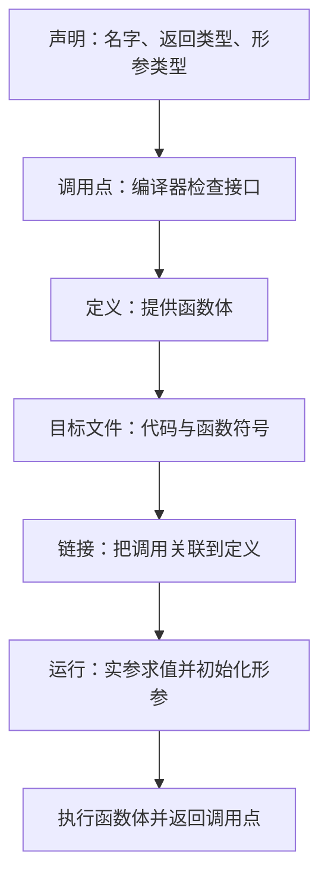

# 第 5 天：函数的声明、定义、调用与返回

预计用时：120～150 分钟  
语言标准：C++17

## 今日目标

学完本单元，你应该能够：

1. 用准确语言区分函数声明、函数定义和函数调用
2. 区分形参与实参，并跟踪一次函数调用中的值
3. 编写有返回值函数和 `void` 函数
4. 使用前置声明，让函数定义可以写在 `main` 后面
5. 判断错误主要发生在编译阶段还是链接阶段
6. 准确解释 `main` 的特殊地位以及 `return 0;` 的含义

## 本单元范围

### 今天必须掌握

- 函数的声明、定义、调用
- 返回类型、函数名、形参列表和函数体
- 实参与形参
- `return 表达式;` 和 `void`
- 声明必须在调用点可见
- “有声明但没有定义”为什么可能编译成功、链接失败

### 今天先看全貌

- 调用发生时：计算实参、初始化形参、执行函数体、返回调用点
- 常见实现会使用调用栈保存一次调用所需的状态
- 函数声明属于编译期接口；函数定义还要为程序提供可链接的实现
- 编译器可能内联函数，但必须保持 C++ 抽象机要求的可观察行为

### 后续深入

- 第 6 天：值传递、引用传递、重载、默认参数和递归
- 第 11 天：形参和局部对象的存储期、生命周期及常见调用栈实现
- 第 14 天：实参求值顺序、表达式副作用和值类别
- 第 15～17 天：翻译单元、符号、名称查找、链接与 ODR
- 第 19～25 天：成员函数、构造/析构、虚函数及运算符重载

对应补全项目：[`G04`](../COVERAGE_MAP.md)。本单元与第 4 天共同完成该项目的教材闭环。

---

## 关键术语索引（正文可跳转）

> 本表用于查阅和复习，不要求在学习正文前逐项背诵。正文会在术语真正参与知识推导时直接解释，或链接到对应的完整定义。
>
> 点击第一列术语可跳到下方定义。表格只承担索引功能；跳转目标仍使用真正的 Markdown 六级标题，确保 GitHub 与 Obsidian 均可识别。

| 术语（点击跳转） | 一句话直观解释 |
|---|---|
| [函数（function）](#术语-d05-01-函数) | 给一段可重复执行的行为起名字 |
| [函数类型（function type）](#术语-d05-02-函数类型) | 描述函数接收什么、返回什么的类型信息 |
| [函数接口（interface）](#术语-d05-03-函数接口) | 调用者为了正确使用函数需要知道的约定 |
| [函数声明（declaration）](#术语-d05-04-函数声明) | 先告诉编译器“有这样一个函数，可以这样调用” |
| [函数定义（definition）](#术语-d05-05-函数定义) | 给出函数真正执行的代码 |
| [函数调用表达式（function call expression）](#术语-d05-06-函数调用表达式) | 写函数名和括号，让函数执行一次 |
| [调用者与被调用者（caller and callee）](#术语-d05-07-调用者与被调用者) | 发起调用的是调用者，被叫到的是被调用者 |
| [形参（parameter）](#术语-d05-08-形参) | 函数定义中用于接收输入的名字 |
| [实参（argument）](#术语-d05-09-实参) | 调用函数时实际放进括号的表达式 |
| [返回类型（return type）](#术语-d05-10-返回类型) | 函数承诺返回哪一类结果 |
| [返回值（return value）](#术语-d05-11-返回值) | 某一次调用实际交回给调用者的结果 |
| [<code>void</code> 返回](#术语-d05-12-void返回) | 这个函数完成动作，但不交回一个普通值 |
| [控制转移（control transfer）](#术语-d05-13-控制转移) | 程序暂时跳到函数体，结束后再回来 |
| [调用栈（call stack）](#术语-d05-14-调用栈) | 运行时按调用顺序保存“回来位置和局部状态”的常见结构 |
| [栈帧（stack frame）](#术语-d05-15-栈帧) | 某一次函数调用在调用栈中的那一层 |
| [函数签名（function signature）](#术语-d05-16-函数签名) | 用来区分函数身份的一组类型信息 |

### 术语定义

###### 术语-d05-01-函数

**函数（function）**

- **新手先这样理解：** 给一段可重复执行的行为起名字
- **专业上更准确地说：** 函数是可被调用的程序实体，具有函数类型；定义时还具有函数体。函数不是对象，也不是“保存代码的变量”。

###### 术语-d05-02-函数类型

**函数类型（function type）**

- **新手先这样理解：** 描述函数接收什么、返回什么的类型信息
- **专业上更准确地说：** 函数类型由返回类型和形参类型列表等规则形成，例如“接收两个 <code>int</code> 并返回 <code>int</code>”。函数名、形参名和默认实参不属于函数类型。

###### 术语-d05-03-函数接口

**函数接口（interface）**

- **新手先这样理解：** 调用者为了正确使用函数需要知道的约定
- **专业上更准确地说：** “接口”是工程概念，通常包括函数声明表达的名称、参数类型、返回类型，以及文档中的前置条件、效果和错误约定；它不等同于单独一个 C++ 关键字。

###### 术语-d05-04-函数声明

**函数声明（declaration）**

- **新手先这样理解：** 先告诉编译器“有这样一个函数，可以这样调用”
- **专业上更准确地说：** 函数声明把函数名称和类型等信息引入作用域，使调用点能够进行名称查找和类型检查。只有声明而没有可用定义时，程序仍可能在链接阶段失败。

###### 术语-d05-05-函数定义

**函数定义（definition）**

- **新手先这样理解：** 给出函数真正执行的代码
- **专业上更准确地说：** 函数定义是带函数体的声明，它为函数提供实现。对普通非内联函数，一个程序中通常只能有一个符合 ODR 的定义；完整规则在第 17 天学习。

###### 术语-d05-06-函数调用表达式

**函数调用表达式（function call expression）**

- **新手先这样理解：** 写函数名和括号，让函数执行一次
- **专业上更准确地说：** 调用表达式先确定被调用函数，处理各个实参与形参的初始化，再把控制转移给被调用函数；有返回值时，整个调用表达式会产生相应结果。

###### 术语-d05-07-调用者与被调用者

**调用者与被调用者（caller and callee）**

- **新手先这样理解：** 发起调用的是调用者，被叫到的是被调用者
- **专业上更准确地说：** 这是描述调用关系的工程术语。例如 <code>main</code> 执行 <code>add(2, 3)</code> 时，<code>main</code> 是 caller，<code>add</code> 是 callee。

###### 术语-d05-08-形参

**形参（parameter）**

- **新手先这样理解：** 函数定义中用于接收输入的名字
- **专业上更准确地说：** 形参在函数声明或定义的形参列表中声明，属于被调用函数。调用发生时，它会按参数传递规则由对应实参初始化或绑定。

###### 术语-d05-09-实参

**实参（argument）**

- **新手先这样理解：** 调用函数时实际放进括号的表达式
- **专业上更准确地说：** 实参是调用表达式提供的表达式，例如 <code>add(a, 3)</code> 中的 <code>a</code> 和 <code>3</code>。实参与形参不是同一个语法位置，也不一定是同一个对象。

###### 术语-d05-10-返回类型

**返回类型（return type）**

- **新手先这样理解：** 函数承诺返回哪一类结果
- **专业上更准确地说：** 返回类型是函数声明的一部分，并参与函数类型的形成；普通函数不能只靠返回类型不同来构成重载。

###### 术语-d05-11-返回值

**返回值（return value）**

- **新手先这样理解：** 某一次调用实际交回给调用者的结果
- **专业上更准确地说：** 对非 <code>void</code> 函数，<code>return</code> 表达式的结果要按返回类型规则进行检查和必要转换，然后用于形成该次调用的结果。返回类型与返回值不能混称。

###### 术语-d05-12-void返回

**<code>void</code> 返回**

- **新手先这样理解：** 这个函数完成动作，但不交回一个普通值
- **专业上更准确地说：** 当函数返回类型为 <code>void</code> 时，调用表达式不产生可供普通值计算使用的结果。<code>void</code> 是语言中的类型，不应简单解释成数字 0 或空指针。

###### 术语-d05-13-控制转移

**控制转移（control transfer）**

- **新手先这样理解：** 程序暂时跳到函数体，结束后再回来
- **专业上更准确地说：** 调用把控制交给被调用函数；正常返回时，控制继续到调用表达式之后。异常、程序终止等路径可能不会按普通方式返回。

###### 术语-d05-14-调用栈

**调用栈（call stack）**

- **新手先这样理解：** 运行时按调用顺序保存“回来位置和局部状态”的常见结构
- **专业上更准确地说：** 调用栈是多数实现采用的运行时机制，不是 C++ 标准强制规定的物理结构。优化器可以内联函数，使某次调用不产生可观察的独立栈帧。

###### 术语-d05-15-栈帧

**栈帧（stack frame）**

- **新手先这样理解：** 某一次函数调用在调用栈中的那一层
- **专业上更准确地说：** 栈帧是实现层术语，可能保存返回地址、局部对象、溢出到内存的形参和寄存器状态；其具体布局由平台 ABI、编译器和优化决定。

###### 术语-d05-16-函数签名

**函数签名（function signature）**

- **新手先这样理解：** 用来区分函数身份的一组类型信息
- **专业上更准确地说：** 在 C++ 标准语境中，“签名”有特定定义，不能随意当作“整条函数声明”的同义词；普通函数签名通常不包含返回类型和形参名。本课程会在涉及重载时谨慎使用该词。

## 一、完整知识地图

[函数](#术语-d05-01-函数)不是只有“把代码装进一个盒子”这么简单。它同时涉及源代码结构、编译检查、链接和运行时控制流：



一段典型代码包含三种不同动作：

```cpp
int add(int left, int right);       // 声明

int main() {
    int result{add(2, 3)};          // 调用
    return 0;
}

int add(int left, int right) {      // 定义
    return left + right;
}
```

必须先建立这个区分：

> 声明告诉当前翻译单元“这个函数怎样使用”；定义为函数提供函数体。调用才会在程序执行时请求运行该函数。

---

## 二、核心术语：在讲解中建立定义

### 1. 函数

函数是具有名字、[返回类型](#术语-d05-10-返回类型)、形参列表和函数体的一段程序结构。调用它会把[控制转移](#术语-d05-13-控制转移)到函数体；函数结束后，控制通常回到调用点之后。

### 2. [函数声明](#术语-d05-04-函数声明)

声明把函数的名字和类型信息引入当前作用域：

```cpp
int add(int left, int right);
```

末尾是分号，没有函数体。参数名可以省略：

```cpp
int add(int, int);
```

这两个声明对调用者提供的类型信息相同。保留有意义的参数名通常更便于阅读。

### 3. [函数定义](#术语-d05-05-函数定义)

定义包含函数体：

```cpp
int add(int left, int right) {
    return left + right;
}
```

每个函数定义同时也是一个声明；但只有分号、没有函数体的声明不是定义。

### 4. 函数调用

函数名后跟实参列表形成调用表达式：

```cpp
add(2, 3)
```

如果函数返回一个值，调用表达式也会产生一个值。

### 5. [形参](#术语-d05-08-形参)

形参写在函数声明或定义的圆括号中：

```cpp
int add(int left, int right)
```

`left` 和 `right` 是形参。它们属于被调用函数。

### 6. [实参](#术语-d05-09-实参)

实参写在调用处：

```cpp
add(2, 3)
```

`2` 和 `3` 是实参。调用发生时，它们用于初始化对应形参。

### 7. 返回类型

函数名前面的类型说明调用结果的类型：

```cpp
int add(int left, int right);
```

这里返回类型是 `int`。

### 8. [返回值](#术语-d05-11-返回值)

`return` 后的表达式给出返回结果：

```cpp
return left + right;
```

表达式结果会按函数返回类型进行检查和必要的转换，然后函数结束，控制回到调用者。

### 9. [调用者与被调用者](#术语-d05-07-调用者与被调用者)

发起调用的函数叫调用者，被调用的函数叫被调用者。例如 `main` 调用 `add` 时：

- 调用者：`main`
- 被调用者：`add`

---

## 三、读懂函数的组成

读函数时先抓住两个概念：[**函数类型**](#术语-d05-02-函数类型)描述函数接收哪些类型的输入、返回哪种类型的结果；[**函数调用表达式**](#术语-d05-06-函数调用表达式)则是写出被调用对象和实参列表，让一次调用实际发生的表达式，例如 `add(2, 3)`。

```cpp
int remaining_cycles(int completed, int target) {
    return target - completed;
}
```

| 部分 | 含义 |
|---|---|
| `int` | 返回类型 |
| `remaining_cycles` | 函数名 |
| `(int completed, int target)` | 形参列表 |
| `{ ... }` | 函数体 |
| `return target - completed;` | 产生返回值并结束本次调用 |

调用：

```cpp
int remaining{remaining_cycles(3, 8)};
```

这里：

- `3` 初始化形参 `completed`
- `8` 初始化形参 `target`
- 函数计算 `8 - 3`
- 返回值 `5` 初始化变量 `remaining`

---

## 四、为什么需要函数

### 1. 给一段行为命名

```cpp
bool can_continue(int battery, bool emergency_stop) {
    return battery >= 20 && !emergency_stop;
}
```

函数名说明了这段判断的用途。

### 2. 避免重复

如果同一计算在多个地方出现，可以把它集中到一个函数中。修改规则时只需修改定义。

### 3. 分离接口和实现

[**函数接口**](#术语-d05-03-函数接口)是调用者正确使用函数所需的约定，通常包括名称、参数类型、返回类型以及文档说明的前置条件和效果；函数体则是实现这些约定的具体代码。

调用者只需知道声明：

```cpp
int remaining_cycles(int completed, int target);
```

函数体可以写在当前文件后面，也可以在另一个 `.cpp` 中。跨文件组织会在第 15～17、33 天系统学习。

### 4. 便于测试

输入和输出明确的小函数可以独立验证，例如分别测试：

```text
remaining_cycles(3, 8)  -> 5
remaining_cycles(8, 8)  -> 0
remaining_cycles(10, 8) -> 0
```

---

## 五、声明为什么必须在调用点可见

阅读下面的顺序：

```cpp
int main() {
    int result{add(2, 3)};
    return 0;
}

int add(int left, int right) {
    return left + right;
}
```

编译器处理 `main` 中的调用时，还没有看到 `add` 的声明，因此无法确认：

- `add` 是否是函数
- 需要几个实参
- 每个形参是什么类型
- 调用结果是什么类型

一种修复方法是在 `main` 前加入声明：

```cpp
int add(int left, int right);
```

另一种方法是把完整定义放到 `main` 前。两种写法都能让调用点先看到声明。

---

## 六、声明、定义与链接的真实关系

考虑：

```cpp
int motor_power(int level);

int main() {
    return motor_power(3);
}
```

只有声明，没有定义。分开执行：

```bash
g++ -std=c++17 -Wall -Wextra -pedantic -c missing_definition.cpp -o missing_definition.o
```

编译阶段通常能够成功，因为声明足以让编译器检查调用的类型。

再链接：

```bash
g++ missing_definition.o -o missing_definition
```

链接器会寻找 `motor_power(int)` 的定义；找不到时通常报告：

```text
undefined reference to `motor_power(int)'
```

这与第 4 天的完整链路一致：

```text
源文件
  → 预处理
  → 狭义编译
  → 汇编
  → 含未解析引用的目标文件
  → 链接时寻找函数定义
```

所以：

> 声明存在不等于定义存在；单个源文件编译成功也不等于整个程序链接成功。

---

## 七、一次函数调用实际发生什么

调用：

```cpp
int result{add(2, 3)};
```

从 C++ 语言层面，可以按以下顺序理解：

1. 确定要调用的函数
2. 计算实参表达式 `2` 和 `3`
3. 用实参初始化对应形参 `left` 和 `right`
4. 进入函数体
5. 计算 `left + right`
6. `return` 结束这次调用并产生结果 `5`
7. 回到调用点，用结果初始化 `result`

这里使用的实参很简单。多个实参表达式之间并不能一律假定按从左到右求值；带副作用的精确规则放在第 14 天。

### 常见实现中的[调用栈](#术语-d05-14-调用栈)

多数桌面和服务器实现会使用调用栈保存返回位置、部分形参、局部对象和寄存器状态。调用 `add` 时，可以形成类似：

```text
较新的调用
┌────────────────────────────┐
│ add：left、right、返回信息   │
├────────────────────────────┤
│ main：result 等局部对象      │
└────────────────────────────┘
较早的调用
```

`add` 返回后，它本次调用中的形参和局部对象生命周期结束。

但要准确区分：

- C++ 标准规定程序行为、对象生命周期和控制转移
- “[栈帧](#术语-d05-15-栈帧)具体长什么样、哪些值放寄存器”属于实现和平台细节
- 优化器可能内联 `add`，不真正生成独立调用指令，但结果必须符合语言要求

对象存储期、生命周期和常见栈实现将在第 11 天展开。

---

## 八、有返回值的函数

### 一个返回点

```cpp
int add(int left, int right) {
    return left + right;
}
```

### 多个返回路径

```cpp
int remaining_cycles(int completed, int target) {
    if (completed >= target) {
        return 0;
    }

    return target - completed;
}
```

当第一个 `return` 执行时，函数立即结束，后面的语句不会继续执行。

### 所有可达路径都必须正确返回

错误示例：

```cpp
int sign(int value) {
    if (value >= 0) {
        return 1;
    }
}
```

当 `value < 0` 时，控制会走到函数末尾，却没有返回 `int`。编译器通常会警告；对于普通的有返回值函数，实际执行到这种路径会产生未定义行为。

修复：

```cpp
int sign(int value) {
    if (value >= 0) {
        return 1;
    }

    return -1;
}
```

---

## 九、不返回值的 [`void`](#术语-d05-12-void返回) 函数

只执行动作、不向调用者提供结果时，可以使用 `void`：

```cpp
void print_ready() {
    std::cout << "Robot ready\n";
}
```

调用：

```cpp
print_ready();
```

`void` 函数可以自然执行到末尾，也可以使用不带表达式的：

```cpp
return;
```

不能把 `void` 调用当作一个 `int` 值：

```cpp
int result{print_ready()}; // 编译错误
```

---

## 十、形参和实参不要混淆

```cpp
int multiply(int left, int right) {
    return left * right;
}

int main() {
    int factor{4};
    int result{multiply(factor, 3)};
}
```

| 名称 | 所在位置 | 本例 |
|---|---|---|
| 形参 | 函数声明或定义中 | `left`、`right` |
| 实参 | 函数调用中 | `factor`、`3` |

本例的 `int` 形参采用值传递。它们从实参获得值，但不是调用者变量 `factor` 本身。值传递、引用传递以及如何修改调用者对象将在第 6 天精确比较。

---

## 十一、函数声明必须一致

下面的声明与定义一致：

```cpp
int add(int left, int right);

int add(int left, int right) {
    return left + right;
}
```

下面不一致：

```cpp
double add(int left, int right);

int add(int left, int right) {
    return left + right;
}
```

C++ 不能仅通过返回类型区分两个同名、同形参类型的函数，因此这种写法会导致编译错误，而不是得到两个重载。

本课程会谨慎使用“[函数签名](#术语-d05-16-函数签名)”一词。C++ 标准语境中的普通函数签名通常不包含返回类型和形参名；完整声明仍然包含返回类型。函数重载规则在第 6 天展开。

---

## 十二、`main` 是一个特殊函数

第 4 天已经说明：可执行文件被装载后，运行环境还会完成启动代码和运行库初始化，然后才进入 `main`。因此 `main` 通常不是可执行文件中的第一条机器指令。

对于常见的宿主环境 C++ 程序：

```cpp
int main() {
    return 0;
}
```

需要掌握：

1. `main` 位于全局命名空间，是程序指定的主函数
2. 返回类型必须是 `int`，不能写成 `void main()`
3. 不应在程序中自己调用 `main`
4. `return 0;` 把成功状态交还给运行环境，不会自动在终端打印 `0`
5. 执行到 `main` 末尾而没有显式 `return`，效果相当于返回 `0`

```cpp
int main() {
    std::cout << "Done\n";
} // 对 main 特殊处理：相当于 return 0;
```

非零返回值通常表示失败，但具体状态如何被外部环境解释具有平台约定。

还要保留完整边界：

- 本课程当前讨论的是常见宿主环境程序
- 某些嵌入式“独立实现”可以有不同的启动方式，甚至不要求使用通常形式的 `main`
- 机器人固件中的复位处理程序、启动代码和无限控制循环属于平台与工程环境问题

至此，`G04` 的教材路线闭环：

```text
操作系统/固件启动
  → 装载与运行时初始化
  → 进入宿主程序的 main
  → main 调用其他函数
  → main 返回状态给运行环境
```

---

## 十三、完整示例：机器人任务判断

仓库示例：[robot_functions.cpp](../examples/day-05/robot_functions.cpp)

```cpp
#include <iostream>

int remaining_cycles(int completed_cycles, int target_cycles);
bool can_continue(int battery_percent, bool emergency_stop);
void print_decision(bool allowed, int remaining);

int main() {
    int completed_cycles{3};
    int target_cycles{8};
    int battery_percent{42};
    bool emergency_stop{false};

    int remaining{
        remaining_cycles(completed_cycles, target_cycles)
    };
    bool allowed{
        can_continue(battery_percent, emergency_stop)
    };

    print_decision(allowed, remaining);
    return 0;
}

int remaining_cycles(int completed_cycles, int target_cycles) {
    if (completed_cycles >= target_cycles) {
        return 0;
    }

    return target_cycles - completed_cycles;
}

bool can_continue(int battery_percent, bool emergency_stop) {
    return battery_percent >= 20 && !emergency_stop;
}

void print_decision(bool allowed, int remaining) {
    std::cout << "Remaining cycles: " << remaining << '\n';

    if (allowed) {
        std::cout << "Decision: continue\n";
    } else {
        std::cout << "Decision: stop\n";
    }
}
```

编译：

```bash
g++ -std=c++17 -Wall -Wextra -pedantic \
    examples/day-05/robot_functions.cpp \
    -o robot_functions
```

运行结果：

```text
Remaining cycles: 5
Decision: continue
```

---

## 十四、错误实验与定位

### 错误 1：调用前没有声明

```cpp
int main() {
    return add(2, 3);
}

int add(int left, int right) {
    return left + right;
}
```

主要失败阶段：狭义编译。修复方法是在调用前放置声明或定义。

### 错误 2：只有声明，没有定义

```cpp
int add(int left, int right);

int main() {
    return add(2, 3);
}
```

通常能够生成目标文件，但链接失败。

### 错误 3：实参数量不匹配

```cpp
int add(int left, int right);
int result{add(2)};
```

主要失败阶段：狭义编译。编译器能从声明发现少了一个实参。

### 错误 4：普通有返回值函数漏掉返回路径

```cpp
int positive_only(int value) {
    if (value > 0) {
        return value;
    }
}
```

严格警告选项通常会指出问题；若实际走到无返回值路径，会产生未定义行为。

### 错误 5：误以为 `return 0;` 会输出数字

`return` 把值交给调用者或运行环境；`std::cout` 才向标准输出流写内容。这是两种不同的数据去向。

---

## 十五、随堂练习

1. 在 `int add(int left, int right);` 中指出返回类型、函数名和形参类型。
2. 在 `add(count, 2)` 中指出两个实参。
3. 解释为什么“只有函数声明”的程序可能通过编译但不能完成链接。
4. 解释普通函数的 `return 5;` 与 `std::cout << 5;` 有何不同。
5. 把完整示例中的 `battery_percent` 改为 `10`，先预测再运行。

完整作答区见：[第 5 天练习单](../exercises/day-05.md)。

---

## 十六、不要形成的六个误解

1. **声明就是定义**：错误。定义必须提供函数体。
2. **函数写在文件后面也一定能调用**：错误。调用点之前必须能看到相应声明。
3. **编译成功说明函数定义一定存在**：错误。缺少定义可能到链接阶段才暴露。
4. **实参和形参是同一个术语**：错误。它们处于调用两侧的不同位置。
5. **每次函数调用都必然生成物理栈帧**：错误。那是常见实现，优化器可以内联。
6. **程序执行的第一条机器指令就是 `main` 第一行**：错误。第 4 天已经展示了装载与启动过程。

---

## 十七、今日完成标准

满足以下条件，才算完成第 5 天：

- 能独立写出函数声明、定义和调用
- 能指出一段代码中的形参与实参
- 能编写一个返回 `int` 或 `bool` 的函数
- 能编写并调用一个 `void` 函数
- 能解释声明为何用于编译检查、定义为何还关系到链接
- 能通过删除函数定义制造一次真实的链接错误
- 能准确解释 `main` 前后发生的控制转移和返回状态
- 完成练习单并提交仓库等待批改

下一单元：函数（二）——值传递、引用传递、重载、默认参数与递归。
