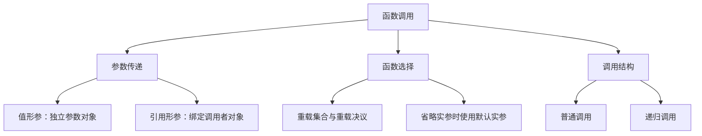

# 第 6 天：值传递、引用传递、函数重载、默认参数与递归

预计用时：150～180 分钟  
语言标准：C++17

## 今日目标

学完本单元，你应该能够：

1. 比较值形参、非常量左值引用形参和只读引用形参
2. 判断函数能否修改调用者传入的对象
3. 编写一组普通非模板重载函数
4. 用“候选函数—可行函数—最佳可行函数”解释基本重载选择
5. 正确声明和使用默认实参
6. 编写具有基例和递归步骤的简单递归函数
7. 判断引用绑定、重载歧义和无限递归分别在哪个阶段暴露

## 本单元范围

### 今天必须掌握

- 基本类型的值传递
- `T&` 非常量左值引用传递
- `const T&` 的只读引用入门
- 普通非模板函数的基本重载决议
- 默认实参的声明位置、尾部规则和调用含义
- 直接递归、基例和递归步骤

### 今天先看全貌

- 类类型按值传递还涉及复制、移动和优化
- 引用绑定与左值、右值、临时对象生命周期相关
- 完整重载决议还受名称查找、转换序列、模板和用户定义转换影响
- 每次递归调用都有独立的形参和局部对象；常见实现通常使用调用栈
- 尾递归优化不是 C++ 的保证

### 后续深入

- 第 10 天：地址、指针和引用的系统模型
- 第 11 天：形参、局部对象的存储期、生命周期和常见调用栈
- 第 13～14 天：`const`、类型转换、值类别和实参求值
- 第 17 天：名称查找怎样决定重载候选集合
- 第 21～22 天：类对象按值传递时的复制与移动
- 第 25 天：运算符重载和成员/非成员函数选择
- 第 27 天：函数模板、模板实参推导和模板重载

对应补全项目：[`G16`～`G18`](../COVERAGE_MAP.md)。

---

## 关键术语索引（正文可跳转）

> 本索引用于查阅和复习，不要求在学习正文前逐项背诵。正文会在术语真正参与知识推导时直接解释，或链接回这里。
>
> 每个跳转目标都是真正的 Markdown 六级标题，GitHub 与 Obsidian 均可识别。请勿删除以“术语-”开头的小标题。

###### 术语-d06-01-值形参

**值形参（by-value parameter）**

- **新手先这样理解：** 函数拿到一份独立的参数值，修改形参通常不改调用者对象
- **专业上更准确地说：** 值形参本身是参数对象，由实参按初始化规则建立。对类类型可能发生复制、移动或省略；“一定完整复制一份内存”不是普遍准确的说法。

###### 术语-d06-02-引用

**引用（reference）**

- **新手先这样理解：** 给已有对象提供另一个访问名称
- **专业上更准确地说：** 引用是初始化后指代某个对象或函数的实体，通常不能重新改绑。使用引用表达式时通常是在访问所指代的实体；引用不是一个可以像普通对象那样独立赋值改绑的容器。

###### 术语-d06-03-绑定

**绑定（binding）**

- **新手先这样理解：** 确定这个引用现在指向哪个实体
- **专业上更准确地说：** 引用绑定是引用初始化的一部分，语言规则会检查对象类别、类型转换和 <code>const</code> 限定。它与以后通过引用给对象赋值是两件事。

###### 术语-d06-04-左值

**左值（lvalue）**

- **新手先这样理解：** 通常表示一个有身份、可以再次定位到的对象
- **专业上更准确地说：** 左值是一种表达式值类别，通常标识一个对象或函数。它并不等同于“等号左边的值”；有些左值不能被修改，某些赋值左操作数还需满足额外条件。第 14、22 天继续深化。

###### 术语-d06-05-非常量左值引用形参t与

**非常量左值引用形参 <code>T&amp;</code>**

- **新手先这样理解：** 函数直接操作调用者提供的可修改对象
- **专业上更准确地说：** 这种形参必须按引用绑定规则绑定到合适的非 <code>const</code> 左值；通过形参修改所指代对象会被调用者观察到。字面量通常不能直接绑定给它。

###### 术语-d06-06-只读引用形参constt与

**只读引用形参 <code>const T&amp;</code>**

- **新手先这样理解：** 函数借用对象来读取，但不能通过该形参修改它
- **专业上更准确地说：** 该引用禁止通过自身修改所指代对象，并能绑定更多种实参。某些类型转换可能产生临时对象，因此“使用 <code>const T&amp;</code> 永远不创建临时对象”并不准确。

###### 术语-d06-07-函数重载

**函数重载（overloading）**

- **新手先这样理解：** 多个同名函数处理不同类型的输入
- **专业上更准确地说：** 在允许的作用域和规则下，多个同名函数可形成重载；调用时编译器依据名称查找、实参和转换规则选择目标。仅形参名不同或仅返回类型不同不能构成普通函数重载。

###### 术语-d06-08-重载集合

**重载集合（overload set）**

- **新手先这样理解：** 当前名字对应的一组同名函数
- **专业上更准确地说：** 名称查找在当前上下文中找到的相关函数形成供后续重载决议考虑的集合。它不是一个运行时容器。

###### 术语-d06-09-重载决议

**重载决议（overload resolution）**

- **新手先这样理解：** 编译器从同名函数中选出这一调用该用哪个
- **专业上更准确地说：** 重载决议发生在编译期，依次考虑候选函数、可行性和隐式转换序列的优劣；只有存在唯一最佳可行函数时调用才成立。

###### 术语-d06-10-候选函数

**候选函数（candidate function）**

- **新手先这样理解：** 有资格进入本轮选择名单的函数
- **专业上更准确地说：** 候选函数由名称查找及重载规则确定。进入候选集合并不表示它能接受当前实参。

###### 术语-d06-11-可行函数

**可行函数（viable function）**

- **新手先这样理解：** 参数数量和类型规则都允许这次调用的候选函数
- **专业上更准确地说：** 可行性要求实参数量满足规则，并且每个实参都存在可接受的隐式转换或引用绑定到对应形参。

###### 术语-d06-12-最佳可行函数

**最佳可行函数（best viable function）**

- **新手先这样理解：** 所需转换整体上唯一更合适的那个函数
- **专业上更准确地说：** 编译器按标准规定的偏序与转换等级比较可行函数；“看起来最接近”只是直觉，必须存在规则意义上的唯一最佳者。

###### 术语-d06-13-歧义

**歧义（ambiguity）**

- **新手先这样理解：** 编译器无法唯一决定选哪个函数
- **专业上更准确地说：** 当存在多个可行函数却没有唯一最佳选择时，调用在编译期失败。编译器不会随机挑选，也不会等到运行时再决定。

###### 术语-d06-14-隐式转换

**隐式转换（implicit conversion）**

- **新手先这样理解：** 编译器按规则自动把实参调整为形参需要的类型
- **专业上更准确地说：** 隐式转换是语言在特定上下文允许自动进行的转换序列。它的等级会影响重载选择，但并非“能转就一定安全或一定会选中”。

###### 术语-d06-15-默认实参

**默认实参（default argument）**

- **新手先这样理解：** 调用时省略某项输入，由声明提供默认表达式
- **专业上更准确地说：** 默认实参附着在可见声明上，在调用点用于补足省略的实参，并在每次调用时求值；它不是函数体内部自动初始化形参的隐藏语句，也不属于函数类型。

###### 术语-d06-16-递归

**递归（recursion）**

- **新手先这样理解：** 函数直接或间接调用自己
- **专业上更准确地说：** 每次递归调用都是一次新的函数调用，具有独立的形参和局部对象状态；递归必须有可达的终止路径，且问题状态需要朝该路径推进。

###### 术语-d06-17-基例

**基例（base case）**

- **新手先这样理解：** 不再继续调用自己、直接结束或给出结果的情况
- **专业上更准确地说：** 基例是递归控制流中的终止分支。只写出基例还不够，递归步骤必须能在有限次调用内到达它。

###### 术语-d06-18-栈溢出

**栈溢出（stack overflow）**

- **新手先这样理解：** 递归太深，常见调用栈空间耗尽
- **专业上更准确地说：** 栈溢出是常见实现上的运行时故障，不保证以某个标准 C++ 异常形式出现。无限递归通常先表现为持续调用，随后可能异常终止。

## 一、完整知识地图



它们不是互不相干的四个语法点：

- 参数传递决定被调用函数操作的是独立参数对象还是调用者对象
- [重载决议](#术语-d06-09-重载决议)决定同名函数中究竟调用哪一个
- [默认实参](#术语-d06-15-默认实参)在调用处补足省略的实参，然后再进行函数调用
- 递归只是函数直接或间接再次调用自己，每次调用仍遵守相同的参数规则

---

## 二、核心术语：在讲解中建立定义

### 1. [值形参](#术语-d06-01-值形参)

```cpp
void try_change(int value);
```

`value` 是一个独立的参数对象，由实参的值初始化。修改它通常不会修改调用者的 `int` 对象。

### 2. [引用](#术语-d06-02-引用)

引用为已有对象提供另一个名字。引用必须在初始化时[绑定](#术语-d06-03-绑定)，之后不能改为绑定另一个对象。

### 3. [非常量左值引用形参](#术语-d06-05-非常量左值引用形参t与)

```cpp
void normalize(int& value);
```

`value` 绑定到调用者提供的可修改对象；通过 `value` 进行赋值会修改该对象。

### 4. [只读引用形参](#术语-d06-06-只读引用形参constt与)

```cpp
void inspect(const int& value);
```

它绑定对象，但不能通过 `value` 修改所绑定的对象。`const` 的完整规则在第 13 天学习。

### 5. 重载

同一作用域中可以存在多个同名函数，只要它们具有可区分的形参类型列表：

```cpp
void report(int value);
void report(double value);
```

### 6. [重载集合](#术语-d06-08-重载集合)

名称查找找到的同名函数组成供重载决议考虑的集合。完整名称查找在第 17 天学习。

### 7. [候选函数](#术语-d06-10-候选函数)

进入本次重载决议考虑范围的函数。

### 8. [可行函数](#术语-d06-11-可行函数)

实参数量满足要求，并且每个实参都能按规则转换并绑定到对应形参的候选函数。

### 9. [最佳可行函数](#术语-d06-12-最佳可行函数)

编译器比较各个可行函数所需的转换。如果存在唯一更好的选择，就调用它；否则报告歧义。

### 10. 默认实参

调用者省略某个实参时，由可见声明提供的表达式：

```cpp
int energy_cost(int cycles, int per_cycle = 3);
```

### 11. [递归](#术语-d06-16-递归)

函数直接或间接调用自己。

### 12. [基例](#术语-d06-17-基例)与递归步骤

- 基例：不再继续递归，直接产生结果
- 递归步骤：把问题推进到更接近基例的状态，再进行调用

---

## 三、值传递：形参是独立对象

```cpp
#include <iostream>

void try_change(int value) {
    value = 99;
    std::cout << "Inside: " << value << '\n';
}

int main() {
    int battery{40};
    try_change(battery);
    std::cout << "Outside: " << battery << '\n';
}
```

输出：

```text
Inside: 99
Outside: 40
```

调用过程：

```text
main 中的 battery 值为 40
        ↓ 用这个值初始化
try_change 中独立的形参 value，初始值为 40
        ↓
value 被改为 99
        ↓
函数结束，value 生命周期结束
        ↓
battery 仍为 40
```

这里的准确结论是：

> 对基本类型的值形参而言，形参是由实参初始化的独立参数对象；给形参赋值不会给调用者对象赋值。

对于类对象，按值传递仍然创建参数对象，但初始化可能涉及复制构造、移动构造或允许的省略；第 21～22 天补齐。

---

## 四、引用传递：形参绑定调用者对象

```cpp
void normalize_percent(int& percent) {
    if (percent < 0) {
        percent = 0;
    } else if (percent > 100) {
        percent = 100;
    }
}
```

调用：

```cpp
int battery{108};
normalize_percent(battery);
```

`percent` 绑定 `battery`。函数中的：

```cpp
percent = 100;
```

修改的就是 `battery`，所以调用结束后 `battery == 100`。

### 非常量左值引用的绑定限制

可以：

```cpp
int battery{40};
normalize_percent(battery);
```

不能：

```cpp
normalize_percent(40);
```

字面量 `40` 不是可以绑定到 `int&` 的可修改[左值](#术语-d06-04-左值)，因此这是编译错误。

也不能把只读对象绑定给准备修改对象的 `int&`：

```cpp
const int battery{40};
normalize_percent(battery); // 编译错误
```

`const`、左值和右值的完整规则分别在第 13、14 天展开。

---

## 五、只读引用 `const T&`

如果函数只需观察对象而不应修改它，可以使用：

```cpp
void print_level(const int& level) {
    std::cout << level << '\n';
}
```

它可以绑定普通对象：

```cpp
int battery{40};
print_level(battery);
```

也可以绑定字面量产生的临时值：

```cpp
print_level(40);
```

函数不能通过 `level` 赋值：

```cpp
level = 50; // 编译错误
```

对于 `int` 这样的小型基本类型，只读地传值通常已经足够简单；`const T&` 的主要工程价值会在 `std::string`、容器和类对象出现后更加明显。不能把“引用一定更快”当成普遍规则。

---

## 六、值形参与引用形参怎样选择

| 需求 | 入门选择 | 结果 |
|---|---|---|
| 函数需要一个小型值，不修改调用者 | `int value` | 独立参数对象 |
| 函数必须修改调用者对象 | `int& value` | 绑定可修改对象 |
| 函数只读访问对象且希望避免类对象复制 | `const T& value` | 只读绑定 |

还要避免两个误区：

1. `T&` 不表示“返回多个值”的专用语法；它表示引用类型
2. 是否应修改调用者是接口设计问题，不能为了少写一个 `return` 随意使用引用

指针、空指针、引用不能重新绑定等内容在第 10 天系统比较。

---

## 七、[函数重载](#术语-d06-07-函数重载)

### 基本定义

```cpp
void report(int value) {
    std::cout << "int: " << value << '\n';
}

void report(double value) {
    std::cout << "double: " << value << '\n';
}
```

调用：

```cpp
report(5);   // 选择 report(int)
report(5.0); // 选择 report(double)
```

编译器在编译阶段完成普通函数重载决议。运行时不会逐个尝试这些函数。

### 不能只改变返回类型

错误：

```cpp
int convert(int value);
double convert(int value);
```

调用 `convert(5)` 时，返回值的使用方式不能用来形成两个仅返回类型不同的普通重载。这组声明发生冲突。

### 形参名不同不构成重载

```cpp
int add(int left, int right);
int add(int first, int second);
```

它们声明的是同一个函数，因为形参名不属于用于区分普通函数重载的形参类型列表。

---

## 八、基本重载决议：候选、可行、最佳

考虑：

```cpp
void report(int value);
void report(double value);
```

调用：

```cpp
report(5);
```

基本过程：

1. 名称查找得到名为 `report` 的候选函数
2. 检查实参数量和类型，形成可行函数
3. 比较所需的[隐式转换](#术语-d06-14-隐式转换)
4. 选出唯一最佳可行函数

对当前只涉及内置数值类型的例子，可以先使用这条排序：

```text
精确匹配
  优于
提升
  优于
一般标准转换
```

示例：

```cpp
void report(int value);
void report(double value);

char code{'A'};
report(code);
```

- `char → int` 是整数提升
- `char → double` 是一般标准转换
- 因此选择 `report(int)`

### [歧义](#术语-d06-13-歧义)

```cpp
void set_level(long value);
void set_level(double value);

set_level(10);
```

对这个调用：

- `int → long` 是一般标准转换
- `int → double` 也是一般标准转换
- 没有唯一更好的函数，因此编译器报告调用有歧义

这只是完整重载决议的一部分。用户定义转换、模板函数、引用绑定细分以及名称查找分别在第 13、17、25、27 天补齐。

---

## 九、重载在构建链路中的位置

普通重载的选择发生在狭义编译阶段：

```text
源代码中的 report(5)
  → 名称查找与重载决议
  → 选定 report(int)
  → 目标文件中产生对选定函数的代码或引用
  → 链接器解析对应定义
```

常见编译器会把形参类型编码进目标文件符号名，这通常称为名称修饰或 name mangling；具体编码方式不是 C++ 标准规定的。

优化器还可能内联已选中的函数，但不会改变“源语言层面先选定哪个函数”的结果。

第 24 天的虚函数动态绑定不同：那种选择可以依赖运行时对象的动态类型。

---

## 十、默认实参

声明：

```cpp
int energy_cost(int cycles, int per_cycle = 3);
```

调用：

```cpp
energy_cost(4);    // 使用默认实参 3
energy_cost(4, 5); // 显式提供 5
```

定义通常不重复默认实参：

```cpp
int energy_cost(int cycles, int per_cycle) {
    return cycles * per_cycle;
}
```

### 规则 1：默认实参必须在调用点可见

默认实参属于声明提供给调用者的信息。如果调用点看到的声明没有默认实参，就不能省略对应实参。

### 规则 2：默认实参通常从右向左连续出现

正确：

```cpp
void configure(int speed, int power = 50, bool enabled = true);
```

错误：

```cpp
void configure(int speed = 10, int power, bool enabled = true);
```

在同一个形参列表中，一旦某个形参有默认实参，右侧形参也必须已有默认实参。

### 规则 3：不要在同一可见作用域重复指定默认实参

错误：

```cpp
int energy_cost(int cycles, int per_cycle = 3);

int energy_cost(int cycles, int per_cycle = 3) {
    return cycles * per_cycle;
}
```

### 规则 4：默认实参不属于函数类型

下面不是两个重载：

```cpp
int energy_cost(int cycles, int per_cycle);
int energy_cost(int cycles, int per_cycle = 3);
```

它们是同一个函数的声明；第二条在其可见范围中补充了默认实参。

### 规则 5：默认实参表达式在每次调用时求值

默认表达式中名字的查找和含义在声明处确定，但表达式会在省略实参的调用发生时求值。不要把默认实参理解为程序启动时只计算一次的常量替换。

---

## 十一、默认实参与重载的相互作用

危险设计：

```cpp
void move(int distance);
void move(int distance, int speed = 1);

move(5);
```

两个函数对一个 `int` 实参都可行，因此调用有歧义。

重载和默认实参都能让调用形式变得简洁，但组合不当会制造难以理解或歧义的接口。优先让每种调用形式有唯一清晰的含义。

---

## 十二、递归

### 最小示例

```cpp
int sum_to(int value) {
    if (value <= 0) {
        return 0;
    }

    return value + sum_to(value - 1);
}
```

调用：

```cpp
int result{sum_to(4)};
```

展开：

```text
sum_to(4)
= 4 + sum_to(3)
= 4 + 3 + sum_to(2)
= 4 + 3 + 2 + sum_to(1)
= 4 + 3 + 2 + 1 + sum_to(0)
= 4 + 3 + 2 + 1 + 0
= 10
```

### 两个必要组成

基例：

```cpp
if (value <= 0) {
    return 0;
}
```

递归步骤：

```cpp
return value + sum_to(value - 1);
```

`value - 1` 让问题持续接近基例。

---

## 十三、递归调用中的对象和控制流

调用 `sum_to(3)` 时，从语言行为上存在多次尚未结束的调用：

| 调用 | 本次形参 `value` | 等待的结果 |
|---|---:|---|
| `sum_to(3)` | 3 | `3 + sum_to(2)` |
| `sum_to(2)` | 2 | `2 + sum_to(1)` |
| `sum_to(1)` | 1 | `1 + sum_to(0)` |
| `sum_to(0)` | 0 | 直接返回 0 |

每次调用的形参都是独立的参数对象；`sum_to(3)` 的 `value` 与 `sum_to(2)` 的 `value` 不是同一个对象。

常见实现通常为每次未结束调用保留栈帧。递归层数过深可能耗尽有限调用栈，但 C++ 标准不规定固定栈大小，也不保证以某种特定异常报告耗尽。

编译器有时能够把某些递归优化成循环形式，但 C++17 不保证尾调用优化。不能依赖它来保证无限深递归安全。

---

## 十四、递归错误实验

如果递归调用层数持续增长，常见实现中的调用栈空间可能耗尽，这种运行时故障称为[**栈溢出**](#术语-d06-18-栈溢出)。C++ 标准不保证它一定以可捕获异常的形式出现，程序也可能直接异常终止。

### 没有可达基例

```cpp
int countdown(int value) {
    return countdown(value - 1);
}
```

每次调用都会继续递归，没有正常停止路径。实际运行通常最终因资源耗尽而异常终止；具体表现依赖实现和运行环境。

### 状态没有接近基例

```cpp
int countdown(int value) {
    if (value == 0) {
        return 0;
    }

    return countdown(value + 1);
}
```

从正数开始时，`value` 越来越远离 `0`。

### 基例写在递归调用之后

```cpp
int countdown(int value) {
    int result{countdown(value - 1)};

    if (value == 0) {
        return 0;
    }

    return result;
}
```

程序先递归，基例检查来不及执行。

---

## 十五、递归还是循环

`sum_to` 也能使用循环：

```cpp
int sum_to_loop(int value) {
    int result{0};

    for (int current{1}; current <= value; ++current) {
        result = result + current;
    }

    return result;
}
```

选择依据不是“递归更高级”：

- 问题本身具有树、分治、嵌套结构时，递归可能更自然
- 简单线性重复通常用循环更直接，也避免递归深度风险
- 必须比较可读性、正确性、深度上限和性能

树结构将在后续容器与综合项目中再次出现。

---

## 十六、完整示例：机器人任务函数

仓库示例：[function_tools.cpp](../examples/day-06/function_tools.cpp)

```cpp
#include <iostream>

void try_boost(int percent);
void normalize_percent(int& percent);
int energy_cost(int cycles, int per_cycle = 3);
double energy_cost(double cycles, double per_cycle);
int recursive_sum(int value);

int main() {
    int battery{108};
    normalize_percent(battery);
    std::cout << "Battery after clamp: " << battery << '\n';

    try_boost(battery);
    std::cout << "Battery after value call: " << battery << '\n';

    std::cout << "Energy default: " << energy_cost(4) << '\n';
    std::cout << "Energy custom: " << energy_cost(4, 5) << '\n';
    std::cout << "Energy precise: " << energy_cost(2.5, 1.2) << '\n';
    std::cout << "Recursive sum: " << recursive_sum(4) << '\n';
    return 0;
}

void try_boost(int percent) {
    percent = percent + 10;
    std::cout << "Inside value parameter: " << percent << '\n';
}

void normalize_percent(int& percent) {
    if (percent < 0) {
        percent = 0;
    } else if (percent > 100) {
        percent = 100;
    }
}

int energy_cost(int cycles, int per_cycle) {
    return cycles * per_cycle;
}

double energy_cost(double cycles, double per_cycle) {
    return cycles * per_cycle;
}

int recursive_sum(int value) {
    if (value <= 0) {
        return 0;
    }

    return value + recursive_sum(value - 1);
}
```

编译：

```bash
g++ -std=c++17 -Wall -Wextra -pedantic \
    examples/day-06/function_tools.cpp \
    -o function_tools
```

运行结果：

```text
Battery after clamp: 100
Inside value parameter: 110
Battery after value call: 100
Energy default: 12
Energy custom: 20
Energy precise: 3
Recursive sum: 10
```

---

## 十七、错误分类

### 把字面量传给 `int&`

```cpp
void modify(int& value);
modify(10);
```

主要在狭义编译阶段失败：引用绑定不合法。

### 没有唯一最佳重载

```cpp
void select(long value);
void select(double value);
select(10);
```

主要在狭义编译阶段失败：重载调用有歧义。

### 只声明选中的重载、不提供定义

重载决议可以在编译阶段成功；如果最终选中的函数没有定义，链接阶段仍会出现未定义引用。

### 递归没有停止

语法和链接都可能成功；问题在运行过程中表现为持续调用和资源耗尽风险。

---

## 十八、随堂练习

1. 说明 `int value` 与 `int& value` 对调用者对象的影响。
2. 判断为什么 `modify(10)` 不能调用接收 `int&` 的函数。
3. 用候选、可行和最佳可行三个词解释 `report(5)`。
4. 解释为什么不能只通过返回类型重载。
5. 为 `energy_cost` 写出一次使用默认实参和一次显式实参的调用。
6. 手工展开 `recursive_sum(3)`。

完整作答区见：[第 6 天练习单](../exercises/day-06.md)。

---

## 十九、不要形成的八个误解

1. **值传递完全没有对象创建**：错误。形参本身是参数对象。
2. **引用形参内部保存调用者对象的副本**：错误。引用绑定对象。
3. **引用总是比值传递快**：错误。要结合类型、优化和接口语义。
4. **同名函数就是重载**：错误。还要满足作用域和形参类型等语言规则。
5. **编译器只看返回类型选择重载**：错误。不能仅按返回类型重载。
6. **默认实参属于函数定义内部的隐藏值**：错误。它是调用点可见声明提供的信息。
7. **递归函数共享同一个形参对象**：错误。每次调用有独立参数对象。
8. **尾递归一定不会增加调用深度**：错误。C++ 不保证尾调用优化。

---

## 二十、本单元新增的知识补全项目

| 编号 | 今天覆盖 | 后续补全 |
|---|---|---|
| `G16` | 基本类型值传递、`T&`、`const T&` 的核心区别 | 第 10、13、14、21、22、27 天补齐引用绑定、值类别、类对象复制/移动和转发 |
| `G17` | 普通非模板函数、内置类型标准转换的基本重载决议 | 第 13、17、25、27 天补齐完整转换、名称查找、运算符和模板重载 |
| `G18` | 递归的基例、递归步骤、独立调用状态和深度风险 | 第 11、18 天补齐对象生命周期、调用栈实现和调试方法 |

---

## 二十一、今日完成标准

- 能用代码证明值形参的修改不影响调用者基本类型对象
- 能用 `int&` 编写一个会修改调用者对象的函数
- 能解释 `const int&` 为什么能绑定字面量但不能通过引用赋值
- 能判断普通数值重载中的精确匹配、提升、一般转换和歧义
- 能正确声明默认实参，并避免重复默认值和非尾部空缺
- 能写出同时具有基例和递归步骤的函数
- 能手工跟踪至少四层递归调用
- 能区分引用绑定错误、重载歧义、链接缺失定义和递归失控
- 完成练习单并提交仓库等待批改

下一单元：原生数组、`std::string` 与 `std::vector`。
