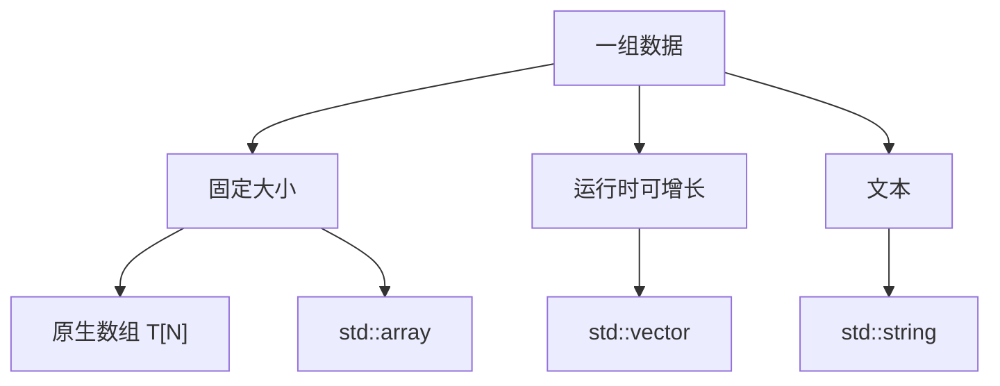

# 第 7 天：原生数组、字符串类与向量容器

预计用时：150～180 分钟  
语言标准：C++17

本单元具体学习的三种类型是原生数组 `T[N]`、字符串类 `std::string` 和向量容器 `std::vector<T>`。

## 今日目标

学完本单元，你应该能够：

1. 区分原生数组、`std::string` 和 `std::vector` 的类型与主要用途
2. 创建、读取、修改并遍历一组同类型数据
3. 准确解释大小、容量、元素、下标和越界
4. 写出不会发生下标越界的访问代码
5. 区分范围 `for` 中的元素副本、可修改引用和只读引用
6. 说明原生数组与 `std::vector` 在大小变化、赋值和函数传参上的关键区别
7. 使用 AddressSanitizer 观察一次真实的越界错误

## 本单元范围

### 今天必须掌握

- 原生数组的固定元素个数、元素类型和连续排列
- `std::string` 的文本用途、`size()`、下标与遍历
- `std::vector<T>` 的动态元素个数、`size()`、`push_back()` 与遍历
- 合法下标范围 `[0, size)`
- `operator[]` 不做边界检查，`at()` 会检查边界
- 基于下标的 `for` 与范围 `for`
- 范围 `for` 中值、`T&` 与 `const T&` 的区别

### 今天先看全貌

- `std::array<T, N>` 是固定大小的标准库容器；第 28 天与其他顺序容器比较
- 原生数组在许多表达式中会转换为指向首元素的指针
- `std::vector` 的 `size` 与 `capacity` 不同，扩容可能重新分配元素存储
- 指针、引用和迭代器可能因 `vector` 重分配而失效
- `std::string` 的 `size()` 统计 `char` 代码单元，不保证等于人看到的字符数
- `std::vector<bool>` 是特殊化类型，不具有普通 `std::vector<T>` 的全部元素引用和连续存储性质

### 后续深入

- 第 10 天：数组到指针转换、地址、指针与引用
- 第 11～12 天：对象生命周期、动态存储与所有权
- 第 14 天：越界导致的未定义行为与表达式规则
- 第 18 天：使用调试器和 Sanitizer 定位内存错误
- 第 19～23 天：`std::string`、`std::vector` 的类对象、资源管理、复制和移动
- 第 27～30 天：模板、容器复杂度、迭代器失效、标准算法与 Lambda
- 第 32 天：`at()` 抛出的异常及错误处理策略

对应补全项目：[`G09`、`G19`～`G22`](../COVERAGE_MAP.md)。

---

## 关键术语索引（正文可跳转）

> 本表是可跳转索引，不要求在开始学习前逐项背诵。正文会在术语真正参与知识推导时直接解释，或把术语链接回本表。
>
> 点击正文中的术语可回到对应定义；查看后使用 Obsidian 或浏览器的“返回”即可回到原阅读位置。

| 术语 | 新手先这样理解 | 专业上更准确地说 |
|---|---|---|
| <a id="term-d07-01"></a>**序列（sequence）** | 按先后位置排列的一组元素 | “序列”是描述有序元素关系的通用术语；原生数组、字符串和 <code>vector</code> 都可按序列理解，但它们的类型规则、大小管理和接口不同。 |
| <a id="term-d07-02"></a>**元素（element）** | 序列中的一个成员，例如第 3 个角度值 | 元素通常是序列所包含的对象。<code>angles[2]</code> 表示下标为 2 的元素表达式；“第 3 个”与“下标 2”是两种不同计数说法。 |
| <a id="term-d07-03"></a>**原生数组（built-in array）** | 元素数量固定、直接由语言提供的数组 | 类型 <code>T[N]</code> 表示恰好包含 N 个连续 <code>T</code> 元素对象的数组类型。N 是类型的一部分，数组大小创建后不能通过增加元素改变。 |
| <a id="term-d07-04"></a>**数组界限（array bound or extent）** | 数组定义中方括号里的固定元素数量 | 在 <code>double angles[4]</code> 中，4 是数组界限。合法元素下标为 0 到 3；界限是元素个数，不是最后一个下标。 |
| <a id="term-d07-05"></a>**容器（container）** | 帮你管理一组对象并提供访问接口的标准库类型 | 标准库容器满足规定的容器要求并管理元素。<code>std::vector</code> 是序列容器；原生数组具有序列，但不是标准库容器类。 |
| <a id="term-d07-06"></a>**<code>std::string</code>** | 专门管理文本字符序列的标准库类型 | <code>std::string</code> 是 <code>std::basic_string&lt;char&gt;</code> 的别名，连续存储 <code>char</code> 代码单元。其 <code>size()</code> 返回 <code>char</code> 元素数，不保证等于人眼看到的 Unicode 字符数。 |
| <a id="term-d07-07"></a>**<code>std::vector&lt;T&gt;</code>** | 元素数量可在运行时增长或缩小的连续数组式容器 | <code>std::vector</code> 是类模板；实例 <code>std::vector&lt;T&gt;</code> 管理连续的 T 元素序列。对象本身与它所管理的动态元素存储不是同一个概念。 |
| <a id="term-d07-08"></a>**下标（index or subscript）** | 用数字表示元素位置，通常从 0 开始 | 下标表达式选择某个位置的元素。对大小为 N 的普通序列，合法下标构成半开区间 <code>[0, N)</code>；N 本身已经越界。 |
| <a id="term-d07-09"></a>**大小（size）** | 当前实际有多少个元素 | <code>size()</code> 表示当前元素数量。空序列大小为 0，此时不存在合法的普通元素下标。 |
| <a id="term-d07-10"></a>**容量（capacity）** | <code>vector</code> 在再次申请更大存储前最多能容纳多少个元素 | 对 <code>vector</code>，<code>capacity()</code> 至少不小于 <code>size()</code>，但容量范围内尚未构造的槽位不是可访问元素。容量不等于大小。 |
| <a id="term-d07-11"></a>**连续存储（contiguous storage）** | 相邻元素的地址紧挨着排列 | 对原生数组、普通 <code>vector&lt;T&gt;</code> 和 C++17 的 <code>basic_string</code> 元素，标准保证按元素顺序连续存储；容器对象自身不一定与其动态元素存储相邻。 |
| <a id="term-d07-12"></a>**半开区间 <code>[0, size)</code>** | 从 0 开始，包含 0，但不包含 <code>size</code> | 该范围恰好包含 <code>size</code> 个整数位置。使用 <code>i &lt; size</code> 能自然表达它，避免把元素数量误当作最后下标。 |
| <a id="term-d07-13"></a>**越界（out-of-bounds access）** | 访问了不存在的元素位置 | 使用 <code>operator[]</code> 访问超出合法范围的位置不进行边界检查，并可能导致未定义行为；<code>at()</code> 会检查并在失败时抛出 <code>std::out_of_range</code>。 |
| <a id="term-d07-14"></a>**重新分配（reallocation）** | <code>vector</code> 旧空间不够时换一块更大的连续空间 | 重新分配时，<code>vector</code> 获得新的元素存储并移动或复制已有元素，再释放旧存储。标准不保证每次容量按固定倍数增长。 |
| <a id="term-d07-15"></a>**失效（invalidation）** | 以前保存的元素地址或位置凭证可能不能再用 | 当容器操作使某个指针、引用或迭代器失效后，程序不能再假定它仍指向原元素或合法位置；继续使用可能导致未定义行为。不同操作的失效范围不同。 |
| <a id="term-d07-16"></a>**迭代器（iterator）** | 像“可移动位置指针”一样访问序列元素的对象 | 迭代器是满足特定操作要求的类型，用于表示范围中的位置并访问元素；它不一定是原生指针。完整类别和规则在第 28～30 天学习。 |
| <a id="term-d07-17"></a>**范围 <code>for</code>** | 依次对范围中的每个元素执行一次循环体 | 范围 <code>for</code> 是语言语法，会按规则取得范围的起止位置并逐个迭代。循环变量按值时得到副本，按引用时绑定元素；精确展开稍后学习。 |

## 一、完整知识地图



这张图只按本单元最关心的用途分类，不表示标准库中只有这些序列类型：

- [原生数组](#term-d07-03)是 C++ 语言内建的复合类型
- `std::array`、`std::vector` 是标准库容器
- [`std::string`](#term-d07-06) 是专门表示字符序列的标准库类
- `deque`、`list` 等其他顺序容器在第 28 天进入比较

今天学习的共同主线是：

```text
创建序列
  → 得到元素个数
  → 用合法下标或遍历访问元素
  → 必要时修改元素
  → 防止访问边界之外
```

---

## 二、核心术语：在讲解中建立定义

### 1. [序列](#term-d07-01)

一组有顺序的元素。顺序决定每个元素的位置。

### 2. [元素](#term-d07-02)

序列中的单个对象。例如 `angles[2]` 表示数组中的一个 `double` 元素对象。

### 3. 元素类型

序列中元素的类型。`std::vector<double>` 的元素类型是 `double`。

### 4. [下标](#term-d07-08)

表示元素位置的整数值。C++ 序列通常从下标 `0` 开始。

### 5. [大小](#term-d07-09)

序列当前包含的元素个数。`vector.size()` 返回当前元素数量。

### 6. [数组界限](#term-d07-04)

原生数组类型中固定的元素个数：

```cpp
double angles[4]{};
```

`4` 是数组界限，也称 extent。`double[4]` 与 `double[5]` 是不同类型。

### 7. [容器](#term-d07-05)

标准库中管理一组对象并提供访问操作的类模板或类。`std::vector` 是容器。

### 8. [容量](#term-d07-10)

`std::vector` 在不[重新分配](#term-d07-14)元素存储的情况下最多能够容纳的元素数。始终满足：

```text
capacity() >= size()
```

但二者不保证相等。

### 9. [连续存储](#term-d07-11)

相邻元素在存储中连续排列。原生数组和普通 [`std::vector<T>`](#term-d07-07) 的元素均连续；C++17 的 `std::string` 字符也连续。

### 10. [越界](#term-d07-13)

访问合法范围之外的位置。大小为 `N` 的序列，普通元素下标范围是：

```text
0, 1, ..., N - 1
```

也写作[半开区间](#term-d07-12) `[0, N)`。

---

## 三、三种序列的准确比较

| 特征 | 原生数组 `T[N]` | `std::string` | `std::vector<T>` |
|---|---|---|---|
| 所属 | 语言内建类型 | 标准库类 | 标准库类模板 |
| 主要用途 | 固定数量的同类型元素 | 文本字符序列 | 数量可变的同类型元素 |
| 元素个数 | 创建后固定 | 可改变 | 可改变 |
| 连续元素 | 是 | C++17 中是 | 普通 `T` 是 |
| 获取大小 | 对仍是数组的对象用 `std::size` | `.size()` | `.size()` |
| 增加元素 | 不支持 | 可追加字符/文本 | `push_back()` 等 |
| 整体赋值 | 原生数组不支持 | 支持 | 支持 |
| `operator[]` 检查边界 | 否 | 否 | 否 |
| `.at()` 检查边界 | 没有成员函数 | 是 | 是 |

“原生数组不能增长”与“`vector` 可以增长”是重要差异，但不是全部差异。二者还在类型系统、复制赋值、函数传参、资源管理和接口上不同。

---

## 四、原生数组：固定数量的元素对象

### 4.1 定义和初始化

```cpp
double angles[4]{10.0, 20.0, 30.0, 40.0};
```

这定义了一个类型为 `double[4]` 的数组对象，其中包含四个 `double` 元素对象：

| 下标 | 表达式 | 值 |
|---:|---|---:|
| 0 | `angles[0]` | 10.0 |
| 1 | `angles[1]` | 20.0 |
| 2 | `angles[2]` | 30.0 |
| 3 | `angles[3]` | 40.0 |

如果初始化器少于元素数，剩余元素会被值初始化：

```cpp
int values[4]{1, 2};
```

结果是：

```text
1 2 0 0
```

如果初始化器多于数组元素数，则编译失败：

```cpp
int values[2]{1, 2, 3}; // 错误
```

### 4.2 获取元素个数

C++17 可以使用：

```cpp
#include <iterator>

std::size(angles)
```

当 `angles` 在这个位置仍具有数组类型时，结果是 `4`。

不要把元素个数重复写成魔法数字：

```cpp
for (std::size_t index{0}; index < std::size(angles); ++index) {
    std::cout << angles[index] << '\n';
}
```

### 4.3 数组不能整体赋值

```cpp
int first[3]{1, 2, 3};
int second[3]{};

second = first; // 编译错误
```

原生数组不是可通过普通赋值运算符整体赋值的类型。若要复制，必须逐元素处理，或选择具有值语义的 `std::array` / `std::vector`。

### 4.4 数组传给函数时的关键陷阱

下面看起来像接收四元素数组：

```cpp
void inspect(double values[4]);
```

但函数形参中的数组写法会调整为指针形参，`4` 不会作为数组界限保存在该形参类型中。这涉及数组到指针转换和函数形参调整，第 10 天系统学习。

今天先遵守：

> 不要依赖函数形参中的 `T values[N]` 来获得或强制元素个数。

---

## 五、`std::string`：面向文本的字符序列

使用前包含：

```cpp
#include <string>
```

创建字符串：

```cpp
std::string robot_name{"Arm-A"};
```

### 5.1 大小和下标

```cpp
std::cout << robot_name.size() << '\n'; // 5
std::cout << robot_name[0] << '\n';     // A
```

这里的普通字符下标是 `0`～`4`。

### 5.2 修改字符

```cpp
robot_name[0] = 'a';
```

字符串变为：

```text
arm-A
```

单个 `char` 使用单引号；`std::string` 文本使用双引号。

### 5.3 `size()` 不一定等于人看到的字符数

`std::string` 保存 `char` 序列，`size()` 返回 `char` 代码单元数量。若字符串使用 UTF-8，一个汉字通常由多个字节/`char` 代码单元表示。

因此：

```cpp
std::string text{"机器人"};
```

不能假定 `text.size()` 一定等于人看到的三个汉字。Unicode 文本处理超出本课程核心范围，不能把 `std::string` 简化成“每个下标对应一个自然语言字符”。

### 5.4 `std::string` 是类对象

它内部管理字符序列，但复制、移动、容量和资源释放仍涉及类对象规则。第 19～23 天从构造、析构、复制、移动和 RAII 补齐。

---

## 六、`std::vector<T>`：元素数量可变的连续序列

使用前包含：

```cpp
#include <vector>
```

创建：

```cpp
std::vector<double> angles{10.0, 20.0, 30.0};
```

这里：

- `std::vector` 是类模板
- `double` 是模板实参，指定元素类型
- `angles` 是一个 `std::vector<double>` 对象
- 当前有三个 `double` 元素

### 6.1 读取与修改

```cpp
std::cout << angles[1] << '\n'; // 20
angles[1] = 25.0;
```

### 6.2 增加元素

```cpp
angles.push_back(40.0);
```

执行后：

```text
size: 3 → 4
elements: 10.0, 25.0, 30.0, 40.0
```

### 6.3 `size` 与 `capacity`

```cpp
angles.size()
angles.capacity()
```

- `size()`：当前实际存在多少个元素对象
- `capacity()`：不重新分配元素存储时最多可容纳多少个元素

标准不规定一次 `push_back` 后容量必须变成多少。不要编写依赖“容量一定翻倍”的程序。

当容量不足时，`vector` 可能取得一块更大的连续存储，把现有元素转移到新位置，再释放旧存储。因此此前指向元素的指针、引用和[迭代器](#term-d07-16)可能[失效](#term-d07-15)。完整失效规则与复杂度在第 28 天学习。

### 6.4 `vector` 对象与元素存储不是同一概念

从可观察接口看：

```cpp
angles.data()
```

返回指向连续元素序列起点的指针（空 `vector` 的具体指针值不作这里的假设）。

`vector` 对象负责管理这段元素存储。实现通常通过分配器取得动态存储，但不要把“`vector` 本身一定在堆上”当成正确说法：`vector` 对象自身可以是局部对象、成员对象或其他存储期的对象；它管理的元素存储是另一件事。

---

## 七、下标、边界与两种访问接口

若：

```cpp
std::vector<int> values{10, 20, 30};
```

则：

```text
size() == 3
合法普通元素下标：0、1、2
```

### 7.1 `operator[]` 不检查边界

```cpp
values[3]
```

超出普通元素范围。对 `vector` 执行这种越界访问会导致未定义行为。程序可能：

- 看似输出某个值
- 输出垃圾数据
- 崩溃
- 在优化后表现不同

“这一次没有崩溃”不能证明代码正确。

### 7.2 `at()` 检查边界

```cpp
values.at(3)
```

`at()` 会检查位置，越界时抛出 `std::out_of_range` 异常。异常处理在第 32 天系统学习。

### 7.3 从外部得到的下标先检查

```cpp
std::size_t index{3};

if (index < values.size()) {
    std::cout << values[index] << '\n';
} else {
    std::cout << "Invalid index\n";
}
```

这里的判断必须是 `<`，不是 `<=`：

```cpp
index < values.size()  // 正确上界
```

当 `index == size()` 时，已经位于末尾之后，不是最后一个元素。

---

## 八、两种遍历方式

### 8.1 基于下标的 `for`

需要下标时：

```cpp
for (std::size_t index{0}; index < angles.size(); ++index) {
    std::cout << index << ": " << angles[index] << '\n';
}
```

`size()` 的返回类型是无符号整数类型 `size_type`；这里使用 `std::size_t` 与之协调。类型别名和精确类型在第 8、13、27 天继续学习。

### 8.2 范围 `for`

[**范围 `for`**](#term-d07-17) 是直接按顺序访问一个范围中各元素的循环语法。它省去了手写下标，但循环变量按值、按可修改引用还是按只读引用，仍会决定是否复制元素以及能否修改原元素。

只需要元素值时：

```cpp
for (double angle : angles) {
    std::cout << angle << '\n';
}
```

这里每次迭代的 `angle` 是由对应元素初始化的独立对象。修改 `angle` 不修改容器元素：

```cpp
for (double angle : angles) {
    angle = 0.0;
}
```

### 8.3 使用引用修改元素

```cpp
for (double& angle : angles) {
    angle = angle + 5.0;
}
```

`angle` 每次绑定当前元素，通过它赋值会修改元素。

### 8.4 使用只读引用观察元素

```cpp
for (const double& angle : angles) {
    std::cout << angle << '\n';
}
```

对 `double` 这样的小对象，按值读取也很合适；对较大的类对象，只读引用可表达“不复制、不修改”的意图。复制和性能不能只靠口号判断，第 21～22、28 天继续分析。

范围 `for` 的精确展开涉及 `begin`、`end`、迭代器和引用绑定，第 27～30 天补齐。

---

## 九、真实存储与执行过程

考虑：

```cpp
std::vector<double> angles{10.0, 20.0, 30.0};
angles.push_back(40.0);
```

从语言和标准库接口可依赖的过程看：

1. 创建 `std::vector<double>` 对象
2. 创建三个 `double` 元素对象，顺序为 `10.0`、`20.0`、`30.0`
3. `size()` 为 `3`，`capacity()` 至少为 `3`
4. 调用 `push_back(40.0)`
5. 在末尾创建值为 `40.0` 的元素
6. `size()` 变为 `4`
7. 如果原容量不足，可能重新分配连续元素存储并转移已有元素

连续元素可以表示为：

```text
data() ──► [10.0][20.0][30.0][40.0]
下标          0     1     2     3
```

对普通 `vector<T>`，相邻元素地址满足连续排列要求。但实际地址、容量增长倍率、分配器实现和移动/复制选择不由这段代码固定。

---

## 十、函数参数：沿用第 6 天的只读引用

如果函数只读观察整个 `vector`：

```cpp
void print_angles(const std::vector<double>& angles) {
    for (double angle : angles) {
        std::cout << angle << '\n';
    }
}
```

这与第 6 天形成连接：

- `angles` 是引用形参，不创建一个完整 `vector` 参数副本
- `const` 禁止函数通过该引用修改 `vector`
- 每个元素在范围 `for` 中仍按值读取

如果函数必须修改所有元素：

```cpp
void offset_angles(std::vector<double>& angles, double offset) {
    for (double& angle : angles) {
        angle = angle + offset;
    }
}
```

类对象复制、移动与按值传参代价在第 21～22 天补齐。

---

## 十一、构建链路中的位置

编译本单元示例：

```bash
g++ -std=c++17 -Wall -Wextra -pedantic \
    examples/day-07/sequences.cpp \
    -o sequences
```

这仍是一条由 `g++` 驱动程序组织的端到端构建命令：

```text
源文件
→ 预处理：展开 <string>、<vector> 等头文件内容
→ 狭义编译：检查数组、模板实例化、下标表达式和函数调用
→ 汇编
→ 目标文件
→ 链接：连接所需标准库实现
→ 可执行文件
→ 操作系统装载并启动
```

模板的定义为何通常需要在使用点可见，在第 15、27 天结合翻译单元与模板实例化学习。

---

## 十二、完整示例：机器人角度序列

仓库示例：[sequences.cpp](../examples/day-07/sequences.cpp)

程序同时演示：

- 原生数组与 `std::size`
- `std::string` 字符遍历
- `std::vector` 的增长、大小和容量
- 通过 `const std::vector<double>&` 传参
- 空容器检查
- 外部下标的边界检查

平均值函数中的：

```cpp
static_cast<double>(angles.size())
```

显式地把元素个数转换为 `double` 后再做除法。今天只需看懂它在表达转换意图；`static_cast`、隐式转换和不同整数类型的精确规则在第 13 天补齐，对应已有项目 `G07`。

预期输出：

```text
Raw array extent: 4
home_angles[2]: -20
Robot name: Arm-A
Characters: A r m - A
Vector size before: 3
Vector size after: 4
Capacity covers size: true
Commands: 10 20 30 40
Average command: 25
Index 4 is outside [0, 4)
```

---

## 十三、错误实验：真实观察越界

实验文件：[bounds_error.cpp](../examples/day-07/bounds_error.cpp)

其中：

```cpp
std::vector<int> sensor_values{10, 20, 30};
std::cout << sensor_values[3] << '\n';
```

`3` 等于 `size()`，因此越界。

使用 AddressSanitizer 和 UndefinedBehaviorSanitizer 构建：

```bash
g++ -std=c++17 -Wall -Wextra -pedantic \
    -fsanitize=address,undefined -fno-omit-frame-pointer \
    examples/day-07/bounds_error.cpp \
    -o bounds_error

./bounds_error
```

常见实现会报告 `heap-buffer-overflow` 一类诊断并以非零状态结束。诊断文字和地址因平台而异。

这里要区分：

- 源码通常可以通过编译
- 链接也可以成功
- 错误访问发生在运行期
- 未定义行为不保证一定被检测；Sanitizer 是额外的运行期检测工具

不要在正常程序中保留越界访问。实验完成后使用边界判断或 `at()` 修复。

---

## 十四、常见错误

### 错误 1：把 `size()` 当作最后一个下标

```cpp
values[values.size()] // 越界
```

最后一个下标是 `size() - 1`，但空序列不能直接计算和访问最后元素。更安全的是先判断是否为空。

### 错误 2：循环条件使用 `<=`

```cpp
for (std::size_t i{0}; i <= values.size(); ++i)
```

当 `i == values.size()` 时越界。应为：

```cpp
i < values.size()
```

### 错误 3：范围 `for` 修改的是副本

```cpp
for (double value : values) {
    value = 0.0;
}
```

若要修改元素，使用 `double& value`。

### 错误 4：把容量当作元素数量

`capacity()` 范围内不代表都存在元素对象。只能按 `size()` 判断可访问元素范围。

### 错误 5：认为原生数组形参保留界限

```cpp
void inspect(int values[10]);
```

函数形参调整后不保留 `10` 作为可查询数组界限。

### 错误 6：保存元素引用后继续扩容

```cpp
double& first{values[0]};
values.push_back(42.0);
```

如果 `push_back` 触发重分配，`first` 可能失效。今天只知道风险，第 28 天学习完整失效规则。

---

## 十五、不要形成的十个误解

1. **数组名就是指针**：错误。数组和指针是不同类型，只是在许多表达式中发生数组到指针转换。
2. **数组元素数可以在创建后改变**：错误。原生数组界限固定。
3. **`vector` 对象本身一定在堆上**：错误。对象自身的存储期与其管理的元素存储要分开。
4. **`size()` 是最后一个下标**：错误。它是元素个数。
5. **`capacity()` 个位置都可以访问**：错误。只有 `[0, size())` 中存在元素。
6. **`operator[]` 越界会自动报错**：错误。它不执行边界检查。
7. **越界没有崩溃就说明安全**：错误。未定义行为不保证表现。
8. **范围 `for` 总会修改原元素**：错误。按值循环变量是独立对象。
9. **`std::string::size()` 总是人类字符数**：错误。它统计 `char` 代码单元。
10. **所有 `std::vector<T>` 都完全相同**：错误。`std::vector<bool>` 是标准规定的特殊化。

---

## 十六、随堂练习

1. 分别说明原生数组、`std::string` 和 `std::vector` 的类型类别。
2. 写出大小为 4 的序列的全部合法下标。
3. 预测部分初始化的原生数组内容。
4. 比较 `size()` 与 `capacity()`。
5. 解释为什么 `index <= values.size()` 不能作为访问条件。
6. 比较范围 `for` 中 `double`、`double&` 与 `const double&`。
7. 使用 Sanitizer 观察一次越界，再修复它。

完整作答区见：[第 7 天练习单](../exercises/day-07.md)。

---

## 十七、本单元偿还与新增的知识缺口

| 编号 | 今天覆盖 | 后续补全 |
|---|---|---|
| `G09` | `std::string` 的字符序列接口、连续性、大小、下标与遍历 | 第 19～23、27～28 天补齐类对象、资源管理、复制、移动、模板和复杂度 |
| `G19` | 原生数组类型、固定界限、连续元素、初始化和不可整体赋值 | 第 10、14、28 天补齐数组到指针转换、函数形参调整、越界 UB 与 `std::array` |
| `G20` | `std::vector<T>` 的基本模型、`size`、`capacity`、增长和连续元素 | 第 21～22、27～28 天补齐复制/移动、模板、复杂度、分配和失效规则 |
| `G21` | 合法下标、`operator[]`、`at()` 与 Sanitizer 越界实验 | 第 14、18、28、32 天补齐 UB、工具诊断、容器边界和异常处理 |
| `G22` | 基于下标的循环以及范围 `for` 的值/引用差异 | 第 14、27～30 天补齐求值、精确展开、迭代器与算法 |

---

## 十八、今日完成标准

- 能正确创建并遍历一个原生数组、一个 `std::string` 和一个 `std::vector<double>`
- 能说出三者的类型类别，而不把它们都笼统叫作数组
- 能解释大小为 `N` 的序列为什么使用 `[0, N)` 作为合法下标范围
- 能用 `<` 写出正确的下标循环边界
- 能用范围 `for` 分别只读和修改元素
- 能解释 `vector` 的 `size()` 与 `capacity()` 为什么不能混用
- 能说明 `operator[]` 与 `at()` 的边界行为差异
- 能用 Sanitizer 观察越界诊断，并知道未检测到不代表没有未定义行为
- 能解释 `vector` 对象与其管理的元素存储不是同一概念
- 完成练习单并提交仓库等待批改

下一单元：枚举、类型别名、命名空间、`struct`、`class` 与对象。
