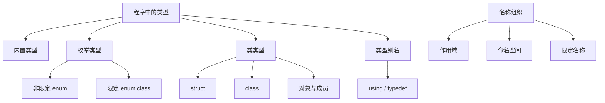

# 第 8 天：枚举、类型别名、命名空间与类对象

预计用时：120～150 分钟  
语言标准：C++17

## 今日目标

学完本单元，你应该能够：

1. 区分内置类型、枚举类型、类类型、类型别名和对象
2. 使用 `enum class` 表示有限状态，并解释它为什么比一组无关联整数更安全
3. 使用 `using` 声明类型别名，同时知道别名不会创建新类型
4. 使用命名空间组织名称，并用限定名称避免冲突
5. 使用 `struct` 定义简单数据类型并创建多个相互独立的对象
6. 说明 `struct` 和 `class` 都能定义类类型，以及二者的默认访问权限差异
7. 使用 `public` 与 `private` 建立最小类接口
8. 准确区分“类型”“对象”“变量名”“数据成员”和“成员函数”
9. 判断常见问题发生在编译期、链接期还是运行期

---

## 先读：关键术语导航

> 本单元最容易混淆的是“类型、名字、对象、成员”和“命名空间、作用域”。请先按下表分开，再阅读代码。

| 术语 | 新手先这样理解 | 专业上更准确地说 |
|---|---|---|
| **类型（type）** | 一套规定“有哪些值、能做哪些操作”的规则 | 类型规定表达式和值的类别、允许的操作及对象的解释方式。类型本身不是运行时对象；写出类定义也不会自动创建该类的实例。 |
| **用户定义类型（user-defined type）** | 程序员为领域概念建立的新类型 | C++ 中的类类型和枚举类型属于用户定义类型。类型别名只为已有类型增加名称，不会创建新的用户定义类型。 |
| **枚举类型（enumeration type）** | 用有限个有名字的选项表示状态 | 枚举声明定义一个独立类型，并声明一组枚举项。<code>enum class</code> 是限定枚举，具有更强的作用域和转换约束。 |
| **枚举项（enumerator）** | 枚举中每个有名字的可选值 | 枚举项是声明于枚举中的具名常量。例如 <code>Mode::running</code> 表示 <code>Mode</code> 类型的一个枚举值，不是字符串。 |
| **底层类型（underlying type）** | 编译器用于表示枚举值的整数类型 | 每个枚举都有底层整数类型，可以显式指定。底层类型影响表示范围，但不意味着限定枚举会自动隐式转换成该整数类型。 |
| **类型别名（type alias）** | 给已有类型再取一个更清楚的名字 | <code>using JointId = int;</code> 使两个名称指代同一类型，不建立新的类型身份，因此不能仅靠别名形成重载或强类型隔离。 |
| **命名空间（namespace）** | 给名称划分领域，避免不同模块撞名 | 命名空间定义可命名的声明区域和相应作用域，用于组织名称查找。它不是类、对象或运行时存储容器，不会被构造或析构。 |
| **作用域（scope）** | 一个名字能够在哪些代码区域被查找到 | 作用域是名称查找规则中的程序区域。命名空间作用域、类作用域和块作用域是不同种类；作用域不等于对象生命周期或链接属性。 |
| **限定名称（qualified name）** | 把所属范围写出来的完整名字 | <code>robotics::Mode</code> 和 <code>Mode::running</code> 含有作用域限定符 <code>::</code>，名称查找会从指定范围开始。限定名称不是“复制”某个命名空间中的内容。 |
| **类类型（class type）** | 用 <code>class</code> 或 <code>struct</code> 描述的一类对象 | C++ 的类类型由 <code>class</code>、<code>struct</code> 或 <code>union</code> 声明定义；本课程当前聚焦前两者。类定义描述类型，类对象才是运行时实体。 |
| **<code>struct</code> 与 <code>class</code>** | 都能定义带数据和函数的类型 | 二者都使用 C++ 类机制；主要语言差异是未显式写出时的默认成员访问权限和默认继承权限：<code>struct</code> 默认 <code>public</code>，<code>class</code> 默认 <code>private</code>。 |
| **对象（object）** | 程序运行时某个类型的具体实例 | 在 C++ 语言模型中，对象是一段具有类型和生命周期的存储区域。一个类对象可包含多个成员子对象；同一类型的不同对象通常拥有各自的非静态数据成员。 |
| **成员（member）** | 声明在类内部、属于该类定义的名称 | 类成员可以是数据成员、成员函数、嵌套类型等。非静态数据成员会成为类对象的子对象；静态成员遵循另一套规则。 |
| **访问控制（access control）** | 规定类外代码能否直接使用某个成员 | <code>public</code>、<code>protected</code> 和 <code>private</code> 在编译期限制成员访问。<code>private</code> 不等同于加密，也不意味着数据在物理内存中不可见。 |
| **接口（interface）** | 类愿意让外部代码使用的操作方式 | 接口是设计层概念，通常由公开成员函数、非成员函数和使用约定共同构成；它不只是把所有数据成员写成 <code>public</code>。 |
| **封装（encapsulation）** | 把状态和操作组织起来，并控制外部如何改变状态 | 封装是一种设计原则：通过边界隐藏实现细节并集中维护约束。仅仅使用 <code>class</code> 或 <code>private</code> 并不会自动产生良好封装。 |
| **不变量（invariant）** | 一个有效对象应始终满足的内部条件 | 类不变量是对象在公开操作的稳定边界上应保持为真的约束，例如“关节编号非负”。构造函数和成员函数应共同维护它。 |
| **聚合（aggregate）** | 可以按成员顺序直接用花括号初始化的简单对象类型 | “聚合”是标准定义的类别，需满足一组随语言版本变化的条件。并非所有 <code>struct</code> 都是聚合，也并非 <code>class</code> 一定不是聚合。 |
| **对齐（alignment）** | 某类对象的地址通常要满足特定倍数要求 | 类型具有对齐要求，实现必须把对象放在满足该要求的地址上。对齐会影响对象布局、数组步长和可能的填充。 |
| **填充（padding）** | 编译器为满足布局和对齐在成员之间加入的空隙字节 | 填充字节不是数据成员，不能用成员大小简单相加预测整个对象大小。具体布局受类型规则、ABI 和实现影响。 |
| **<code>const</code> 成员函数** | 承诺不通过该成员函数修改当前对象的普通状态 | 成员函数形参列表后的 <code>const</code> 限定隐式对象参数，并限制对非 <code>mutable</code> 成员的修改。完整的 <code>this</code> 与常量性在第 19 天学习。 |

## 一、完整知识地图

今天学习的是 C++ **用户自定义类型体系的入口**。完整路线如下：



还需要把今天的位置放进更完整的 C++ 模型中：

```text
源代码中的声明
→ 编译器建立类型与名称信息
→ 根据类型规则检查表达式和访问权限
→ 为需要的对象安排存储并生成操作这些对象的代码
→ 汇编产生目标文件
→ 链接解析跨翻译单元符号
→ 可执行文件被装载和启动
→ 运行时创建、使用和销毁对象
```

命名空间主要作用于**名称组织与查找**，不是运行时容器；类类型描述对象能够包含什么以及允许怎样操作；真正运行时存在的是具体对象及其子对象。

---

## 二、范围标签

### 今天掌握

- `enum class` 的定义、限定枚举名和基本使用
- `using` 类型别名
- 命名空间定义、重开和限定名称
- `struct`、`class`、对象、数据成员和成员函数
- `public`、`private` 的最小用法
- `struct` 与 `class` 的默认访问权限差异
- 多个对象各自拥有非静态数据成员
- 聚合初始化的入门使用

### 先看全貌

- 非限定枚举 `enum` 与限定枚举 `enum class` 的区别
- 枚举底层类型和显式转换
- 限定名称查找与非限定名称查找
- 命名空间、作用域、链接和翻译单元之间的关系
- 类对象的初始化、复制、布局、对齐和填充
- 成员函数调用时如何关联到具体对象

### 后续深入

- 第 10～11 天：对象地址、引用、存储期和生命周期
- 第 13～14 天：枚举底层类型、显式转换、初始化和表达式规则
- 第 15～17 天：翻译单元、名称查找、命名空间、链接、ODR、`static` 与 `extern`
- 第 19～22 天：构造、析构、`this`、复制和移动
- 第 24 天：继承以及 `struct` / `class` 的默认继承权限
- 第 27 天：别名模板、模板类型和类型推导

对应补全项目：已有的 `G06`、`G17`，以及本单元新增的 `G23`～`G26`。

---

## 三、八张名词卡

### 1. 类型

类型规定一组可能的值、允许的操作以及这些值和对象应如何被解释。

```cpp
int count{6};
```

`int` 是类型，`count` 是名称，运行时创建的是一个 `int` 对象。

### 2. 用户自定义类型

由程序员通过语言提供的声明定义出来的类型，例如：

```cpp
enum class Mode { idle, running };

struct JointState {
    int id{};
    double angle{};
};
```

`Mode` 和 `JointState` 都是用户定义的类型。

### 3. 枚举类型

枚举类型用一组具名枚举项表示有限的离散状态。

```cpp
enum class Mode {
    idle,
    calibrating,
    running,
    fault
};
```

### 4. 类型别名

类型别名是现有类型的另一个名称：

```cpp
using JointId = int;
```

`JointId` 与 `int` 是同一个类型，不是两个不同类型。

### 5. 命名空间

命名空间提供一种可命名的作用域，用于组织名称并减少冲突：

```cpp
namespace robotics {
    enum class Mode { idle, running };
}
```

### 6. 类类型

由 `class`、`struct` 或 `union` 定义的类型属于类类型。今天只学习 `class` 和 `struct`。

### 7. 对象

在 C++ 语言模型中，对象是一段具有类型、大小、存储位置、生命周期和值或状态的存储区域。这个定义比“变量是盒子”的类比更准确。

```cpp
JointState joint{1, 30.0, true};
```

这里创建了一个 `JointState` 对象；它包含三个成员对象。

### 8. 成员

在类定义中声明的实体叫成员。今天主要接触：

- 数据成员：保存对象状态
- 成员函数：定义对象可以执行的操作

---

## 四、为什么需要枚举

假设用整数表示机器人模式：

```cpp
int mode{2};
```

问题是：

- `2` 的含义只能依赖额外约定
- `-100`、`42` 等无效值也能轻易传入
- 其他整数概念可能被误传给模式参数

使用枚举：

```cpp
enum class Mode {
    idle,
    calibrating,
    running,
    fault
};

Mode mode{Mode::running};
```

现在类型和名称共同表达意图。

### 4.1 `enum class` 是独立类型

```cpp
enum class Mode { idle, running };
enum class Connection { offline, online };

Mode mode{Mode::running};
Connection connection{Connection::online};
```

`Mode` 和 `Connection` 是两个不同类型。即使枚举项在概念上相似，也不能无条件混用。

### 4.2 枚举项需要限定

```cpp
Mode mode{Mode::running};
```

`Mode::running` 是限定名称：

- `Mode`：枚举类型名
- `::`：作用域解析运算符
- `running`：该枚举作用域中的枚举项

### 4.3 可以显式指定枚举值

```cpp
enum class ErrorCode {
    none = 0,
    sensor_timeout = 10,
    motor_fault = 20
};
```

若未显式给出，第一个枚举项通常从 `0` 开始，后续枚举项依次增加；准确地说，每个未指定初始化器的枚举项取前一个枚举项加一，第一个则为零。

### 4.4 可以显式指定底层类型

```cpp
enum class Mode : unsigned char {
    idle,
    running,
    fault
};
```

底层类型参与枚举值的表示范围和对象表示。今天只知道语法和目的；整数转换、表示范围和底层类型规则在第 13～14 天深入。

### 4.5 `enum class` 不隐式转换为整数

```cpp
Mode mode{Mode::running};
// int value{mode}; // 编译错误
```

需要转换时必须明确表达：

```cpp
int value{static_cast<int>(mode)};
```

`static_cast` 的系统规则放在第 13 天。今天只需理解：显式转换让“把模式当整数”的意图出现在代码中。

### 4.6 非限定枚举仍然存在

```cpp
enum LegacyMode {
    idle,
    running
};
```

这种枚举的枚举项会进入外围作用域，并且通常可转换为整数，更容易发生名称污染和误用。现代新代码中，表示状态集合时通常优先考虑 `enum class`，但不能说非限定枚举已经被废除。

---

## 五、类型别名：改善表达，不创造新类型

定义别名：

```cpp
using JointId = int;
using Angle = double;
```

使用：

```cpp
JointId id{3};
Angle target{45.0};
```

别名可以提高可读性，也便于以后集中替换底层类型。

### 5.1 别名不是新类型

```cpp
using JointId = int;

JointId id{3};
int count{id}; // 两者本来就是同一类型
```

因此不能用别名建立真正的类型隔离：

```cpp
using JointId = int;
using ErrorCode = int;
```

`JointId` 和 `ErrorCode` 都仍是 `int`，编译器不会因为别名不同而阻止混用。

下面两个重载也不是不同函数：

```cpp
void set_value(int value);
void set_value(JointId value); // 与上一声明是同一个参数类型
```

若想得到真正不同的类型，应定义枚举或类类型，而不是只起别名。

### 5.2 `typedef` 是旧式语法

```cpp
typedef int JointId;
```

这也定义类型别名。现代 C++ 通常优先使用 `using`，特别是别名模板的语法更清晰；别名模板在第 27 天学习。

---

## 六、命名空间：组织名称，不是运行时容器

两个库都可能需要 `Mode`：

```cpp
namespace robot {
    enum class Mode { idle, running };
}

namespace simulator {
    enum class Mode { paused, realtime };
}
```

通过限定名称区分：

```cpp
robot::Mode real_mode{robot::Mode::running};
simulator::Mode sim_mode{simulator::Mode::realtime};
```

### 6.1 命名空间可以重新打开

```cpp
namespace robotics {
    enum class Mode { idle, running };
}

namespace robotics {
    using JointId = int;
}
```

这两个命名空间定义属于同一个 `robotics` 命名空间。

### 6.2 限定名称与非限定名称

```cpp
robotics::Mode mode{robotics::Mode::running};
```

`robotics::Mode` 和 `robotics::Mode::running` 都是限定名称。

函数内部直接写：

```cpp
Mode mode{Mode::running};
```

其中 `Mode` 是非限定名称，编译器需要根据当前作用域和语言的名称查找规则确定它指向哪个声明。完整名称查找在第 17 天学习。

### 6.3 `using` 声明与 `using namespace`

只引入一个名称：

```cpp
using robotics::Mode;

Mode mode{Mode::running};
```

引入整个命名空间：

```cpp
using namespace robotics;
```

`using namespace` 会让更多名称参与非限定查找，可能增加冲突和歧义。尤其不要在头文件的全局作用域随意使用。初学阶段优先写完整限定名称，或在很小的局部作用域使用单个 `using` 声明。

### 6.4 命名空间不创建运行时对象

```cpp
namespace robotics {
    using JointId = int;
}
```

这段声明本身不会创建一个叫 `robotics` 的运行时对象。命名空间影响声明归属和名称查找；其中定义的变量、函数或类对象是否占用存储，要分别按照它们自己的规则判断。

命名空间作用域变量的链接、未命名命名空间和跨文件规则在第 15～17 天补齐。

---

## 七、`struct`：定义简单数据类类型

```cpp
struct JointState {
    int id{};
    double angle{};
    bool enabled{};
};
```

这段代码定义了一个名为 `JointState` 的类类型，但还没有创建 `JointState` 对象。

创建对象：

```cpp
JointState shoulder{1, 30.0, true};
JointState elbow{2, -15.0, false};
```

现在创建了两个不同对象。

### 7.1 成员访问

```cpp
std::cout << shoulder.id << '\n';
shoulder.angle = 45.0;
```

`.` 是成员访问运算符。`shoulder.angle` 表示 `shoulder` 对象的 `angle` 成员。

### 7.2 每个对象拥有自己的非静态数据成员

```cpp
shoulder.angle = 45.0;
elbow.angle = -15.0;
```

修改 `shoulder.angle` 不会自动修改 `elbow.angle`。两个对象分别包含自己的 `id`、`angle` 和 `enabled` 成员对象。

### 7.3 聚合初始化

当前 `JointState` 满足 C++17 聚合类型的条件，可以使用：

```cpp
JointState shoulder{1, 30.0, true};
```

这里按成员声明顺序初始化：

1. `id` 使用 `1`
2. `angle` 使用 `30.0`
3. `enabled` 使用 `true`

聚合的精确定义和各种初始化形式在第 13、19 天深入。不要把“所有 `struct` 都能这样初始化”当作永久规则；加入私有成员、构造函数或其他特征后，聚合资格可能改变，且不同 C++ 标准版本的聚合规则存在差异。

### 7.4 对象复制的入门观察

```cpp
JointState copy{shoulder};
copy.angle = 90.0;
```

`copy` 是新对象。修改它的 `angle` 不改变 `shoulder.angle`。当前简单类型的成员被复制到新对象中。

这不等于“所有类复制都只是安全地复制每个字节”。用户定义复制操作、资源所有权、浅拷贝与移动语义在第 21～22 天系统学习。

---

## 八、`class`：通过访问控制建立接口

```cpp
class Robot {
public:
    void set_mode(Mode mode) {
        mode_ = mode;
    }

    Mode mode() const {
        return mode_;
    }

private:
    Mode mode_{Mode::idle};
};
```

创建对象：

```cpp
Robot robot{};
robot.set_mode(Mode::running);
```

### 8.1 `public`

`public` 成员可以从类外通过对象访问：

```cpp
robot.set_mode(Mode::running);
```

### 8.2 `private`

`private` 成员不能从普通类外代码直接访问：

```cpp
// robot.mode_ = Mode::fault; // 编译错误
```

外部代码通过公开成员函数操作内部状态，这形成了最基础的封装边界。

### 8.3 `struct` 和 `class` 的准确关系

在 C++ 中，`struct` 和 `class` 都能定义类类型。最直接的语言差异是：

| 写法 | 成员默认访问权限 | 基类默认继承权限 |
|---|---|---|
| `struct` | `public` | `public` |
| `class` | `private` | `private` |

继承在第 24 天学习。除默认权限外，`struct` 也可以有私有成员、成员函数、构造函数、继承和虚函数；`class` 也可以拥有公开数据成员。

工程习惯上常用：

- `struct`：以公开数据组合为主的简单记录
- `class`：需要维护不变量、隐藏状态和公开操作接口

这是常见设计习惯，不是语言强制规定。

### 8.4 `const` 成员函数先看位置

```cpp
Mode mode() const {
    return mode_;
}
```

末尾的 `const` 表示该成员函数不能通过当前对象修改普通非 `mutable` 数据成员。今天先学会识别；`const`、`this` 和成员函数的精确模型在第 13、19 天补齐。

---

## 九、类型、名称、对象与成员不能混为一谈

阅读：

```cpp
JointState joint{1, 30.0, true};
```

准确拆分：

| 组成 | 含义 |
|---|---|
| `JointState` | 类类型名称 |
| `joint` | 声明引入的对象名称 |
| 整条定义 | 创建并初始化一个 `JointState` 对象 |
| `joint.id` | 该对象的 `id` 成员对象 |
| `joint.angle` | 该对象的 `angle` 成员对象 |

再看：

```cpp
namespace robotics {
    struct JointState {
        int id{};
    };
}
```

- `robotics`：命名空间名称
- `robotics::JointState`：类类型的限定名称
- 仅定义类时，没有创建 `JointState` 对象
- 只有出现对象定义时，才创建对应对象

---

## 十、真实的创建、初始化和成员访问过程

考虑：

```cpp
robotics::JointState joint{1, 30.0, true};
joint.angle = 45.0;
```

在当前例子可依赖的语言层面过程是：

1. `robotics::JointState` 已经是编译器已知的完整类类型
2. 执行到对象定义时，`joint` 的生命周期开始
3. 按成员声明顺序初始化 `id`、`angle`、`enabled`
4. `joint` 成为一个包含三个成员子对象的完整对象
5. 成员访问表达式找到 `joint` 的 `angle` 成员
6. 赋值把该 `double` 成员的值改为 `45.0`
7. 离开当前作用域时，局部对象生命周期结束

今天不能据此断言成员在内存中毫无间隙地紧密拼接。实现可能为了对齐插入填充字节：

```text
对象存储（示意，不是标准规定的精确布局）
[id][可能的填充][angle][enabled][可能的尾部填充]
```

可以使用 `sizeof(JointState)` 观察当前实现的对象大小，但一次输出不能代表所有平台，也不能单靠成员大小相加预测结果。对象表示、对齐和布局属于后续深化内容。

---

## 十一、完整示例：机器人类型模型

仓库示例：[robot_types.cpp](../examples/day-08/robot_types.cpp)

示例包含：

- `robotics` 命名空间
- `JointId` 类型别名
- `Mode` 限定枚举
- `JointState` 数据结构
- `Robot` 类及公开接口
- 两个相互独立的 `JointState` 对象
- 简单对象复制
- 通过限定名称使用命名空间成员

预期输出：

```text
Robot: Arm-A
Mode: running
Joint count: 2
Joint 1 angle=15.5 enabled=true
Joint 2 angle=-20 enabled=false
Copied angle: 90
Original angle: 15.5
```

---

## 十二、构建链路中的真实位置

构建命令：

```bash
g++ -std=c++17 -Wall -Wextra -pedantic \
    examples/day-08/robot_types.cpp \
    -o robot_types
```

这是一条端到端驱动命令，不是内部单步过程：

```text
源文件 robot_types.cpp
→ 预处理：处理 #include 和预处理指令
→ 狭义编译：
   建立枚举、别名、命名空间和类的声明信息
   执行名称查找、类型检查、重载决议和访问控制检查
   为函数和对象操作生成较低层代码
→ 汇编：生成目标文件中的机器指令与相关信息
→ 目标文件
→ 链接：解析所需符号并连接标准库
→ 可执行文件
→ 操作系统装载与启动
→ 进入 main，创建并操作局部对象
```

类型别名通常只影响源代码层面的类型表达，不意味着可执行文件中会存在一个独立的“别名对象”。命名空间也不是运行时对象。类定义为编译器提供对象结构和操作规则，具体对象才在各自生命周期内存在。

---

## 十三、错误实验

### 13.1 把 `enum class` 当成整数

实验文件：[scoped_enum_error.cpp](../examples/day-08/scoped_enum_error.cpp)

构建：

```bash
g++ -std=c++17 -Wall -Wextra -pedantic \
    examples/day-08/scoped_enum_error.cpp \
    -o scoped_enum_error
```

关键错误位于：

```cpp
return mode == 1;
```

`mode` 是 `Mode`，右侧是 `int`。`enum class` 不提供这种隐式整数比较，狭义编译阶段会因找不到合法的 `operator==` 而失败，不会进入成功汇编和链接。

### 13.2 类型别名不能形成重载

```cpp
using JointId = int;

void inspect(int value);
void inspect(JointId value);
```

两份声明的参数类型相同。若给出两个函数定义，会产生重定义错误，而不是两个可供重载选择的函数。

### 13.3 直接访问私有成员

```cpp
Robot robot{};
robot.mode_ = Mode::running;
```

如果 `mode_` 是 `private`，类外直接访问违反访问控制，编译失败。

### 13.4 同一作用域的名称冲突

```cpp
enum class Mode { idle, running };
// enum class Mode { paused, realtime }; // 同一作用域重复定义
```

使用不同命名空间可以表达两个不同领域的同名类型：

```cpp
robot::Mode
simulator::Mode
```

---

## 十四、常见错误与工程陷阱

### 错误 1：认为类型定义会自动创建对象

```cpp
struct JointState {
    int id{};
};
```

这里只定义类型，没有创建 `JointState` 对象。

### 错误 2：把类型别名当成新类型

```cpp
using JointId = int;
```

这不会阻止把普通 `int` 用作 `JointId`。

### 错误 3：把枚举项写成字符串

```cpp
Mode mode{"running"}; // 错误
```

应写：

```cpp
Mode mode{Mode::running};
```

### 错误 4：忘记限定枚举项

```cpp
Mode mode{running}; // 通常找不到该名称
```

对 `enum class` 应使用 `Mode::running`。

### 错误 5：在头文件全局使用 `using namespace`

它会把大量名称引入所有包含该头文件的翻译单元，增加冲突和意外重载候选。优先使用限定名称。

### 错误 6：认为 `struct` 只能放数据

`struct` 也能有成员函数、访问控制、构造函数、继承和虚函数。

### 错误 7：认为 `class` 对象共享所有成员

普通非静态数据成员属于各个对象。静态成员是另一套规则，将在后续课程学习。

### 错误 8：依赖成员恰好紧密排列

对象布局可能包含对齐填充，不能用成员大小简单相加替代 `sizeof`，更不能将一次平台观察推广到所有实现。

### 错误 9：把命名空间当作对象

命名空间不执行构造或析构，也不是运行时存储容器。

### 错误 10：公开所有成员后仍声称建立了不变量

若外部代码可以任意修改所有数据成员，类通常无法集中维护内部约束。第 19 天会系统学习封装、构造函数和不变量。

---

## 十五、不要形成的十二个误解

1. `enum class` 只是几个整数的注释：错误，它定义独立枚举类型。
2. 枚举项一定按某种机器字节表示：错误，底层类型和对象表示需要按规则与实现讨论。
3. `using JointId = int` 创建了强类型编号：错误，它只是别名。
4. 命名空间会在运行时占用一个对象：错误。
5. `using namespace` 会复制命名空间内容：错误，它影响名称查找。
6. `struct` 不是类：错误，`struct` 定义类类型。
7. `class` 的所有成员永远私有：错误，只有未显式标注区域的默认访问权限是 `private`。
8. 类定义本身创建了对象：错误。
9. 同一类的全部对象共享普通数据成员：错误。
10. 对象复制永远等于原始字节复制：错误。
11. 成员在内存中一定无填充连续排列：错误。
12. 作用域、命名空间、生命周期和链接是一回事：错误，它们是不同维度。

---

## 十六、随堂练习

1. 区分类型、对象、对象名和数据成员。
2. 比较整数状态码与 `enum class`。
3. 验证限定枚举不能直接与整数比较。
4. 解释类型别名为什么不能形成强类型隔离。
5. 使用两个命名空间解决同名 `Mode` 冲突。
6. 创建并修改两个独立的 `JointState` 对象。
7. 比较 `struct` 和 `class` 的语言差异与工程习惯。
8. 使用 `public` 成员函数访问 `private` 状态。
9. 跟踪聚合对象的成员初始化顺序。
10. 独立建立一个机器人传感器类型模型。

完整作答区见：[第 8 天练习单](../exercises/day-08.md)。

---

## 十七、本单元偿还与新增的知识缺口

| 编号 | 今天覆盖 | 后续补全 |
|---|---|---|
| `G06` | 类型、对象、对象名、成员对象及多个对象的独立状态 | 第 11、13、19 天补齐存储期、生命周期、对象表示和构造 |
| `G17` | 限定名称、命名空间和基本名称冲突 | 第 13、17、25、27 天补齐完整名称查找、转换、重载和模板 |
| `G23` | 限定/非限定枚举、枚举项、显式值和底层类型入口 | 第 13～14、17 天补齐转换、表示、作用域和链接规则 |
| `G24` | `using` 与 `typedef` 类型别名，明确别名不是新类型 | 第 17、27 天补齐跨文件声明影响和别名模板 |
| `G25` | 命名空间定义、重开、限定名称及局部 `using` 声明 | 第 15～17 天补齐翻译单元、查找、未命名命名空间、链接和 ODR |
| `G26` | `struct` / `class`、对象、成员、访问控制和简单复制 | 第 11、19～24 天补齐生命周期、布局、构造析构、复制移动和继承 |

---

## 十八、今日完成标准

- 能使用 `enum class` 表示至少四种机器人状态
- 能解释为什么 `Mode::running` 不能直接当作普通 `int`
- 能使用 `using` 创建可读别名，并说明它没有创建新类型
- 能把两个同名类型放入不同命名空间并正确限定使用
- 能准确说明命名空间不是运行时对象
- 能定义 `struct`、创建两个对象并证明其成员状态彼此独立
- 能说明 `struct` 与 `class` 都定义类类型
- 能说出二者默认成员访问权限的差异
- 能通过公开成员函数操作私有状态
- 能区分类型定义、对象定义和成员访问
- 能解释对象布局为什么可能包含填充
- 能把编译失败定位到类型检查、名称查找或访问控制
- 完成练习单并同步仓库等待批改

下一单元：第一阶段综合训练——完成多函数、多类型的机器人关节状态小程序，并解释其完整构建过程。
