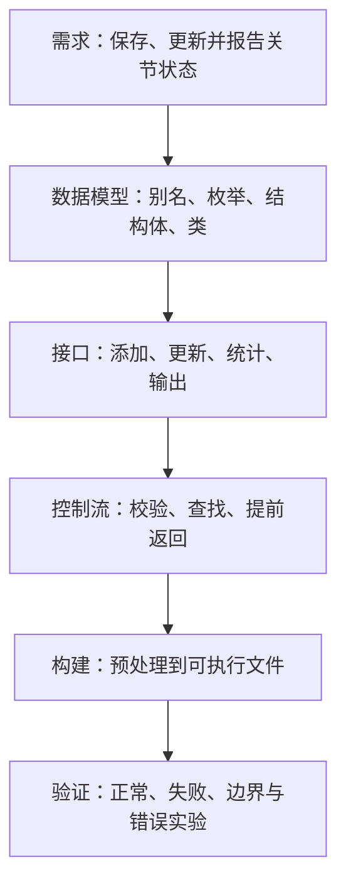

# 第 9 天：机器人关节状态程序综合训练

预计用时：150～180 分钟  
语言标准：C++17  
本单元性质：第一阶段综合训练

## 今日目标

学完本单元，你应该能够：

1. 把一个自然语言需求拆成类型、对象、函数和控制流程
2. 综合使用函数、引用、条件、循环、`std::string`、`std::vector`、枚举、命名空间、`struct` 与 `class`
3. 编写机器人关节状态监控程序，并说明每个类型和函数的职责
4. 使用返回值区分“更新成功”“关节不存在”和“输入超出范围”等结果
5. 解释按值遍历为何可能造成“函数报告成功，但原数据没有改变”的逻辑错误
6. 使用严格警告和 Sanitizer 验证程序
7. 从源文件开始，准确复述预处理、狭义编译、汇编、目标文件、链接、装载和运行的完整链路
8. 区分编译错误、运行期内存错误和运行结果不符合需求的逻辑错误

---

## 关键术语索引（正文可跳转）

> 本表用于查阅和复习，不要求在学习正文前逐项背诵。正文会在术语真正参与设计和推导时直接解释，或链接到对应的完整定义。
>
> 点击第一列术语可跳到下方定义。表格只承担索引功能；跳转目标仍使用真正的 Markdown 六级标题，确保 GitHub 与 Obsidian 均可识别。

| 术语（点击跳转） | 一句话直观解释 |
|---|---|
| [需求（requirement）](#术语-d09-01-需求) | 程序必须实现的行为或满足的条件 |
| [程序设计（program design）](#术语-d09-02-程序设计) | 在写代码前先决定程序由哪些部分组成、各自负责什么 |
| [数据模型（data model）](#术语-d09-03-数据模型) | 用类型和对象表达问题中的数据及其关系 |
| [业务规则（business rule）](#术语-d09-04-业务规则) | 来自具体任务、用于判断操作是否允许的规则 |
| [职责（responsibility）](#术语-d09-05-职责) | 一个类型或函数应该负责完成的明确工作 |
| [接口（interface）](#术语-d09-06-接口) | 其他代码可以使用的操作入口及其约定 |
| [只读操作（read-only operation）](#术语-d09-07-只读操作) | 观察状态但不修改对象可观察状态的操作 |
| [线性查找（linear search）](#术语-d09-08-线性查找) | 从序列开头依次检查元素，直到找到目标或到达末尾 |
| [提前返回（early return）](#术语-d09-09-提前返回) | 一旦结果确定就立即结束当前函数调用 |
| [测试用例（test case）](#术语-d09-10-测试用例) | 一组输入、操作和预期结果组成的验证场景 |
| [正常路径（happy path）](#术语-d09-11-正常路径) | 输入有效且所有操作按预期成功的执行路线 |
| [边界情况（edge case）](#术语-d09-12-边界情况) | 位于允许范围边缘或容易暴露缺陷的特殊情况 |
| [逻辑错误（logic error）](#术语-d09-13-逻辑错误) | 程序能构建并运行，但结果不满足需求 |
| [编译警告（compiler warning）](#术语-d09-14-编译警告) | 编译器发现可疑代码后给出的非致命诊断 |
| [Sanitizer](#术语-d09-15-sanitizer) | 在测试运行中帮助发现部分内存和未定义行为问题的检测工具 |
| [回归检查（regression check）](#术语-d09-16-回归检查) | 修改代码后重新验证原有正确行为没有被破坏 |

### 术语定义

###### 术语-d09-01-需求

**需求（requirement）**

- **新手先这样理解：** 程序必须做到什么，而不是准备怎样写代码。
- **专业上更准确地说：** 需求描述系统应提供的行为、约束或质量条件。需求应尽量可验证，例如“角度只接受 `[-180, 180]`”比“角度要合理”更容易实现和测试。

###### 术语-d09-02-程序设计

**程序设计（program design）**

- **新手先这样理解：** 写代码前先安排类型、函数和数据怎样协作。
- **专业上更准确地说：** 程序设计是把需求映射为数据表示、操作接口、控制流程和模块边界的过程。设计不是只画图，也不是代码写完后再补一段说明。

###### 术语-d09-03-数据模型

**数据模型（data model）**

- **新手先这样理解：** 决定程序用什么类型保存现实问题中的信息。
- **专业上更准确地说：** 数据模型用类型、成员及其关系表达问题域中的实体和状态。本单元用 `JointId`、`Mode`、`JointState` 和 `RobotMonitor` 表达机器人关节监控任务。

###### 术语-d09-04-业务规则

**业务规则（business rule）**

- **新手先这样理解：** 由当前任务决定的“什么情况允许、什么情况拒绝”。
- **专业上更准确地说：** 业务规则是来自问题域的约束，不是 C++ 语法本身。例如角度范围 `[-180, 180]` 是本练习设定的任务规则，不是 C++ 对 `double` 的限制。

###### 术语-d09-05-职责

**职责（responsibility）**

- **新手先这样理解：** 一个程序组成部分应该完成的那一类工作。
- **专业上更准确地说：** 职责描述类型或函数维护哪些状态、执行哪些操作以及不应承担什么。清晰职责能减少重复代码和相互矛盾的修改路径。

###### 术语-d09-06-接口

**接口（interface）**

- **新手先这样理解：** 其他代码与某个类型或函数交互时可以使用的入口。
- **专业上更准确地说：** 接口由可访问的函数、参数、返回类型、可观察行为及使用约定共同组成。接口不只等于函数名；失败时返回什么同样属于接口的一部分。

###### 术语-d09-07-只读操作

**只读操作（read-only operation）**

- **新手先这样理解：** 读取或输出对象状态，但不改变它。
- **专业上更准确地说：** 对类对象而言，标记为 `const` 的成员函数承诺不通过该对象修改普通非 `mutable` 数据成员。本单元的 `enabled_count()` 和 `print_report()` 都是只读成员函数。

###### 术语-d09-08-线性查找

**线性查找（linear search）**

- **新手先这样理解：** 一个接一个检查，直到找到目标。
- **专业上更准确地说：** 线性查找按序检查最多全部元素。若序列有 `n` 个元素，最坏情况下检查 `n` 次；本单元不提前引入复杂度符号，正式复杂度分析在第 28 天展开。

###### 术语-d09-09-提前返回

**提前返回（early return）**

- **新手先这样理解：** 结果已经确定时，不再执行函数后面的语句。
- **专业上更准确地说：** `return` 会结束当前函数调用，并在非 `void` 函数中产生返回值。提前返回可用于拒绝无效输入或在找到目标后立即报告成功。

###### 术语-d09-10-测试用例

**测试用例（test case）**

- **新手先这样理解：** 用一组具体操作证明程序某项行为是否正确。
- **专业上更准确地说：** 测试用例通常包含前置状态、输入或操作、预期结果以及实际结果。只运行一次正常输入不能覆盖失败路径和边界情况。

###### 术语-d09-11-正常路径

**正常路径（happy path）**

- **新手先这样理解：** 所有输入有效时最顺利的执行路线。
- **专业上更准确地说：** 正常路径是满足预期前置条件且操作成功的典型场景。工程验证还必须覆盖拒绝路径和边界情况，不能只验证正常路径。

###### 术语-d09-12-边界情况

**边界情况（edge case）**

- **新手先这样理解：** 刚好位于范围端点、空序列或目标不存在等特殊输入。
- **专业上更准确地说：** 边界情况位于输入域、状态空间或控制分支的边界，常用于发现比较符号、空序列处理和差一错误等缺陷。

###### 术语-d09-13-逻辑错误

**逻辑错误（logic error）**

- **新手先这样理解：** 代码能运行，但做出来的事情不对。
- **专业上更准确地说：** 逻辑错误是实现行为与需求或算法意图不一致。编译器通常不能仅凭语言规则判断它，因为相关代码在语法和类型上可能完全合法。

###### 术语-d09-14-编译警告

**编译警告（compiler warning）**

- **新手先这样理解：** 代码不一定非法，但编译器认为值得你检查。
- **专业上更准确地说：** 警告是实现提供的诊断，通常不阻止目标文件和可执行文件生成。警告集合和文字依编译器与选项而异，零警告也不能证明程序逻辑正确。

###### 术语-d09-15-sanitizer

**Sanitizer**

- **新手先这样理解：** 给测试程序加入额外检查，帮助暴露部分危险运行行为。
- **专业上更准确地说：** Sanitizer 是编译器支持的动态检测机制，通过插桩和运行库在执行时报告特定类别的问题。AddressSanitizer 主要检测部分内存错误，UndefinedBehaviorSanitizer 检测部分未定义行为；它们不能证明程序没有所有错误。

###### 术语-d09-16-回归检查

**回归检查（regression check）**

- **新手先这样理解：** 修复或新增功能后，把原来的测试再跑一遍。
- **专业上更准确地说：** 回归检查用于确认改动没有破坏先前已经满足的行为。它依赖可重复的输入和明确的预期结果，而不是“看起来还能运行”。

---

## 一、完整知识地图



这不是一个新语法单元，而是第一次把第 1～8 天的知识放入同一个可运行程序：

| 已学内容 | 在本项目中的位置 |
|---|---|
| 类型、对象、初始化、表达式 | 关节状态对象与更新表达式 |
| 条件、循环、作用域 | 范围校验、关节查找和统计 |
| 函数、参数、返回值 | 模式转文本、更新角度、打印状态 |
| 值传递、引用传递 | 小型枚举按值传递，较大对象按 `const&` 只读传递 |
| 数组/字符串/向量 | `std::string` 保存名称，`std::vector` 保存多个关节 |
| 枚举、别名、命名空间 | `Mode`、`JointId` 与 `robotics` |
| `struct`、`class`、对象 | `JointState` 表示记录，`RobotMonitor` 管理整体状态 |
| 完整构建链路 | 源码经过多个构建阶段成为可执行文件 |

---

## 二、范围标签

### 今天掌握

- 从可验证需求推导类型、成员和函数
- 用多函数、多类型组织一个完整小程序
- 通过 `bool` 返回值报告操作是否成功
- 正确选择按值、可修改引用和只读引用
- 设计正常、失败和边界测试
- 使用严格警告、ASan 和 UBSan 验证
- 解释单文件程序的完整构建与启动链路

### 先看全貌

- “需求 → 设计 → 实现 → 验证”的工程闭环
- 接口不仅包含函数名，还包含参数、返回值和行为约定
- 测试必须覆盖成功与失败路径
- 业务规则与 C++ 语言规则不是同一层

### 后续深入

- 第 10 天：地址、指针与引用的底层关系
- 第 11～12 天：对象生命周期、存储期、动态存储和所有权
- 第 13～14 天：完整初始化形式、转换、求值顺序和未定义行为
- 第 15～17 天：头文件、翻译单元、分离编译、符号、链接与 ODR
- 第 18 天：调试器、警告与 Sanitizer 的系统使用
- 第 19～24 天：构造、析构、复制移动、RAII、智能指针和多态
- 第 28、30 天：复杂度、迭代器和标准算法
- 第 33～34 天：CMake、测试、静态分析和接口设计

---

## 三、先把需求写成可验证条件

本单元所说的[程序设计](#术语-d09-02-程序设计)，是先把任务安排为数据类型、操作接口和控制流程，再进入具体代码；它不是写完代码后补一张结构图。

本单元程序要完成六项[需求](#术语-d09-01-需求)：

1. 保存机器人名称和运行模式
2. 保存多个关节的编号、名称、角度和使能状态
3. 根据关节编号更新角度
4. 只接受 `[-180, 180]` 度范围内的更新
5. 目标不存在或角度越界时报告失败，并保持原数据不变
6. 输出机器人模式、使能关节数量和每个关节的状态

这里的角度范围是本项目设定的[业务规则](#术语-d09-04-业务规则)，不是 `double` 类型的语言限制。C++ 能表示大于 180 的 `double` 值；是否接受该值由我们的程序决定。

需求必须能验证。例如第 5 条至少隐含两项测试：

- 更新不存在的编号后返回 `false`
- 更新越界角度后返回 `false`，原角度保持不变

---

## 四、从需求建立数据模型

[数据模型](#术语-d09-03-数据模型)不是“随便建几个变量”，而是明确每类信息由什么类型表达。

```cpp
using JointId = int;

enum class Mode {
    offline,
    ready,
    running,
    fault
};

struct JointState {
    JointId id{};
    std::string name{};
    double angle_deg{};
    bool enabled{};
};
```

### 4.1 `JointId`：表达意图的类型别名

`using JointId = int;` 让接口中的 `int` 更容易理解，但它没有创造一个与 `int` 不同的新类型。编译器仍然允许把普通 `int` 传给接收 `JointId` 的函数。

### 4.2 `Mode`：用限定枚举表达有限状态

运行模式只有列出的几种状态，因此使用 `enum class` 比任意整数更清楚：

```cpp
Mode mode{Mode::offline};
```

它不会隐式等同于 `0`、`1` 等整数。底层类型和显式转换在第 13 天继续学习。

### 4.3 `JointState`：把同一关节的信息组成一个对象

`JointState` 是类类型，四个成员共同描述一个关节。下面的初始化顺序按成员声明顺序对应：

```cpp
JointState shoulder{2, "shoulder", 35.0, true};
```

今天使用这种简单聚合形式。构造函数、成员初始化列表和对象完整初始化模型在第 19 天展开。

### 4.4 `RobotMonitor`：维护整体状态并提供操作

机器人名称、模式和关节序列彼此相关，由一个对象统一维护：

```cpp
class RobotMonitor {
public:
    void set_name(const std::string& name);
    void set_mode(Mode mode);
    void add_joint(const JointState& joint);
    bool update_angle(JointId id, double angle_deg);
    int enabled_count() const;
    void print_report() const;

private:
    std::string robot_name_{"unnamed"};
    Mode mode_{Mode::offline};
    std::vector<JointState> joints_{};
};
```

这里只展示[接口](#术语-d09-06-接口)与数据成员。类外代码通过公开成员函数操作对象，不能直接绕过接口修改私有成员。

---

## 五、让每个函数只承担清楚的职责

[职责](#术语-d09-05-职责)是“这个函数负责什么”。本程序的划分如下：

| 函数 | 输入 | 返回/效果 | 职责 |
|---|---|---|---|
| `mode_name` | `Mode` | 对应字符串 | 把枚举状态转换为可显示文本 |
| `result_text` | `bool` | `accepted` 或 `rejected` | 把操作结果转换为文本 |
| `print_joint` | `const JointState&` | 输出一行 | 输出一个关节，不修改它 |
| `set_name` | `const std::string&` | 修改名称 | 设置监控对象名称 |
| `set_mode` | `Mode` | 修改模式 | 设置运行模式 |
| `add_joint` | `const JointState&` | 向序列添加元素 | 保存一个关节状态副本 |
| `update_angle` | 编号与角度 | 成功返回 `true` | 校验、查找并修改目标关节 |
| `enabled_count` | 无 | 使能数量 | 统计状态，不修改对象 |
| `print_report` | 无 | 输出完整报告 | 组织整体输出，不修改对象 |

### 5.1 参数传递不是统一选一种形式

本程序根据含义选择：

- `Mode`、`bool`、`int`、`double` 体积小且只需读取，按值传递
- `std::string`、`JointState` 不需要复制时，通过 `const T&` 只读传递
- 需要修改向量中真实元素时，范围 `for` 使用 `JointState&`
- 只需读取向量元素时，使用 `const JointState&`

这不是“类对象永远传引用”的绝对规则。复制成本、所有权、是否需要修改以及接口语义都要考虑；复制与移动在第 21～22 天系统学习。

### 5.2 `const` 成员函数表达只读承诺

```cpp
int enabled_count() const;
void print_report() const;
```

末尾的 `const` 表示这些成员函数是[只读操作](#术语-d09-07-只读操作)。这里的 `const` 修饰成员函数，不是修饰返回值。`this`、常量对象和成员函数限定的完整模型在第 19 天学习。

---

## 六、核心函数：校验、查找与更新

```cpp
bool update_angle(JointId id, double angle_deg) {
    if (angle_deg < -180.0 || angle_deg > 180.0) {
        return false;
    }

    for (JointState& joint : joints_) {
        if (joint.id == id) {
            joint.angle_deg = angle_deg;
            return true;
        }
    }
    return false;
}
```

### 6.1 第一步：拒绝越界输入

```cpp
if (angle_deg < -180.0 || angle_deg > 180.0) {
    return false;
}
```

只要角度小于 `-180` 或大于 `180`，就通过[提前返回](#术语-d09-09-提前返回)结束当前调用。端点 `-180` 和 `180` 被接受，因为条件使用 `<` 和 `>`，而不是 `<=` 和 `>=`。

`||` 的短路求值和完整求值顺序保证在第 14 天深入；今天只使用已经学过的逻辑“或”。

### 6.2 第二步：按编号线性查找

```cpp
for (JointState& joint : joints_) {
    if (joint.id == id) {
        joint.angle_deg = angle_deg;
        return true;
    }
}
```

程序从第一个关节开始逐个比较编号，这就是[线性查找](#术语-d09-08-线性查找)。找到后修改真实元素并返回 `true`；循环结束仍未找到，返回 `false`。

### 6.3 为什么必须写 `JointState&`

```cpp
for (JointState& joint : joints_)
```

`joint` 绑定到向量中的真实元素，所以赋值会修改 `joints_` 保存的对象。如果省略 `&`：

```cpp
for (JointState joint : joints_)
```

每轮得到的是当前元素的副本。修改副本不会修改向量中的原对象。代码仍可能编译和运行，所以这属于逻辑错误，而不一定是编译错误。

---

## 七、完整程序

源文件：[robot_joint_monitor.cpp](../examples/day-09/robot_joint_monitor.cpp)

程序采用以下主流程：

```cpp
int main() {
    robotics::RobotMonitor monitor{};
    robotics::JointState base{1, "base", 0.0, true};
    robotics::JointState shoulder{2, "shoulder", 35.0, true};
    robotics::JointState tool{3, "tool", -10.0, false};

    monitor.set_name("Cardiac-Arm");
    monitor.add_joint(base);
    monitor.add_joint(shoulder);
    monitor.add_joint(tool);
    monitor.set_mode(robotics::Mode::running);

    const bool valid_update{monitor.update_angle(2, 47.5)};
    const bool missing_joint{monitor.update_angle(9, 10.0)};
    const bool invalid_angle{monitor.update_angle(1, 220.0)};

    // 输出三次操作结果，再输出完整报告
    monitor.print_report();
    return 0;
}
```

这里有三个不同[测试用例](#术语-d09-10-测试用例)：

1. 编号存在且角度有效：应返回 `true` 并修改关节 2
2. 编号不存在：应返回 `false`
3. 编号存在但角度越界：应返回 `false`，关节 1 保持 `0` 度

第一个是[正常路径](#术语-d09-11-正常路径)，后两个验证失败路径。

---

## 八、跟踪一次真实执行过程

先有三个关节：

| 编号 | 名称 | 初始角度 | 使能 |
|---|---|---:|---|
| 1 | base | 0.0 | true |
| 2 | shoulder | 35.0 | true |
| 3 | tool | -10.0 | false |

### 8.1 `update_angle(2, 47.5)`

1. `47.5` 在允许范围内，不提前返回
2. 检查关节 1：编号不等于 2
3. 检查关节 2：编号相等
4. 把真实元素的 `angle_deg` 改为 `47.5`
5. 返回 `true`，不再检查关节 3

### 8.2 `update_angle(9, 10.0)`

1. 角度有效
2. 三个编号依次检查，均不等于 9
3. 循环结束，返回 `false`
4. 三个关节都不改变

### 8.3 `update_angle(1, 220.0)`

1. `220.0 > 180.0`
2. 立即返回 `false`
3. 不进入循环
4. 关节 1 仍为 `0.0`

这个顺序体现了一个设计意图：先校验输入，再修改状态，避免失败操作只完成一半。

---

## 九、构建、运行与完整链路

在仓库根目录执行：

```bash
mkdir -p build/day-09

g++ -std=c++17 -Wall -Wextra -Wpedantic \
    examples/day-09/robot_joint_monitor.cpp \
    -o build/day-09/robot_joint_monitor

./build/day-09/robot_joint_monitor
```

这一条 `g++` 命令是由驱动程序协调多阶段构建的便捷写法，不能把内部过程错误地说成“源码直接一步变成程序”。本次构建仍然经过：

```text
源文件
→ 预处理
→ 预处理后的翻译单元
→ 狭义编译与代码生成
→ 汇编
→ 可重定位目标文件
→ 链接目标文件、启动文件和所需库
→ 可执行文件
→ 操作系统装载与运行库启动
→ 调用 main
```

如果使用第 4 天的方法，可分别通过 `-E`、`-S`、`-c` 停在预处理文本、汇编文本和目标文件阶段。第 15～16 天会在多文件场景继续深入翻译单元、符号和链接。

预期输出：

```text
Update joint 2: accepted
Update joint 9: rejected
Update joint 1 to 220 deg: rejected

Robot: Cardiac-Arm
Mode: running
Enabled joints: 2 / 3
  [1] base: angle=0 deg, enabled=yes
  [2] shoulder: angle=47.5 deg, enabled=yes
  [3] tool: angle=-10 deg, enabled=no
```

---

## 十、使用严格警告与 Sanitizer

### 10.1 严格警告

```bash
g++ -std=c++17 -Wall -Wextra -Wpedantic \
    examples/day-09/robot_joint_monitor.cpp \
    -o build/day-09/robot_joint_monitor
```

[编译警告](#术语-d09-14-编译警告)用于提示可疑代码。本示例在 GCC 和相应选项下应做到零警告，但零警告只说明这些检查没有发现问题，不等于程序已经满足所有需求。

### 10.2 ASan 与 UBSan

GCC 或 Clang 环境可尝试：

```bash
g++ -std=c++17 -Wall -Wextra -Wpedantic \
    -fsanitize=address,undefined -fno-omit-frame-pointer \
    examples/day-09/robot_joint_monitor.cpp \
    -o build/day-09/robot_joint_monitor_san

./build/day-09/robot_joint_monitor_san
```

[Sanitizer](#术语-d09-15-sanitizer)只会在相关执行路径真正运行时检测特定问题。一次无报告运行不能证明所有输入、所有平台和所有错误类别都安全。

---

## 十一、错误实验一：修改了副本，没有修改原对象

文件：[copy_update_bug.cpp](../examples/day-09/copy_update_bug.cpp)

错误函数：

```cpp
for (JointState joint : joints) {
    if (joint.id == id) {
        joint.angle_deg = angle_deg;
        return true;
    }
}
```

构建并运行：

```bash
g++ -std=c++17 -Wall -Wextra -Wpedantic \
    examples/day-09/copy_update_bug.cpp \
    -o build/day-09/copy_update_bug

./build/day-09/copy_update_bug
```

输出：

```text
reported success: yes
stored angle: 35
```

函数报告成功，但原向量中的角度没有变。这是[逻辑错误](#术语-d09-13-逻辑错误)：程序符合 C++ 语法和类型规则，却不符合“更新原关节”的需求。

修复：

```cpp
for (JointState& joint : joints)
```

修复后必须重新运行原有正常和失败测试，这就是[回归检查](#术语-d09-16-回归检查)。

---

## 十二、错误实验二：绕过公开接口访问私有成员

文件：[private_access_error.cpp](../examples/day-09/private_access_error.cpp)

错误代码：

```cpp
RobotMonitor monitor{};
monitor.mode_ = Mode::running;
```

构建：

```bash
g++ -std=c++17 -Wall -Wextra -Wpedantic \
    examples/day-09/private_access_error.cpp \
    -o build/day-09/private_access_error
```

狭义编译阶段应诊断 `mode_` 是私有成员，因而不会成功生成最终可执行文件。正确做法是使用公开接口：

```cpp
monitor.set_mode(Mode::running);
```

访问控制不是操作系统提供的运行时权限检查，而是 C++ 语言在程序构建时实施的规则。

---

## 十三、测试设计：不能只运行一次正常输入

至少设计以下测试：

| 测试 | 初始条件/操作 | 预期结果 |
|---|---|---|
| 有效更新 | 关节 2，角度 47.5 | 返回 `true`，保存 47.5 |
| 目标不存在 | 关节 9，角度 10 | 返回 `false`，所有关节不变 |
| 小于下界 | 关节 1，角度 -180.1 | 返回 `false` |
| 等于下界 | 关节 1，角度 -180 | 返回 `true` |
| 等于上界 | 关节 1，角度 180 | 返回 `true` |
| 大于上界 | 关节 1，角度 180.1 | 返回 `false` |
| 空关节序列 | 不添加关节，直接更新 | 返回 `false`，报告数量为 0 |
| 统计使能数量 | 两个 true、一个 false | 返回 2 |

`-180`、`180`、空序列和刚越过端点的数值都是[边界情况](#术语-d09-12-边界情况)。它们能检查 `<`、`>` 是否符合需求，并暴露空容器处理问题。

---

## 十四、常见工程陷阱

### 陷阱 1：先写代码，最后才猜需求

如果“角度合理”没有明确范围，程序和测试都无法判断 `181` 是否应被接受。先把需求写成可验证条件。

### 陷阱 2：把所有数据都保存成 `int`

模式、布尔状态和角度具有不同含义。合适的类型能让错误更早暴露并让接口更清楚。

### 陷阱 3：函数既查找、又修改、又输出大量无关内容

职责混杂会让函数难以复用和测试。本例让 `update_angle` 返回结果，由调用方决定怎样显示。

### 陷阱 4：用 `void` 隐藏失败

更新可能失败。若接口完全不报告结果，调用方无法区分成功与拒绝。本单元用 `bool` 建立最小结果通道；更丰富的错误表示在第 32 天学习。

### 陷阱 5：把 `using JointId = int` 当作强类型隔离

别名提高可读性，但编译器仍把它视为 `int`。需要真正类型隔离时要设计独立类型，后续类单元再展开。

### 陷阱 6：按值遍历后误以为修改了容器

没有 `&` 时修改的是副本。编译成功不代表满足需求。

### 陷阱 7：只测试成功场景

目标不存在、空序列、端点和越界值同样属于接口行为。

### 陷阱 8：把警告和 Sanitizer 当成正确性证明

它们只能发现覆盖范围内的部分问题，不能替代需求检查和结果验证。

---

## 十五、不要形成的八个新误解

1. 综合训练不是把所有已学语法强行塞进一个函数
2. `class` 并不自动保证设计合理，接口仍可能表达错误
3. 私有成员不是“更安全的内存”，而是受语言访问控制约束的成员
4. `bool` 只能表示成功/失败，不能携带所有失败原因
5. 线性查找适合本次小序列，不代表所有规模都应这样查找
6. `const` 成员函数承诺只读，不等于整个程序中不存在其他对象状态变化
7. 零编译警告不等于零逻辑错误
8. Sanitizer 没有报告不等于所有路径都不存在问题

---

## 十六、随堂练习

1. 在不看代码的情况下，写出六项需求分别由哪个类型或函数承担。
2. 把 `update_angle` 的范围 `for` 改成按值遍历，预测并验证输出。
3. 增加 `bool set_enabled(JointId id, bool enabled)`，要求目标不存在时返回 `false`。
4. 增加空序列测试，确认 `enabled_count()` 返回 0 且报告能够正常输出。
5. 用自己的话解释为什么 `g++ source.cpp -o program` 不表示内部只有一个“编译”阶段。

完整作答见：[第 9 天练习单](../exercises/day-09.md)。

---

## 十七、本单元偿还与新增的知识缺口

本单元是整合与验证课，不提前宣称补齐后续单元承担的完整模型：

- `G04` 已由第 4、5 天补齐；本单元再次验证完整构建与 `main` 的分层模型，不改变其状态
- `G09`、`G20`：继续使用 `std::string` 和 `std::vector`，但模板、资源管理、复制移动和迭代器失效仍按计划在第 19～23、27～28 天补齐
- `G16`：继续练习值传递与引用传递，但临时对象、复制移动、转发引用等仍在后续单元补齐
- `G17`：使用普通函数和成员函数，不把完整名称查找与重载规则提前称作已掌握
- `G22`：继续使用范围 `for`，其精确展开、迭代器和算法模型仍在第 14、27～30 天补齐
- `G26`：继续使用 `struct`、`class` 和 `const` 成员函数，但构造析构、`this`、特殊成员及多态仍由第 19～24 天承担

本单元没有新增需要登记的永久省略项，也不把上述项目的教材状态改为“已补全”。

---

## 十八、今日完成标准

不看讲义时能够完成以下事项，才算第 9 天达标：

- 从需求写出 `JointId`、`Mode`、`JointState` 和 `RobotMonitor` 的职责
- 独立实现添加关节、更新角度、统计使能数量和输出报告
- 解释 `update_angle` 三个 `return` 分别对应什么路径
- 解释为什么可修改遍历使用 `JointState&`，只读遍历使用 `const JointState&`
- 验证有效编号、无效编号、上下界、越界值和空序列
- 严格警告构建无警告，并完成一次 ASan/UBSan 运行
- 让私有成员错误实验在狭义编译阶段按预期失败
- 准确复述源码到可执行文件、装载和进入 `main` 的完整过程
- 能区分编译错误、Sanitizer 运行诊断和逻辑错误
- 完成并同步第 9 天练习单

下一单元：地址、指针与引用。
