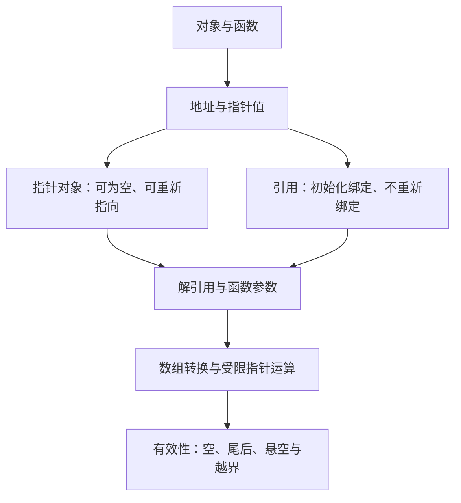

# 第 10 天：地址、指针与引用

预计用时：150～180 分钟  
语言标准：C++17  
本单元位置：第二阶段起点——内存、翻译单元与链接模型

## 今日目标

学完本单元，你应该能够：

1. 准确区分对象、对象地址、指针对象、指针值和引用
2. 根据语法位置解释 `&` 和 `*` 的不同含义
3. 使用 `&object` 取得地址，使用 `*pointer` 访问指向的对象
4. 使用 `nullptr` 表示空指针，并在解引用前检查可能为空的指针
5. 解释指针为什么可以改为指向另一对象，而引用不能重新绑定
6. 根据接口是否允许“没有对象”以及是否需要重新指向，选择指针参数或引用参数
7. 解释原生数组到首元素指针的转换，以及数组形参为何会调整为指针形参
8. 只在同一数组及其尾后位置构造规则允许的范围内进行指针运算
9. 识别空指针解引用、类型不匹配、越界指针和悬空指针等风险
10. 使用严格警告和 Sanitizer 验证正确示例与错误实验

---

## 关键术语索引（正文可跳转）

> 本表用于查阅和复习，不要求在学习正文前逐项背诵。正文会在术语真正参与知识推导时直接解释，或链接到对应的完整定义。
>
> 点击第一列术语可跳到下方定义。表格只承担索引功能；跳转目标仍使用真正的 Markdown 六级标题，确保 GitHub 与 Obsidian 均可识别。

| 术语（点击跳转） | 一句话直观解释 |
|---|---|
| [地址（address）](#术语-d10-01-地址) | 用来定位具有存储位置的对象或函数的信息 |
| [取地址运算符（address-of operator）](#术语-d10-02-取地址运算符) | 一元 `&`，用于取得对象或函数的地址 |
| [指针类型（pointer type）](#术语-d10-03-指针类型) | 值可以表示对象/函数地址、尾后位置或空值的一类类型 |
| [指针对象（pointer object）](#术语-d10-04-指针对象) | 类型为指针类型、其值是指针值的对象 |
| [被指向对象（pointee）](#术语-d10-05-被指向对象) | 某个有效对象指针所指示的对象 |
| [解引用（dereference）](#术语-d10-06-解引用) | 通过一元 `*` 形成指向对象的表达式 |
| [空指针（null pointer）](#术语-d10-07-空指针) | 明确表示当前不指向任何对象或函数的指针值 |
| [`nullptr`](#术语-d10-08-nullptr) | C++11 起用于产生空指针值的专用字面量 |
| [引用（reference）](#术语-d10-09-引用) | 初始化时绑定到已有实体、之后通过引用操作该实体的语言机制 |
| [引用绑定（reference binding）](#术语-d10-10-引用绑定) | 引用在初始化时与目标实体建立关联 |
| [重新指向（reseat）](#术语-d10-11-重新指向) | 改变指针值，使指针随后指示另一个目标 |
| [指针参数（pointer parameter）](#术语-d10-12-指针参数) | 通过指针值接收目标位置、并可用空值表达“无目标”的形参 |
| [引用参数（reference parameter）](#术语-d10-13-引用参数) | 直接绑定到实参实体、通过形参操作该实体的引用形参 |
| [数组到指针转换（array-to-pointer conversion）](#术语-d10-14-数组到指针转换) | 数组表达式在许多上下文中转换为指向首元素的指针 |
| [数组形参调整（array parameter adjustment）](#术语-d10-15-数组形参调整) | 函数形参中的 `T a[]` 实际调整为 `T* a` |
| [指针运算（pointer arithmetic）](#术语-d10-16-指针运算) | 按数组元素位置移动或比较指针的受限运算 |
| [尾后指针（past-the-end pointer）](#术语-d10-17-尾后指针) | 指向数组最后一个元素之后位置、可比较但不可解引用的指针 |
| [悬空指针（dangling pointer）](#术语-d10-18-悬空指针) | 原目标生命周期结束后仍保留旧地址关系的指针 |
| [未定义行为（undefined behavior）](#术语-d10-19-未定义行为) | C++ 标准不对程序结果提出要求的行为 |

### 术语定义

###### 术语-d10-01-地址

**地址（address）**

- **新手先这样理解：** 程序用来找到某个对象所在位置的信息。
- **专业上更准确地说：** 对具有存储位置的对象或函数，C++ 的指针值可以表示其地址。地址是抽象机语义的一部分；屏幕上看到的十六进制数只是某个实现对地址的常见显示形式，不能把示例数值推广到其他运行或平台。

###### 术语-d10-02-取地址运算符

**取地址运算符（address-of operator）**

- **新手先这样理解：** 写在对象前的一元 `&`，得到指向该对象的指针。
- **专业上更准确地说：** 对可取地址的对象或函数表达式应用一元 `&`，会产生相应的指针值。`&` 在声明中的引用符号、表达式中的取地址运算和二元按位与运算具有不同语法角色。

###### 术语-d10-03-指针类型

**指针类型（pointer type）**

- **新手先这样理解：** 专门保存“指向什么”的指针值的类型。
- **专业上更准确地说：** 对对象类型 `T`，`T*` 是指向 `T` 的指针类型。对象指针值可表示某个 `T` 对象的地址、数组尾后位置、空指针值，或在某些情况下成为无效值。不同指向类型不能任意混用。

###### 术语-d10-04-指针对象

**指针对象（pointer object）**

- **新手先这样理解：** 自己也是对象，只是保存的值用于指示另一个对象。
- **专业上更准确地说：** `int* pointer` 声明了一个类型为 `int*` 的对象。必须区分指针对象本身、指针对象当前保存的指针值，以及该值可能指示的被指向对象。

###### 术语-d10-05-被指向对象

**被指向对象（pointee）**

- **新手先这样理解：** 指针当前指向的那个对象。
- **专业上更准确地说：** 当对象指针值表示某个对象的地址时，该对象就是指针所指示的对象。空指针没有被指向对象；尾后指针也不指示可解引用的数组元素。

###### 术语-d10-06-解引用

**解引用（dereference）**

- **新手先这样理解：** 根据指针中保存的指向关系，访问那个对象。
- **专业上更准确地说：** 对指向有效对象或函数的指针应用一元 `*`，会形成表示所指实体的表达式。对空指针、悬空指针或不可解引用的尾后指针执行需要访问对象的操作，会产生未定义行为。

###### 术语-d10-07-空指针

**空指针（null pointer）**

- **新手先这样理解：** 明确表示“现在没有指向任何目标”。
- **专业上更准确地说：** 空指针值与任何对象或函数的地址都不相等。指针对象可以保存空指针值，但空指针不能被用来访问一个被指向对象，因为不存在这样的对象。

###### 术语-d10-08-nullptr

**`nullptr`**

- **新手先这样理解：** C++ 中表达空指针的专用写法。
- **专业上更准确地说：** `nullptr` 是空指针字面量，其类型为 `std::nullptr_t`，可以转换为任意指针类型或成员指针类型的空值。现代 C++ 中它比整数 `0` 或宏 `NULL` 更清楚，也能减少重载选择中的歧义。

###### 术语-d10-09-引用

**引用（reference）**

- **新手先这样理解：** 初始化后，通过另一个名称直接操作原来的实体。
- **专业上更准确地说：** 引用是 C++ 的语言机制，必须按引用绑定规则初始化，并在其有效使用期间表示已绑定的实体。引用本身不是对象，语言也没有普通“空引用”状态；实现可能用地址完成引用语义，但这不是要求学习者把引用等同于隐藏指针。

###### 术语-d10-10-引用绑定

**引用绑定（reference binding）**

- **新手先这样理解：** 创建引用时决定它对应哪个对象。
- **专业上更准确地说：** 引用必须在初始化时按照类型与值类别规则绑定到允许的实体。绑定之后，对引用名称的普通赋值作用于已绑定对象，而不是让引用改绑到新对象。

###### 术语-d10-11-重新指向

**重新指向（reseat）**

- **新手先这样理解：** 给指针赋另一个地址，使它改为指向别处。
- **专业上更准确地说：** 可修改的指针对象可以被赋予另一个兼容指针值或空指针值。引用没有对应的重新绑定赋值操作；给引用赋值会修改它所表示的对象。

###### 术语-d10-12-指针参数

**指针参数（pointer parameter）**

- **新手先这样理解：** 函数收到一个指针值，可能通过它访问调用方对象。
- **专业上更准确地说：** 指针形参自身是本次函数调用中的参数对象，初始化自实参提供的指针值。接口可用空指针表达“没有目标”，因此函数在解引用前必须满足或检查相应前置条件。

###### 术语-d10-13-引用参数

**引用参数（reference parameter）**

- **新手先这样理解：** 函数形参直接对应调用方提供的实体。
- **专业上更准确地说：** 引用形参在函数调用时绑定到实参实体。通过非 `const` 引用形参进行赋值会修改该实体；`const T&` 提供只读访问语义。引用绑定、临时对象和 `const` 的完整规则在后续单元继续补齐。

###### 术语-d10-14-数组到指针转换

**数组到指针转换（array-to-pointer conversion）**

- **新手先这样理解：** 数组名称在许多表达式中会提供指向第一个元素的指针。
- **专业上更准确地说：** 除若干规定上下文外，数组类型表达式会转换为指向其首元素的指针。数组类型本身没有因此“变成”指针；例如 `sizeof(array)` 与 `sizeof(pointer)` 的含义仍然不同。

###### 术语-d10-15-数组形参调整

**数组形参调整（array parameter adjustment）**

- **新手先这样理解：** 函数参数列表里看似数组的写法，实际收到的是指针。
- **专业上更准确地说：** 在函数参数类型形成过程中，写作 `T parameter[]` 或 `T parameter[N]` 的形参会调整为 `T* parameter`。因此函数不能从该形参本身恢复调用方数组的元素个数，通常还需单独传入大小。

###### 术语-d10-16-指针运算

**指针运算（pointer arithmetic）**

- **新手先这样理解：** 让指针按元素位置前后移动，而不是按任意字节乱跳。
- **专业上更准确地说：** 对数组元素指针进行整数加减，结果必须保持在同一数组的元素范围或恰好到达尾后位置；相关比较和相减也受同一数组关系约束。越出允许范围本身就可能违反语言规则，并非只有解引用时才有问题。

###### 术语-d10-17-尾后指针

**尾后指针（past-the-end pointer）**

- **新手先这样理解：** 用来表示“已经走到数组末尾”的位置标记。
- **专业上更准确地说：** 对含 `N` 个元素的数组，指向第 `N` 个位置的指针是尾后指针。它可用于循环终止比较，但不指示真实数组元素，不能解引用。

###### 术语-d10-18-悬空指针

**悬空指针（dangling pointer）**

- **新手先这样理解：** 指针还保留旧地址关系，但原对象已经不再存活。
- **专业上更准确地说：** 当所指对象生命周期结束或相关存储被释放后，仍保留该旧指向关系的指针通常称为悬空指针。能否比较、复制或使用某类无效指针涉及更细规则；初学阶段必须遵守“不通过它访问原对象”。

###### 术语-d10-19-未定义行为

**未定义行为（undefined behavior）**

- **新手先这样理解：** 程序已经违反语言规则，不能再要求它给出某种固定结果。
- **专业上更准确地说：** 对未定义行为，C++ 标准不施加要求。程序可能崩溃、看似正常、产生错误结果或被优化成意外形式；一次运行没有崩溃不能证明行为合法。

---

## 一、完整知识地图



本单元先建立对象指针的第一层完整模型。C++ 还存在函数指针、成员指针、多级指针、智能指针和更完整的限定转换规则；这些不是今天的核心，但不会被错误地说成不存在。

---

## 二、范围标签

### 今天掌握

- 对象、地址、指针对象、指针值和引用的区别
- `T*`、`&object`、`*pointer`、`T&` 和 `nullptr`
- 指针可为空、可重新指向；引用初始化绑定且不能重新绑定
- 指针参数和引用参数的基本选择
- 数组到首元素指针的转换与数组形参调整
- 同一数组范围内的基本指针运算和尾后指针
- 空指针解引用、类型不匹配和悬空风险

### 先看全貌

- 指针值不只包含“指向对象”和“空”两种状态
- 引用语义不等于“编译器偷偷放了一个指针”
- 指针有效性依赖目标对象的生命周期和允许的访问范围
- 数组表达式经常转换为指针，但数组与指针仍是不同类型

### 后续深入

- 第 11 天：对象存储期、生命周期、调用栈与常见内存区域
- 第 12 天：动态存储、`new`、`delete`、泄漏、悬空与所有权
- 第 13 天：`const T*`、`T* const`、转换和完整初始化形式
- 第 14 天：表达式求值、指针运算边界、值类别与未定义行为
- 第 17 天：复杂声明、链接和跨翻译单元名称规则
- 第 21～23 天：原始指针与复制、移动、智能指针和所有权
- 第 25、30 天：函数指针、可调用对象与算法接口

---

## 三、对象与地址不是同一个概念

```cpp
int joint_id{10};
```

`joint_id` 是一个 `int` 对象的名称，对象当前值为 `10`。对该对象应用[取地址运算符](#术语-d10-02-取地址运算符)：

```cpp
&joint_id
```

得到的是表示该对象[地址](#术语-d10-01-地址)的 `int*` 指针值，而不是整数值 `10`。

可以观察地址：

```cpp
std::cout << &joint_id << '\n';
```

输出常类似十六进制数，但实际文本、数值和每次运行的位置都由平台和运行环境决定。不要把某次显示的地址写死到程序逻辑中。

| 项目 | 类型 | 当前含义 |
|---|---|---|
| `joint_id` | `int` | 表示对象，读取时可取得值 10 |
| `&joint_id` | `int*` | 表示指向 `joint_id` 的指针值 |
| `sizeof(joint_id)` | `std::size_t` | 当前实现中 `int` 对象占用的字节数 |

`sizeof` 的返回类型、对象表示与平台差异在第 13～14 天进一步学习。

---

## 四、指针类型、指针对象和被指向对象

```cpp
int joint_id{10};
int* joint_pointer{&joint_id};
```

必须区分三层：

1. `int*` 是[指针类型](#术语-d10-03-指针类型)
2. `joint_pointer` 是[指针对象](#术语-d10-04-指针对象)
3. `joint_id` 是 `joint_pointer` 当前的[被指向对象](#术语-d10-05-被指向对象)

指针对象保存的是指针值，不是把整个 `joint_id` 对象复制进去。

### 4.1 `*` 在声明与表达式中不是同一个角色

声明：

```cpp
int* joint_pointer{&joint_id};
```

这里的 `*` 参与声明符，说明 `joint_pointer` 的类型是 `int*`。

表达式：

```cpp
*joint_pointer
```

这里的一元 `*` 执行[解引用](#术语-d10-06-解引用)，形成表示 `joint_id` 对象的表达式。因此：

```cpp
*joint_pointer = 20;
```

会把 `joint_id` 改为 `20`。

乘法中的二元 `*` 又是第三种语法角色：

```cpp
int product{3 * 4};
```

词法记号相同，不代表语义相同；必须根据所在语法位置判断。

### 4.2 一个声明中不要混写多个不同形态

```cpp
int* first, second;
```

只有 `first` 是 `int*`，`second` 是 `int`。`*` 属于各个声明符，而不是自动覆盖逗号后的所有名称。初学和工程代码中优先一行声明一个对象：

```cpp
int* first{};
int second{};
```

---

## 五、引用：绑定后通过引用操作原对象

```cpp
int joint_id{10};
int& joint_reference{joint_id};
```

`joint_reference` 是一个 `int` [引用](#术语-d10-09-引用)，在初始化时完成[引用绑定](#术语-d10-10-引用绑定)。之后：

```cpp
joint_reference = 30;
```

不是让引用改绑到整数 `30`，而是把已绑定的 `joint_id` 对象赋值为 `30`。

### 5.1 引用必须初始化

下面不能成立：

```cpp
int& reference;
```

普通引用没有“先空着以后再绑定”的状态。声明引用时必须提供符合绑定规则的初始化目标。

### 5.2 不要把引用定义成“必然没有存储的指针”

实现可能通过机器地址完成某些引用操作，也可能优化掉可见存储，但 C++ 语言层面给出的是引用绑定和通过引用访问实体的规则。引用不是对象，`sizeof(reference)` 得到的是被引用类型相关结果，而不是一个“引用对象大小”。

---

## 六、指针与引用的准确对比

| 问题 | 指针 | 引用 |
|---|---|---|
| 基本声明 | `int* pointer` | `int& reference` |
| 初始目标 | 可指向对象，也可为 `nullptr` | 必须按规则绑定到目标 |
| 访问目标 | `*pointer` | 直接使用 `reference` |
| 能否重新指向/绑定 | 可修改指针值后[重新指向](#术语-d10-11-重新指向) | 绑定后不能重新绑定 |
| 赋值含义 | `pointer = &other` 修改指针值 | `reference = other` 给已绑定对象赋值 |
| 是否需要空值检查 | 若接口允许为空，需要 | 语言中没有普通空引用状态 |
| 能否进行指针运算 | 对数组关系内的对象指针可以 | 不适用 |
| 语言分类 | 指针对象是对象 | 引用不是对象 |

### 6.1 指针可以重新指向

```cpp
int first{10};
int second{20};
int* pointer{&first};

pointer = &second;
*pointer = 30;
```

最终 `second` 变成 `30`，`first` 仍为 `10`。

### 6.2 引用赋值不是重新绑定

```cpp
int first{10};
int second{20};
int& reference{first};

reference = second;
```

这会把 `second` 的值赋给 `first`。`reference` 仍然绑定 `first`。

---

## 七、空指针与 `nullptr`

```cpp
int* pointer{nullptr};
```

`pointer` 是真实存在的指针对象，它当前保存[空指针](#术语-d10-07-空指针)值。空指针表示没有指向任何对象，并不表示“指向地址为零的可访问对象”。

现代 C++ 使用 [`nullptr`](#术语-d10-08-nullptr)：

```cpp
if (pointer == nullptr) {
    std::cout << "no target\n";
}
```

不要写：

```cpp
*pointer = 10;
```

因为不存在被指向对象。空指针解引用产生[未定义行为](#术语-d10-19-未定义行为)。

### 为什么不优先使用 `0` 或 `NULL`

整数常量 `0` 在某些指针上下文可形成空指针值，传统宏 `NULL` 的具体定义又可能是整数形式。它们会把“整数零”和“没有指针目标”混在同一表达方式中，并可能影响函数重载。`nullptr` 的专用类型使意图更明确。

---

## 八、函数参数：是否允许“没有对象”是关键问题

### 8.1 指针参数

```cpp
void increment_by_pointer(int* value) {
    if (value == nullptr) {
        return;
    }
    ++(*value);
}
```

[指针参数](#术语-d10-12-指针参数)可以接收：

```cpp
increment_by_pointer(&joint_id);
increment_by_pointer(nullptr);
```

这个接口用 `nullptr` 表示“本次没有目标”。函数必须在解引用前处理这一状态。

### 8.2 引用参数

```cpp
void increment_by_reference(int& value) {
    ++value;
}
```

[引用参数](#术语-d10-13-引用参数)表达“调用时必须提供一个可修改的 `int` 对象”：

```cpp
increment_by_reference(joint_id);
```

### 8.3 第一层选择规则

- 必须有目标，而且函数直接操作该目标：优先考虑引用
- “没有目标”是合法状态：考虑指针，并明确空值行为
- 需要让函数内的游标改为指向不同元素：指针更自然
- 只需输入一个小型值：按值传递可能更清楚

这不是覆盖所有接口设计的绝对规则。所有权、生命周期、可空类型、智能指针和迭代器会在后续单元加入判断。

---

## 九、数组与指针：经常转换，但不是同一类型

```cpp
int samples[3]{4, 8, 12};
int* first{samples};
```

在这个初始化表达式中，`samples` 发生[数组到指针转换](#术语-d10-14-数组到指针转换)，产生指向首元素 `samples[0]` 的指针。

因此：

```cpp
*first          // samples[0]
*(first + 1)    // samples[1]
*(first + 2)    // samples[2]
```

但不能说“数组就是指针”：

- `samples` 的类型是 `int[3]`
- `first` 的类型是 `int*`
- `sizeof(samples)` 计算整个数组对象的大小
- `sizeof(first)` 计算指针对象的大小

具体数值依平台，不应写死。

### 9.1 指针运算按元素移动

[指针运算](#术语-d10-16-指针运算)中的 `first + 1` 表示移到下一个 `int` 元素位置，不是简单把打印出来的地址数值加 1 字节。

对于三个元素的数组：

```cpp
int* begin{samples};
int* end{samples + 3};
```

`end` 是[尾后指针](#术语-d10-17-尾后指针)，适合用于终止比较：

```cpp
for (int* current{begin}; current != end; ++current) {
    std::cout << *current << '\n';
}
```

循环在 `current == end` 时停止，绝不能解引用 `end`。

### 9.2 不要构造越出允许范围的指针

下面不是合法的通用做法：

```cpp
int* invalid{samples + 4};
```

对于长度为 3 的数组，只能在数组元素和恰好尾后位置的规则范围内形成相关指针运算结果。完整表达式规则和未定义行为在第 14 天继续深化。

---

## 十、数组形参会调整为指针

```cpp
void set_first(int values[], int new_value) {
    values[0] = new_value;
}
```

函数形参里的 `int values[]` 发生[数组形参调整](#术语-d10-15-数组形参调整)，其参数类型等同于：

```cpp
void set_first(int* values, int new_value);
```

因此函数通过指针修改调用方数组首元素，但 `values` 自身不携带数组长度。若函数需要遍历，必须另外获得元素数量，或以后使用能保留大小信息的接口。

```cpp
void print_values(const int values[], int count) {
    for (int index{}; index < count; ++index) {
        std::cout << values[index] << '\n';
    }
}
```

这里 `count` 必须与真实数组范围一致。传入错误大小会造成越界风险。`std::array`、容器接口和迭代器在第 28～30 天系统比较。

---

## 十一、完整示例与执行跟踪

源文件：[pointer_reference_basics.cpp](../examples/day-10/pointer_reference_basics.cpp)

初始代码：

```cpp
int joint_id{10};
int* joint_pointer{&joint_id};
int& joint_reference{joint_id};
```

三者关系：

| 名称 | 类型 | 与 `joint_id` 的关系 |
|---|---|---|
| `joint_id` | `int` | 原对象 |
| `joint_pointer` | `int*` | 指针对象，值指向 `joint_id` |
| `joint_reference` | `int&` | 初始化时绑定到 `joint_id` |

执行：

1. `*joint_pointer = 20`：通过指针把原对象改为 20
2. `joint_reference = 30`：通过引用把同一对象改为 30
3. `increment_by_pointer(joint_pointer)`：检查非空后把对象增至 31
4. `increment_by_reference(joint_reference)`：把对象增至 32
5. `increment_by_pointer(nullptr)`：提前返回，原对象仍为 32
6. 数组表达式转换为首元素指针，读取 4、8、12
7. 数组形参调整为指针，通过 `values[0]` 把首元素改为 40

---

## 十二、构建、运行与完整链路

```bash
mkdir -p build/day-10

g++ -std=c++17 -Wall -Wextra -Wpedantic \
    examples/day-10/pointer_reference_basics.cpp \
    -o build/day-10/pointer_reference_basics

./build/day-10/pointer_reference_basics
```

预期输出：

```text
initial: 10
pointer and object address match: yes
after pointer write: 20
after reference write: 30
after pointer increment: 31
after reference increment: 32
null call leaves value: 32
array values through pointer: 4 8 12
after array-parameter update: 40 8 12
```

这条 `g++` 命令仍由驱动程序协调完整构建：

```text
源文件
→ 预处理
→ 预处理后的翻译单元
→ 狭义编译与代码生成
→ 汇编
→ 可重定位目标文件
→ 链接目标文件、启动文件和所需库
→ 可执行文件
→ 操作系统装载与运行库启动
→ 调用 main
```

指针和引用的类型检查主要发生在狭义编译阶段；运行时的空指针解引用则可能需要 Sanitizer 才得到清晰诊断。

---

## 十三、错误实验一：指向类型不匹配

文件：[pointer_type_error.cpp](../examples/day-10/pointer_type_error.cpp)

```cpp
int joint_id{3};
double* wrong_pointer{&joint_id};
```

`&joint_id` 的类型是 `int*`，不能直接初始化 `double*`。

```bash
g++ -std=c++17 -Wall -Wextra -Wpedantic \
    examples/day-10/pointer_type_error.cpp \
    -o build/day-10/pointer_type_error
```

狭义编译阶段应给出类似“不能把 `int*` 转换为 `double*`”的诊断，不会成功产生最终可执行文件。指针类型保留被指向类型信息，编译器据此检查解引用后的访问类型。

---

## 十四、错误实验二：空指针解引用

文件：[null_dereference.cpp](../examples/day-10/null_dereference.cpp)

```cpp
int* pointer{nullptr};
std::cout << *pointer << '\n';
```

使用 ASan/UBSan 构建并运行：

```bash
g++ -std=c++17 -Wall -Wextra -Wpedantic \
    -fsanitize=address,undefined -fno-omit-frame-pointer \
    examples/day-10/null_dereference.cpp \
    -o build/day-10/null_dereference_san

./build/day-10/null_dereference_san
```

程序应以非零状态终止，并报告空地址读取或相关运行时错误。诊断文字依编译器和平台而异。

重要边界：Sanitizer 报告不是 C++ 标准规定的结果。标准只规定这里是未定义行为；没有 Sanitizer 时，程序仍可能崩溃、看似运行或表现不同。

---

## 十五、悬空指针先建立边界

```cpp
int* pointer{nullptr};

{
    int local_value{42};
    pointer = &local_value;
}

// 此处 local_value 的生命周期已经结束
```

离开代码块后名称 `local_value` 超出作用域，同时这个自动存储期对象的生命周期也结束。`pointer` 仍保存旧指向关系，成为[悬空指针](#术语-d10-18-悬空指针)。不能通过它继续读取原对象。

今天只建立风险边界。作用域、存储期和生命周期为什么是三个不同维度，将在第 11 天完整展开；动态存储释放后的悬空问题在第 12 天学习。

引用也可能因所绑定对象生命周期结束而失效，因此“引用不能为 null”绝不等于“引用永远安全”。

---

## 十六、常见工程陷阱

### 陷阱 1：把指针对象与被指向对象混成一个东西

给 `pointer` 赋值可能改变指向；给 `*pointer` 赋值会修改目标对象，两者完全不同。

### 陷阱 2：认为 `&` 永远表示地址

`int& reference` 中它参与引用声明；`&object` 中它是取地址运算符；`a & b` 中它是按位与。

### 陷阱 3：认为 `*` 永远表示指针

它可以参与指针声明、执行一元解引用，也可以表示二元乘法。

### 陷阱 4：用引用赋值尝试“改绑”

`reference = other` 修改已绑定对象，不会重新绑定引用。

### 陷阱 5：不检查允许为空的指针参数

若接口允许 `nullptr`，函数必须在解引用前处理；若接口不允许，应明确前置条件并选择更合适的表达方式。

### 陷阱 6：说“数组就是指针”

数组表达式经常发生转换，但数组类型、对象大小和指针类型仍不同。

### 陷阱 7：以为数组形参保留了长度

`int values[10]` 作为函数形参仍调整为 `int* values`；写出的 `10` 不让指针携带数组大小。

### 陷阱 8：把尾后指针当作最后一个元素

尾后指针用于边界比较，不指向元素，不能解引用。

### 陷阱 9：认为地址打印相同就能证明生命周期合法

旧地址数值可能被重新使用。有效访问取决于对象生命周期和语言规则，不只取决于数值看起来相同。

### 陷阱 10：认为指针只用于堆内存

本单元的指针指向普通局部对象和数组元素。指针是通用的间接访问机制，不等同于 `new` 或堆。

---

## 十七、不要形成的十个新误解

1. 地址不是对象当前保存的业务数值
2. 指针对象不是它所指向的对象
3. 指针的显示地址不是可长期保存的稳定编号
4. 引用不是能够随时改绑的指针别名变量
5. “引用不能为 null”不等于引用永远不会失效
6. 空指针是明确的指针状态，不是一个可访问的零地址对象
7. 数组到指针转换不等于数组类型永久变成指针类型
8. 指针运算不是对任意地址整数做自由算术
9. 尾后指针可以参与边界表示，但不能解引用
10. 程序一次没有崩溃不能证明未定义行为合法

---

## 十八、随堂练习

1. 画表区分 `int value`、`int* pointer`、`int& reference` 三者的类型和关系。
2. 用一个指针依次指向两个 `int` 对象，并证明修改目标不会同时修改另一个对象。
3. 编写同时提供指针参数版和引用参数版的加一函数，说明接口差异。
4. 对长度为 4 的数组使用首元素指针和尾后指针完成遍历，但不得解引用尾后指针。
5. 解释为什么 `void f(int values[10])` 仍不能从 `values` 得到调用方数组长度。

完整作答见：[第 10 天练习单](../exercises/day-10.md)。

---

## 十九、本单元偿还与新增的知识缺口

### 本次部分补全

- `G16`：补充引用绑定、指针参数、引用参数、可空性和重新指向的第一层模型；临时对象、类对象复制/移动、转发引用和引用折叠仍由第 13、14、21、22、27 天补齐
- `G19`：补充数组到指针转换、数组形参调整、首元素与尾后位置；完整越界行为、`std::array` 和迭代器模型仍由第 14、28 天补齐

### 明确暂缓

- 对象存储期和生命周期：第 11 天
- 动态存储、释放、所有权与资源泄漏：第 12、20、23 天
- `const T*`、`T* const`、转换与完整初始化规则：第 13 天
- 指针表达式求值、越界与未定义行为细则：第 14 天
- 多级指针、复杂声明和跨文件接口：第 17 天结合工程需要继续展开
- 函数指针、成员指针和可调用对象：第 25、30 天

本单元没有把上述后续内容隐藏，也没有把 `G16` 或 `G19` 错误标记为“教材已补全”。

---

## 二十、今日完成标准

不看讲义时能够完成以下事项，才算第 10 天达标：

- 准确解释对象、地址、指针对象、指针值、被指向对象和引用
- 根据上下文解释 `&` 与 `*` 的不同语法角色
- 通过指针和引用分别修改同一个对象，并跟踪每一步结果
- 证明指针可以重新指向，而引用赋值不会重新绑定
- 编写能够安全接收 `nullptr` 的指针参数函数
- 根据“是否允许没有目标”选择指针参数或引用参数
- 解释数组为什么不是指针，以及数组表达式何时产生首元素指针
- 解释数组形参调整，并为遍历函数另外传入正确大小
- 使用尾后指针终止循环，且不解引用尾后位置
- 让类型不匹配实验在狭义编译阶段失败
- 让空指针实验被 ASan/UBSan 诊断并以非零状态结束
- 说出悬空指针与空指针的区别
- 完成并同步第 10 天练习单

下一单元：对象、存储期、生命周期、栈与堆。
