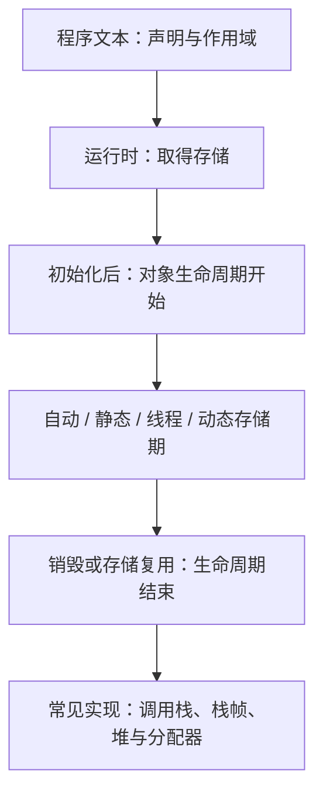

# 第 11 天：对象存储期、生命周期与栈堆模型

预计用时：160～190 分钟  
语言标准：C++17  
核心原则：先掌握 C++ 语言规则，再理解常见运行时实现

## 今日目标

学完本单元，你应该能够：

1. 分清对象、存储、作用域、存储期、生命周期和链接属性
2. 说出自动、静态、线程和动态四类存储期
3. 解释普通局部对象、函数参数、命名空间作用域对象和局部 `static` 对象何时获得存储、开始生存及结束生存
4. 解释递归中每次函数调用为什么拥有各自的参数和自动局部对象
5. 准确说明调用栈、栈帧、堆和自由存储区属于常见实现或工程术语，而不是 C++ 对象分类的替代品
6. 解释为什么名称离开作用域与对象生命周期结束不是永远同时发生
7. 识别未初始化自动标量对象的读取风险，并区分编译警告与语言规则
8. 识别对象生命周期结束后继续通过指针访问所造成的悬空访问
9. 使用严格警告和 AddressSanitizer 验证示例与错误实验

---

## 关键术语索引（正文可跳转）

> 本表用于查阅和复习，不要求在学习正文前逐项背诵。正文会在术语真正参与推导时直接解释，或链接到对应的完整定义。
>
> 点击第一列术语可跳到下方定义。表格只承担索引功能；目标仍是真正的 Markdown 六级标题。

| 术语（点击跳转） | 一句话直观解释 |
|---|---|
| [对象（object）](#术语-d11-01-对象) | 程序运行期间具有类型、存储和生命周期的实体 |
| [存储（storage）](#术语-d11-02-存储) | 用来容纳对象表示的内存区域或资源 |
| [存储期（storage duration）](#术语-d11-03-存储期) | 对象所占存储保持可用的时间类别 |
| [生命周期（lifetime）](#术语-d11-04-生命周期) | 对象作为该类型实体合法存在的时间区间 |
| [作用域（scope）](#术语-d11-05-作用域) | 一个名称可以被非限定使用的程序文本区域 |
| [链接属性（linkage）](#术语-d11-06-链接属性) | 不同作用域或翻译单元中的名称能否表示同一实体 |
| [自动存储期（automatic storage duration）](#术语-d11-07-自动存储期) | 普通块变量和函数参数通常具有的存储期 |
| [静态存储期（static storage duration）](#术语-d11-08-静态存储期) | 存储覆盖整个程序执行期间的类别 |
| [线程存储期（thread storage duration）](#术语-d11-09-线程存储期) | 每个线程拥有独立实体、存储覆盖该线程执行期间的类别 |
| [动态存储期（dynamic storage duration）](#术语-d11-10-动态存储期) | 通过动态存储分配机制取得和释放的存储类别 |
| [初始化（initialization）](#术语-d11-11-初始化) | 对象开始生存时建立其初始状态的过程 |
| [销毁（destruction）](#术语-d11-12-销毁) | 结束对象生命周期并执行所需清理的过程 |
| [块变量（block variable）](#术语-d11-13-块变量) | 声明在函数体或其他复合语句块中的变量 |
| [函数参数对象（parameter object）](#术语-d11-14-函数参数对象) | 每次函数调用按参数规则形成的参数实体 |
| [命名空间作用域对象](#术语-d11-15-命名空间作用域对象) | 由命名空间作用域变量定义产生的对象 |
| [局部静态对象（local static object）](#术语-d11-16-局部静态对象) | 名称在块内、但具有静态存储期的对象 |
| [调用栈（call stack）](#术语-d11-17-调用栈) | 常见实现中管理活动函数调用状态的后进先出结构 |
| [栈帧（stack frame）](#术语-d11-18-栈帧) | 常见实现为一次活动调用保存状态的区域 |
| [栈溢出（stack overflow）](#术语-d11-19-栈溢出) | 调用栈资源耗尽的常见运行故障 |
| [堆（heap）](#术语-d11-20-堆) | 常见实现中供动态分配器管理的一片内存区域 |
| [自由存储区（free store）](#术语-d11-21-自由存储区) | C++ 中由 `new`/`delete` 相关机制管理的动态存储概念 |
| [不确定值（indeterminate value）](#术语-d11-22-不确定值) | 某些未初始化对象表示对应的、不能按普通有效值读取的状态 |
| [悬空指针（dangling pointer）](#术语-d11-23-悬空指针) | 原目标生命周期结束后仍保留旧指向关系的指针 |
| [未定义行为（undefined behavior）](#术语-d11-24-未定义行为) | C++ 标准不对结果施加要求的行为 |

### 术语定义

###### 术语-d11-01-对象

**对象（object）**

- **新手先这样理解：** 程序运行时真正存在、能够保存状态的具体实体。
- **专业上更准确地说：** 对象是 C++ 抽象机中的存储区域，具有类型并处于一段生命周期内。变量定义经常创建对象，但对象不等同于名称；动态对象和临时对象可能没有普通变量名。

###### 术语-d11-02-存储

**存储（storage）**

- **新手先这样理解：** 对象存在时用来放置其表示的空间。
- **专业上更准确地说：** 存储是足以容纳对象表示并满足对齐要求的区域。获得存储不必然意味着某个特定类型对象的生命周期已经开始，存储可用时间与对象生命周期必须区分。

###### 术语-d11-03-存储期

**存储期（storage duration）**

- **新手先这样理解：** 对象所用空间能保持多久。
- **专业上更准确地说：** 存储期描述对象存储最短持续时间的类别。C++ 包含自动、静态、线程和动态存储期；它不是“变量在哪个大括号里可见”的同义词。

###### 术语-d11-04-生命周期

**生命周期（lifetime）**

- **新手先这样理解：** 某个对象作为这个类型的对象，什么时候开始存在、什么时候不再存在。
- **专业上更准确地说：** 对象生命周期是在满足存储和初始化等规则后开始、在销毁或存储被释放/复用等条件下结束的运行期区间。存储可以先于生命周期取得，也可能在对象生命周期结束后仍存在。

###### 术语-d11-05-作用域

**作用域（scope）**

- **新手先这样理解：** 源代码中可以直接写某个名称的范围。
- **专业上更准确地说：** 作用域是声明引入的名称可以按名称查找规则被使用的程序文本区域。它主要描述名称可见性，不直接决定所有对象的存储期或生命周期。

###### 术语-d11-06-链接属性

**链接属性（linkage）**

- **新手先这样理解：** 不同位置出现的同名名称能不能表示同一个实体。
- **专业上更准确地说：** 链接属性规定不同作用域或翻译单元中的声明所引入的名称能否表示同一实体。它与作用域、存储期和生命周期是不同维度，第 17 天系统学习。

###### 术语-d11-07-自动存储期

**自动存储期（automatic storage duration）**

- **新手先这样理解：** 进入相应块或调用时形成，离开时自动结束的普通局部存储类别。
- **专业上更准确地说：** 未声明为 `static`、`thread_local` 且不是动态分配的块变量通常具有自动存储期；函数参数也具有自动存储期。每次递归调用形成彼此独立的参数和自动对象。

###### 术语-d11-08-静态存储期

**静态存储期（static storage duration）**

- **新手先这样理解：** 存储从程序开始附近一直保持到程序结束。
- **专业上更准确地说：** 命名空间作用域变量、声明为 `static` 的块变量及其他规定实体具有静态存储期，其存储持续整个程序执行。初始化与销毁顺序另有规则，不能只凭“全局/局部”推断全部细节。

###### 术语-d11-09-线程存储期

**线程存储期（thread storage duration）**

- **新手先这样理解：** 每个线程各有一份，跟随该线程存在。
- **专业上更准确地说：** 声明为 `thread_local` 的实体具有线程存储期，每个线程拥有独立对象，其存储持续相应线程执行期间。线程初始化和销毁细节在第 35 天学习。

###### 术语-d11-10-动态存储期

**动态存储期（dynamic storage duration）**

- **新手先这样理解：** 程序运行时主动申请，并在适当时机释放的存储类别。
- **专业上更准确地说：** 通过动态存储分配函数取得的存储具有动态存储期，其持续时间由分配和释放操作决定。对象生命周期与底层存储持续时间仍不是同一个概念，第 12 天展开。

###### 术语-d11-11-初始化

**初始化（initialization）**

- **新手先这样理解：** 对象刚开始存在时建立初始状态。
- **专业上更准确地说：** 初始化是在对象生命周期开始相关过程中按初始化规则建立值或状态；它不是对象已经存在后的普通赋值。不同初始化形式在第 13、19 天继续补齐。

###### 术语-d11-12-销毁

**销毁（destruction）**

- **新手先这样理解：** 对象结束生存并完成必要清理。
- **专业上更准确地说：** 销毁会结束对象生命周期；类对象通常执行析构过程，标量对象没有用户可见的析构函数调用。完整析构与 RAII 在第 20 天学习。

###### 术语-d11-13-块变量

**块变量（block variable）**

- **新手先这样理解：** 声明在一对大括号形成的块里的变量。
- **专业上更准确地说：** 块变量是声明于块作用域的变量。它可以具有自动、静态或线程存储期，因此“局部变量”不能直接等同于“短生命周期栈变量”。

###### 术语-d11-14-函数参数对象

**函数参数对象（parameter object）**

- **新手先这样理解：** 每次调用函数时为按值参数形成的那份参数实体。
- **专业上更准确地说：** 非引用形参是函数调用期间的参数对象，通常具有自动存储期；引用形参不是对象，而是在调用时绑定到实参实体。参数初始化、复制移动和临时对象规则在后续补齐。

###### 术语-d11-15-命名空间作用域对象

**命名空间作用域对象**

- **新手先这样理解：** 由写在所有函数外、位于命名空间作用域的变量定义产生的对象。
- **专业上更准确地说：** 命名空间作用域变量定义产生的对象具有静态存储期，但其名称的链接属性还取决于声明形式。不能把“命名空间作用域”与“外部链接”直接画等号。

###### 术语-d11-16-局部静态对象

**局部静态对象（local static object）**

- **新手先这样理解：** 名称只在函数块内可用，但对象状态能跨调用保留。
- **专业上更准确地说：** 声明为 `static` 的块变量具有块作用域与静态存储期。其动态初始化通常在控制第一次经过声明时完成；若初始化成功，后续调用使用同一对象。

###### 术语-d11-17-调用栈

**调用栈（call stack）**

- **新手先这样理解：** 常见运行时按“后调用先返回”保存函数调用状态的结构。
- **专业上更准确地说：** 调用栈是许多 ABI 和实现用于维护返回地址、保存寄存器、参数及部分自动对象的机制。C++ 标准不要求每个自动对象必须物理位于栈内存中。

###### 术语-d11-18-栈帧

**栈帧（stack frame）**

- **新手先这样理解：** 一次活动函数调用在调用栈中对应的一份状态记录。
- **专业上更准确地说：** 栈帧是实现和 ABI 术语，通常容纳一次调用所需的返回信息、保存状态及部分局部存储。优化可能改变、合并或省略可观察不到的栈帧布局。

###### 术语-d11-19-栈溢出

**栈溢出（stack overflow）**

- **新手先这样理解：** 活动调用占用的栈资源超过运行环境限制。
- **专业上更准确地说：** 栈溢出是常见实现中的资源耗尽故障，可能由过深递归或过大的栈分配触发。C++ 不保证它表现为可捕获异常；可能终止或崩溃。

###### 术语-d11-20-堆

**堆（heap）**

- **新手先这样理解：** 常见运行时中供动态分配器管理的内存区域。
- **专业上更准确地说：** 堆是操作系统、运行库和分配器语境中的实现术语，其组织方式不由 C++ 标准固定。它不能代替语言中的动态存储期和对象生命周期概念。

###### 术语-d11-21-自由存储区

**自由存储区（free store）**

- **新手先这样理解：** C++ 通过 `new`/`delete` 相关机制管理动态存储时使用的概念。
- **专业上更准确地说：** 自由存储区通常指由全局分配函数及 `new`/`delete` 表达式体系管理的存储。实现经常从进程堆取得它，但“free store”和某个操作系统堆不必严格等同。

###### 术语-d11-22-不确定值

**不确定值（indeterminate value）**

- **新手先这样理解：** 对象没有获得可按普通有效值使用的初始状态。
- **专业上更准确地说：** 在 C++17 中，某些未初始化标量对象具有不确定值；对其执行通常的读取求值会导致未定义行为，少数无符号字符/字节场景存在特殊规则。编译器警告不是该规则成立的前提。

###### 术语-d11-23-悬空指针

**悬空指针（dangling pointer）**

- **新手先这样理解：** 指针还留着旧地址，但原对象已经结束生命周期。
- **专业上更准确地说：** 目标对象生命周期结束后，仍保留旧指向关系的指针通常称为悬空指针。通过它访问已经不存在的对象会违反生命周期规则；指针不会自动变为 `nullptr`。

###### 术语-d11-24-未定义行为

**未定义行为（undefined behavior）**

- **新手先这样理解：** 程序违反语言规则后，不能要求它稳定地产生某个结果。
- **专业上更准确地说：** 对未定义行为，C++ 标准不施加要求。编译器可基于“正确程序不会这样做”进行优化，因此看似可重复的实验结果也不能成为合法性依据。

---

## 一、完整知识地图



必须同时保留两层模型：

- C++ 语言层：作用域、存储期、生命周期、初始化、销毁、链接属性
- 常见实现层：调用栈、栈帧、寄存器、进程堆、内存分配器

实现层帮助理解运行和调试，但不能反过来替换语言规则。

---

## 二、范围标签

### 今天掌握

- 作用域、存储期、生命周期和链接属性是不同维度
- 自动、静态、线程、动态四类存储期
- 普通块变量、参数对象、命名空间作用域对象和局部静态对象
- 递归中每次调用形成独立参数和自动对象
- 调用栈/栈帧与自动存储期的关系边界
- 堆/自由存储区与动态存储期的关系边界
- 未初始化自动标量读取与生命周期结束后访问的风险

### 先看全貌

- 存储存在不等于某个类型对象的生命周期已经开始
- 名称不可见不等于对象一定已经销毁
- 局部变量不一定是自动存储期，自动对象也不保证物理放在栈上
- 指针保存旧地址不代表原对象仍然存活

### 后续深入

- 第 12 天：动态存储、`new`、`delete`、所有权和泄漏
- 第 13 天：初始化形式、`const`、`constexpr` 和转换
- 第 14 天：求值、不确定值细则、值类别和未定义行为
- 第 17 天：作用域、名称查找、链接属性、ODR、`static` 与 `extern`
- 第 18 天：调试器、警告和 Sanitizer 系统诊断
- 第 19～20 天：构造、析构和 RAII
- 第 35 天：`thread_local` 与线程生命周期

---

## 三、六个概念不能混为一谈

以这段代码为例：

```cpp
int next_value() {
    static int counter{};
    ++counter;
    return counter;
}
```

| 维度 | 对 `counter` 的说明 |
|---|---|
| [对象](#术语-d11-01-对象) | 一个类型为 `int` 的运行时实体 |
| [存储](#术语-d11-02-存储) | 容纳该 `int` 对象表示的区域 |
| [作用域](#术语-d11-05-作用域) | 名称 `counter` 只在函数内相应块可用 |
| [存储期](#术语-d11-03-存储期) | `static` 使其具有静态存储期 |
| [生命周期](#术语-d11-04-生命周期) | 初始化完成后开始，通常持续到程序终止阶段销毁 |
| [链接属性](#术语-d11-06-链接属性) | 块作用域名称通常没有链接；第 17 天展开 |

这证明：名称离开作用域后，局部静态对象仍然可以继续存活。下一次调用重新进入作用域时，同一个名称再次表示同一个对象。

---

## 四、对象生命周期如何开始和结束

对本阶段学习的普通对象，可以建立以下准确第一层模型：

1. 先取得足够大小并满足对齐要求的存储
2. 按相应规则完成[初始化](#术语-d11-11-初始化)
3. 对象生命周期开始，可以按其类型规则使用
4. 到达规定时机后发生[销毁](#术语-d11-12-销毁)或存储被释放/复用
5. 对象生命周期结束，不能继续把旧地址当作该对象访问

语言中存在隐式创建、联合体成员、原始存储和透明可替换等更细例外。它们将在对象模型深入阶段处理，今天不能把第一层模型误称为覆盖全部低层规则。

### 初始化不是赋值

```cpp
int value{10};  // 初始化
value = 20;     // 赋值
```

初始化建立对象初始状态；赋值改变一个已经处于生命周期内的对象。两者发生时机和语言规则不同。

---

## 五、自动存储期：普通块变量与函数参数

```cpp
void automatic_demo() {
    int counter{};
    ++counter;
    std::cout << counter << '\n';
}
```

`counter` 是[块变量](#术语-d11-13-块变量)，没有 `static` 或 `thread_local`，因此具有[自动存储期](#术语-d11-07-自动存储期)。每次调用都会形成一个新的 `counter` 对象，初始化为 0，再变为 1。

连续调用两次：

```cpp
automatic_demo();
automatic_demo();
```

输出：

```text
1
1
```

第二次不是复用第一次对象的值；第一次对象的生命周期已经在调用离开相应块时结束。

### 函数参数

```cpp
void inspect(int depth) {
}
```

按值形参 `depth` 是本次调用的[函数参数对象](#术语-d11-14-函数参数对象)，具有自动存储期。引用形参则不是参数对象，而是在调用时绑定实参。

---

## 六、递归：每次调用都有独立对象

```cpp
void recursive_trace(int depth) {
    int marker{depth};
    std::cout << "enter: " << marker << '\n';

    if (depth > 0) {
        recursive_trace(depth - 1);
    }

    std::cout << "leave: " << marker << '\n';
}
```

调用 `recursive_trace(2)` 时，运行期间同时存在三次活动调用：

| 调用层 | 参数对象 `depth` | 自动对象 `marker` |
|---|---:|---:|
| 外层 | 2 | 2 |
| 中层 | 1 | 1 |
| 内层 | 0 | 0 |

输出顺序：

```text
enter: 2
enter: 1
enter: 0
leave: 0
leave: 1
leave: 2
```

内层返回后，中层自己的 `marker` 仍保持 1。这不是同一个局部对象被反复覆盖，而是每次调用各有独立对象。

常见实现通过[调用栈](#术语-d11-17-调用栈)和[栈帧](#术语-d11-18-栈帧)保存这些活动状态。递归过深可能造成[栈溢出](#术语-d11-19-栈溢出)，但 C++ 不保证一定抛出某种异常，也不保证编译器执行尾调用优化。

---

## 七、静态存储期：命名空间对象与局部 `static`

### 7.1 命名空间作用域对象

```cpp
int namespace_counter{100};
```

这是[命名空间作用域对象](#术语-d11-15-命名空间作用域对象)，具有[静态存储期](#术语-d11-08-静态存储期)。它的存储覆盖整个程序执行期。

注意：具有静态存储期不等于名称必然具有外部链接。`const`、`static`、未命名命名空间和 `inline` 等会影响名称规则，第 17 天正式学习。

### 7.2 局部静态对象

```cpp
int next_static_value() {
    static int counter{};
    ++counter;
    return counter;
}
```

`counter` 是[局部静态对象](#术语-d11-16-局部静态对象)：

- 名称作用域局限在函数块
- 存储期是静态存储期
- 初始化成功后，后续调用使用同一对象

两次调用输出 1、2，而不是 1、1。

自 C++11 起，函数局部静态对象的初始化在多线程并发首次进入时具有线程安全保证；初始化顺序、异常重试和销毁顺序的完整规则在第 17、20、35 天继续学习。

---

## 八、线程存储期先看全貌

```cpp
thread_local int per_thread_counter{};
```

`thread_local` 对象具有[线程存储期](#术语-d11-09-线程存储期)。每个线程拥有各自的对象，存储持续相应线程执行期间。

今天只需把它放入四类存储期地图，不编写并发程序。线程创建、数据竞争和同步在第 35 天学习。

---

## 九、动态存储期、自由存储区与堆

预览代码：

```cpp
int* pointer{new int{42}};
delete pointer;
pointer = nullptr;
```

`new int{42}` 涉及取得[动态存储期](#术语-d11-10-动态存储期)的存储并创建对象；`delete` 结束相应对象生命周期并释放匹配存储。完整规则、数组形式、失败处理和所有权在第 12 天学习。

### “堆”与“自由存储区”不是同一层术语

| 术语 | 所在层次 | 准确用法 |
|---|---|---|
| [堆](#术语-d11-20-堆) | 操作系统/运行库/分配器实现 | 常见动态内存区域，结构不由 C++ 固定 |
| [自由存储区](#术语-d11-21-自由存储区) | C++ 工程与分配机制语境 | 与 `new`/`delete` 和分配函数体系相关 |
| 动态存储期 | C++ 语言规则 | 描述动态分配存储的持续时间类别 |

日常说“堆对象”通常能沟通，但精确分析时应说“具有动态存储期的对象”，并继续说明由谁拥有、何时销毁和释放。

---

## 十、为什么“局部变量都在栈上”不准确

```cpp
void example() {
    int automatic_value{};
    static int static_value{};
}
```

两个名称都位于块作用域，但：

- `automatic_value` 具有自动存储期
- `static_value` 具有静态存储期

常见编译器可能把 `automatic_value` 放在栈帧、寄存器中，或在不影响可观察行为时完全优化掉。C++ 标准规定它的语言语义，不规定必须拥有某个可见栈偏移。

因此优先使用：

- 自动存储期对象
- 静态存储期对象
- 动态存储期对象

仅在分析 ABI、汇编、调试器或运行资源时再使用“栈上/堆上”。

---

## 十一、作用域结束与生命周期结束

普通自动块变量常表现为二者同时发生：

```cpp
{
    int local{42};
}  // 名称离开作用域，对象生命周期结束
```

但局部静态对象证明它们并非同义词：

```cpp
void function() {
    static int persistent{};
}
```

函数返回后，名称 `persistent` 在函数外不可使用，但对象仍然存活。下一次调用会再次通过该名称访问同一个对象。

链接属性也是独立维度：名称能否跨作用域或翻译单元表示同一实体，不由对象是否仍存活单独决定。

---

## 十二、未初始化自动标量对象

```cpp
int measurement;
std::cout << measurement << '\n';
```

这里没有初始化 `measurement`。在本课程采用的 C++17 规则下，它具有[不确定值](#术语-d11-22-不确定值)，对其进行这种普通读取会导致[未定义行为](#术语-d11-24-未定义行为)。

不能说“它一定是随机数”或“它一定是上次内存残留”：这些都不是语言保证。

用 GCC 测试警告：

```bash
g++ -std=c++17 -O2 -Wall -Wextra -Wpedantic \
    examples/day-11/uninitialized_read.cpp \
    -o build/day-11/uninitialized_read
```

当前 GCC 通常报告 `used uninitialized`。警告由实现和优化分析决定；即使某次没有警告，读取仍不会因此变得合法。不要运行这个故意包含未定义行为的程序来“观察它是什么值”。

---

## 十三、生命周期结束后的悬空访问

```cpp
int* dangling{nullptr};

{
    int local_value{42};
    dangling = &local_value;
}

std::cout << *dangling << '\n';
```

离开内部块后，`local_value` 生命周期结束，但 `dangling` 不会自动变为 `nullptr`，它成为[悬空指针](#术语-d11-23-悬空指针)。解引用并读取旧对象违反生命周期规则。

使用 AddressSanitizer：

```bash
g++ -std=c++17 -O1 -g -Wall -Wextra -Wpedantic \
    -fsanitize=address -fsanitize-address-use-after-scope \
    -fno-omit-frame-pointer \
    examples/day-11/use_after_scope.cpp \
    -o build/day-11/use_after_scope_san

./build/day-11/use_after_scope_san
```

支持该检测的环境应报告 `stack-use-after-scope` 或相关错误，并非零退出。报告中的 “stack” 是 Sanitizer 针对当前实现观察到的存放位置；语言层根因是对象生命周期已经结束。

---

## 十四、完整示例

源文件：[storage_lifetime_demo.cpp](../examples/day-11/storage_lifetime_demo.cpp)

构建并运行：

```bash
mkdir -p build/day-11

g++ -std=c++17 -Wall -Wextra -Wpedantic \
    examples/day-11/storage_lifetime_demo.cpp \
    -o build/day-11/storage_lifetime_demo

./build/day-11/storage_lifetime_demo
```

预期输出：

```text
namespace counter: 100
namespace counter: 101
automatic counter: 1
automatic counter: 1
static counter: 1
static counter: 2
enter: 2
enter: 1
enter: 0
leave: 0
leave: 1
leave: 2
```

这组输出同时验证：

- 命名空间作用域对象状态可持续
- 自动局部对象在每次调用中重新形成
- 局部静态对象跨调用保留状态
- 递归每层调用拥有独立参数与自动局部对象

---

## 十五、构建链路中的位置

存储期和生命周期主要描述程序运行语义，但相关错误可在不同阶段暴露：

| 现象 | 典型阶段 |
|---|---|
| 使用未声明或超出作用域的名称 | 狭义编译 |
| 未初始化读取被静态分析发现 | 狭义编译警告 |
| 目标文件间重复定义 | 链接，第 17 天深入 |
| 悬空访问被 ASan 捕获 | 运行期检测 |
| 递归资源耗尽 | 运行期/运行环境 |

完整构建仍是：

```text
源文件 → 预处理 → 狭义编译 → 汇编 → 目标文件
→ 链接 → 可执行文件 → 装载与运行库启动 → main
```

“编译器没报错”只能说明相应静态检查没有阻止构建，不能证明所有运行路径的生命周期都合法。

---

## 十六、常见工程陷阱

### 陷阱 1：把变量定义成“带名字的内存格”后就停止

变量是名称与实体声明关系；对象还具有类型、存储期和生命周期。动态对象甚至可能没有普通变量名。

### 陷阱 2：把作用域当作生命周期

局部静态对象名称离开作用域后，对象仍存活。

### 陷阱 3：把生命周期当作存储期

存储可能已取得但对象尚未开始生存，也可能在对象生命周期结束后被复用。

### 陷阱 4：说所有局部变量都在栈上

局部 `static` 不是自动存储期；自动对象也可能被放入寄存器或优化掉。

### 陷阱 5：说 `static` 只是“让变量一直存在”

`static` 在不同上下文还影响存储期、链接属性或类成员性质。今天仅在块变量和命名空间变量相关位置建立部分模型，第 17、19 天继续。

### 陷阱 6：认为指针不为 `nullptr` 就一定有效

悬空指针通常仍是非空值，但原对象生命周期已经结束。

### 陷阱 7：把编译警告当作语言规则

警告可能受编译器、选项和优化级别影响；未定义行为规则不依赖编译器是否提醒。

### 陷阱 8：运行一次“正常”就认为未初始化读取可用

未定义行为没有稳定结果保证。

### 陷阱 9：认为递归只重复执行同一个局部对象

每次活动调用有独立参数和自动对象。

### 陷阱 10：把堆等同于所有动态资源

动态资源还包括文件、互斥量、套接字等；堆只是一类内存实现概念，RAII 在第 20 天学习。

---

## 十七、不要形成的十个新误解

1. 名称不是对象本身，名称不可见也不等于对象一定已经销毁
2. 作用域、存储期、生命周期和链接属性不是同义词
3. “局部”描述声明位置，不直接等于自动存储期
4. 自动存储期不保证对象物理位于调用栈
5. 静态存储期不自动等于外部链接
6. 动态存储期不等于对象可以永远不释放
7. 堆不是 C++ 语言规定的唯一动态存储结构
8. 指针非空不等于指向的对象仍在生命周期内
9. 编译器没有警告不等于未初始化读取合法
10. 栈溢出不保证表现为可捕获的标准异常

---

## 十八、随堂练习

1. 对一个普通局部变量、局部 `static` 变量和命名空间变量分别填写作用域、存储期和生命周期。
2. 修改主示例，让自动计数器接收初值，验证每次调用仍形成独立对象。
3. 把递归深度改为 3，先预测再核对进入/离开顺序。
4. 编译未初始化读取实验，记录警告但不要运行故意的未定义行为程序。
5. 用 ASan 运行悬空访问实验，并解释报告中的实现术语与语言层根因。

完整作答见：[第 11 天练习单](../exercises/day-11.md)。

---

## 十九、本单元偿还与新增的知识缺口

### 本次部分补全

- `G06`：补充名称、对象、存储、值、存储期和生命周期的关系；对象表示和构造细节仍由第 13、19 天补齐
- `G11`：完整区分作用域、存储期和生命周期；链接属性细则仍由第 17 天补齐
- `G14`：明确 C++17 下未初始化自动标量的普通读取风险及警告边界；未定义行为与工具体系仍由第 14、18 天深化
- `G15`：建立四类存储期，并区分调用栈/堆等实现术语；动态存储管理由第 12 天补齐
- `G18`：补充递归每次调用的参数/自动对象与常见栈资源限制；调试方法和尾调用不保证由第 18 天继续
- `G26`：补充对象生命周期和存储基础；构造析构、特殊成员与多态仍由第 19～24 天补齐
- `G27`：补充指针有效性依赖对象生命周期及悬空风险；所有权、限定转换和智能指针仍在后续补齐

### 明确暂缓

- 动态存储分配与所有权：第 12、20、23 天
- 完整初始化、对象表示和转换：第 13～14 天
- 链接属性、静态初始化顺序和 ODR：第 17 天
- 构造、析构、RAII 和对象生命周期高级规则：第 19～22 天
- 线程存储期的并发语义：第 35 天

---

## 二十、今日完成标准

不看讲义时能够完成以下事项，才算第 11 天达标：

- 用自己的话区分对象、名称、存储、作用域、存储期、生命周期和链接属性
- 列出四类存储期并各举一个例子
- 解释普通自动局部对象为何每次调用重新形成
- 解释局部静态对象为何名称局部但状态跨调用保留
- 跟踪递归三层调用中各自的参数和自动对象
- 准确说明调用栈、栈帧、堆与自由存储区的术语层次
- 解释为什么“所有局部变量都在栈上”不准确
- 解释未初始化自动 `int` 的普通读取为何不能靠实验值判断
- 解释空指针与悬空指针的区别
- 使用 ASan 复现并解释 `stack-use-after-scope`
- 完成并同步第 11 天练习单

下一单元：动态存储、`new`、`delete` 与所有权问题。
