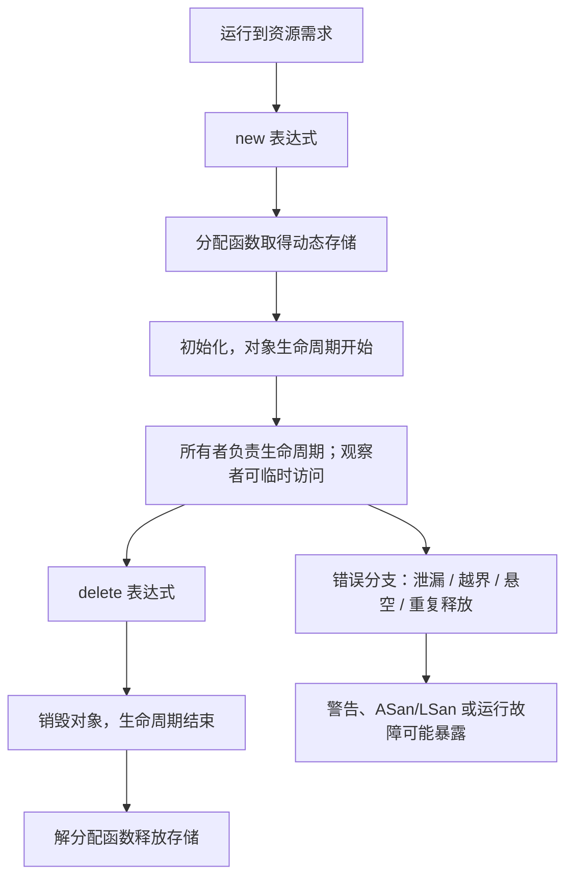

# 第12天-动态存储、手动释放与所有权

> 语言标准：C++17  
> 建议用时：120 分钟  
> 前置单元：第 10 天地址与指针、第 11 天存储期与生命周期

## 今日目标

完成本单元后，你应能准确解释 `new` 表达式和 `delete` 表达式各自完成什么，正确匹配单对象/数组形式，并沿着所有权关系识别内存泄漏、悬空指针、释放后使用、重复释放和越界风险。今天学习手动管理，是为了看清资源问题的根因，而不是鼓励在工程中优先使用裸 `new`。

## 关键术语索引

索引只用于查阅和复习，不替代正文教学；不必先背完再继续。

| 可点击术语 | 一句话直观解释 |
|---|---|
| [动态存储期](#术语-d12-01-动态存储期) | 动态取得的存储持续到显式释放或程序结束，不跟某个块自动同步结束。 |
| [动态分配](#术语-d12-02-动态分配) | 程序运行时向分配机制请求一段满足大小和对齐要求的存储。 |
| [new 表达式](#术语-d12-03-new表达式) | 取得存储、创建并初始化对象，成功后产生指向对象的指针。 |
| [分配函数](#术语-d12-04-分配函数) | `new` 表达式用于取得原始存储的底层函数机制。 |
| [delete 表达式](#术语-d12-05-delete表达式) | 结束目标对象生命周期并把匹配存储交还给释放机制。 |
| [解分配](#术语-d12-06-解分配) | 把先前动态取得的存储归还给相匹配的分配机制。 |
| [所有权](#术语-d12-07-所有权) | 约定谁负责确保资源最终且仅被释放一次。 |
| [所有者](#术语-d12-08-所有者) | 当前承担资源释放责任的对象或程序角色。 |
| [观察者](#术语-d12-09-观察者) | 可以访问资源但不负责延长其生命周期或释放它的角色。 |
| [别名](#术语-d12-10-别名) | 多个表达式或指针值可以表示同一对象。 |
| [内存泄漏](#术语-d12-11-内存泄漏) | 动态存储仍被占用，却已没有可执行的正确释放路径。 |
| [悬空指针](#术语-d12-12-悬空指针) | 指针仍保存旧地址，但目标对象的生命周期已经结束。 |
| [释放后使用](#术语-d12-13-释放后使用) | 对象已销毁和释放后，仍通过旧指针访问它。 |
| [重复释放](#术语-d12-14-重复释放) | 对同一次分配所得存储执行超过一次释放操作。 |
| [匹配释放](#术语-d12-15-匹配释放) | 分配形式和释放形式必须按语言规则成对。 |
| [数组 new 表达式](#术语-d12-16-数组new表达式) | 使用 `new T[n]` 创建一组动态数组元素。 |
| [数组 delete 表达式](#术语-d12-17-数组delete表达式) | 使用 `delete[]` 销毁动态数组元素并释放匹配存储。 |
| [空指针](#术语-d12-18-空指针) | 明确不指向任何对象或函数的指针值。 |
| [未定义行为](#术语-d12-19-未定义行为) | 程序违反规则后，C++ 标准不再约束其结果。 |
| [异常安全](#术语-d12-20-异常安全) | 即使操作因异常中断，程序仍维持承诺的状态和资源约束。 |
| [RAII](#术语-d12-21-raii) | 把资源所有权绑定到对象生命周期，以自动执行清理。 |

###### 术语-d12-01-动态存储期

**动态存储期（dynamic storage duration，C++ 标准术语）**

- **新手先这样理解：** 它不因创建指针的代码块结束而自动释放。
- **专业上更准确地说：** 通过动态分配函数取得的存储具有动态存储期；它从分配成功开始持续到由相应解分配函数释放。指向它的局部指针可以先结束生命周期，两者不是同一个对象。

###### 术语-d12-02-动态分配

**动态分配（dynamic allocation，语言/运行库机制术语）**

- **新手先这样理解：** 程序运行到需要时才请求存储。
- **专业上更准确地说：** 分配函数按请求的大小和对齐取得原始存储；取得存储不必然等同于某个对象已经初始化并开始生命周期，`new` 表达式还会继续创建对象。

###### 术语-d12-03-new表达式

**new 表达式（new-expression，C++ 标准术语）**

- **新手先这样理解：** 它创建动态对象，并给出访问该对象的指针。
- **专业上更准确地说：** 普通 `new T(args)` 表达式调用合适的分配函数取得存储，在该存储中按 new-initializer 初始化 `T` 对象；成功时结果是指向该对象的指针。分配失败或初始化抛出异常时有相应失败与清理规则。

###### 术语-d12-04-分配函数

**分配函数（allocation function，C++ 标准术语）**

- **新手先这样理解：** 它负责找存储，不负责表达完整的对象创建意图。
- **专业上更准确地说：** `operator new`/`operator new[]` 是由 new 表达式调用以取得存储的可替换或重载函数；它们与 new 表达式不是同一个概念。

###### 术语-d12-05-delete表达式

**delete 表达式（delete-expression，C++ 标准术语）**

- **新手先这样理解：** 它先让对象结束，再归还对应存储。
- **专业上更准确地说：** 对合法操作数，delete 表达式调用对象析构函数（若适用），再调用匹配的解分配函数。对空指针值执行 delete 表达式没有效果；对不合规指针执行则可能为未定义行为。

###### 术语-d12-06-解分配

**解分配（deallocation，C++ 标准术语）**

- **新手先这样理解：** 把动态取得的存储还回去。
- **专业上更准确地说：** 解分配函数 `operator delete`/`operator delete[]` 接收适当指针并释放相匹配的动态存储。对象销毁与存储解分配概念不同，虽然 delete 表达式通常按顺序组织两者。

###### 术语-d12-07-所有权

**所有权（ownership，通行的 C++ 设计术语，不是原始指针类型属性）**

- **新手先这样理解：** 谁承诺最后清理资源，谁就承担所有权责任。
- **专业上更准确地说：** 所有权描述负责控制资源生命周期并确保按协议释放的设计关系。`int*` 的类型本身不记录它是拥有、借用还是观察；必须由接口约定或所有权类型表达。

###### 术语-d12-08-所有者

**所有者（owner，工程设计术语）**

- **新手先这样理解：** 它是当前负责清理的人。
- **专业上更准确地说：** 所有者持有或控制足以执行正确释放的信息，并必须保证责任被履行或明确转移。唯一所有权意味着某一时刻只有一个负责释放的角色。

###### 术语-d12-09-观察者

**观察者（observer，工程设计术语）**

- **新手先这样理解：** 它能看或用资源，但不能决定资源活多久。
- **专业上更准确地说：** 观察者持有非拥有访问关系；其合法使用前提是被观察资源仍在生命周期内。观察者不能单凭原始指针判断目标是否已经销毁。

###### 术语-d12-10-别名

**别名（alias，语言/分析术语）**

- **新手先这样理解：** 不同指针可能最终指向同一个对象。
- **专业上更准确地说：** 当多个表达式或指针值表示同一存储位置或对象时，存在别名关系。改变一个指针对象的值不会自动改变其他指针对象保存的值。

###### 术语-d12-11-内存泄漏

**内存泄漏（memory leak，工程诊断术语）**

- **新手先这样理解：** 存储还占着，却找不到正确归还它的办法。
- **专业上更准确地说：** 程序失去对动态分配存储执行匹配解分配的可达路径，或在要求的资源生命周期内未执行释放，构成泄漏。进程终止后操作系统回收地址空间不等于程序资源管理正确。

###### 术语-d12-12-悬空指针

**悬空指针（dangling pointer，C++ 通行术语）**

- **新手先这样理解：** 地址数字还在，但那个对象已经不存在。
- **专业上更准确地说：** 指针指向的对象生命周期已结束，或相应存储已失效时，该指针处于悬空状态；非空并不证明它可解引用。

###### 术语-d12-13-释放后使用

**释放后使用（use-after-free，安全与诊断术语）**

- **新手先这样理解：** 归还存储后又把旧地址当成原对象使用。
- **专业上更准确地说：** 动态对象生命周期结束且存储解分配后，经由悬空指针读取、写入或调用对象成员通常违反生命周期与指针有效性规则，导致未定义行为。

###### 术语-d12-14-重复释放

**重复释放（double free / double delete，安全与诊断术语）**

- **新手先这样理解：** 同一份存储被归还两次。
- **专业上更准确地说：** 第一次匹配释放后，旧指针不再是可再次传给相应 delete 表达式的合法对象指针；再次释放会导致未定义行为，并可能破坏分配器状态。

###### 术语-d12-15-匹配释放

**匹配释放（matching allocation/deallocation，规则描述）**

- **新手先这样理解：** 怎么申请，就用对应形式归还。
- **专业上更准确地说：** 单对象 new 表达式所得指针必须交给适当的 `delete`，数组 new 表达式所得指针必须交给 `delete[]`；还必须满足指针来源、类型相容性等规则。形式不匹配会导致未定义行为。

###### 术语-d12-16-数组new表达式

**数组 new 表达式（array new-expression，C++ 标准术语）**

- **新手先这样理解：** 它创建指定数量的动态数组元素。
- **专业上更准确地说：** `new T[n]` 取得足以容纳数组及实现所需开销的存储，并按初始化规则创建 `n` 个 `T` 元素；结果指针指向首元素，而不是携带长度的容器对象。

###### 术语-d12-17-数组delete表达式

**数组 delete 表达式（array delete-expression，C++ 标准术语）**

- **新手先这样理解：** 它与数组 new 表达式配对，结束各元素并释放整段存储。
- **专业上更准确地说：** `delete[] pointer` 对由匹配数组 new 表达式产生的数组执行元素销毁并调用相应数组解分配函数；不能替换为普通 `delete`。

###### 术语-d12-18-空指针

**空指针（null pointer，C++ 标准术语）**

- **新手先这样理解：** 它明确表示“现在不指向对象”。
- **专业上更准确地说：** 空指针值与任何对象或函数指针值比较都不相等。`nullptr` 是 C++ 的空指针字面量；对空指针执行 `delete` 或 `delete[]` 没有效果，但解引用空指针是未定义行为。

###### 术语-d12-19-未定义行为

**未定义行为（undefined behavior，C++ 标准术语）**

- **新手先这样理解：** 违反规则后，不能要求程序稳定报错或输出某个值。
- **专业上更准确地说：** 对未定义行为，C++ 标准不施加要求；编译器和运行环境没有义务检测。一次看似正常的运行不能证明代码合法。

###### 术语-d12-20-异常安全

**异常安全（exception safety，C++ 设计术语）**

- **新手先这样理解：** 中途失败时也不能把资源遗忘或把状态破坏掉。
- **专业上更准确地说：** 操作在异常传播时仍满足约定的不变量和资源保证；常见保证层级与异常传播在第 32 天深入，今天只识别裸资源跨越可能抛出操作的风险。

###### 术语-d12-21-raii

**RAII（Resource Acquisition Is Initialization，C++ 设计惯用法）**

- **新手先这样理解：** 让一个对象活着时拥有资源，对象结束时自动清理。
- **专业上更准确地说：** RAII 把资源获取与对象初始化关联，把释放写入析构过程，从而利用作用域展开和对象生命周期保证清理。第 20 天学习析构与 RAII，第 23 天学习智能指针。

---

## 一、完整知识地图



这张图有三条必须同时保留的线：

1. 对象线：初始化 → 生命周期开始 → 使用 → 销毁 → 生命周期结束
2. 存储线：动态分配 → 动态存储期 → 解分配
3. 责任线：建立所有权 → 合法观察/转移 → 最终且仅一次释放

`new`/`delete` 不是“申请地址/清空地址”的简写；所有权也不是地址本身携带的属性。

## 二、范围标签

### 今天掌握

- 单对象 `new`、`delete` 与数组 `new[]`、`delete[]` 的真实作用和匹配规则
- 动态对象、动态存储和保存地址的指针对象是不同实体
- 原始指针所有者、观察者与别名关系
- 泄漏、悬空、释放后使用、重复释放、形式不匹配和动态数组越界
- `delete nullptr` 的规则和“置空一个指针不能修复所有别名”
- 使用 AddressSanitizer 复现动态存储错误

### 先看全貌

- 普通抛出式 `new` 分配失败会抛出 `std::bad_alloc`
- 对象构造抛出时，new 表达式会按规则释放刚取得的存储
- 分配函数可以替换、重载，还存在 placement new
- 非内存资源也需要所有权与释放协议

### 后续深入

- 第 13～14 天：转换、表达式求值和未定义行为边界
- 第 18 天：Sanitizer、调试器和泄漏检测工具体系
- 第 19～20 天：构造、析构、异常路径与 RAII
- 第 21～22 天：拥有资源的类如何复制和移动
- 第 23 天：`unique_ptr`、`shared_ptr`、`weak_ptr` 表达所有权
- 第 28 天：用标准容器替代手写动态数组，学习迭代器失效
- 第 32 天：异常传播与异常安全保证

---

## 三、`new` 表达式创建对象，不只是“找内存”

先建立可复述的直觉：[`new` 表达式](#术语-d12-03-new表达式)会为对象取得存储、初始化对象，并产生访问该对象的指针。

专业上，它通常包含：

1. 通过适当的[分配函数](#术语-d12-04-分配函数)执行[动态分配](#术语-d12-02-动态分配)
2. 在取得的存储中初始化指定类型对象，使对象生命周期开始
3. 成功时产生指向该对象的指针值

```cpp
int* pointer{new int{42}};
```

这里至少有两个不同对象：

| 实体 | 类型 | 常见存储期 | 当前值/状态 |
|---|---|---|---|
| 局部指针对象 `pointer` | `int*` | 自动存储期 | 保存动态 `int` 对象的地址 |
| 动态创建的对象 | `int` | [动态存储期](#术语-d12-01-动态存储期) | 值为 42，生命周期已开始 |

局部指针离开作用域不会自动 `delete` 它指向的对象。指针和值指向的对象必须分开追踪。

### 分配失败先看全貌

普通抛出式 `new` 无法取得存储时会抛出 `std::bad_alloc`；使用 `std::nothrow` 的形式会返回空指针。今天不编写失败恢复策略，第 32 天结合异常深入。不要把“`new` 只会返回 `nullptr`”当作普通形式的规则。

---

## 四、`delete` 表达式包含销毁与解分配

直观上，[`delete` 表达式](#术语-d12-05-delete表达式)先结束对象，再归还匹配存储。

```cpp
delete pointer;
pointer = nullptr;
```

专业上，对合法的单对象 new 结果执行 `delete pointer` 时：

1. 对象析构函数被调用（若类型需要），对象生命周期结束
2. 匹配的[解分配](#术语-d12-06-解分配)函数释放存储
3. `pointer` 这个指针对象仍存在，其值不会由 `delete` 自动改为 `nullptr`

随后赋值 `pointer = nullptr`，改变的是指针对象的值，不是再次销毁目标对象。[空指针](#术语-d12-18-空指针)可作为“当前没有目标”的显式状态；`delete nullptr` 没有效果。

这不意味着“释放后置空”能普遍修复设计。它只改变一个指针对象，其他别名仍可能悬空。

---

## 五、所有权是责任，不是裸指针类型属性

先用一句话区分：[`所有权`](#术语-d12-07-所有权)回答“谁负责最终释放”，指针只回答“当前保存了什么指针值”。

```cpp
int* owner{new int{42}};
int* observer{owner};
```

- [`所有者`](#术语-d12-08-所有者) `owner` 承担本例中的释放责任
- [`观察者`](#术语-d12-09-观察者) `observer` 只在目标仍存活时访问
- 两个指针保存同一对象地址，形成[别名](#术语-d12-10-别名)

但它们的 C++ 类型完全相同，都是 `int*`。编译器不能从类型判断哪个名字代表拥有者。这就是裸指针接口容易含糊的根因。

### 释放后的真实状态

```cpp
delete owner;
owner = nullptr;
```

状态变为：

| 项目 | 状态 |
|---|---|
| 动态 `int` 对象 | 生命周期已结束 |
| 对应动态存储 | 已释放 |
| `owner` | 空指针 |
| `observer` | 仍保存旧值，是[悬空指针](#术语-d12-12-悬空指针) |

所以不能把“对 owner 置空”描述成“所有指向它的指针自动失效并置空”。C++ 没有这种传播机制。

---

## 六、五类手动管理错误

### 6.1 内存泄漏

直观上，[内存泄漏](#术语-d12-11-内存泄漏)是存储仍占用，却丢失了正确释放路径。

```cpp
int* pointer{new int{42}};
pointer = new int{99}; // 第一次分配的地址丢失
delete pointer;        // 只释放第二次分配
```

进程退出时操作系统通常会回收地址空间，这是常见操作系统行为，不会让长期运行程序、循环请求或其他资源的泄漏变得正确。

### 6.2 释放后使用

[`释放后使用`](#术语-d12-13-释放后使用)指通过旧地址继续访问已结束生命周期的对象：

```cpp
int* owner{new int{42}};
int* alias{owner};
delete owner;
owner = nullptr;
return *alias; // 未定义行为
```

`alias` 非空仍不合法。其根因是对象已不存在，而不是地址数字是否为 0。

### 6.3 重复释放

[`重复释放`](#术语-d12-14-重复释放)把同一次分配所得存储交还两次：

```cpp
int* pointer{new int{42}};
delete pointer;
delete pointer; // 未定义行为
```

第一次以后 `pointer` 保存的是旧值。第二次 delete 不会自动识别“已经释放过”。

### 6.4 分配与释放形式不匹配

[`匹配释放`](#术语-d12-15-匹配释放)要求单对象和数组形式正确成对：

| 分配 | 正确释放 |
|---|---|
| `new T{...}` | `delete pointer;` |
| `new T[n]{...}` | `delete[] pointer;` |

把 `new[]` 的结果交给普通 `delete` 是[未定义行为](#术语-d12-19-未定义行为)，即使 `T` 是 `int`、某次运行没有崩溃也不合法。

### 6.5 动态数组越界

```cpp
int* values{new int[3]{1, 2, 3}};
int invalid{values[3]}; // 越界；合法下标只有 0、1、2
delete[] values;
```

原始指针不保存可供语言自动检查的元素数量。第 7 天的半开区间规则仍成立；第 28 天用标准容器和迭代器系统化处理范围。

---

## 七、动态数组：`new[]` 必须配对 `delete[]`

[`数组 new 表达式`](#术语-d12-16-数组new表达式)创建动态数组元素：

```cpp
constexpr std::size_t count{3};
int* samples{new int[count]{4, 8, 12}};
```

表达式结果指向首元素，但指针类型仍是 `int*`，不会自动携带 `count`。因此长度必须由其他可靠方式维护。

[`数组 delete 表达式`](#术语-d12-17-数组delete表达式)与它配对：

```cpp
delete[] samples;
samples = nullptr;
```

对于类类型数组，销毁还要涉及每个元素的析构。完整析构顺序在第 20 天学习。工程代码通常优先 `std::vector<T>`、`std::array<T, N>` 或拥有数组的智能指针，而不是手写 `new[]`。

---

## 八、完整安全示例与执行跟踪

源文件：[dynamic_storage_demo.cpp](../examples/day-12/dynamic_storage_demo.cpp)

```bash
mkdir -p build/day-12

g++ -std=c++17 -Wall -Wextra -Wpedantic \
    examples/day-12/dynamic_storage_demo.cpp \
    -o build/day-12/dynamic_storage_demo

./build/day-12/dynamic_storage_demo
```

预期输出：

```text
single: 42
updated through owner: 55
array total: 24
```

关键状态顺序：

1. `owner` 保存动态 `int` 地址，`observer` 成为非拥有别名
2. 经 `owner` 写入 55，经 `observer` 读取也看到同一对象的 55
3. `delete owner` 后对象生命周期结束、存储释放；两个本地指针随即显式置空
4. `new int[count]{...}` 创建 3 个数组元素
5. `delete[] samples` 完成匹配释放
6. 最后的 `delete owner` 操作数为空指针，因此没有效果

示例刻意手动管理以展示协议。工程上更好的接口会用对象类型表达所有权，让清理不依赖每条控制路径都记得写 `delete`。

---

## 九、错误实验：让 Sanitizer 捕获真实问题

### 9.1 释放后使用

源文件：[use_after_free.cpp](../examples/day-12/use_after_free.cpp)

```bash
g++ -std=c++17 -O1 -g -Wall -Wextra -Wpedantic \
    -fsanitize=address,undefined -fno-omit-frame-pointer \
    examples/day-12/use_after_free.cpp \
    -o build/day-12/use_after_free_san

./build/day-12/use_after_free_san
```

支持 ASan 的环境应报告 `heap-use-after-free` 并以非零状态退出。

### 9.2 重复释放

源文件：[double_delete.cpp](../examples/day-12/double_delete.cpp)

```bash
g++ -std=c++17 -O1 -g -Wall -Wextra -Wpedantic \
    -fsanitize=address,undefined -fno-omit-frame-pointer \
    examples/day-12/double_delete.cpp \
    -o build/day-12/double_delete_san

./build/day-12/double_delete_san
```

环境通常报告 `attempting double-free`。

### 9.3 错误的数组释放形式

源文件：[mismatched_delete.cpp](../examples/day-12/mismatched_delete.cpp)

```bash
g++ -std=c++17 -O1 -g -Wall -Wextra -Wpedantic \
    -fsanitize=address,undefined -fno-omit-frame-pointer \
    examples/day-12/mismatched_delete.cpp \
    -o build/day-12/mismatched_delete_san

./build/day-12/mismatched_delete_san
```

环境通常报告 `alloc-dealloc-mismatch`。这些报告是工具诊断，不是语言保证的输出；根因均是程序已触发未定义行为。

---

## 十、异常路径为何让手动管理更危险

```cpp
int* pointer{new int{42}};
operation_that_may_throw();
delete pointer;
```

如果中间调用抛出异常且本层没有完成清理，控制流会越过 `delete`，造成泄漏。直观上，[异常安全](#术语-d12-20-异常安全)要求失败路径也遵守资源承诺。

今天只识别这个缺口。第 20 天的 [RAII](#术语-d12-21-raii) 会把清理绑定到对象析构，第 23 天的 `std::unique_ptr` 会用类型直接表达唯一所有权。到那时，即使异常传播，对象销毁路径也会负责清理。

---

## 十一、真实构建与运行位置

本单元错误发生在运行语义中，但源文件仍经过完整链路：

```text
源文件 → 预处理 → 狭义编译 → 汇编 → 目标文件
→ 链接 → 可执行文件 → 操作系统装载与运行库启动 → main
```

| 问题 | 典型发现位置 |
|---|---|
| 明显类型不匹配 | 狭义编译诊断 |
| `new[]` 配普通 `delete` | 编译器可能警告；也可能未诊断 |
| 释放后使用、重复释放 | 运行期；ASan 可插桩检测 |
| 泄漏 | 长期资源观察或 LSan/Valgrind 等工具 |
| 所有权含糊 | 接口设计与代码审查；编译器通常无法从裸指针判断 |

一条 `g++` 命令仍是编译器驱动程序组织多个阶段，Sanitizer 选项会让编译/链接加入检测插桩与运行库，不是把构建链路改成一步。

---

## 十二、常见误解校正

1. `new` 不是只分配“无类型内存”；new 表达式还负责对象初始化。
2. `delete` 不是把某个地址值清零；它组织销毁和解分配。
3. 指针对象与被指向的动态对象不是同一个对象。
4. `delete pointer` 不会自动执行 `pointer = nullptr`。
5. 把一个别名置空不会更新其他别名。
6. 非空指针可能悬空；非空不等于有效。
7. `delete nullptr` 安全，不等于对悬空的非空指针 delete 安全。
8. `new[]`/`delete[]` 的方括号不是可省略装饰。
9. 程序退出后操作系统回收内存，不会证明泄漏设计正确。
10. ASan 没报告不等于程序没有所有权错误；工具覆盖、执行路径和配置都有边界。
11. 原始指针可以是所有者，也可以是观察者；类型本身不表达该区别。
12. 学会裸 `new` 是为了理解底层协议；常规工程优先自动对象、容器和 RAII 所有权类型。

---

## 十三、最小选择规则

遇到“需要保存数据”时，按这个顺序考虑：

1. 生命周期能随当前作用域结束：使用普通自动对象
2. 一组可变长度同类元素：优先 `std::vector`
3. 固定长度数组：优先 `std::array` 或原生数组（按接口需要）
4. 必须独占动态对象：第 23 天优先 `std::unique_ptr`
5. 只有在实现底层资源类、与 C 接口/特殊 ABI 交互等明确理由下，才直接管理裸 `new`/`delete`

这不是 C++ 语法强制，而是减少手动责任遗漏的工程选择。

---

## 十四、随堂练习

1. 对单对象示例逐行画出指针对象、动态对象、存储和所有权状态。
2. 预测并运行主示例，核对三个输出。
3. 用 ASan 分别复现释放后使用、重复释放和形式不匹配。
4. 解释为什么 `owner = nullptr` 不能自动修复 `observer`。
5. 编写一个正确匹配 `new[]`/`delete[]` 的求和程序。
6. 为“函数返回裸动态数组”接口列出所有权和长度传递风险。

完整作答区见：[第 12 天练习单](../exercises/day-12.md)。

---

## 十五、本单元偿还与新增的知识缺口

### 本次补全

- `G15`：在第 11 天四类存储期与堆/自由存储区边界之上，补全动态分配、对象生命周期、解分配和错误模型；该计划项教材闭环
- `G27`：补充裸对象指针的所有者/观察者/别名角色，以及悬空、释放后使用和置空不传播；cv 限定、转换、多级指针与智能指针仍待后续单元

### 新增追踪项

- `G28`：裸 `new`/`delete` 只建立手动资源协议；第 20 天用析构与 RAII、第 21～22 天处理拥有资源对象的复制移动、第 23 天用智能指针表达所有权、第 28 天用标准容器替代手写动态数组

### 明确暂缓

- 自定义分配函数、placement new、对齐分配：课程外延或后续高级专题
- 构造失败清理、析构顺序和 RAII：第 19～20 天
- 拥有资源类的 Rule of Three/Move：第 21～22 天
- 智能指针和共享所有权：第 23 天
- Sanitizer 与泄漏检测工具体系：第 18 天
- 异常安全保证层级：第 32 天

---

## 十六、今日完成标准

不看讲义时能够做到以下事项，才算本单元达标：

- 分步骤解释 new 表达式的分配、初始化和结果
- 分步骤解释 delete 表达式的销毁、解分配和指针对象状态
- 区分动态对象、动态存储和保存地址的自动指针对象
- 正确匹配 `new`/`delete` 与 `new[]`/`delete[]`
- 用所有者、观察者和别名追踪一段代码
- 解释置空一个指针为什么不能修复其他别名
- 识别泄漏、悬空、释放后使用、重复释放、越界和形式不匹配
- 说明 `delete nullptr` 与 delete 悬空指针的区别
- 用 ASan 复现并解释三个错误实验
- 说明为什么工程代码通常优先自动对象、标准容器和 RAII
- 完成并同步第 12 天练习单

下一单元：`const`、`constexpr`、初始化形式与类型转换。
