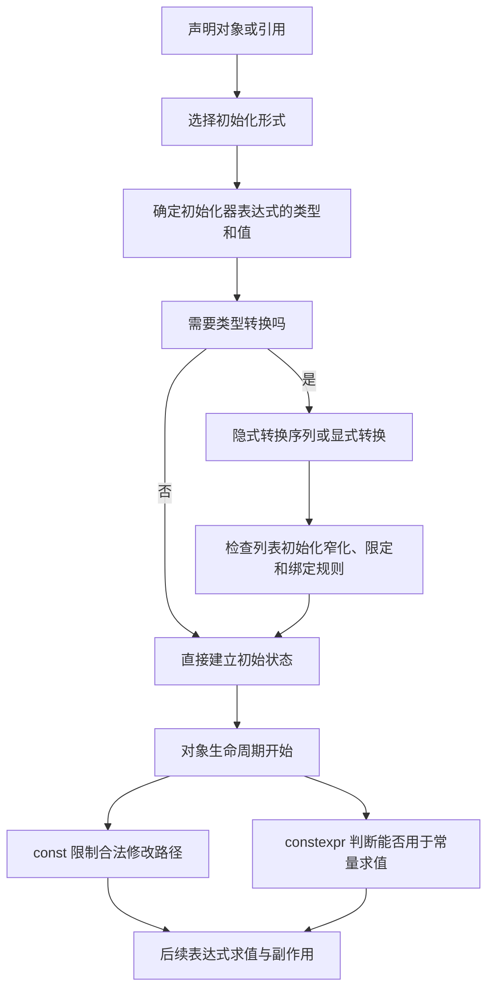

# 第 13 天：`const`、`constexpr`、初始化与类型转换

## 今日目标

完成本单元后，你应能区分“对象不可经当前途径修改”与“值可在编译期使用”，能判断常见初始化形式、窄化转换和显式转换，并能读懂引用与指针上的 `const`。

## 关键术语索引

索引只用于查阅和复习，不替代后文的推导与实验。

| 可点击术语 | 一句话直观解释 |
|---|---|
| [`const` 限定类型](#术语-d13-01-const限定类型) | 通过该类型表达式不能修改所指对象。 |
| [常量对象](#术语-d13-02-常量对象) | 创建后不能通过合法 C++ 操作改变值的对象。 |
| [顶层 `const`](#术语-d13-03-顶层const) | 限定对象本身，例如指针对象不能改指向。 |
| [底层 `const`](#术语-d13-04-底层const) | 限定间接访问的目标，例如不能经指针改目标。 |
| [`constexpr`](#术语-d13-05-constexpr) | 要求对象或函数具备参与常量求值的条件。 |
| [常量表达式](#术语-d13-06-常量表达式) | 能按语言规则在翻译期间求值的表达式。 |
| [初始化](#术语-d13-07-初始化) | 对象生命周期开始时确定初始状态。 |
| [赋值](#术语-d13-08-赋值) | 对已存在对象写入新值。 |
| [默认初始化](#术语-d13-09-默认初始化) | 声明对象而不写初始化器时采用的规则。 |
| [值初始化](#术语-d13-10-值初始化) | 用空括号或空花括号请求值初始化。 |
| [直接初始化](#术语-d13-11-直接初始化) | 初始化器直接用于选择并初始化目标。 |
| [复制初始化](#术语-d13-12-复制初始化) | 使用 `=` 语法初始化新对象，并按复制初始化规则选转换。 |
| [直接列表初始化](#术语-d13-13-直接列表初始化) | 用花括号直接初始化，且禁止窄化。 |
| [复制列表初始化](#术语-d13-14-复制列表初始化) | 用 `= {}` 初始化，且同样禁止窄化。 |
| [窄化转换](#术语-d13-15-窄化转换) | 可能丢失值域或精度、因而被列表初始化限制的转换。 |
| [隐式转换](#术语-d13-16-隐式转换) | 语境需要另一类型时由语言自动执行的转换。 |
| [整数提升](#术语-d13-17-整数提升) | 较小整数类型在表达式中提升到 `int` 或 `unsigned int`。 |
| [标准转换序列](#术语-d13-18-标准转换序列) | 语言内建转换按规定阶段组成的序列。 |
| [`static_cast`](#术语-d13-19-static_cast) | 明确请求一类编译期可检查的转换。 |
| [`const_cast`](#术语-d13-20-const_cast) | 专门改变 cv 限定，不保证修改目标合法。 |
| [临时对象](#术语-d13-21-临时对象) | 为表达式求值而创建、通常没有名字的对象。 |
| [引用绑定](#术语-d13-22-引用绑定) | 建立引用与其所指对象或函数的关联。 |
| [枚举显式转换](#术语-d13-23-枚举显式转换) | 明确地在枚举与整数表示之间转换。 |
| [未定义行为](#术语-d13-24-未定义行为) | 标准不对违反规则后的结果作任何要求。 |

###### 术语-d13-01-const限定类型

**`const` 限定类型（const-qualified type，C++ 标准术语）**

- **新手先这样理解：** 经由这个类型看到对象时，只能读取，不能写入。
- **专业上更准确地说：** `const` 是 cv 限定符；对 `const` 限定类型的表达式，语言禁止调用会修改对象的操作。限定可能作用于对象本身，也可能作用于复合类型中的间接目标。

###### 术语-d13-02-常量对象

**常量对象（const object，C++ 标准术语）**

- **新手先这样理解：** 对象一经初始化，合法程序不能再改变它的值。
- **专业上更准确地说：** 常量对象是类型为 `const T` 的完整对象、非 `mutable` 子对象，或常量对象的相应子对象；试图通过去除限定后的访问修改真正的常量对象会产生未定义行为。

###### 术语-d13-03-顶层const

**顶层 `const`（top-level const，常用标准解释术语）**

- **新手先这样理解：** 不能改变当前对象本身。
- **专业上更准确地说：** 顶层 cv 限定作用于类型最外层。例如 `int* const` 的指针对象本身是常量，但它指向的 `int` 未必是常量。

###### 术语-d13-04-底层const

**底层 `const`（low-level const，常用标准解释术语）**

- **新手先这样理解：** 不能经当前指针或引用修改间接目标。
- **专业上更准确地说：** 底层 cv 限定位于复合类型的非最外层，例如 `const int*` 中被指向类型是 `const int`；转换和赋值必须保留相应限定安全性。

###### 术语-d13-05-constexpr

**`constexpr`（C++ 说明符，C++ 标准术语）**

- **新手先这样理解：** 它要求声明具备在编译期求值或参与编译期计算的条件。
- **专业上更准确地说：** `constexpr` 可用于变量和函数等声明。`constexpr` 变量必须由常量表达式初始化并且本身是常量；`constexpr` 函数可以在常量表达式中求值，但用普通运行期实参调用时也可以在运行期求值。

###### 术语-d13-06-常量表达式

**常量表达式（constant expression，C++ 标准术语）**

- **新手先这样理解：** 语言能在翻译程序时可靠算出的表达式。
- **专业上更准确地说：** 常量表达式是满足特定语法与语义约束、可用于要求编译期值的上下文的表达式；它不是“优化器碰巧提前算了”的同义词。

###### 术语-d13-07-初始化

**初始化（initialization，C++ 标准术语）**

- **新手先这样理解：** 创建对象时确定它从什么状态开始。
- **专业上更准确地说：** 初始化发生在对象生命周期开始之际，依据声明形式和初始化器选择默认、值、直接、复制、列表等规则；它不是先造出对象再执行一次普通赋值。

###### 术语-d13-08-赋值

**赋值（assignment，C++ 表达式类别）**

- **新手先这样理解：** 对已经存在的对象换一个值。
- **专业上更准确地说：** 赋值是对生命周期已经开始的可修改对象执行的表达式操作；内置赋值或重载赋值运算符会更新既有对象状态。

###### 术语-d13-09-默认初始化

**默认初始化（default-initialization，C++ 标准术语）**

- **新手先这样理解：** 声明时没写初始化器，由类型规则决定初始状态。
- **专业上更准确地说：** `T object;` 触发默认初始化。对类类型会选择默认构造；对自动存储期的内置标量通常不执行初始化，读取其不确定值可能导致未定义行为。

###### 术语-d13-10-值初始化

**值初始化（value-initialization，C++ 标准术语）**

- **新手先这样理解：** 用空初始化器请求一个明确的“初始值状态”。
- **专业上更准确地说：** `T{}` 或某些 `T()` 形式触发值初始化；对 `int` 等标量结果为零，对类类型按其构造规则处理。

###### 术语-d13-11-直接初始化

**直接初始化（direct-initialization，C++ 标准术语）**

- **新手先这样理解：** 把初始化器直接交给目标类型。
- **专业上更准确地说：** `T object(arguments);` 等形式触发直接初始化，按目标类型和候选构造/转换规则选择初始化方式；类类型细节在第 19 天深化。

###### 术语-d13-12-复制初始化

**复制初始化（copy-initialization，C++ 标准术语）**

- **新手先这样理解：** `=` 出现在声明中，但这里仍是在创建对象。
- **专业上更准确地说：** `T object = expression;` 触发复制初始化；它考虑允许的隐式转换并排除 `explicit` 构造函数的直接使用。C++17 的复制消除规则不等于此处一定发生一次赋值或物理复制。

###### 术语-d13-13-直接列表初始化

**直接列表初始化（direct-list-initialization，C++ 标准术语）**

- **新手先这样理解：** `T object{...};` 用花括号直接创建对象，并检查窄化。
- **专业上更准确地说：** 直接列表初始化使用花括号初始化器列表，遵循列表初始化的候选选择和禁止窄化规则；类类型还会优先考虑 `std::initializer_list` 构造函数，第 19、28 天深化。

###### 术语-d13-14-复制列表初始化

**复制列表初始化（copy-list-initialization，C++ 标准术语）**

- **新手先这样理解：** `T object = {...};` 也是创建对象，花括号仍检查窄化。
- **专业上更准确地说：** 复制列表初始化结合列表初始化与复制初始化规则；若最终选择 `explicit` 构造函数则程序非良构，类类型细节后续学习。

###### 术语-d13-15-窄化转换

**窄化转换（narrowing conversion，C++ 标准术语）**

- **新手先这样理解：** 转换可能装不下原值或损失精度，所以花括号通常拒绝它。
- **专业上更准确地说：** 列表初始化定义了一组禁止的转换，包括多数浮点到整数、可能超出目标范围的整数转换等；常量表达式若其值可由目标类型精确表示，部分整数情形可被允许。

###### 术语-d13-16-隐式转换

**隐式转换（implicit conversion，C++ 标准术语）**

- **新手先这样理解：** 代码没有写转换语法，但语境要求另一类型，语言按规则转换。
- **专业上更准确地说：** 隐式转换序列用于初始化、运算、函数实参匹配和返回等语境，可由标准转换、用户定义转换和省略号转换组成；今天深入内置类型的标准转换。

###### 术语-d13-17-整数提升

**整数提升（integral promotion，C++ 标准术语）**

- **新手先这样理解：** `bool`、`char`、`short` 等较小整数常先提升为适合运算的整数类型。
- **专业上更准确地说：** 符合条件的整数或枚举纯右值转换为 `int`；若 `int` 不能表示其全部值则转换为 `unsigned int`，具体结果依类型范围与实现。

###### 术语-d13-18-标准转换序列

**标准转换序列（standard conversion sequence，C++ 标准术语）**

- **新手先这样理解：** 语言把内建转换按限定顺序组合成一条合法路线。
- **专业上更准确地说：** 标准转换序列可包含值类别转换、数值提升或转换、函数指针转换以及限定转换等规定阶段；重载决议会用其等级比较候选，第 14、17、25 天继续深化。

###### 术语-d13-19-static_cast

**`static_cast`（显式类型转换表达式，C++ 标准术语）**

- **新手先这样理解：** 程序员明确说“按这种受检查的转换规则得到目标类型”。
- **专业上更准确地说：** `static_cast<T>(expression)` 只允许标准规定的一组转换，编译器检查其形式合法性；它不会自动证明数值不丢失、指针所指对象真实类型正确或运行期访问安全。

###### 术语-d13-20-const_cast

**`const_cast`（显式类型转换表达式，C++ 标准术语）**

- **新手先这样理解：** 它只改变访问路径上的 `const`/`volatile` 限定。
- **专业上更准确地说：** `const_cast` 可执行规定的 cv 限定转换。若原对象本来就是常量对象，经去除限定后的路径写入仍是未定义行为；它不是“把常量变成变量”。

###### 术语-d13-21-临时对象

**临时对象（temporary object，C++ 标准术语）**

- **新手先这样理解：** 为完成一个表达式而创建、通常没有名字的短期对象。
- **专业上更准确地说：** 临时对象按语言规则物化并具有生命周期；绑定到合适的 `const` 左值引用可在特定语境延长其生命周期，但延长规则不是任意传播的。

###### 术语-d13-22-引用绑定

**引用绑定（reference binding，C++ 标准术语）**

- **新手先这样理解：** 初始化引用时确定它以后代表哪个对象或函数。
- **专业上更准确地说：** 引用初始化按直接绑定、转换后绑定及临时量物化等规则建立关联；非 `const` 左值引用通常不能绑定右值，而 `const` 左值引用可绑定满足转换规则的临时对象。

###### 术语-d13-23-枚举显式转换

**枚举显式转换（C++ 转换规则）**

- **新手先这样理解：** `enum class` 不会偷偷变成整数，需要明确转换。
- **专业上更准确地说：** 限定枚举不隐式转换为整数；可使用 `static_cast` 得到底层整数表示。整数转枚举也需显式转换，并受枚举值范围规则约束。

###### 术语-d13-24-未定义行为

**未定义行为（undefined behavior，C++ 标准术语）**

- **新手先这样理解：** 违反规则后不能要求程序报错、崩溃或产生固定结果。
- **专业上更准确地说：** 对未定义行为，C++ 标准不施加要求；编译器无需诊断。一次运行看似正常不能证明操作合法。

---

## 一、完整知识地图



完整模型包含四条线：初始化形式、类型转换、cv 限定、常量求值。`const` 不自动表示编译期常量，`constexpr` 也不表示函数每次调用都必定在编译期执行。

## 二、范围标签

### 今天掌握

- `const` 对象、`const` 引用以及指针的顶层/底层 `const`
- `constexpr` 变量、`constexpr` 函数与常量表达式的基本边界
- 默认、值、直接、复制、直接列表和复制列表初始化
- 初始化与赋值的区别
- 常见整数/浮点隐式转换、整数提升和窄化
- 用 `static_cast` 表达有意转换，并检查值域
- 限定枚举到整数的显式转换

### 先看全貌

- 标准转换序列还包括值类别、函数指针和更完整的限定转换
- 类类型初始化会涉及构造函数、`explicit` 与 `initializer_list`
- 常量求值还有字面类型、立即函数、模板参数等更完整规则
- `const_cast` 可改变访问路径的限定，但不能让真正的常量对象变得可修改

### 后续深入

- 第 14 天：表达式求值顺序、值类别、转换后的副作用与未定义行为
- 第 17 天：声明、名称、链接及跨翻译单元的常量对象
- 第 19 天：构造函数、成员初始化列表和类类型初始化
- 第 25 天：用户定义转换与重载决议
- 第 27 天：`auto`、模板推导、`if constexpr` 和编译期类型计算
- 第 32 天：转换失败、异常与错误处理策略

## 三、`const` 约束访问路径，不等于“编译期常量”

直观上，[`const` 限定类型](#术语-d13-01-const限定类型)表示不能通过当前表达式修改对象。专业上，`const` 是类型系统的一部分，它限制修改操作，不承诺值一定在翻译期间已知。

```cpp
int runtime_value{};
std::cin >> runtime_value;
const int snapshot{runtime_value};
```

`snapshot` 是[常量对象](#术语-d13-02-常量对象)，不能再赋值，但其值来自运行期输入，不是常量表达式。

```cpp
constexpr int motor_count{6};
static_assert(motor_count > 0);
```

[`constexpr`](#术语-d13-05-constexpr) 变量必须由[常量表达式](#术语-d13-06-常量表达式)初始化，并隐含顶层 `const`。`static_assert` 要求可在翻译期判断的条件。

### `constexpr` 函数不等于“只在编译期运行”

```cpp
constexpr int square(int value) {
    return value * value;
}

constexpr int compile_time{square(4)};
int input{};
std::cin >> input;
int run_time{square(input)};
```

同一个函数在常量表达式语境中可被常量求值，也可用运行期值正常调用。是否产生机器码、是否被优化折叠是实现与优化问题，不改变语言语义。

## 四、初始化不是赋值

一句可复述的话：[`初始化`](#术语-d13-07-初始化)建立新对象的初始状态；[`赋值`](#术语-d13-08-赋值)修改已经存在的对象。

```cpp
int speed{10}; // 初始化，speed 的生命周期开始
speed = 20;    // 赋值，speed 已经存在
```

声明中的 `=` 也可能是初始化：

```cpp
int speed = 10; // 复制初始化，不是先默认初始化再赋值
```

对 `int` 最终值可能相同，但类类型会涉及不同候选构造规则，因此不能把所有形式简化为赋值。

## 五、六种初始化形式与真实结果

| 形式 | 例子 | 对 `int` 的关键结果 |
|---|---|---|
| [默认初始化](#术语-d13-09-默认初始化) | `int a;` | 自动对象的值不确定，不能读取 |
| [值初始化](#术语-d13-10-值初始化) | `int b{};` | `b == 0` |
| [直接初始化](#术语-d13-11-直接初始化) | `int c(3.8);` | 允许转换，`c == 3` |
| [复制初始化](#术语-d13-12-复制初始化) | `int d = 3.8;` | 允许转换，`d == 3`，通常可警告 |
| [直接列表初始化](#术语-d13-13-直接列表初始化) | `int e{3};` | 无窄化，合法 |
| [复制列表初始化](#术语-d13-14-复制列表初始化) | `int f = {3};` | 无窄化，合法 |

`int e{3.8};` 和 `int f = {3.8};` 因浮点到整数的[窄化转换](#术语-d13-15-窄化转换)而非良构，编译器必须诊断。

对内置类型，花括号能阻止许多意外丢失；对类类型，花括号还会改变构造函数候选优先级，第 19 天再完整展开。

## 六、隐式转换要同时检查来源、目标和值域

直观上，[隐式转换](#术语-d13-16-隐式转换)是语境自动要求的类型变化。专业上，语言通过[标准转换序列](#术语-d13-18-标准转换序列)等规则决定转换是否合法；“合法”不等于“无损”。

```cpp
double voltage{12.75};
int truncated = voltage;       // 合法，但小数部分被丢弃
unsigned int wrapped = -1;     // 合法，结果按无符号转换规则确定
```

在典型实现中第二个结果很大，但确切宽度依实现。用 `std::numeric_limits<unsigned int>` 检查类型范围，不能假设所有平台的 `int` 都是 32 位。

较小整数参与运算时常先发生[整数提升](#术语-d13-17-整数提升)：

```cpp
char left{10};
char right{20};
auto sum = left + right; // 通常类型为 int；auto 在第 27 天系统学习
```

这里提前用 `auto` 仅为了观察结果类型，不把类型推导规则称为已掌握内容。

## 七、`static_cast` 表达意图，不保证值无损

[`static_cast`](#术语-d13-19-static_cast)让转换意图出现在代码中：

```cpp
double angle{42.9};
int whole_degrees{static_cast<int>(angle)};
```

结果仍是 42；显式写出转换没有恢复被丢弃的小数。稳妥流程是先检查目标类型范围，再转换：

```cpp
if (angle >= static_cast<double>(std::numeric_limits<int>::min()) &&
    angle <= static_cast<double>(std::numeric_limits<int>::max())) {
    int value{static_cast<int>(angle)};
}
```

浮点 NaN、无穷和边界舍入还需要更严谨检查，第 32 天结合输入验证处理。

限定枚举不会隐式转成整数：

```cpp
enum class Mode : unsigned char { idle = 0, active = 1 };
int code{static_cast<int>(Mode::active)};
```

这就是[枚举显式转换](#术语-d13-23-枚举显式转换)，保留强类型边界，同时允许明确读取底层数值。

## 八、`const` 引用可以绑定临时对象

[引用绑定](#术语-d13-22-引用绑定)发生在引用初始化时：

```cpp
int value{7};
int& writable{value};
const int& readonly{value};
const int& temporary_view{40 + 2};
```

- `writable` 可修改 `value`
- `readonly` 不能经该引用修改 `value`，但 `value` 本身仍可通过非 const 路径改变
- 表达式 `40 + 2` 产生用于绑定的[临时对象](#术语-d13-21-临时对象)，其生命周期在这个局部引用的生命周期内得到延长

非 `const` 的 `int&` 不能绑定该右值。生命周期延长规则依初始化语境而定，不能理解为“把引用再传给别处就永久延长”。

## 九、指针的顶层与底层 `const`

```cpp
int first{1};
int second{2};

const int* pointer_to_const{&first}; // 目标只读，指针可改
int* const const_pointer{&first};    // 指针不可改，目标可写
const int* const both_const{&first}; // 两层都不可改
```

- [底层 `const`](#术语-d13-04-底层const)：`*pointer_to_const = 3;` 非法，但 `pointer_to_const = &second;` 合法
- [顶层 `const`](#术语-d13-03-顶层const)：`const_pointer = &second;` 非法，但 `*const_pointer = 3;` 合法

从 `int*` 转为 `const int*` 通常是在增加保护；反向不能隐式完成。多级指针的限定转换有额外安全规则，第 14、17 天继续分析。

## 十、`const_cast` 不能把真正的常量变成可修改对象

[`const_cast`](#术语-d13-20-const_cast)只改变访问表达式的 cv 限定：

```cpp
int original{10};
const int& view{original};
int& recovered{const_cast<int&>(view)};
recovered = 20; // 合法：底层对象 original 本来不是 const
```

但下面不同：

```cpp
const int fixed{10};
int& invalid_path{const_cast<int&>(fixed)};
invalid_path = 20; // 未定义行为
```

这里的[未定义行为](#术语-d13-24-未定义行为)来自修改真正的常量对象。常规应用代码应优先修正接口，而不是用 `const_cast` 绕开 const-correctness。

## 十一、主示例与执行状态

源文件：[const_conversion_demo.cpp](../examples/day-13/const_conversion_demo.cpp)

```bash
mkdir -p build/day-13
g++ -std=c++17 -Wall -Wextra -Wpedantic -Wconversion -Wsign-conversion \
    examples/day-13/const_conversion_demo.cpp \
    -o build/day-13/const_conversion_demo
./build/day-13/const_conversion_demo
```

预期输出：

```text
compile-time square: 36
runtime const snapshot: 7
explicit whole degrees: 42
mode code: 1
pointer view: 12
```

状态追踪：

1. `constexpr int squared` 在常量表达式语境中求值，并通过 `static_assert`
2. `const int snapshot` 由运行期函数结果初始化，之后只读但不成为常量表达式
3. `42.9` 经明确且范围已检查的 `static_cast<int>` 得到 42
4. `Mode::active` 显式转换为底层代码 1
5. `const int*` 观察可修改对象；对象经原名称改为 12，指针视图读取到新值

## 十二、错误实验

### 12.1 列表初始化拒绝窄化

[narrowing_error.cpp](../examples/day-13/narrowing_error.cpp)：

```bash
g++ -std=c++17 -Wall -Wextra -Wpedantic -pedantic-errors \
    examples/day-13/narrowing_error.cpp -o build/day-13/narrowing_error
```

该程序在标准 C++17 中非良构，编译器必须给出诊断。这里增加 `-pedantic-errors`，要求 GCC 不把它作为扩展继续生成程序；诊断会指出 `double` 到 `int` 的 narrowing conversion。

### 12.2 不能给常量对象赋值

[const_assignment_error.cpp](../examples/day-13/const_assignment_error.cpp)：

```bash
g++ -std=c++17 -Wall -Wextra -Wpedantic \
    examples/day-13/const_assignment_error.cpp -o build/day-13/const_assignment_error
```

编译必须失败，因为赋值要求可修改左操作数。

### 12.3 去除限定后修改真正常量

[modify_const_ub.cpp](../examples/day-13/modify_const_ub.cpp) 展示语法可编译但语义为未定义行为的反例。不要把其某次输出当成规则；编译器和 Sanitizer都不保证诊断这种错误。

## 十三、真实构建位置

所有示例仍经过完整链路：

```text
源文件 → 预处理 → 狭义编译 → 汇编 → 目标文件
→ 链接 → 可执行文件 → 操作系统装载与运行库启动 → main
```

- 非法窄化与给 `const` 对象赋值在狭义编译阶段必须诊断
- `static_assert` 条件在翻译期间检查；失败不会生成可用目标文件
- `constexpr` 函数的运行期调用仍按普通执行语义工作
- 修改真正常量的反例属于运行语义中的未定义行为，编译成功不等于合法

一条 `g++` 命令是编译器驱动程序组织这些阶段，不代表源码一步变成可执行文件。

## 十四、常见误解校正

1. `const` 表示不能经该路径修改，不保证值在编译期已知。
2. `constexpr` 变量是常量；`constexpr` 函数不保证每次调用都在编译期执行。
3. 声明中的 `=` 可能是初始化，不是赋值。
4. `int value;` 对自动标量不会自动得到 0。
5. 花括号拒绝的窄化可能在括号或 `=` 初始化中仍合法但丢值。
6. `static_cast` 表达意图，不证明转换无损。
7. `const int*` 与 `int* const` 限定的层级不同。
8. `const` 引用不一定引用常量对象；它只是当前路径只读。
9. 去掉 `const` 的语法成功，不代表修改真正常量合法。
10. 实现宽度、优化折叠和诊断文本不能冒充 C++ 语言保证。

## 十五、随堂练习

1. 将六种初始化形式分类，并预测内置整数结果。
2. 编译两个错误实验，抄录关键诊断并解释语言规则。
3. 分析五组 `const` 指针声明，分别判断能否改指向、改目标。
4. 将三个有意数值转换改写为带范围检查的 `static_cast`。
5. 写一个既能常量求值又能运行期调用的 `constexpr` 函数。
6. 解释为什么 `const int snapshot{runtime_value};` 不是常量表达式。

完整作答区见：[第 13 天练习单](../exercises/day-13.md)。

## 十六、本单元偿还与新增的知识缺口

### 本次补全

- `G06`：补充对象类型的 cv 限定、初始化状态与合法修改路径
- `G07`：补充内置数值类型的值域、整数提升和常见转换；对象表示与完整求值边界留到第 14 天
- `G08`：系统区分六种初始化形式并覆盖窄化；类成员初始化留到第 19 天
- `G16`：补充 `const` 引用、临时对象绑定与生命周期延长的入门规则
- `G17`：补充内置类型标准转换序列与重载相关位置；用户定义转换留到第 25、27 天
- `G23`：补充限定枚举的显式整数转换
- `G27`：补充顶层/底层 `const`、限定转换与 `const_cast` 边界

### 新增追踪项

- `G29`：今天建立 `constexpr` 变量、函数和常量表达式的基础；第 14 天补求值边界，第 27 天补模板、`if constexpr` 与类型推导中的编译期机制

## 十七、今日完成标准

- 能用一句话区分 `const` 与 `constexpr`
- 能区分初始化与赋值，并识别六种初始化形式
- 能判断列表初始化中的典型窄化
- 能说明隐式转换合法但仍可能丢值
- 能在有意转换前检查值域并使用 `static_cast`
- 能区分 `const int*`、`int* const`、`const int* const`
- 能解释 `const` 引用绑定临时对象的当前规则与边界
- 能说明 `const_cast` 后何时仍不得写入
- 能通过两个编译失败实验解释诊断阶段
- 完成并同步第 13 天练习单

下一单元：表达式求值、短路、求值顺序、值类别与未定义行为。
