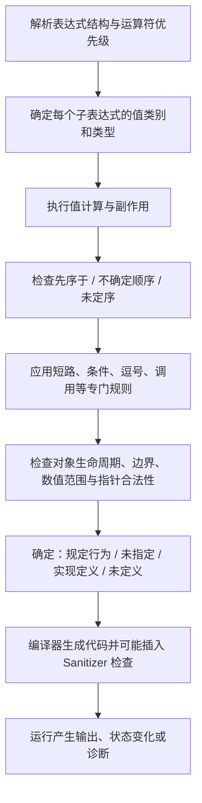

# 第 14 天：表达式求值、顺序、值类别与未定义行为

## 今日目标

本单元不只计算“表达式最后得到多少”，还追踪每次值计算、对象修改和调用的先后关系。学完后，你应能判断短路是否发生、多个副作用是否具有顺序保证、表达式属于哪类值类别，以及代码是确定行为、未指定行为、实现定义行为还是未定义行为。

## 关键术语索引

索引只用于查阅与复习；核心规则会在正文真正使用它们的位置重新解释。

| 可点击术语 | 一句话直观解释 |
|---|---|
| [表达式](#术语-d14-01-表达式) | 由操作数和运算符组成并参与求值的语言结构。 |
| [值计算](#术语-d14-02-值计算) | 算出表达式结果或确定对象身份的过程。 |
| [副作用](#术语-d14-03-副作用) | 修改对象、执行 I/O 或调用函数等可观察动作。 |
| [完整表达式](#术语-d14-04-完整表达式) | 不作为另一个表达式子部分的求值边界。 |
| [先序于](#术语-d14-05-先序于) | 语言保证 A 的求值在 B 之前完成。 |
| [未定序](#术语-d14-06-未定序) | 两次求值之间没有先后保证，甚至可交错。 |
| [不确定顺序](#术语-d14-07-不确定顺序) | 两者必有先后但标准不指定谁先。 |
| [未指定行为](#术语-d14-08-未指定行为) | 标准允许有限多个结果，实现无需说明选哪个。 |
| [实现定义行为](#术语-d14-09-实现定义行为) | 实现必须选择并记录一种允许的行为。 |
| [未定义行为](#术语-d14-10-未定义行为) | 违反规则后，标准不再约束程序结果。 |
| [短路求值](#术语-d14-11-短路求值) | 左侧已决定结果时，右侧不求值。 |
| [前置自增](#术语-d14-12-前置自增) | 先修改对象，再产生修改后的左值。 |
| [后置自增](#术语-d14-13-后置自增) | 产生修改前的值，并安排一次递增副作用。 |
| [泛左值](#术语-d14-14-泛左值) | 求值能够确定对象或函数身份的表达式。 |
| [左值](#术语-d14-15-左值) | 非将亡的泛左值，通常表示仍可继续使用的有身份实体。 |
| [将亡值](#术语-d14-16-将亡值) | 表示资源可被复用的泛左值。 |
| [纯右值](#术语-d14-17-纯右值) | 主要计算值或初始化结果对象的表达式。 |
| [右值](#术语-d14-18-右值) | 纯右值与将亡值的合称。 |
| [临时量实质化](#术语-d14-19-临时量实质化) | 在需要对象身份时把纯右值转成临时对象。 |
| [对象表示](#术语-d14-20-对象表示) | 对象占据的 `unsigned char` 字节序列。 |
| [有符号整数溢出](#术语-d14-21-有符号整数溢出) | 结果超出有符号目标类型范围的未定义行为。 |
| [尾后指针](#术语-d14-22-尾后指针) | 指向数组末元素之后位置、可比较但不可解引用的指针。 |
| [范围for展开](#术语-d14-23-范围for展开) | 范围 `for` 按规定建立范围、起点和终点并迭代。 |
| [Sanitizer](#术语-d14-24-sanitizer) | 通过编译插桩在执行时捕获部分错误的工具。 |
| [常量求值](#术语-d14-25-常量求值) | 在要求常量表达式的语境中按更严格规则完成求值。 |

###### 术语-d14-01-表达式

**表达式（expression，C++ 标准术语）**

- **新手先这样理解：** 它是一段会被求值的代码，不一定只产生一个数字。
- **专业上更准确地说：** 表达式是由操作数、运算符和子表达式构成的语言结构；其求值可以产生值、确定实体身份并引发副作用。声明、语句和表达式不是同一语法层级。

###### 术语-d14-02-值计算

**值计算（value computation，C++ 标准术语）**

- **新手先这样理解：** 求出结果值，或确定当前表达式指的是哪个对象。
- **专业上更准确地说：** 表达式求值包含值计算与副作用；值计算可能确定对象身份（glvalue 的结果）或计算数值（prvalue 的结果）。

###### 术语-d14-03-副作用

**副作用（side effect，C++ 标准术语）**

- **新手先这样理解：** 除了得到结果外，还改变了程序可观察状态。
- **专业上更准确地说：** 修改对象、访问 `volatile` 泛左值、调用库 I/O 或调用执行这些动作的函数都属于副作用。自增同时包含值计算与修改副作用。

###### 术语-d14-04-完整表达式

**完整表达式（full-expression，C++ 标准术语）**

- **新手先这样理解：** 一次相对独立的求值任务结束点。
- **专业上更准确地说：** 完整表达式是不作为另一个表达式子表达式的表达式，以及标准列出的其他初始化等边界；一个完整表达式的求值和副作用先序于下一个完整表达式。

###### 术语-d14-05-先序于

**先序于（sequenced before，C++ 标准术语）**

- **新手先这样理解：** 语言保证 A 完成后才开始 B。
- **专业上更准确地说：** “先序于”是同一线程中求值之间的非对称、传递关系。若 A 先序于 B，则 A 的值计算和相关副作用按规则在 B 之前发生。

###### 术语-d14-06-未定序

**未定序（unsequenced，C++ 标准术语）**

- **新手先这样理解：** 语言没有在两次求值之间画出安全的先后线。
- **专业上更准确地说：** 若 A 既不先序于 B，B 也不先序于 A，且二者并非不确定顺序，则它们未定序，可以交错。对同一内存位置的某些未定序修改/读取组合会导致未定义行为。

###### 术语-d14-07-不确定顺序

**不确定顺序（indeterminately sequenced，C++ 标准术语）**

- **新手先这样理解：** 一定一个先一个后，但标准不告诉你哪个先。
- **专业上更准确地说：** A 要么完整先序于 B，要么 B 完整先序于 A，二者不交错；每次执行可选择不同顺序。C++17 中函数实参的完整求值彼此不确定顺序。

###### 术语-d14-08-未指定行为

**未指定行为（unspecified behavior，C++ 标准术语）**

- **新手先这样理解：** 几种结果都合法，程序不能依赖其中一种。
- **专业上更准确地说：** 标准允许实现从一组可能行为中选择，且不要求记录本次选择。例如多数函数实参谁先求值未被指定，但这不等于程序自动具有未定义行为。

###### 术语-d14-09-实现定义行为

**实现定义行为（implementation-defined behavior，C++ 标准术语）**

- **新手先这样理解：** 不同编译器或平台可以不同，但必须在文档里说明。
- **专业上更准确地说：** 标准允许实现选择行为，并要求实现记录选择。例如普通 `char` 是有符号还是无符号由实现定义。

###### 术语-d14-10-未定义行为

**未定义行为（undefined behavior，C++ 标准术语）**

- **新手先这样理解：** 程序已经违反语言规则，不能要求它稳定报错或给固定结果。
- **专业上更准确地说：** 对未定义行为，C++ 标准不施加要求；编译器无需诊断，并可基于“合法程序不会发生该情况”进行优化。

###### 术语-d14-11-短路求值

**短路求值（short-circuit evaluation，C++ 运算规则）**

- **新手先这样理解：** `&&` 左边为假或 `||` 左边为真时，右边根本不执行。
- **专业上更准确地说：** 内置逻辑与、逻辑或先求左操作数；仅在结果尚未确定时求右操作数，且左操作数的求值先序于右操作数。重载运算符是函数调用，不保留全部内置短路语义。

###### 术语-d14-12-前置自增

**前置自增（prefix increment，内置运算符规则）**

- **新手先这样理解：** 先把对象加一，表达式代表加一后的对象。
- **专业上更准确地说：** 对内置算术类型，`++i` 等价于 `i += 1` 的效果，修改对象并产生指向该对象的左值；重载版本在第 25 天学习。

###### 术语-d14-13-后置自增

**后置自增（postfix increment，内置运算符规则）**

- **新手先这样理解：** 表达式先给出旧值，同时对象会增加一。
- **专业上更准确地说：** `i++` 的值计算产生修改前的纯右值，且该值计算先序于递增副作用；递增副作用必须在下一个完整表达式之前完成。

###### 术语-d14-14-泛左值

**泛左值（glvalue，generalized lvalue，C++ 标准术语）**

- **新手先这样理解：** 求值结果带有某个对象或函数的身份。
- **专业上更准确地说：** glvalue 是求值确定对象或函数身份的表达式类别，包含 lvalue 与 xvalue。

###### 术语-d14-15-左值

**左值（lvalue，C++ 标准术语）**

- **新手先这样理解：** 通常代表一个有身份、之后仍可使用的对象或函数。
- **专业上更准确地说：** lvalue 是非 xvalue 的 glvalue。命名变量表达式通常是 lvalue，即使变量类型带 `const`；能否修改与是否为 lvalue 是不同问题。

###### 术语-d14-16-将亡值

**将亡值（xvalue，expiring value，C++ 标准术语）**

- **新手先这样理解：** 它仍有对象身份，但其资源可被复用。
- **专业上更准确地说：** xvalue 是表示资源可被复用对象/位域的 glvalue；典型来源包括返回 `T&&` 的函数调用和某些显式转换。移动语义在第 22 天深入。

###### 术语-d14-17-纯右值

**纯右值（prvalue，pure rvalue，C++ 标准术语）**

- **新手先这样理解：** 它主要用来计算一个值或初始化结果对象。
- **专业上更准确地说：** prvalue 是用于初始化对象或计算运算数值的表达式类别；C++17 的纯右值在需要身份时才通过临时量实质化产生临时对象。

###### 术语-d14-18-右值

**右值（rvalue，C++ 标准术语）**

- **新手先这样理解：** 它包含临时计算结果和可被移动资源的对象表达式。
- **专业上更准确地说：** rvalue 是 prvalue 与 xvalue 的并集。不要把所有“没有名字的东西”机械等同于右值；命名的右值引用变量表达式本身是 lvalue。

###### 术语-d14-19-临时量实质化

**临时量实质化转换（temporary materialization conversion，C++17 标准术语）**

- **新手先这样理解：** 当纯计算结果需要被当成对象访问时，语言建立一个临时对象。
- **专业上更准确地说：** 该转换把类型为 `T` 的 prvalue 转成指向实质化临时对象的 xvalue，并按规则初始化临时对象。

###### 术语-d14-20-对象表示

**对象表示（object representation，C++ 标准术语）**

- **新手先这样理解：** 对象在存储中实际占用的那些字节。
- **专业上更准确地说：** 完整对象类型 `T` 的对象表示是组成该对象的 `sizeof(T)` 个 `unsigned char` 对象序列；其中参与表示值的位构成值表示，其余可能是填充位。相同值不必在所有类型/实现上拥有唯一字节表示。

###### 术语-d14-21-有符号整数溢出

**有符号整数溢出（signed integer overflow，C++ 算术规则）**

- **新手先这样理解：** 有符号计算超出类型范围时，不保证像里程表一样绕回。
- **专业上更准确地说：** 若有符号整数运算的数学结果不能由结果类型表示，行为未定义；无符号整数则按模 `2^N` 算术，但这不代表所有无符号回绕都符合业务意图。

###### 术语-d14-22-尾后指针

**尾后指针（past-the-end pointer，C++ 标准术语）**

- **新手先这样理解：** 它是数组合法范围的结束标记，不是一个元素。
- **专业上更准确地说：** 对含 `N` 个元素的数组，`array + N` 是尾后指针，可用于同一数组范围的比较与差值，但不能解引用；越过尾后位置的指针运算也不合法。

###### 术语-d14-23-范围for展开

**范围 `for` 展开（range-based for exposition，C++ 标准说明机制）**

- **新手先这样理解：** 范围表达式先保存一次，再用起点和终点逐元素循环。
- **专业上更准确地说：** C++17 按标准给出的说明性等价形式建立 `auto&& range`、`begin` 和 `end`，再迭代并初始化循环变量；这用于描述语义，不要求编译器真的生成同样的源代码文本。

###### 术语-d14-24-sanitizer

**Sanitizer（编译器工具族，工具链术语）**

- **新手先这样理解：** 它在程序运行时帮助抓住部分越界、悬空和算术错误。
- **专业上更准确地说：** 编译器通过插桩并链接运行库检测特定错误类别；ASan、UBSan 覆盖范围不同，未报告不证明程序没有未定义行为。

###### 术语-d14-25-常量求值

**常量求值（constant evaluation，C++ 标准术语）**

- **新手先这样理解：** 编译期要求算出结果时，非法路径必须被拒绝。
- **专业上更准确地说：** 核心常量表达式不能执行标准列出的禁用操作，包括会产生某些未定义行为的求值；普通运行期表达式可编译不代表同样表达式能用于 `constexpr` 初始化。

---

## 一、完整知识地图



完整分析不能只看优先级。优先级与结合性决定语法分组；求值顺序决定运行时先后；值类别描述表达式结果的身份/资源属性；行为分类决定程序能依赖什么。

## 二、范围标签

### 今天掌握

- 值计算、副作用、完整表达式和“先序于”关系
- `&&`、`||`、条件运算符和内置逗号运算符的求值保证
- 函数实参在 C++17 中“不交错但先后未指定”
- 内置前置/后置自增的结果与副作用
- lvalue、xvalue、prvalue 及 glvalue/rvalue 总图
- 未指定、实现定义和未定义行为的区别
- 数组尾后指针、越界、有符号溢出和未初始化读取
- 范围 `for` 的 C++17 说明性展开

### 先看全貌

- 操作符重载会把许多运算写法转入函数调用规则
- 临时对象、引用折叠和移动语义会继续使用值类别
- 对象表示包含值表示与可能的填充位
- 编译器优化会利用“合法程序不触发 UB”的前提

### 后续深入

- 第 18 天：警告、调试器、ASan、UBSan 与错误分类
- 第 22 天：右值引用、移动语义、`std::move` 和被移动对象状态
- 第 25 天：重载自增、逻辑、逗号与流运算符的函数调用语义
- 第 27 天：`decltype`、`auto`、模板推导与值类别保持
- 第 28～30 天：迭代器、范围、算法及失效规则
- 第 35 天：跨线程先发生关系、数据竞争与内存模型

## 三、值计算和副作用必须分开追踪

先建立可复述的直觉：一个[表达式](#术语-d14-01-表达式)可以既算出结果，又改变对象。专业上，表达式求值由[值计算](#术语-d14-02-值计算)和[副作用](#术语-d14-03-副作用)组成。

```cpp
int cycle{4};
int old{cycle++};
```

`cycle++` 的值计算产生旧值 4，所以 `old == 4`；其递增副作用使 `cycle == 5`。这两件事不是“同时得到一个神秘结果”。

每个以分号结束的表达式语句通常形成[完整表达式](#术语-d14-04-完整表达式)边界；前一完整表达式的副作用在下一完整表达式前完成。

## 四、顺序关系不是只有“确定/不确定”两种

若 A [先序于](#术语-d14-05-先序于) B，语言保证 A 完成在 B 之前。若二者[不确定顺序](#术语-d14-07-不确定顺序)，一定一个完整在前、但谁先未指定。若二者[未定序](#术语-d14-06-未定序)，没有这样的先后保证。

```cpp
observe(first(), second());
```

C++17 中两个实参的完整求值彼此不确定顺序：`first()` 与 `second()` 不交错，但标准未指定谁先。这通常属于[未指定行为](#术语-d14-08-未指定行为)，不是自动 UB。

```cpp
int i{0};
int result{i++ + i++};
```

内置 `+` 不规定两个操作数谁先；两个后置自增对同一对象的修改未定序，因此行为未定义。把它拆成两个完整表达式才能得到可依赖代码。

## 五、短路具有真实的执行保证

[短路求值](#术语-d14-11-短路求值)不只是“逻辑表技巧”：左操作数先求值；只有需要时才求右操作数。

```cpp
if (pointer != nullptr && *pointer > 0) {
    // 只有 pointer 非空才执行解引用
}
```

对内置 `&&`，左侧为假时右侧不求值；对内置 `||`，左侧为真时右侧不求值。

其他重要保证：

- `condition ? second : third`：先求 condition，只求被选中的一个分支
- 内置逗号运算符 `left, right`：left 先序于 right，结果取 right
- `statement1; statement2;`：前一完整表达式先于后一完整表达式

逗号分隔函数实参不是逗号运算符；不要把 `f(a(), b())` 误认为 `a()` 必先执行。

## 六、前置与后置自增不是简单文本替换

[前置自增](#术语-d14-12-前置自增)先修改并产生修改后对象的 lvalue；[后置自增](#术语-d14-13-后置自增)产生旧值的 prvalue，并安排递增副作用。

```cpp
int value{3};
int first{++value};  // value == 4, first == 4
int second{value++}; // second == 4, 随后 value == 5
```

对内置整数，`++value` 的效果可与 `value += 1` 联系理解；但后置形式的表达式结果不同。重载 `operator++` 是函数，第 25 天再比较。

## 七、值类别完整总图

```text
expression
├── glvalue：能确定对象/函数身份
│   ├── lvalue：非将亡的有身份表达式
│   └── xvalue：资源可复用的有身份表达式
└── prvalue：计算值或初始化结果对象

rvalue = prvalue + xvalue
```

- [泛左值](#术语-d14-14-泛左值)回答“是哪一个实体”
- [左值](#术语-d14-15-左值)常来自命名变量表达式
- [将亡值](#术语-d14-16-将亡值)保留身份但允许资源复用
- [纯右值](#术语-d14-17-纯右值)主要计算值或初始化结果对象
- [右值](#术语-d14-18-右值)是 prvalue 与 xvalue 的并集

```cpp
int value{10};        // 表达式 value 是 lvalue
int sum{value + 2};   // value + 2 是 prvalue
const int& ref{42};   // 42 是 prvalue；需要身份时发生临时量实质化
```

[临时量实质化](#术语-d14-19-临时量实质化)在 C++17 中把需要身份的 prvalue 转成指向临时对象的 xvalue。值类别不直接等于可修改性：`const int` 变量表达式仍是 lvalue，但不能经该表达式修改。

## 八、四种行为分类必须分清

| 分类 | 标准承诺 | 例子 |
|---|---|---|
| 规定行为 | 结果和约束由规则确定 | `false && function()` 不调用函数 |
| [未指定行为](#术语-d14-08-未指定行为) | 允许若干选择，不要求记录 | 多数函数实参谁先求值 |
| [实现定义行为](#术语-d14-09-实现定义行为) | 实现选择且必须记录 | 普通 `char` 的符号性 |
| [未定义行为](#术语-d14-10-未定义行为) | 标准不施加要求 | 有符号溢出、越界解引用 |

“结果不唯一”不等于 UB。未指定与实现定义仍在标准允许范围内；UB 则不能靠多运行几次建立规律。

## 九、整数、浮点与对象表示边界

类型的位宽和范围应通过 `sizeof` 与 `std::numeric_limits<T>` 查询，不假定 `int` 固定 32 位。普通 `char` 的符号性由实现定义。

[`对象表示`](#术语-d14-20-对象表示)是对象占据的 `sizeof(T)` 个字节；值表示只包含参与表示值的位，类型还可能有填充位。字节序、宽度和浮点格式常依实现或平台，不能由某台机器一次输出推广为语言保证。

关键算术边界：

- [有符号整数溢出](#术语-d14-21-有符号整数溢出)是 UB
- 无符号整数按模 `2^N` 运算，是规定行为
- 整数除以零是 UB
- 浮点计算遵循实现支持的浮点特性；精度、无穷与 NaN 要用 `numeric_limits`/`cmath` 检查
- 未初始化自动标量的普通读取在 C++17 中可能读取不确定值并触发 UB；警告不保证出现

## 十、数组边界、指针值与尾后位置

```cpp
int values[3]{10, 20, 30};
int* begin{values};
int* end{values + 3};
```

`begin` 指向首元素，`end` 是[尾后指针](#术语-d14-22-尾后指针)。可以比较 `begin != end`，但不能解引用 `end`。合法下标仍是 `[0, 3)`。

对象指针值可以是指向对象、尾后、空指针或无效指针值。对象生命周期结束或存储释放后，旧指针可能成为无效/悬空访问路径；“地址数字非零”不等于可解引用。

数组到指针转换不会携带长度。`values[3]` 等价于对 `*(values + 3)` 的访问意图，解引用尾后指针导致 UB。[Sanitizer](#术语-d14-24-sanitizer)可以捕获许多实际执行到的越界，但不是语言规则本身。

## 十一、范围 `for` 的表达式只建立一次

[范围for展开](#术语-d14-23-范围for展开)可用以下说明性等价形式理解。它是描述语义的 exposition，不是要求编译器做文本替换：

```cpp
{
    auto&& range = range_expression;
    auto begin = begin_expression;
    auto end = end_expression;
    for (; begin != end; ++begin) {
        item_declaration = *begin;
        statement
    }
}
```

范围表达式求值一次；循环变量每轮由 `*begin` 初始化。按值、`auto&`、`const auto&` 会决定复制、可修改引用或只读引用。`begin`/`end` 的精确查找及迭代器失效在第 28～30 天深入。

## 十二、枚举值不只等于已命名枚举项

```cpp
enum class Mode : unsigned char { idle = 0, active = 1 };
Mode raw{static_cast<Mode>(2)};
```

固定底层类型枚举的值范围由底层类型决定；`2` 没有对应命名 enumerator，但可成为该枚举类型的值。不要把“没有名字”误写成必然 UB。业务层若只允许 `idle/active`，应额外验证。

非固定底层类型枚举的可表示值范围规则不同；对象表示、跨接口序列化和链接在第 17、33 天结合工程边界继续学习。

## 十三、常量求值会拒绝非法路径

[`常量求值`](#术语-d14-25-常量求值)不是优化器“尽量提前算”。要求常量表达式的语境会拒绝不满足核心常量表达式规则的求值：

```cpp
constexpr int maximum{std::numeric_limits<int>::max()};
// constexpr int invalid{maximum + 1}; // 编译期诊断
```

同样的 `maximum + 1` 若写在运行期代码中，仍是有符号溢出 UB，只是编译器不一定拒绝构建。常量表达式约束帮助提前发现问题，但不能自动保护所有运行期输入。

## 十四、主示例与执行跟踪

源文件：[expression_evaluation_demo.cpp](../examples/day-14/expression_evaluation_demo.cpp)

```bash
mkdir -p build/day-14
g++ -std=c++17 -Wall -Wextra -Wpedantic -Wconversion -Wsign-conversion \
    examples/day-14/expression_evaluation_demo.cpp \
    -o build/day-14/expression_evaluation_demo
./build/day-14/expression_evaluation_demo
```

预期输出：

```text
short-circuit &&: 0 calls
short-circuit ||: 0 calls
prefix result: 4, object: 4
postfix result: 4, object: 5
range total: 60
one-past distance: 3
```

状态顺序：

1. 两个短路表达式都不执行右侧计数函数
2. `++value` 修改后产生 4；`value++` 产生旧值 4，完整表达式结束后对象为 5
3. 范围表达式建立一次，三个元素依次累加为 60
4. 尾后指针与首指针相减得到元素距离 3，但从未解引用尾后位置

## 十五、错误实验

### 15.1 未定序修改

[unsequenced_modification.cpp](../examples/day-14/unsequenced_modification.cpp) 含 `i++ + i++`。使用 GCC 时：

```bash
g++ -std=c++17 -Wall -Wextra -Wpedantic -Werror=sequence-point \
    examples/day-14/unsequenced_modification.cpp \
    -o build/day-14/unsequenced_modification
```

`-Werror=sequence-point` 将 GCC 的相关警告提升为错误以阻止生成反例程序。语言结论来自未定序规则，不来自警告一定存在；不同编译器的选项和文本可不同。

### 15.2 数组越界

[out_of_bounds.cpp](../examples/day-14/out_of_bounds.cpp)：

```bash
g++ -std=c++17 -O1 -g -Wall -Wextra -Wpedantic \
    -fsanitize=address,undefined -fno-omit-frame-pointer \
    examples/day-14/out_of_bounds.cpp -o build/day-14/out_of_bounds_san
./build/day-14/out_of_bounds_san
```

执行到错误路径时，ASan 应报告栈缓冲区越界并非零退出。

### 15.3 有符号溢出

[signed_overflow.cpp](../examples/day-14/signed_overflow.cpp)：

```bash
g++ -std=c++17 -O1 -g -Wall -Wextra -Wpedantic \
    -fsanitize=undefined -fno-sanitize-recover=undefined \
    examples/day-14/signed_overflow.cpp -o build/day-14/signed_overflow_san
./build/day-14/signed_overflow_san
```

UBSan 应报告 signed integer overflow 并非零退出。

### 15.4 常量表达式拒绝溢出

[constant_expression_error.cpp](../examples/day-14/constant_expression_error.cpp) 在 `constexpr` 初始化中制造溢出，狭义编译阶段必须诊断。

## 十六、真实构建与诊断位置

所有文件仍经过完整链路：

```text
源文件 → 预处理 → 狭义编译 → 汇编 → 目标文件
→ 链接 → 可执行文件 → 操作系统装载与运行库启动 → main
```

- 常量表达式不合法：狭义编译必须诊断
- 未定序修改：程序语义为 UB；编译器可能警告，启用相应 `-Werror` 可阻止构建
- 越界和运行期溢出：通常在运行到错误路径时由 ASan/UBSan 插桩报告
- 无诊断、无崩溃、某次输出稳定，都不能证明 UB 代码合法

Sanitizer 选项使编译阶段加入检查，并在链接阶段加入运行库；它没有把完整构建链路压缩成一步。

## 十七、常见误解校正

1. 运算符优先级决定语法分组，不自动决定操作数求值先后。
2. 函数实参顺序未指定不等于它们在 C++17 中可以任意交错。
3. 未指定行为仍受标准约束，不等于未定义行为。
4. `&&`/`||` 的右侧可能根本不执行，副作用也不会发生。
5. `++i` 与 `i++` 修改结果相同，但表达式结果和值类别不同。
6. lvalue 不等于“可修改”；`const` lvalue 仍是 lvalue。
7. 右值不等于“没有名字”；命名右值引用表达式是 lvalue。
8. 有符号溢出不保证回绕，无符号回绕才是规定行为。
9. 尾后指针可以形成和比较，但不能解引用。
10. Sanitizer 未报告不等于没有 UB；只有执行到且在其覆盖范围内才可能报告。

## 十八、随堂练习

1. 为五组表达式分别画出值计算和副作用节点。
2. 判断每组求值是先序、不确定顺序还是未定序。
3. 预测并运行短路示例，核对函数调用次数。
4. 将含两个自增的未定序表达式改成结果明确的多个完整表达式。
5. 为给定表达式标注 lvalue、xvalue 或 prvalue。
6. 用 ASan 和 UBSan 复现越界与有符号溢出。
7. 写出范围 `for` 的说明性展开并解释范围表达式为何只求值一次。

完整作答区见：[第 14 天练习单](../exercises/day-14.md)。

## 十九、本单元偿还与新增的知识缺口

### 本次补全

- `G07`：补齐类型范围、符号性、精度、对象/值表示和实现相关边界，教材状态闭环
- `G12`：补齐内置 `&&`/`||` 的短路、副作用与先序保证，教材状态闭环
- `G13`：补齐内置前后置自增的表达式结果与副作用；重载形式留到第 25 天
- `G14`：将未初始化读取放入 UB、警告和工具诊断边界；工具体系第 18 天深化
- `G16`：补充 glvalue/prvalue、临时量实质化与引用绑定所依赖的值类别基础
- `G19`、`G21`：补充尾后指针、越界 UB 与 ASan 真实诊断；`std::array` 和容器保证留到第 28 天
- `G22`：补充 C++17 范围 `for` 的说明性展开和范围表达式求值规则
- `G23`：补充固定底层类型枚举的值范围与“无对应枚举项不必然 UB”边界
- `G27`：补充对象指针值分类、尾后位置与无效访问边界
- `G29`：补充常量求值拒绝非法路径的边界；模板编译期机制留到第 27 天

### 新增追踪项

- `G30`：今天建立单线程求值顺序；运算符重载在第 25 天补齐，跨线程的先发生关系与数据竞争在第 35 天补齐

## 二十、今日完成标准

- 能区分优先级、结合性与求值顺序
- 能分别解释值计算、副作用和完整表达式
- 能判断先序、不确定顺序和未定序
- 能说明短路为何可以保护条件性解引用
- 能准确比较前置与后置自增
- 能画出 glvalue/lvalue/xvalue/prvalue/rvalue 总图
- 能区分未指定、实现定义和未定义行为
- 能解释有符号溢出、数组越界和未初始化读取为何危险
- 能说明尾后指针可做什么、不可做什么
- 能用 Sanitizer 复现实验并说明工具边界
- 完成并同步第 14 天练习单

下一单元：预处理、头文件、宏、包含保护与翻译单元。
