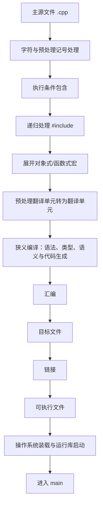

# 第 15 天：预处理、头文件、宏与翻译单元

## 今日目标

本单元把 `#include`、宏和头文件放回完整构建链路。学完后，你应能观察真实预处理产物，解释一个 `.cpp` 如何连同递归包含内容形成翻译单元，能编写自包含且有包含保护的头文件，并能识别宏替换发生在类型检查之前所带来的风险。

## 关键术语索引

索引只用于查阅与复习，不替代后文在具体构建过程中的讲解。

| 可点击术语 | 一句话直观解释 |
|---|---|
| [预处理](#术语-d15-01-预处理) | 在狭义编译前处理指令、包含文件和宏。 |
| [预处理器](#术语-d15-02-预处理器) | 执行预处理规则的工具或工具链组件。 |
| [预处理指令](#术语-d15-03-预处理指令) | 以 `#` 开始并控制包含、宏和条件包含的指令。 |
| [预处理记号](#术语-d15-04-预处理记号) | 预处理阶段识别和替换的基本记号单位。 |
| [源文件](#术语-d15-05-源文件) | 提交给实现处理的源代码文件。 |
| [头文件](#术语-d15-06-头文件) | 通常承载共享声明和类型接口的工程文件。 |
| [标准库头](#术语-d15-07-标准库头) | 由 C++ 实现提供、可用头名包含的标准接口。 |
| [`#include`](#术语-d15-08-include指令) | 查找指定头并把其处理结果纳入当前位置。 |
| [包含搜索路径](#术语-d15-09-包含搜索路径) | 实现寻找头或文件时采用的目录规则。 |
| [宏](#术语-d15-10-宏) | 按预处理记号执行替换的预处理名称。 |
| [对象式宏](#术语-d15-11-对象式宏) | 不带参数、遇到名称就替换的宏。 |
| [函数式宏](#术语-d15-12-函数式宏) | 带形参列表、按调用形态替换的宏。 |
| [替换列表](#术语-d15-13-替换列表) | 宏展开时用于生成新预处理记号的主体。 |
| [宏展开](#术语-d15-14-宏展开) | 按规则替换宏并继续重扫描结果的过程。 |
| [条件包含](#术语-d15-15-条件包含) | 根据预处理条件保留或跳过一段源码。 |
| [包含保护](#术语-d15-16-包含保护) | 用唯一宏让同一头在一个翻译单元中只生效一次。 |
| [`#pragma once`](#术语-d15-17-pragma-once) | 常见但非 C++17 标准保证的单次包含指令。 |
| [预处理翻译单元](#术语-d15-18-预处理翻译单元) | 主源文件及递归包含内容扣除条件跳过部分后的整体。 |
| [翻译单元](#术语-d15-19-翻译单元) | 预处理完成后交给后续翻译阶段的语言单位。 |
| [声明](#术语-d15-20-声明) | 向程序引入名称及实体信息。 |
| [定义](#术语-d15-21-定义) | 提供实体完整定义或为对象分配定义性存储的声明。 |
| [自包含头文件](#术语-d15-22-自包含头文件) | 不依赖包含顺序即可单独包含并通过编译的头。 |
| [编译器驱动程序](#术语-d15-23-编译器驱动程序) | 组织预处理、编译、汇编和链接等工具阶段的程序。 |
| [一次定义规则](#术语-d15-24-一次定义规则) | 约束定义数量及跨翻译单元一致性的语言规则。 |

###### 术语-d15-01-预处理

**预处理（preprocessing，C++ 翻译阶段）**

- **新手先这样理解：** 在真正分析 C++ 类型和语法前，先处理 `#include`、`#define` 和条件指令。
- **专业上更准确地说：** 预处理属于标准翻译过程的一部分，包括执行预处理指令、宏替换、条件包含和相关记号处理，产生供后续翻译使用的翻译单元。

###### 术语-d15-02-预处理器

**预处理器（preprocessor，工具链术语）**

- **新手先这样理解：** 它是负责执行预处理规则的工具组件。
- **专业上更准确地说：** 预处理器是实现预处理语义的工具或编译器内部组件；它与“预处理”阶段不同。实际实现可能独立运行，也可能集成进编译器。

###### 术语-d15-03-预处理指令

**预处理指令（preprocessing directive，C++ 标准术语）**

- **新手先这样理解：** 它告诉预处理阶段要包含、定义、判断或报告什么。
- **专业上更准确地说：** 预处理指令位于逻辑源代码行中，以 `#` 预处理记号开头，包含 `#include`、`#define`、`#if`、`#error` 等；它不是普通 C++ 语句。

###### 术语-d15-04-预处理记号

**预处理记号（preprocessing token，C++ 标准术语）**

- **新手先这样理解：** 预处理器按这些基本片段识别宏名和替换内容。
- **专业上更准确地说：** 预处理记号是头名、标识符、预处理数字、字符/字符串字面量、运算符和标点等词法单位；宏替换操作的是记号序列，而不是无条件搜索任意字符串。

###### 术语-d15-05-源文件

**源文件（source file，C++ 标准术语）**

- **新手先这样理解：** 它是作为一次翻译起点交给编译器驱动的代码文件。
- **专业上更准确地说：** 源文件是包含文本、经实现的源字符映射与各翻译阶段处理的输入；工程中 `.cpp` 是常见约定，但扩展名不是 C++ 语言语法。

###### 术语-d15-06-头文件

**头文件（header file，工程术语）**

- **新手先这样理解：** 它通常放多个 `.cpp` 共同需要看到的声明和类型接口。
- **专业上更准确地说：** 工程头文件常以 `.h`/`.hpp` 存储声明、类型定义及允许多处出现的定义。它不是独立翻译单元，也不会仅因存在于项目中而自动参与构建。

###### 术语-d15-07-标准库头

**标准库头（standard library header，C++ 标准术语）**

- **新手先这样理解：** `<iostream>` 等头名代表实现提供的标准接口。
- **专业上更准确地说：** 标准指定一组可包含的头及其声明效果，但不要求每个标准头必须对应用户能看到的物理文件。

###### 术语-d15-08-include指令

**`#include` 指令（C++ 预处理指令）**

- **新手先这样理解：** 在当前位置纳入指定头的内容，让后文看到其中声明。
- **专业上更准确地说：** `#include` 根据头名形式执行实现定义的查找并处理目标内容，效果近似于在指令位置用其内容替换且递归预处理；对标准库头不能武断地说成复制某个物理文件。

###### 术语-d15-09-包含搜索路径

**包含搜索路径（include search path，工具链术语）**

- **新手先这样理解：** 工具按一组目录规则寻找你写在 `#include` 中的名字。
- **专业上更准确地说：** 引号形式与尖括号形式的查找方式由实现规定，编译器驱动选项如 GCC/Clang 的 `-I` 可增加搜索目录；具体顺序不是 C++ 语言统一规定的文件系统算法。

###### 术语-d15-10-宏

**宏（macro，C++ 预处理术语）**

- **新手先这样理解：** 它在类型检查前按记号规则替换代码片段。
- **专业上更准确地说：** 宏由 `#define` 引入，在其有效预处理范围内对匹配标识符执行对象式或函数式替换；宏不属于命名空间，没有 C++ 类型和普通作用域规则。

###### 术语-d15-11-对象式宏

**对象式宏（object-like macro，C++ 预处理术语）**

- **新手先这样理解：** 看到宏名就用替换列表取代它。
- **专业上更准确地说：** 对象式宏定义不带形参列表，例如 `#define BUILD_LEVEL 2`；匹配宏名称时按宏替换规则展开。

###### 术语-d15-12-函数式宏

**函数式宏（function-like macro，C++ 预处理术语）**

- **新手先这样理解：** 它看起来像函数调用，但只是带参数的记号替换。
- **专业上更准确地说：** 函数式宏只有在名称后出现符合规则的 `(` 时才收集实参并替换形参；它没有函数调用、参数类型、单次求值或重载保证。

###### 术语-d15-13-替换列表

**替换列表（replacement list，C++ 预处理术语）**

- **新手先这样理解：** 宏名展开后放进去的那串记号。
- **专业上更准确地说：** 替换列表是 `#define` 中宏名称/形参之后的预处理记号序列；函数式宏会按参数替换、字符串化、记号连接和重扫描等规则形成结果。

###### 术语-d15-14-宏展开

**宏展开（macro expansion，预处理过程）**

- **新手先这样理解：** 预处理器把宏调用按规则换成新记号，并继续检查能否展开。
- **专业上更准确地说：** 宏展开包含实参处理、替换和结果重扫描，并有防止当前宏无限自展开等规则；它不是简单的全文字符串替换。

###### 术语-d15-15-条件包含

**条件包含（conditional inclusion，C++ 预处理术语）**

- **新手先这样理解：** 预处理条件决定某些源码是否进入本次翻译。
- **专业上更准确地说：** `#if`、`#ifdef`、`#ifndef`、`#elif`、`#else`、`#endif` 组成条件包含组；未选中的组不进入后续翻译单元。

###### 术语-d15-16-包含保护

**包含保护（include guard，工程惯用法）**

- **新手先这样理解：** 让同一头在一个翻译单元里第二次被包含时跳过正文。
- **专业上更准确地说：** 包含保护用唯一宏配合 `#ifndef/#define/#endif` 实现条件包含，防止同一头内容在一个预处理翻译单元中重复出现；它不把多个翻译单元合并成一个。

###### 术语-d15-17-pragma-once

**`#pragma once`（常见实现扩展）**

- **新手先这样理解：** 很多编译器支持用一行表示头文件只处理一次。
- **专业上更准确地说：** `#pragma once` 被主流实现广泛支持，但不是 C++17 标准规定的可移植包含保护语法；文件身份、符号链接等边界由实现处理。

###### 术语-d15-18-预处理翻译单元

**预处理翻译单元（preprocessing translation unit，C++ 标准术语）**

- **新手先这样理解：** 主源文件、递归包含内容以及条件筛选后的预处理整体。
- **专业上更准确地说：** 一个源文件连同通过 `#include` 包含的所有头和源文件，减去条件包含跳过的源代码行，构成预处理翻译单元。

###### 术语-d15-19-翻译单元

**翻译单元（translation unit，C++ 标准术语）**

- **新手先这样理解：** 预处理完成后，狭义编译器看到的一整个 C++ 单元。
- **专业上更准确地说：** 预处理指令执行、宏展开并将预处理记号转换为后续语言记号后，预处理翻译单元转化为翻译单元；每个 `.cpp` 通常分别产生自己的翻译单元。

###### 术语-d15-20-声明

**声明（declaration，C++ 标准术语）**

- **新手先这样理解：** 告诉当前翻译单元某个名称和实体具有什么信息。
- **专业上更准确地说：** 声明引入或重新声明一个或多个名称/实体，并规定其类型、链接等属性；并非所有声明都是定义。

###### 术语-d15-21-定义

**定义（definition，C++ 标准术语）**

- **新手先这样理解：** 它提供函数主体、完整类型，或真正定义一个对象。
- **专业上更准确地说：** 定义是满足语言定义条件的声明，例如函数体定义函数、类定义完整描述类；对象定义通常使对象获得存储。具体例外与 ODR 在第 17 天深入。

###### 术语-d15-22-自包含头文件

**自包含头文件（self-contained header，工程规则）**

- **新手先这样理解：** 谁先包含谁都无所谓，这个头自己包含其声明所需依赖。
- **专业上更准确地说：** 自包含头可在空源文件中作为第一个包含项独立通过翻译，不依赖其他头偶然提前提供名称；工程上常用“include what you use”维持该性质。

###### 术语-d15-23-编译器驱动程序

**编译器驱动程序（compiler driver，工具链术语）**

- **新手先这样理解：** `g++` 接收命令并组织多个构建阶段和工具。
- **专业上更准确地说：** 驱动程序解析选项，安排预处理、狭义编译、汇编、链接等阶段；`-E` 让流程在预处理后停止，不证明预处理就是整个编译。

###### 术语-d15-24-一次定义规则

**一次定义规则（One Definition Rule, ODR，C++ 标准术语）**

- **新手先这样理解：** 定义放在哪里、能出现几次，都有跨文件规则。
- **专业上更准确地说：** ODR 对翻译单元内及整个程序中的可定义项规定定义数量和多定义一致性要求；本单元只观察重复定义现象，第 17 天系统学习完整规则和例外。

---

## 一、完整知识地图



`#include` 只位于预处理部分；它不直接完成狭义编译、汇编或链接。一个工程有三个 `.cpp`，通常就有三个独立翻译单元，之后才由链接器组合各自目标文件。

## 二、范围标签

### 今天掌握

- 区分预处理器与预处理阶段
- 使用 `g++ -E` 观察宏展开和包含后的产物
- 准确解释 `#include`、引号/尖括号头名和 `-I`
- 区分源文件、头文件、预处理翻译单元与翻译单元
- 编写自包含头文件及标准包含保护
- 区分对象式宏、函数式宏、替换列表和条件包含
- 识别宏的优先级、重复求值、无类型和无命名空间风险
- 在头文件放共享声明，在 `.cpp` 放普通非内联函数定义

### 先看全貌

- 标准翻译过程还包含字符映射、行拼接、相邻字符串字面量连接和模板实例化等阶段
- 宏还支持 `#` 字符串化、`##` 记号连接和变参宏
- 头文件中允许出现某些多定义实体，例如类定义、模板和符合规则的 `inline` 定义
- 标准库头不必对应物理文件

### 后续深入

- 第 16 天：目标文件、符号、重定位、静态库与动态库
- 第 17 天：声明/定义、名称查找、语言链接、ODR、`static`、`extern`、`inline`
- 第 18 天：预处理、编译、汇编、链接和运行错误的工具诊断
- 第 27 天：模板为什么常把定义放在头文件及实例化模型
- 第 33 天：CMake 的 include 目录、编译定义、生成头与构建配置

## 三、`#include` 不是“导入已经编译好的库”

直观上，[`#include`](#术语-d15-08-include指令)把指定头的处理结果纳入当前位置。专业上，它是[预处理指令](#术语-d15-03-预处理指令)，操作发生在狭义编译前。

```cpp
#include "robot_status.hpp"
#include <iostream>
```

- 引号形式通常先按实现规定搜索本地/当前相关位置，再搜索其他路径
- 尖括号形式通常搜索实现和命令选项配置的头路径
- 具体顺序属于实现规则；GCC/Clang 常用 `-Iexamples/day-15/include` 增加[包含搜索路径](#术语-d15-09-包含搜索路径)
- `<iostream>` 是[标准库头](#术语-d15-07-标准库头)，标准不要求它一定是普通物理文件

包含声明只让当前翻译单元能够通过名称和类型检查；函数实现是否能在链接时找到是另一件事。

## 四、从一个 `.cpp` 到一个翻译单元

先区分两个标准概念：

1. [预处理翻译单元](#术语-d15-18-预处理翻译单元)：主[源文件](#术语-d15-05-源文件)加递归包含内容，再扣除条件跳过部分
2. [翻译单元](#术语-d15-19-翻译单元)：预处理指令执行、宏展开并转换为后续语言记号后的单位

```text
main.cpp
  ├─ include/robot_status.hpp
  │    └─ <string>
  └─ <iostream>
          ↓ 预处理
main.cpp 对应的一个翻译单元
```

`robot_status.cpp` 也包含同一头，但它形成另一个翻译单元。头文件本身不会因为被两个 `.cpp` 包含就成为第三个独立翻译单元。

## 五、亲自观察预处理结果

本单元示例目录包含：

```text
examples/day-15/
├── include/robot_status.hpp
├── main.cpp
├── robot_status.cpp
└── macro_demo.cpp
```

只运行预处理：

```bash
mkdir -p build/day-15
g++ -std=c++17 -Iexamples/day-15/include -E \
    examples/day-15/main.cpp -o build/day-15/main.ii
```

这里的 `g++` 是[编译器驱动程序](#术语-d15-23-编译器驱动程序)，`-E` 要求预处理后停止。`main.ii` 会很大，因为 `<iostream>` 和 `<string>` 的递归内容也进入本次预处理结果；行标记用于保留来源位置。

可只搜索自己的声明：

```bash
grep -n "status_text" build/day-15/main.ii | tail
```

看到声明出现在 `.ii` 中，证明当前翻译单元已经获得接口；这还没有证明 `status_text` 的函数定义已链接成功。

## 六、头文件放共享接口，源文件放普通定义

[头文件](#术语-d15-06-头文件)中的[声明](#术语-d15-20-声明)：

```cpp
std::string status_text(int joint_id, bool ready);
```

`robot_status.cpp` 中的[定义](#术语-d15-21-定义)：

```cpp
std::string status_text(int joint_id, bool ready) {
    // 函数体
}
```

分别构建两个翻译单元：

```bash
g++ -std=c++17 -Iexamples/day-15/include -c \
    examples/day-15/main.cpp -o build/day-15/main.o
g++ -std=c++17 -Iexamples/day-15/include -c \
    examples/day-15/robot_status.cpp -o build/day-15/robot_status.o
g++ build/day-15/main.o build/day-15/robot_status.o \
    -o build/day-15/header_demo
./build/day-15/header_demo
```

预期输出：

```text
joint 3: ready
```

普通函数定义若直接放入头并被多个翻译单元包含，可能在链接时产生重复定义。哪些定义允许出现在头中受[一次定义规则](#术语-d15-24-一次定义规则)、`inline` 和模板规则控制，第 17、27 天闭环。

## 七、包含保护只防同一翻译单元内的重复纳入

[包含保护](#术语-d15-16-包含保护)的标准可移植形式：

```cpp
#ifndef CPP_LEARNING_DAY15_ROBOT_STATUS_HPP
#define CPP_LEARNING_DAY15_ROBOT_STATUS_HPP

// 头文件正文

#endif
```

`main.cpp` 故意连续包含 `robot_status.hpp` 两次。第一次定义保护宏并保留正文，第二次 `#ifndef` 条件为假，正文被[条件包含](#术语-d15-15-条件包含)跳过。

保护宏必须在项目中足够唯一。它只对当前预处理翻译单元的宏状态生效；另一个 `.cpp` 会独立预处理并再次看到头内容。

[`#pragma once`](#术语-d15-17-pragma-once) 更短且广泛支持，但不是 C++17 标准保证。本课程示例使用可移植保护宏。

## 八、自包含头避免包含顺序偶然性

[自包含头文件](#术语-d15-22-自包含头文件)必须自己包含接口所需依赖：

```cpp
#include <string>

std::string status_text(int joint_id, bool ready);
```

不能假设使用者恰好先包含 `<string>`。验证方法是创建最小源文件，让目标头成为第一个包含项并执行 `-fsyntax-only`：

```bash
printf '#include "robot_status.hpp"\n' |
g++ -std=c++17 -Iexamples/day-15/include -x c++ -fsyntax-only -
```

`printf` 这里只生成临时标准输入用于实验，不是课程仓库文件写法。

## 九、宏工作在类型系统之前

[宏](#术语-d15-10-宏)按[预处理记号](#术语-d15-04-预处理记号)替换，不进行函数参数类型检查，也没有命名空间作用域。

### 对象式宏

```cpp
#define BUILD_LEVEL 2
```

这是[对象式宏](#术语-d15-11-对象式宏)。对于常量，工程代码通常优先 `constexpr`，因为它有类型、作用域并受语言规则检查。

### 函数式宏与优先级陷阱

```cpp
#define BAD_SQUARE(x) x * x
#define PAREN_SQUARE(x) ((x) * (x))
```

[函数式宏](#术语-d15-12-函数式宏)的[替换列表](#术语-d15-13-替换列表)只是记号序列：

```cpp
BAD_SQUARE(1 + 2)
// 展开为 1 + 2 * 1 + 2，结果为 5
```

加括号可修复此处优先级，但不能修复重复求值：

```cpp
PAREN_SQUARE(value++)
// 参数记号出现两次，可能引入未定序修改和 UB
```

因此即使宏括号完整，也不要给会产生副作用的实参。优先使用 `constexpr` 函数或模板，在类型系统内保证每个实参按函数调用规则求值一次。

## 十、宏展开不是任意字符串替换

[宏展开](#术语-d15-14-宏展开)处理的是记号，并对结果重扫描：

```cpp
#define BASE 3
#define DOUBLE_BASE (2 * BASE)
```

`DOUBLE_BASE` 展开后，`BASE` 还会继续展开。字符串字面量内部的同名字符不会被普通宏替换。

查看自定义宏展开：

```bash
g++ -std=c++17 -E -P examples/day-15/macro_demo.cpp \
    -o build/day-15/macro_demo.ii
grep -n "bad_result\|good_result" build/day-15/macro_demo.ii
```

`-P`、输出格式和行标记是 GCC/Clang 工具选项，不属于 C++ 语言保证。

## 十一、条件包含与构建配置

```cpp
#if defined(ENABLE_TRACE)
std::cout << "trace enabled\n";
#endif
```

从命令行定义宏：

```bash
g++ -std=c++17 -DENABLE_TRACE examples/day-15/macro_demo.cpp \
    -o build/day-15/macro_trace
```

`-D` 是驱动程序选项；[`条件包含`](#术语-d15-15-条件包含)才是 C++ 预处理规则。宏配置对每个翻译单元分别生效；同一程序若以不一致宏配置编译共享头，可能制造 ODR 或 ABI 风险，第 17、33 天深入。

## 十二、错误实验

### 12.1 缺少包含保护

[duplicate_include_error.cpp](../examples/day-15/duplicate_include_error.cpp) 连续包含两次 [unguarded_type.hpp](../examples/day-15/include/unguarded_type.hpp)：

```bash
g++ -std=c++17 -Iexamples/day-15/include -Wall -Wextra -Wpedantic \
    examples/day-15/duplicate_include_error.cpp \
    -o build/day-15/duplicate_include_error
```

狭义编译必须诊断同一翻译单元内 `struct UnguardedType` 的重定义。错误不是链接器发现的，因为重复定义已经同时出现在一个翻译单元中。

### 12.2 宏优先级逻辑错误

[macro_demo.cpp](../examples/day-15/macro_demo.cpp) 可正常编译，但输出：

```text
bad square: 5
parenthesized square: 9
```

这是预处理替换造成的逻辑错误，不要求编译器诊断。查看 `.ii` 比只看宏调用更容易定位根因。

### 12.3 只编译调用方、不链接定义方

```bash
g++ -std=c++17 -Iexamples/day-15/include \
    examples/day-15/main.cpp -o build/day-15/missing_definition
```

`main.cpp` 能完成预处理和狭义编译，因为头里有声明；最终链接失败并报告 `undefined reference`，因为没有加入 `robot_status.cpp` 对应的目标文件。这再次证明“包含头”不等于“链接实现”。

## 十三、真实构建产物跟踪

| 命令 | 停止位置 | 主要产物 |
|---|---|---|
| `g++ -E main.cpp -o main.ii` | 预处理后 | 预处理文本 `.ii` |
| `g++ -S main.cpp -o main.s` | 狭义编译后 | 汇编文本 `.s` |
| `g++ -c main.cpp -o main.o` | 汇编后 | 可重定位目标文件 `.o` |
| `g++ main.o robot_status.o -o app` | 链接后 | 可执行文件 |

完整链路始终是：

```text
源文件 → 预处理 → 翻译单元 → 狭义编译 → 汇编 → 目标文件
→ 链接 → 可执行文件 → 操作系统装载与运行库启动 → main
```

第 15 天放大的是“源文件到翻译单元”；第 16 天继续放大汇编、目标文件、符号、重定位和库。

## 十四、常见误解校正

1. `#include` 不是运行时加载，也不等于链接库。
2. 头文件通常不是独立翻译单元。
3. 一个 `.cpp` 及其递归包含内容通常形成一个翻译单元。
4. 包含保护只防一个翻译单元内的重复包含，不负责跨翻译单元 ODR。
5. `#pragma once` 常用，但不是 C++17 标准指令。
6. 宏替换记号，不是任意文本搜索替换。
7. 函数式宏看起来像函数，却没有类型、作用域、重载或单次求值保证。
8. 给宏参数加括号不能解决重复求值。
9. 声明使编译器理解调用；定义仍需通过目标文件参加链接。
10. `g++ -E` 只停止在预处理阶段，不代表完整构建只有预处理。

## 十五、随堂练习

1. 生成 `main.ii` 并定位自己头文件中的声明。
2. 画出 `main.cpp` 与 `robot_status.cpp` 的两个独立翻译单元。
3. 删除包含保护，复现同一翻译单元的重定义诊断。
4. 只构建调用方，复现链接期未定义引用。
5. 写一个自包含头并用 `-fsyntax-only` 独立检查。
6. 预测三个宏调用展开结果，再检查 `.ii`。
7. 用 `-D` 分别构建启用/禁用跟踪的两个版本。

完整作答区见：[第 15 天练习单](../exercises/day-15.md)。

## 十六、本单元偿还与新增的知识缺口

### 本次补全

- `G01`：在完整链路中补充预处理翻译单元、翻译单元和 `-E` 真实产物；目标文件与链接细节仍由第 16、33 天承担
- `G03`：补齐 `#include` 递归处理、宏、条件包含、包含保护、自包含头与翻译单元；跨翻译单元重复定义和 ODR 由第 17 天闭环
- `G25`：补充头文件中命名空间声明会进入每个包含它的翻译单元；名称查找、未命名/内联命名空间与链接仍在第 17、25、27 天深化

### 新增追踪项

- `G31`：今天学习经典头文件模型；第 17 天补全 ODR/`inline`，第 27 天补模板定义可见性，第 33 天补构建系统的 include 目录、生成头和编译定义；C++20 模块属于本 C++17 主线外延

## 十七、今日完成标准

- 能区分预处理器和预处理阶段
- 能说明 `#include` 做什么、不做什么
- 能区分源文件、头文件、预处理翻译单元和翻译单元
- 能用 `-E` 生成并检查 `.ii`
- 能编写唯一、可移植的包含保护
- 能使头文件自包含并独立验证
- 能区分对象式宏、函数式宏和普通函数
- 能解释宏优先级与重复求值风险
- 能区分同一翻译单元重定义和链接期未定义引用
- 能按完整链路定位预处理、编译和链接错误
- 完成并同步第 15 天练习单

下一单元：汇编、目标文件、符号、重定位、链接与库。
