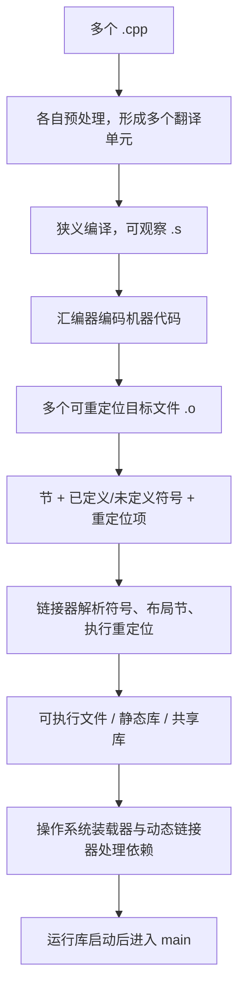

# 第 16 天：汇编、目标文件、符号、重定位、链接与库

## 第一遍：先把一个具体问题学会（必学）

> 如果你的基础较弱，今天先只完成这一节和配套练习。下面的“第二遍”是专业细节，不是读懂第一遍的前置条件。

### 1. 今天到底解决什么问题

`main.cpp` 能单独生成 `.o`，却可能无法生成可执行文件。理解目标文件、符号和重定位，才能真正读懂 `undefined reference`。

### 2. 先看这几行代码

```cpp
// main.cpp
void report_force(double);
int main() { report_force(3.2); }

// force.cpp
#include <iostream>
void report_force(double value) { std::cout << value << '\n'; }
```

不要先问“这个术语的完整定义是什么”。先逐行回答：当前已有哪个对象、值或文件；这一行读了什么；这一行改变或生成了什么。

### 3. 沿着同一批对象或文件走一遍

| 顺序 | 你必须能指出的具体变化 |
|---|---|
| 1 | 两个 `.cpp` 分别预处理、编译和汇编，得到两个目标文件 |
| 2 | `main.o` 记录对 `report_force(double)` 的未定义符号需求 |
| 3 | `force.o` 提供该函数的已定义符号 |
| 4 | 调用地址未确定的位置带有重定位记录 |
| 5 | 链接器组合目标文件与库、解析符号、布局并修正地址 |

如果不能复述上表，就修改一个输入、手写预测并运行 [本课可运行示例](../examples/day-16/main.cpp)；不要靠继续读更多术语解决。

### 4. 只给已经看到的现象命名

| 核心概念 | 先用人话理解 | 回到代码或命令找证据 |
|---|---|---|
| **目标文件** | 单个翻译单元产生的二进制中间产物，含机器代码、数据、符号与重定位信息。 | `main.o` |
| **符号** | 目标文件用名字标记“我提供/我需要的函数或对象”。 | `T report_force` / `U report_force` |
| **重定位** | 记录某处地址尚不能确定、链接时需要修正。 | 调用指令中的待填位置 |
| **链接** | 组合目标文件和库、解析符号、布局并应用重定位。 | `g++ main.o force.o -o app` |

这些解释是第一遍可用模型。第二遍会补边界和专业规则；补细节不等于推翻这里的主线。

### 5. 先形成一个求职可用回答

> 汇编文本是面向某一指令集的可读低层表示；目标文件是结构化二进制，含机器指令、数据、符号和重定位项。分离编译时外部函数最终地址未知，因此目标文件记录符号需求和待修正位置。链接器找到匹配定义、决定最终布局并完成重定位。静态库是目标文件归档，共享库则通常在装载或运行时继续参与。

这段话的结构是“具体问题 → 代码/对象/文件发生什么 → 使用哪条规则 → 有什么边界”。不要只背术语。

请直接在问题下写自己的版本：

1. 目标文件已经有机器指令，为什么通常还不能直接运行？

   > 

2. 符号与重定位分别解决什么问题？

   > 

### 6. 今天明确不要求什么

不背 ELF/COFF 全字段；先用 `nm`/`objdump` 证明符号需求和链接修正。

暂缓不等于删除：第二遍会明确展开，课程计划也标出了对应单元。

### 7. 必须动手完成

- 可运行示例：[main.cpp](../examples/day-16/main.cpp)
- 配套练习：[day-16.md](../exercises/day-16.md)
- 编程任务：创建 `main.cpp` 和 `force.cpp`，分别生成 `.o`，用 `nm -C` 观察同一函数在两个目标文件中的未定义与已定义状态，再完成链接。
预期结果：

```text
最终程序输出 `3.2`；`main.o` 对函数显示未定义需求，`force.o` 提供定义
```

- 故障实验：这是命令级调试题：说明为什么第一条成功而第二条失败；补全正确的分离编译和链接命令。

第一遍完成标准：

- [ ] 我实际运行了正常示例，而不是只读代码。
- [ ] 我能不看讲义复述上面的状态变化表。
- [ ] 我完成了概念检查、可运行任务和调试任务，并写下面试口述初稿。
- [ ] 我能说出一个当前方案的限制，不把入门模型说成全部规则。

---

## 第二遍：完整专业细节（完成第一遍后再读）

这一部分保留完整语言模型、工具边界和深入实验。第一遍已经能跑、能调试、能口述后再进入；一次只读一个小节，并继续把术语落回代码、对象、文件或诊断。

## 今日目标

本单元把“每个翻译单元单独生成目标文件，再由链接器组合”落到真实产物。学完后，你应能用 GCC/Clang 常见工具观察汇编、ELF 目标文件、节、符号表和重定位项，能解释 `undefined reference` 与 `multiple definition`，并能分别制作和使用静态库、共享库。

> 本单元命令在 Linux/ELF 环境验证。ELF、`.so`、`nm`、`readelf`、`objdump` 和具体符号修饰属于平台/工具链机制，不是 C++17 语言强制形式。Windows 常见 COFF/PE、`.obj`、`.lib`、`.dll`；macOS 常见 Mach-O、`.dylib`。

## 关键术语索引

索引只用于查阅与复习；正文会在真实产物出现的位置解释核心术语。

| 可点击术语 | 一句话直观解释 |
|---|---|
| [分离编译](#术语-d16-01-分离编译) | 每个翻译单元独立生成目标文件，最后统一链接。 |
| [汇编代码](#术语-d16-02-汇编代码) | 用助记符表达目标机器指令和数据布局的文本。 |
| [汇编器](#术语-d16-03-汇编器) | 把汇编输入变成目标文件的工具。 |
| [机器代码](#术语-d16-04-机器代码) | 处理器可执行的编码指令字节。 |
| [可重定位目标文件](#术语-d16-05-可重定位目标文件) | 含代码、数据及待修正引用，尚不是完整程序的文件。 |
| [目标文件格式](#术语-d16-06-目标文件格式) | 规定目标文件如何组织节、符号和重定位信息。 |
| [节](#术语-d16-07-节) | 目标文件中按用途组织代码、数据和元数据的区域。 |
| [符号](#术语-d16-08-符号) | 目标文件用名称关联函数、对象或待解析引用的记录。 |
| [已定义符号](#术语-d16-09-已定义符号) | 当前链接输入已经提供实体位置的符号。 |
| [未定义符号](#术语-d16-10-未定义符号) | 当前目标文件使用但期待其他输入提供的符号。 |
| [符号表](#术语-d16-11-符号表) | 保存符号名称、种类、绑定和所在节等信息的表。 |
| [重定位](#术语-d16-12-重定位) | 根据最终布局修正代码或数据中地址相关位置。 |
| [重定位项](#术语-d16-13-重定位项) | 记录哪里要修、引用哪个符号及使用哪种修正规则。 |
| [链接器](#术语-d16-14-链接器) | 组合目标文件和库、解析符号并应用重定位的工具。 |
| [符号解析](#术语-d16-15-符号解析) | 为引用选择满足规则的定义。 |
| [静态库](#术语-d16-16-静态库) | 通常把多个目标文件归档，供链接时抽取使用。 |
| [归档文件](#术语-d16-17-归档文件) | 保存多个成员文件的工具链容器，常用作静态库。 |
| [共享库](#术语-d16-18-共享库) | 在装载或运行时由程序共享映射的库文件。 |
| [静态链接](#术语-d16-19-静态链接) | 链接时把所需目标代码纳入输出文件。 |
| [动态链接](#术语-d16-20-动态链接) | 将部分符号绑定和库装载责任留给动态链接机制。 |
| [装载器](#术语-d16-21-装载器) | 操作系统侧把可执行文件及依赖映射进进程并启动。 |
| [位置无关代码](#术语-d16-22-位置无关代码) | 可在不同装载地址工作而少依赖绝对地址修正的代码。 |
| [名称修饰](#术语-d16-23-名称修饰) | C++ 实现把函数签名等编码进链接符号名。 |
| [ABI](#术语-d16-24-abi) | 二进制层面的调用、布局、命名和异常等兼容约定。 |
| [链接顺序](#术语-d16-25-链接顺序) | 某些链接器扫描输入时，目标文件与库的排列会影响解析。 |

## 一、完整知识地图



一个 `.o` 已经包含机器代码，却仍可能有未定义符号和待修正地址，所以它不是完整可执行程序。链接也不是把文件字节简单拼接；它要解析、选择、布局并重定位。

## 二、范围标签

### 今天掌握

- 分离编译：翻译单元、汇编、目标文件和链接的边界
- 使用 `-S`、`-c` 观察 `.s` 和 `.o`
- 使用 `nm -C`、`readelf`、`objdump` 检查 ELF 目标文件
- 区分已定义符号、未定义符号、符号表和重定位项
- 解释链接器的符号解析与地址修正
- 复现未定义引用和重复定义
- 创建并链接 `.a` 静态库与 `.so` 共享库
- 区分静态链接、动态链接、装载期处理和 `main` 启动

### 先看全貌

- 编译器可直接从内部表示产生目标文件，不一定落地文本 `.s`
- 链接器还会执行节垃圾回收、链接时优化、弱符号选择和动态重定位
- 共享库涉及导出可见性、版本、SONAME、搜索路径与延迟绑定
- 名称修饰、调用约定和对象布局属于 ABI

### 后续深入

- 第 17 天：C++ 声明/定义、名称查找、语言链接、ODR、`static`、`extern` 与 `inline`
- 第 18 天：用诊断、调试器和 Sanitizer 系统定位各阶段错误
- 第 25 天：重载函数的名称修饰与运算符函数
- 第 27 天：模板实例化产生符号与弱/合并定义的工程现象
- 第 33 天：CMake、库目标、传递依赖、RPATH 和 Debug/Release 配置

## 三、分离编译的真实输入与产物

本单元示例：

```text
examples/day-16/
├── include/force_model.hpp
├── main.cpp
├── force_model.cpp
└── duplicate_force_model.cpp
```

[分离编译](#术语-d16-01-分离编译)先让两个 `.cpp` 分别形成翻译单元：

```bash
mkdir -p build/day-16

g++ -std=c++17 -Iexamples/day-16/include -c \
    examples/day-16/main.cpp -o build/day-16/main.o

g++ -std=c++17 -Iexamples/day-16/include -c \
    examples/day-16/force_model.cpp -o build/day-16/force_model.o
```

`main.o` 中已经有 `main` 的机器代码，但 `compute_force(double)` 的定义在另一个目标文件中。

## 四、`.s` 是汇编文本，`.o` 是结构化二进制目标文件

生成[汇编代码](#术语-d16-02-汇编代码)：

```bash
g++ -std=c++17 -Iexamples/day-16/include -S \
    examples/day-16/force_model.cpp -o build/day-16/force_model.s
```

直接让驱动从汇编生成 `.o`：

```bash
g++ -c build/day-16/force_model.s -o build/day-16/from_assembly.o
```

[汇编器](#术语-d16-03-汇编器)把助记符和伪指令编码为[机器代码](#术语-d16-04-机器代码)、数据、符号和重定位信息。[可重定位目标文件](#术语-d16-05-可重定位目标文件)不是纯机器指令字节流，而是遵循[目标文件格式](#术语-d16-06-目标文件格式)的结构化文件。

## 五、节：目标文件按用途组织内容

查看 ELF 节：

```bash
readelf -SW build/day-16/force_model.o
```

常见[节](#术语-d16-07-节)：

| ELF 常见节 | 常见用途 | 是否为 C++ 标准保证 |
|---|---|---|
| `.text` | 机器代码 | 否，ELF/工具链约定 |
| `.rodata` | 只读常量数据 | 否 |
| `.data` | 有初值的可写数据 | 否 |
| `.bss` | 零初始化/未显式存文件数据 | 否 |
| `.symtab` / `.strtab` | 符号及名称字符串 | 否 |
| `.rela.*` / `.rel.*` | 重定位记录 | 否 |

不要把“局部变量一定在 `.bss`/栈”当语言规则。优化、存储期、对象是否需要实体化和 ABI 都会影响产物。

## 六、符号表连接跨翻译单元的名称

查看并反修饰 C++ 名称：

```bash
nm -C build/day-16/main.o
nm -C build/day-16/force_model.o
```

[符号](#术语-d16-08-符号)是目标文件层记录，不等于所有源代码标识符。典型观察：

```text
main.o:
  T main
  U compute_force(double)

force_model.o:
  T compute_force(double)
```

- `T` 常表示符号在代码节中有定义，即[已定义符号](#术语-d16-09-已定义符号)
- `U` 表示当前目标文件中的[未定义符号](#术语-d16-10-未定义符号)
- [符号表](#术语-d16-11-符号表)还记录绑定、类型、节索引等信息

字母含义属于 `nm`/目标格式约定；优化或剥离可能让观察结果改变。

## 七、名称修饰解释为什么符号不只叫函数名

C++ 支持重载，因此链接符号通常编码名称空间和参数类型。[名称修饰](#术语-d16-23-名称修饰)后的原始名可用：

```bash
nm build/day-16/force_model.o
```

`nm -C` 只是工具把符号反修饰为更接近源码的形式。编码由 [ABI](#术语-d16-24-abi) 规定，不由 C++17 规定；不能假设不同编译器、版本和 ABI 的 C++ 二进制天然兼容。

## 八、重定位：地址未知时留下可修正记录

`main.o` 生成时，狭义编译器不知道 `compute_force` 最终放到哪个地址。工具链先产生调用位置和[重定位项](#术语-d16-13-重定位项)：

```bash
readelf -rW build/day-16/main.o
```

可进一步反汇编并显示重定位：

```bash
objdump -drC build/day-16/main.o
```

[重定位](#术语-d16-12-重定位)不是“移动源代码”。链接器依据最终节布局、符号地址、重定位类型和加数修正目标位置。不同架构会看到不同类型，例如 x86-64 的 PC 相对重定位；具体名称不是语言保证。

## 九、链接器完成符号解析和布局

```bash
g++ build/day-16/main.o build/day-16/force_model.o \
    -o build/day-16/force_app
./build/day-16/force_app
```

预期输出：

```text
force: 3.25
```

[链接器](#术语-d16-14-链接器)在本例中至少执行：

1. 读取两个目标文件的节、符号与重定位
2. 通过[符号解析](#术语-d16-15-符号解析)让 `main.o` 的引用匹配 `force_model.o` 的定义
3. 合并并布局输入节
4. 为符号分配最终地址
5. 应用重定位
6. 加入启动文件和由驱动选择的运行库
7. 生成可执行文件元数据

直接调用 `ld` 需要手动提供启动文件、库与平台参数；本课程继续用 `g++` 驱动组织链接。

## 十、错误实验一：未定义引用

只链接调用方：

```bash
g++ build/day-16/main.o -o build/day-16/missing_force_model
```

预处理、狭义编译和汇编都已成功；链接器找不到 `compute_force(double)` 定义，因此报告 `undefined reference`。这不是“编译器看不懂函数声明”，而是链接输入缺少匹配定义。

## 十一、错误实验二：重复定义

[duplicate_force_model.cpp](../examples/day-16/duplicate_force_model.cpp) 故意再次定义同签名函数：

```bash
g++ -std=c++17 -Iexamples/day-16/include -c \
    examples/day-16/duplicate_force_model.cpp \
    -o build/day-16/duplicate_force_model.o

g++ build/day-16/main.o build/day-16/force_model.o \
    build/day-16/duplicate_force_model.o \
    -o build/day-16/duplicate_app
```

链接器应报告 `multiple definition`。哪些定义可多次出现、弱符号和 `inline` 如何工作属于 ODR/ABI 边界，第 17 天准确补齐。

## 十二、静态库：目标文件归档，链接时抽取

创建[归档文件](#术语-d16-17-归档文件)：

```bash
ar rcs build/day-16/libforce_model.a build/day-16/force_model.o
ar t build/day-16/libforce_model.a
```

[静态库](#术语-d16-16-静态库)通常不是把源码变成新语言实体，而是保存目标文件成员和索引。执行[静态链接](#术语-d16-19-静态链接)：

```bash
g++ build/day-16/main.o build/day-16/libforce_model.a \
    -o build/day-16/static_app
./build/day-16/static_app
```

链接器按需要抽取满足未定义符号的成员。最终程序仍可能动态依赖 C++ 运行库和 C 库；“用了一个 `.a`”不等于整个程序完全静态。

### 链接顺序

传统 Unix 链接器对归档常按从左到右扫描。以下顺序更稳妥：

```bash
g++ main.o -Lpath -lforce_model
```

即先出现产生未定义引用的目标文件，再出现提供定义的库。[链接顺序](#术语-d16-25-链接顺序)是工具行为；循环依赖可用链接器分组或更好的库设计处理，第 33 天结合 CMake 深化。

## 十三、共享库：链接依赖与装载期处理

用[位置无关代码](#术语-d16-22-位置无关代码)构建对象并生成[共享库](#术语-d16-18-共享库)：

```bash
g++ -std=c++17 -fPIC -Iexamples/day-16/include -c \
    examples/day-16/force_model.cpp \
    -o build/day-16/force_model.pic.o

g++ -shared build/day-16/force_model.pic.o \
    -o build/day-16/libforce_model.so
```

链接共享库版本，并把示例运行路径写为相对可执行文件目录：

```bash
g++ build/day-16/main.o -Lbuild/day-16 -lforce_model \
    -Wl,-rpath,'$ORIGIN' -o build/day-16/shared_app
./build/day-16/shared_app
```

查看动态依赖：

```bash
readelf -dW build/day-16/shared_app | grep NEEDED
```

[动态链接](#术语-d16-20-动态链接)让输出记录共享库依赖与动态重定位信息；[装载器](#术语-d16-21-装载器)和平台动态链接器在启动时映射库并完成必要绑定。若库不在可搜索位置，程序可能构建成功却在装载阶段失败。

`RPATH/RUNPATH`、`$ORIGIN`、`.so` 搜索规则是 Linux/ELF 工程机制，第 33 天系统学习部署配置。

## 十四、静态库与共享库对比

| 维度 | 静态库 `.a` | 共享库 `.so` |
|---|---|---|
| 链接时 | 抽取所需成员纳入输出 | 记录依赖并建立动态链接信息 |
| 运行时库文件 | 通常不再需要该 `.a` | 通常必须能找到兼容 `.so` |
| 更新影响 | 需重新链接程序 | ABI 兼容时可替换库，但有部署风险 |
| 磁盘/内存共享 | 代码可能复制到多个程序 | 多进程可共享只读映射页 |
| 可移植性 | 格式和 ABI 仍依平台 | 搜索、版本和 ABI 更依平台 |

选择不是“静态永远快、动态永远省空间”。还要考虑许可证、插件需求、安全更新、部署、启动、ABI 稳定性和构建策略。

## 十五、真实构建产物验收

主实验应产生：

```text
force_model.s
main.o
force_model.o
libforce_model.a
force_model.pic.o
libforce_model.so
force_app
static_app
shared_app
```

并验证：

- `main.o` 中 `main` 已定义、`compute_force(double)` 未定义
- `force_model.o` 中 `compute_force(double)` 已定义
- `main.o` 含针对外部调用的重定位记录
- 普通、静态库、共享库三个程序输出一致
- 缺少目标文件时链接失败
- 加入重复定义目标文件时链接失败

## 十六、完整链路再次闭环

```text
源文件
→ 预处理（递归包含、宏、条件包含）
→ 翻译单元
→ 狭义编译（语义分析与代码生成，可观察 .s）
→ 汇编（机器代码、符号、重定位，可观察 .o）
→ 链接（符号解析、节布局、重定位、库选择）
→ 可执行文件或共享库
→ 操作系统装载与动态链接
→ 运行库启动
→ main
```

`g++ source.cpp -o app` 是驱动程序的一条命令，不是内部只有一步。第 16 天补全的是从汇编到链接和库的可观察模型。

## 十七、常见误解校正

1. 汇编代码是文本表示；汇编器是工具；汇编是阶段，三者不能混称。
2. `.o` 已含机器代码，但仍不是完整可执行程序。
3. 符号不是源代码中所有名字的简单清单。
4. 未定义符号在 `.o` 中可以正常存在，链接时才必须解决。
5. 重定位不是移动源文件，而是修正地址相关引用。
6. 静态库通常是目标文件归档，不是一个正在运行的库进程。
7. 链接某个 `.a` 不代表生成完全静态程序。
8. 共享库构建成功不保证运行时一定能找到或 ABI 兼容。
9. `nm` 字母、ELF 节名和名称修饰格式都不是 C++ 标准保证。
10. `undefined reference`、`multiple definition` 与运行时崩溃属于不同阶段。

## 十八、随堂练习

1. 生成 `.s`、`.o`，对比文本汇编与 ELF 目标文件。
2. 用 `nm -C` 标出两个目标文件的已定义/未定义符号。
3. 用 `readelf -rW` 找到 `main.o` 的重定位项。
4. 复现缺少定义与重复定义两种链接错误。
5. 创建 `.a` 并检查归档成员。
6. 创建 `.so`，检查共享程序的 `NEEDED` 项。
7. 删除/移走共享库，观察装载失败，再恢复正确搜索路径。

完整作答区见：[第 16 天练习单](../exercises/day-16.md)。

## 十九、本单元偿还与新增的知识缺口

### 本次补全

- `G01`：补齐 `.s`、`.o`、符号、重定位、链接与库的真实产物；第 33 天仍从构建系统角度闭环
- `G02`：完整区分编译器驱动程序、预处理器、狭义编译器、汇编器与链接器，该计划项教材闭环

### 新增追踪项

- `G32`：今天建立 ELF/Linux 下静态/动态库入门模型；第 17 天补语言链接/ODR，第 25、27 天补重载与模板符号，第 33 天补 CMake、ABI、可见性、SONAME、RPATH 和跨平台库配置

## 二十、今日完成标准

- 能完整解释分离编译与最终链接
- 能区分汇编代码、汇编器和汇编阶段
- 能说明目标文件为什么含机器代码却不能直接作为完整程序运行
- 能用 `readelf` 查看节和重定位
- 能用 `nm -C` 判断已定义/未定义符号
- 能解释符号解析和重定位各自负责什么
- 能复现并区分未定义引用与重复定义
- 能创建、链接和运行静态库/共享库示例
- 能说明共享程序构建成功后仍可能装载失败
- 能标注哪些结论属于 C++、工具链、ELF、ABI 或操作系统层
- 完成并同步第 16 天练习单

下一单元：声明、定义、名称查找、链接、ODR、`static`、`extern` 与 `inline`。

---

## 附录：关键术语卡（查阅用）

###### 术语-d16-01-分离编译

**分离编译（separate compilation，工程与语言实现模型）**

- **新手先这样理解：** 每个 `.cpp` 先单独变成 `.o`，最后再把所有需要的 `.o` 和库接起来。
- **专业上更准确地说：** 各翻译单元独立完成预处理、狭义编译和汇编，产生可重定位目标文件；链接阶段再解析跨翻译单元引用并生成链接产物。

###### 术语-d16-02-汇编代码

**汇编代码（assembly code，工具链术语）**

- **新手先这样理解：** 它用人可读助记符表达接近处理器的指令和数据。
- **专业上更准确地说：** 汇编代码遵循目标架构与汇编器语法，包含指令助记符、标签、伪指令和节指示等；C++ 标准不规定必须生成文本汇编文件。

###### 术语-d16-03-汇编器

**汇编器（assembler，工具链工具）**

- **新手先这样理解：** 它把汇编代码编码进目标文件。
- **专业上更准确地说：** 汇编器把目标架构汇编输入转换为机器代码、数据、符号和重定位记录，并按目标文件格式写出可重定位目标文件。

###### 术语-d16-04-机器代码

**机器代码（machine code，计算机体系结构术语）**

- **新手先这样理解：** 它是处理器真正解释执行的指令字节。
- **专业上更准确地说：** 机器代码是面向特定指令集架构的编码；目标文件中的代码可能仍含需链接器或装载期处理的地址相关引用，因此“有机器代码”不等于“已是可直接运行的完整程序”。

###### 术语-d16-05-可重定位目标文件

**可重定位目标文件（relocatable object file，工具链术语）**

- **新手先这样理解：** 它已有代码和数据，但地址与外部引用还没全部定下来。
- **专业上更准确地说：** 该文件包含可合并的节、符号表和重定位信息，供链接器布局并解析；Linux 常见 `.o`，Windows 常见 `.obj`。

###### 术语-d16-06-目标文件格式

**目标文件格式（object file format，平台 ABI 术语）**

- **新手先这样理解：** 它规定 `.o` 里面每类信息怎样排列和描述。
- **专业上更准确地说：** ELF、COFF、Mach-O 等格式定义文件头、节/段、符号、重定位和动态链接元数据的编码；这不是 C++ 源语言规则。

###### 术语-d16-07-节

**节（section，目标文件格式术语）**

- **新手先这样理解：** 目标文件按用途把代码、只读数据、可写数据等分别存放。
- **专业上更准确地说：** 节是目标文件中的逻辑组织单位，例如 ELF 常见 `.text`、`.rodata`、`.data`、`.bss`、符号表与重定位节；具体名称和存在性由格式与工具链决定。

###### 术语-d16-08-符号

**符号（symbol，链接与目标文件术语）**

- **新手先这样理解：** 目标文件用名称告诉链接器“这里提供了谁”或“这里需要谁”。
- **专业上更准确地说：** 符号表项可关联函数、对象、节或其他实体，包含名称、绑定、可见性、类型、值和节索引等实现信息；并非每个 C++ 名称都必须保留为链接符号。

###### 术语-d16-09-已定义符号

**已定义符号（defined symbol，链接术语）**

- **新手先这样理解：** 当前输入已经提供该函数或对象的实际实现位置。
- **专业上更准确地说：** 已定义符号关联当前目标文件中的某节或特殊定义位置，可作为其他链接输入中未定义引用的候选定义。

###### 术语-d16-10-未定义符号

**未定义符号（undefined symbol，链接术语）**

- **新手先这样理解：** 当前 `.o` 知道要调用某个名字，却没有它的实现。
- **专业上更准确地说：** 未定义符号是目标文件记录的外部引用，期望链接器从其他目标文件、归档成员、共享库或运行环境提供匹配定义。

###### 术语-d16-11-符号表

**符号表（symbol table，目标文件格式术语）**

- **新手先这样理解：** 它是目标文件里供链接与调试工具查询的符号清单。
- **专业上更准确地说：** 符号表按格式保存符号元数据；最终发布文件可能剥离部分普通符号表，但动态链接所需的动态符号信息仍按平台机制保留。

###### 术语-d16-12-重定位

**重定位（relocation，链接术语）**

- **新手先这样理解：** 地址最终确定后，把原先留空或暂定的位置修成正确引用。
- **专业上更准确地说：** 链接器或动态链接器依据目标架构的重定位类型、符号最终地址、加数和修正位置计算并写入地址相关值。

###### 术语-d16-13-重定位项

**重定位项（relocation entry，目标文件格式术语）**

- **新手先这样理解：** 它是一条“这个位置以后要按哪个符号怎样修”的记录。
- **专业上更准确地说：** 重定位项标识待修正偏移、关联符号、重定位类型及可能的显式/隐式加数；具体字段由 ELF/COFF/Mach-O 和架构定义。

###### 术语-d16-14-链接器

**链接器（linker，工具链工具）**

- **新手先这样理解：** 它把目标文件和库组合起来，让跨文件引用找到定义。
- **专业上更准确地说：** 链接器解析符号、选择归档成员、合并/布局节、执行重定位并生成可执行文件、共享库或新的可重定位文件。

###### 术语-d16-15-符号解析

**符号解析（symbol resolution，链接过程）**

- **新手先这样理解：** 链接器为每个外部名字寻找符合规则的定义。
- **专业上更准确地说：** 符号解析按符号绑定、可见性、强弱定义、库扫描及平台规则匹配引用和定义；C++ ODR 与语言链接会影响哪些程序是合法的，第 17 天深入。

###### 术语-d16-16-静态库

**静态库（static library，工具链术语）**

- **新手先这样理解：** 它通常把一组 `.o` 打包，链接时按需要抽取代码。
- **专业上更准确地说：** Unix-like 工具链常用 `ar` 归档形成 `.a`；链接器扫描归档索引并提取满足当前未定义符号的成员。静态库本身不是一个已经运行的进程组件。

###### 术语-d16-17-归档文件

**归档文件（archive，工具链文件格式）**

- **新手先这样理解：** 它是装着多个目标文件成员的容器。
- **专业上更准确地说：** `ar` 格式保存命名成员和可选符号索引；静态库常采用归档，但“归档容器”与“所有代码已复制进可执行文件”不是同一时刻的概念。

###### 术语-d16-18-共享库

**共享库（shared library，平台工具链术语）**

- **新手先这样理解：** 程序记录对库的依赖，运行时再由系统映射相应库。
- **专业上更准确地说：** 共享库是可由动态链接机制装载的链接产物，Linux 常见 `.so`；导出符号、依赖、搜索路径和版本由平台 ABI 与构建配置控制。

###### 术语-d16-19-静态链接

**静态链接（static linking，链接方式）**

- **新手先这样理解：** 链接阶段把所需目标代码纳入最终输出。
- **专业上更准确地说：** 静态链接从目标文件/静态库成员中解析并合并所需代码与数据；仍可能保留对系统动态库的依赖，除非使用完全静态链接配置。

###### 术语-d16-20-动态链接

**动态链接（dynamic linking，平台机制）**

- **新手先这样理解：** 一部分库绑定工作留到装载或运行时完成。
- **专业上更准确地说：** 链接编辑器在可执行文件中记录共享库依赖和动态重定位信息，动态链接器在装载/运行期间映射库并完成规定绑定。

###### 术语-d16-21-装载器

**装载器（loader，操作系统术语）**

- **新手先这样理解：** 它把可执行文件及所需共享库放入新进程地址空间并启动。
- **专业上更准确地说：** 操作系统装载机制读取可执行格式，建立地址空间、映射段、处理解释器/动态链接器和初始进程状态；运行库随后完成启动工作再进入 `main`。

###### 术语-d16-22-位置无关代码

**位置无关代码（Position-Independent Code, PIC，工具链/ABI 术语）**

- **新手先这样理解：** 同一份代码装到不同地址也能正常引用数据和函数。
- **专业上更准确地说：** PIC 采用相对寻址、间接表等 ABI 机制减少代码段装载时修改，常用于共享库；GCC/Clang 常用 `-fPIC`，具体实现依架构。

###### 术语-d16-23-名称修饰

**名称修饰（name mangling，C++ ABI 实现术语）**

- **新手先这样理解：** 编译器把函数名和参数类型等编码进链接符号，支持重载区分。
- **专业上更准确地说：** C++ 实现按 ABI 规则编码实体名称、命名空间、类型等；C++ 标准不规定编码格式，不同 ABI 的符号名可能不兼容。

###### 术语-d16-24-abi

**ABI（Application Binary Interface，平台二进制接口）**

- **新手先这样理解：** 它规定编译后的代码怎样在二进制层面互相调用和交换数据。
- **专业上更准确地说：** ABI 涉及调用约定、寄存器使用、对象布局、名称修饰、异常、二进制格式等；源代码 API 相同不保证不同 ABI 产物可直接链接。

###### 术语-d16-25-链接顺序

**链接顺序（link order，工具链行为）**

- **新手先这样理解：** 某些静态库必须放在使用它的目标文件之后，链接器才会抽取成员。
- **专业上更准确地说：** 传统 Unix 链接器通常从左到右处理输入并按当时未解决引用抽取归档成员；组扫描等选项可改变行为。顺序规则属于具体链接器，不是 C++ 语法。

---
