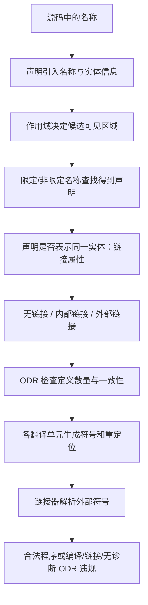

# 第 17 天：声明、定义、名称查找、链接与 ODR

## 第一遍：先把一个具体问题学会（必学）

> 如果你的基础较弱，今天先只完成这一节和配套练习。下面的“第二遍”是专业细节，不是读懂第一遍的前置条件。

### 1. 今天到底解决什么问题

同一个 `config` 在头文件、源文件和多个翻译单元中出现时，名称查找、链接属性和 ODR 分别处理不同问题。

### 2. 先看这几行代码

```cpp
// config.hpp
#pragma once
extern int control_rate_hz;
inline constexpr double max_force{10.0};

// config.cpp
#include "config.hpp"
int control_rate_hz{125};
```

不要先问“这个术语的完整定义是什么”。先逐行回答：当前已有哪个对象、值或文件；这一行读了什么；这一行改变或生成了什么。

### 3. 沿着同一批对象或文件走一遍

| 顺序 | 你必须能指出的具体变化 |
|---|---|
| 1 | 名称查找决定当前代码中的 `control_rate_hz` 指向哪个可见声明 |
| 2 | `extern` 声明不在头文件中创建新的变量定义 |
| 3 | `config.cpp` 提供唯一普通定义 |
| 4 | 外部链接允许不同翻译单元的声明指向同一实体 |
| 5 | `inline constexpr` 变量可按 C++17 规则在多个翻译单元包含相同定义 |

如果不能复述上表，就修改一个输入、手写预测并运行 [本课可运行示例](../examples/day-17/main.cpp)；不要靠继续读更多术语解决。

### 4. 只给已经看到的现象命名

| 核心概念 | 先用人话理解 | 回到代码或命令找证据 |
|---|---|---|
| **声明与定义** | 声明让名字可用；定义提供实体或存储。 | 头文件声明、`.cpp` 定义 |
| **名称查找** | 编译器在当前上下文决定一个名字指向哪个声明。 | 局部、类、命名空间查找 |
| **链接属性** | 名字是否能跨翻译单元表示同一实体。 | 内部/外部链接 |
| **ODR** | 需要唯一实体的定义不能在程序中产生冲突；某些 inline/模板定义有专门允许规则。 | 头文件错误定义导致多重定义 |

这些解释是第一遍可用模型。第二遍会补边界和专业规则；补细节不等于推翻这里的主线。

### 5. 先形成一个求职可用回答

> 声明引入名称和属性，定义真正提供对象或函数实体。名称查找发生在编译期，决定源代码中的名字指哪个声明；链接处理跨目标文件符号；链接属性描述不同作用域或翻译单元中的声明能否指向同一实体；ODR 规定定义的数量和可重复条件。`static` 在块内、命名空间和类成员语境含义不同，不能统一解释成“变量一直存在”。

这段话的结构是“具体问题 → 代码/对象/文件发生什么 → 使用哪条规则 → 有什么边界”。不要只背术语。

请直接在问题下写自己的版本：

1. 名称查找成功为什么仍可能链接失败？

   > 

2. 命名空间作用域 `static` 与函数局部 `static` 分别影响什么？

   > 

### 6. 今天明确不要求什么

不背 ODR 所有例外；先能修复头文件定义、缺失定义和内部/外部链接问题。

暂缓不等于删除：第二遍会明确展开，课程计划也标出了对应单元。

### 7. 必须动手完成

- 可运行示例：[main.cpp](../examples/day-17/main.cpp)
- 配套练习：[day-17.md](../exercises/day-17.md)
- 编程任务：建立 `config.hpp`、`config.cpp` 和两个使用方，使用 `extern` 共享运行期配置，使用 `inline constexpr` 共享编译期常量。
预期结果：

```text
两个使用方观察到同一个 `control_rate_hz` 对象
```

- 故障实验：构建两个使用方，记录重复定义。至少给出 `extern` 分离定义或 C++17 `inline` 变量两种修复思路，并解释适用差异。

第一遍完成标准：

- [ ] 我实际运行了正常示例，而不是只读代码。
- [ ] 我能不看讲义复述上面的状态变化表。
- [ ] 我完成了概念检查、可运行任务和调试任务，并写下面试口述初稿。
- [ ] 我能说出一个当前方案的限制，不把入门模型说成全部规则。

---

## 第二遍：完整专业细节（完成第一遍后再读）

这一部分保留完整语言模型、工具边界和深入实验。第一遍已经能跑、能调试、能口述后再进入；一次只读一个小节，并继续把术语落回代码、对象、文件或诊断。

## 今日目标

本单元从 C++ 语言规则解释第 15～16 天看到的头文件、目标符号和链接错误。学完后，你应能区分声明与定义、作用域与链接，能追踪限定/非限定名称查找，能判断名称具有无链接、内部链接还是外部链接，并能正确使用 `static`、`extern`、`inline` 与头文件中的定义。

## 关键术语索引

索引只用于查阅与复习；正文会在规则参与推导的位置重新解释。

| 可点击术语 | 一句话直观解释 |
|---|---|
| [声明](#术语-d17-01-声明) | 向程序引入或重新说明名称和实体。 |
| [定义](#术语-d17-02-定义) | 提供实体的完整定义性信息。 |
| [实体](#术语-d17-03-实体) | 变量、函数、类型、命名空间等语言中的对象。 |
| [名称](#术语-d17-04-名称) | 用来指代实体、标签或模板等的语言表示。 |
| [作用域](#术语-d17-05-作用域) | 名称可被名称查找找到的程序区域。 |
| [名称查找](#术语-d17-06-名称查找) | 把代码中的名称关联到声明集合。 |
| [非限定名称查找](#术语-d17-07-非限定名称查找) | 查找没有 `::` 限定前缀的名称。 |
| [限定名称查找](#术语-d17-08-限定名称查找) | 在指定类、命名空间或枚举范围内查找名称。 |
| [名称隐藏](#术语-d17-09-名称隐藏) | 内层声明使外层同名声明不再由普通查找得到。 |
| [`using` 声明](#术语-d17-10-using声明) | 把一个指定名称引入当前声明区域。 |
| [`using` 指令](#术语-d17-11-using指令) | 让某命名空间成员参与非限定查找。 |
| [链接](#术语-d17-12-链接) | 决定不同作用域或翻译单元中的声明是否指同一实体。 |
| [无链接](#术语-d17-13-无链接) | 名称不会借链接关系跨声明指向同一实体。 |
| [内部链接](#术语-d17-14-内部链接) | 同一翻译单元内的相应声明可指向同一实体。 |
| [外部链接](#术语-d17-15-外部链接) | 不同翻译单元的相应声明可指向同一实体。 |
| [语言链接](#术语-d17-16-语言链接) | 规定函数类型和外部名称与语言约定的关系。 |
| [一次定义规则](#术语-d17-17-一次定义规则) | 约束定义数量与允许多定义时的一致性。 |
| [ODR使用](#术语-d17-18-odr使用) | 某种使用要求程序提供实体定义。 |
| [`static`](#术语-d17-19-static) | 语境不同可表示内部链接、静态存储期或静态成员。 |
| [`extern`](#术语-d17-20-extern) | 声明链接规格或语言链接，并常用于只声明外部实体。 |
| [`inline`](#术语-d17-21-inline) | 允许符合规则的定义出现在多个翻译单元。 |
| [内联变量](#术语-d17-22-内联变量) | C++17 中可在头文件定义且跨翻译单元表示同一实体的变量。 |
| [未命名命名空间](#术语-d17-23-未命名命名空间) | 为翻译单元提供唯一命名空间和内部链接实体。 |
| [块作用域静态对象](#术语-d17-24-块作用域静态对象) | 名称局部但对象具有静态存储期的对象。 |
| [类型别名](#术语-d17-25-类型别名) | 现有类型的另一个名称，不创建新类型或对象符号。 |
| [可达定义](#术语-d17-26-可达定义) | 在要求处按规则能够看到并使用的定义。 |

## 一、完整知识地图



必须同时追踪四个维度：名称在哪里可查找、名称是否跨翻译单元表示同一实体、对象存在多久、程序需要几个定义。作用域、链接、存储期和生命周期互不等价。

## 二、范围标签

### 今天掌握

- 区分声明、定义、名称和实体
- 限定/非限定名称查找、隐藏与 `using` 的基本规则
- 区分作用域、存储期和链接
- 无链接、内部链接、外部链接与语言链接
- 命名空间作用域 `static`、块作用域 `static`、`extern`
- ODR 的程序级单定义基线与允许多定义类别
- `inline` 函数、C++17 inline 变量与头文件定义
- 未命名命名空间和自包含头接口

### 先看全貌

- 完整名称查找还包括类成员查找、参数相关查找（ADL）、两阶段模板查找
- ODR 多定义许可要求相同记号序列及相同名称查找结果等条件
- 语言链接、名称修饰和调用约定由 ABI 落地
- 静态/线程存储对象还有跨翻译单元初始化顺序问题

### 后续深入

- 第 19～20 天：类静态成员、构造/析构和静态初始化顺序风险
- 第 25 天：ADL、运算符重载、重载集合与 C/C++ 名称
- 第 27 天：模板定义可见性、两阶段查找与实例化 ODR
- 第 33 天：生成头、编译定义、可见性、ABI 和跨库边界
- 第 35 天：块作用域静态初始化的并发保证

## 三、声明与定义：头文件边界的基础

直观上，[声明](#术语-d17-01-声明)让当前翻译单元知道名称和类型，[定义](#术语-d17-02-定义)提供实体所需的完整定义性信息。

```cpp
int current_mode();         // 函数声明，不是定义
extern int active_mode;     // 对象声明，不是定义
int current_mode() {        // 函数定义
    return active_mode;
}
int active_mode{2};         // 对象定义
```

定义也是声明。`extern` 并不保证“永远只是声明”：

```cpp
extern int value;     // 通常是非定义声明
extern int value{1};  // 有初始化器，是定义
```

名称是查找入口，[实体](#术语-d17-03-实体)才是函数、对象或类型本身。多个相容声明可以表示同一实体。

## 四、名称查找先于链接器

[名称查找](#术语-d17-06-名称查找)发生在翻译单元的语义分析阶段，链接器不会替你在源码作用域中“猜名字”。

```cpp
namespace robot {
inline constexpr int max_axes{6};
}

int main() {
    int max_axes{3};
    // max_axes        -> 局部名称
    // robot::max_axes -> 命名空间名称
}
```

[非限定名称查找](#术语-d17-07-非限定名称查找)首先找到局部 `max_axes`，产生[名称隐藏](#术语-d17-09-名称隐藏)；[限定名称查找](#术语-d17-08-限定名称查找)通过 `robot::max_axes` 明确选择命名空间成员。外层实体没有消失，只是普通查找结果不同。

## 五、`using` 声明与指令不是一回事

```cpp
using robot::ModeCode;  // using 声明：引入指定名称
using namespace robot;  // using 指令：整个命名空间参与查找
```

[`using` 声明](#术语-d17-10-using声明)范围窄、意图明确；[`using` 指令](#术语-d17-11-using指令)可能让多个命名空间同名实体同时成为候选。头文件中使用 `using namespace` 会影响所有包含者，通常应避免。

以下写法是[类型别名](#术语-d17-25-类型别名)，语法同样以 `using` 开头但不是 using 声明：

```cpp
using ModeCode = int;
```

别名不创建新类型、对象或链接符号。

## 六、作用域、存储期、生命周期和链接四分法

| 问题 | 概念 |
|---|---|
| 名称在哪里能找到？ | [作用域](#术语-d17-05-作用域) |
| 不同声明是否表示同一实体？ | [链接](#术语-d17-12-链接) |
| 对象存储持续多久？ | 存储期 |
| 对象何时真正存在并可使用？ | 生命周期 |

块内局部变量的名称通常[无链接](#术语-d17-13-无链接)，并不等于它的对象一定短命：块作用域 `static` 名称局部，但对象具有静态存储期。

## 七、无链接、内部链接与外部链接

### 无链接

```cpp
void function() {
    int local{};
}
```

`local` 名称具有无链接，不能靠另一个作用域的同名声明表示同一对象。

### 内部链接

```cpp
static int file_counter{};

namespace {
int helper_state{};
}
```

命名空间作用域 `static` 名称与[未命名命名空间](#术语-d17-23-未命名命名空间)成员具有[内部链接](#术语-d17-14-内部链接)。每个翻译单元可拥有独立同名实体。

命名空间作用域非模板、非 `volatile` 的 `const` 变量默认也常具有内部链接，但 `extern`、`inline`、先前声明等会改变结论；不要只凭“有 const”机械判断。

### 外部链接

```cpp
extern int active_mode; // 头文件声明
int active_mode{2};     // 一个 .cpp 中的定义
```

相应声明通过[外部链接](#术语-d17-15-外部链接)表示同一对象。每个使用翻译单元看到声明，整个程序提供符合 ODR 的定义。

## 八、`static` 的三个语境不能混称

[`static`](#术语-d17-19-static) 的意义取决于位置：

| 位置 | 当前核心作用 |
|---|---|
| 命名空间作用域 | 名称获得内部链接 |
| 块作用域 | 对象具有静态存储期；名称仍局部 |
| 类定义内 | 声明静态数据/函数成员，第 19 天深入 |

示例 `current_mode()` 中：

```cpp
int current_mode() {
    static int calls{};
    ++calls;
    return active_mode + calls;
}
```

[`块作用域静态对象`](#术语-d17-24-块作用域静态对象) `calls` 只初始化一次，每次调用共享同一对象。这里重点是静态存储期，不是把名称变成跨文件外部链接。

## 九、`extern` 与语言链接是两个问题

[`extern`](#术语-d17-20-extern) 对象声明常用于共享外部实体：

```cpp
extern int active_mode;
```

而下面是[语言链接](#术语-d17-16-语言链接)：

```cpp
extern "C" int device_read(int channel);
```

`"C"` 指定 C 语言链接类别，通常影响名称修饰和调用 ABI；它不表示“动态库函数”，也不能自动解决库搜索或定义缺失。具体二进制效果由实现 ABI 决定。

## 十、ODR：不是所有定义都只能写一次

先掌握[一次定义规则](#术语-d17-17-一次定义规则)的三层基线：

1. 一个翻译单元内，可定义项通常不得出现多个定义
2. 程序中每个被 [ODR使用](#术语-d17-18-odr使用) 的非 inline 函数或变量需要且通常只能有一个定义
3. 类、枚举、inline 函数/变量、模板等允许在多个翻译单元定义，但必须满足严格一致性条件

有些跨翻译单元 ODR 违规“不要求诊断”，所以“链接成功”不能证明程序满足 ODR。

## 十一、错误实验：把普通变量定义放进头文件

[bad_definition.hpp](../examples/day-17/include/bad_definition.hpp) 含：

```cpp
int duplicated_mode{1};
```

`bad_a.cpp` 与 `bad_b.cpp` 都包含它，各自生成一个外部定义。链接三个目标文件时通常报告 `multiple definition`：

```bash
g++ -std=c++17 -Iexamples/day-17/include -c examples/day-17/bad_a.cpp -o build/day-17/bad_a.o
g++ -std=c++17 -Iexamples/day-17/include -c examples/day-17/bad_b.cpp -o build/day-17/bad_b.o
g++ -std=c++17 -Iexamples/day-17/include -c examples/day-17/bad_main.cpp -o build/day-17/bad_main.o
g++ build/day-17/bad_main.o build/day-17/bad_a.o build/day-17/bad_b.o -o build/day-17/bad_app
```

包含保护只防同一翻译单元重复纳入头正文；它不能阻止两个不同翻译单元各自得到定义。

## 十二、错误实验：`extern` 声明没有定义

[missing_main.cpp](../examples/day-17/missing_main.cpp)：

```cpp
extern int missing_value;
int main() { return missing_value; }
```

声明与名称查找都合法，目标文件留下未定义符号；若整个链接输入没有定义，链接器报告 `undefined reference`。这与同一翻译单元中“名称未声明”的狭义编译错误不同。

## 十三、`inline` 的核心不是强制优化

[`inline`](#术语-d17-21-inline) 函数可在头文件定义：

```cpp
inline ModeCode double_mode(ModeCode value) {
    return value * 2;
}
```

每个使用它的翻译单元必须有[可达定义](#术语-d17-26-可达定义)，多个定义须满足 ODR 一致性条件，并表示同一实体。编译器仍可不做调用展开；不写 `inline` 的小函数也可能被优化展开。

类定义内部定义的函数隐式 inline；`constexpr` 函数也隐式 inline。模板定义可见性在第 27 天系统学习。

## 十四、C++17 内联变量解决头文件共享常量

[`内联变量`](#术语-d17-22-内联变量)：

```cpp
inline constexpr int max_axes{6};
```

它可以在头文件中出现于多个翻译单元，符合 ODR 时表示同一个实体。相比普通命名空间 `const` 的内部链接副本，inline 变量能提供程序级统一身份和地址。

选择指南：

- 编译期常量且不要求统一地址：普通 `constexpr`/`const` 内部链接可能足够
- 头文件中需要跨翻译单元统一实体：`inline constexpr`
- 可修改共享对象：头文件 `extern` 声明 + 一个 `.cpp` 定义，或谨慎使用 inline 变量

## 十五、完整正确示例

文件：

```text
examples/day-17/
├── include/linkage_demo.hpp
├── main.cpp
├── config.cpp
├── left.cpp
└── right.cpp
```

构建：

```bash
mkdir -p build/day-17
g++ -std=c++17 -Wall -Wextra -Wpedantic -Wconversion -Wsign-conversion \
    -Iexamples/day-17/include \
    examples/day-17/main.cpp examples/day-17/config.cpp \
    examples/day-17/left.cpp examples/day-17/right.cpp \
    -o build/day-17/linkage_demo
./build/day-17/linkage_demo
```

预期输出：

```text
local max axes: 3
shared max axes: 6
shared mode: 2
current mode calls: 3, 4
inline double: 8
file locals: 10, 20
```

真实状态：

- 局部 `max_axes` 隐藏命名空间同名变量，限定名称仍可访问共享值 6
- `active_mode` 在 `config.cpp` 定义一次，其他翻译单元通过 `extern` 声明引用
- `calls` 是一个块作用域静态对象，两次调用分别累积为 1、2
- `double_mode` 与 `max_axes` 的 inline 定义可出现在多个翻译单元
- `left.cpp` 的未命名命名空间对象与 `right.cpp` 的 namespace-scope `static` 对象互不相同

## 十六、用符号表观察语言链接结果

分别生成目标文件：

```bash
g++ -std=c++17 -Iexamples/day-17/include -c examples/day-17/config.cpp -o build/day-17/config.o
g++ -std=c++17 -Iexamples/day-17/include -c examples/day-17/left.cpp -o build/day-17/left.o
g++ -std=c++17 -Iexamples/day-17/include -c examples/day-17/right.cpp -o build/day-17/right.o
nm -C build/day-17/config.o build/day-17/left.o build/day-17/right.o
```

外部链接实体通常显示为全局符号，内部链接对象显示为局部符号；具体字母、名称修饰和优化结果属于 ELF/ABI 工具行为，不是 C++ 语言定义链接属性的方法。

## 十七、枚举、别名和命名空间跨文件边界

类、枚举和[类型别名](#术语-d17-25-类型别名)通常放在受保护的头文件，使各翻译单元看到一致声明/定义：

```cpp
namespace robot {
enum class State { idle, active };
using ModeCode = int;
}
```

类型别名不会产生链接符号；枚举类型定义可按 ODR 条件出现在多个翻译单元。命名空间可跨文件重开，但相应实体的名称查找、链接和定义仍必须满足规则。

完整 ADL、内联命名空间和模板两阶段查找分别在第 25、27 天继续。

## 十八、静态初始化顺序先看全貌

命名空间作用域静态存储对象会经历静态初始化与可能的动态初始化。不同翻译单元中动态初始化的相对顺序存在复杂规则；若一个全局对象构造依赖另一个翻译单元尚未完成初始化的对象，会形成常说的“静态初始化顺序问题”。

今天不构造类对象实验。第 19～20 天学习构造/析构与函数局部静态替代方案，第 33 天结合工程配置闭环，并登记为 `G33`。

## 十九、完整构建链路中的位置

```text
源文件 → 预处理 → 翻译单元
→ 狭义编译：名称查找、类型检查、ODR 的翻译单元内约束
→ 汇编 → 目标文件：局部/全局/未定义符号与重定位
→ 链接：跨目标文件符号解析，可能发现重复/缺失定义
→ 可执行文件 → 装载/动态链接 → 运行库启动 → main
```

语言 ODR 与工具链接错误相关但不相同：有些 ODR 违规可被链接器发现，有些不要求实现诊断。

## 二十、常见误解校正

1. 定义一定是声明；声明不一定是定义。
2. `extern` 对象声明带初始化器时仍是定义。
3. 作用域回答“名字在哪能找到”，链接回答“声明是否表示同一实体”。
4. 内部链接不等于自动存储期；无链接也不等于对象短命。
5. 命名空间作用域 `static` 与块作用域 `static` 作用不同。
6. `extern "C"` 是语言链接，不等于动态库或普通外部链接说明。
7. 包含保护不能阻止头定义在多个翻译单元重复出现。
8. `inline` 的语言作用不是命令优化器必须展开函数。
9. inline 多定义不是“随便复制”；定义和名称查找结果须满足 ODR。
10. 链接成功不能证明所有跨翻译单元 ODR 规则都满足。

## 二十一、随堂练习

1. 分类十组声明：是否为定义、名称具有什么链接。
2. 画出局部隐藏、限定查找和 `using` 后的声明集合。
3. 用 `nm -C` 对比内部/外部链接实体。
4. 复现头文件普通变量导致的重复定义。
5. 复现只有 `extern` 声明导致的未定义引用。
6. 把错误头变量改成 `extern + 单一 .cpp 定义` 与 `inline` 两种合法方案。
7. 解释块作用域静态对象为什么名称局部而状态持久。

完整作答区见：[第 17 天练习单](../exercises/day-17.md)。

## 二十二、本单元偿还与新增的知识缺口

### 本次补全

- `G03`：补齐头文件跨翻译单元重复定义、ODR 与 `inline` 边界，该计划项教材闭环
- `G11`：补齐作用域、存储期、生命周期与链接四个维度，该计划项教材闭环
- `G17`：补充限定/非限定名称查找、隐藏与 `using`；ADL、用户定义转换和模板重载仍待后续单元
- `G23`：补齐枚举定义在头文件中的作用域、链接与 ODR 基础，该计划项教材闭环
- `G24`：补充类型别名在头文件/跨翻译单元中的影响；别名模板待第 27 天
- `G25`：补充命名空间跨翻译单元、名称查找、内部/外部链接与 ODR；ADL、嵌套/内联命名空间待第 25、27 天
- `G31`：补充经典头文件模型的 ODR、`extern` 与 `inline`；模板定义可见性和构建系统仍待第 27、33 天
- `G32`：把 ELF 符号实验连接到 C++ 语言链接、内部/外部链接和 ODR；ABI/库配置仍待第 25、27、33 天

### 新增追踪项

- `G33`：命名空间作用域静态存储对象的跨翻译单元初始化/销毁顺序，第 19～20 天结合构造析构，第 33 天结合工程配置闭环

## 二十三、今日完成标准

- 能区分声明、定义、名称和实体
- 能执行限定与非限定名称查找并解释隐藏
- 能区分 using 声明、using 指令和类型别名
- 能区分作用域、存储期、生命周期与链接
- 能判断无链接、内部链接和外部链接的常见声明
- 能准确解释 `static`、`extern` 与 `extern "C"`
- 能说明 ODR 基线及允许多定义的主要类别
- 能解释 `inline` 与优化器内联不是同一保证
- 能正确选择 `extern + 单定义` 或 C++17 inline 变量
- 能复现并定位重复定义和未定义引用
- 完成并同步第 17 天练习单

下一单元：编译警告、调试器、Sanitizer 与错误分类。

---

## 附录：关键术语卡（查阅用）

###### 术语-d17-01-声明

**声明（declaration，C++ 标准术语）**

- **新手先这样理解：** 它告诉当前程序区域“有这个名字，它代表什么”。
- **专业上更准确地说：** 声明可引入或重新声明名称/实体，并指定类型、链接、属性等；函数原型、`extern` 对象声明、类型定义都属于声明，但并非每个声明都是定义。

###### 术语-d17-02-定义

**定义（definition，C++ 标准术语）**

- **新手先这样理解：** 它提供函数体、完整类型内容，或真正定义对象。
- **专业上更准确地说：** 定义是满足标准定义条件的声明，例如带函数体的函数声明、类说明、通常不含 `extern` 的对象声明；标准列有不构成定义的声明形式和例外。

###### 术语-d17-03-实体

**实体（entity，C++ 标准术语）**

- **新手先这样理解：** 它是语言中能被声明、定义或引用的具体项目。
- **专业上更准确地说：** 实体包括值、对象、引用、结构化绑定、函数、枚举项、类型、类成员、位域、模板、模板特化、命名空间等；名称与实体不是同一概念。

###### 术语-d17-04-名称

**名称（name，C++ 标准术语）**

- **新手先这样理解：** 它是代码中用来找到某个实体的表达方式。
- **专业上更准确地说：** 名称可由标识符、运算符函数名、转换函数名等构成，并通过名称查找关联声明；一个实体可有多个声明，同一拼写在不同作用域也可代表不同实体。

###### 术语-d17-05-作用域

**作用域（scope，C++ 标准术语）**

- **新手先这样理解：** 它回答“这个名称在代码哪些位置可能被找到”。
- **专业上更准确地说：** 作用域是声明引入名称后参与名称查找的程序区域；作用域不决定对象存活多久，也不等同于名称链接属性。

###### 术语-d17-06-名称查找

**名称查找（name lookup，C++ 标准术语）**

- **新手先这样理解：** 编译器根据当前位置和限定信息寻找这个名字对应哪些声明。
- **专业上更准确地说：** 名称查找按限定/非限定、作用域层次、`using`、参数相关查找等规则产生声明集合，随后语义分析、重载决议或模板规则继续选择。

###### 术语-d17-07-非限定名称查找

**非限定名称查找（unqualified name lookup，C++ 标准术语）**

- **新手先这样理解：** 对 `limit` 这类没写所属范围的名字，从当前位置按作用域规则向外找。
- **专业上更准确地说：** 非限定查找依当前语境搜索块、类、命名空间等作用域，并可能结合 `using` 指令与参数相关查找；内层命中常隐藏外层同名声明。

###### 术语-d17-08-限定名称查找

**限定名称查找（qualified name lookup，C++ 标准术语）**

- **新手先这样理解：** 对 `robot::limit` 明确去 `robot` 命名空间找 `limit`。
- **专业上更准确地说：** 限定名称以嵌套名称说明符或限定枚举等指定查找范围，按该范围及相关规则解析；`::name` 从全局命名空间开始。

###### 术语-d17-09-名称隐藏

**名称隐藏（name hiding，名称查找现象）**

- **新手先这样理解：** 内层出现同名声明后，普通查找先看到内层，外层并未消失。
- **专业上更准确地说：** 某作用域中的声明可阻止非限定查找继续找到外层同名声明；可通过资格限定、`using` 声明或重命名消除歧义。

###### 术语-d17-10-using声明

**`using` 声明（using-declaration，C++ 标准术语）**

- **新手先这样理解：** 它把某一个明确名称引进当前区域。
- **专业上更准确地说：** `using robot::ModeCode;` 使指定声明参与当前作用域查找；它不同于定义类型别名的 `using Alias = Type;`。

###### 术语-d17-11-using指令

**`using` 指令（using-directive，C++ 标准术语）**

- **新手先这样理解：** `using namespace robot;` 让整个命名空间的名称参加非限定查找。
- **专业上更准确地说：** using-directive 使被指名命名空间的成员按规则参与非限定查找，并可能引入歧义；头文件中通常避免使用它以免污染所有包含者。

###### 术语-d17-12-链接

**链接（linkage，C++ 语言术语）**

- **新手先这样理解：** 它回答不同位置的同名声明能否表示同一个实体。
- **专业上更准确地说：** 名称可具有无链接、内部链接、外部链接（C++20 另有模块链接）；链接是名称属性，与链接器执行的目标文件链接过程相关但不等同。

###### 术语-d17-13-无链接

**无链接（no linkage，C++ 标准术语）**

- **新手先这样理解：** 这个局部名称只靠当前声明和作用域识别，不跨位置合并实体。
- **专业上更准确地说：** 未明确具有内部/外部链接的块作用域非 `extern` 名称等具有无链接；同名声明不会借链接规则在其他作用域指向同一实体。

###### 术语-d17-14-内部链接

**内部链接（internal linkage，C++ 标准术语）**

- **新手先这样理解：** 名称表示的实体只在当前翻译单元内共享身份。
- **专业上更准确地说：** 具有内部链接的名称在同一翻译单元的适当声明中可指向同一实体，但不会与其他翻译单元的同名实体建立外部链接身份。

###### 术语-d17-15-外部链接

**外部链接（external linkage，C++ 标准术语）**

- **新手先这样理解：** 多个翻译单元可以用相应声明指向同一个函数或对象。
- **专业上更准确地说：** 具有外部链接的名称可在其他翻译单元的声明中表示同一实体，前提是声明可对应且程序满足 ODR、类型和语言链接等规则。

###### 术语-d17-16-语言链接

**语言链接（language linkage，C++ 标准术语）**

- **新手先这样理解：** `extern "C"` 指定 C 语言调用/命名约定，而不是简单说“在外部”。
- **专业上更准确地说：** 语言链接作用于具有外部链接的函数类型和函数/变量名称；C++ 标准规定 C 与 C++ 语言链接类别，但具体调用约定和符号编码由实现 ABI 完成。它与 internal/external linkage 是不同维度。

###### 术语-d17-17-一次定义规则

**一次定义规则（One Definition Rule, ODR，C++ 标准术语）**

- **新手先这样理解：** 普通外部实体通常只能有一个程序级定义；少数头文件实体允许多个一致定义。
- **专业上更准确地说：** ODR 约束翻译单元内定义数量、程序中 odr-use 实体所需定义，以及类、枚举、inline、模板等允许多翻译单元定义时的记号与名称查找一致性条件。

###### 术语-d17-18-odr使用

**ODR 使用（odr-use，C++ 标准术语）**

- **新手先这样理解：** 这种使用真的需要该对象或函数实体存在，所以必须提供定义。
- **专业上更准确地说：** 名称在潜在求值表达式中按规则指名对象/引用或函数时可能构成 odr-use；常量表达式、不可用结果和非 odr-use 等存在例外。今天掌握“调用函数、取对象地址通常需要定义”的工程判断。

###### 术语-d17-19-static

**`static`（C++ 关键字）**

- **新手先这样理解：** 它的作用必须看语境，不能统一翻译成“静态变量”。
- **专业上更准确地说：** 命名空间作用域的 `static` 名称具有内部链接；块作用域 `static` 对象具有静态存储期但名称仍局部；类中 `static` 声明静态成员，第 19 天学习。

###### 术语-d17-20-extern

**`extern`（C++ 关键字与存储类说明符）**

- **新手先这样理解：** 它常用于声明“定义在别处的同一个外部实体”。
- **专业上更准确地说：** `extern` 可指定外部链接声明；不带初始化器的对象声明通常不是定义，而 `extern int value{1};` 是定义。`extern "C"` 是语言链接说明，不能与存储类 `extern` 混为一谈。

###### 术语-d17-21-inline

**`inline`（C++ 说明符）**

- **新手先这样理解：** 它的核心语言作用是允许头文件中的同一定义出现在多个翻译单元。
- **专业上更准确地说：** 在本课程的 C++17 主线中，具有外部链接的 inline 函数或变量可在多个翻译单元定义，定义须可达并满足 ODR 多定义条件；是否真的展开调用由优化器决定，不受该关键字强制。模块链接属于 C++20 以后外延。

###### 术语-d17-22-内联变量

**内联变量（inline variable，C++17 标准术语）**

- **新手先这样理解：** 它允许变量直接在头文件定义，而整个程序仍表示同一个实体。
- **专业上更准确地说：** C++17 的 inline 变量遵循 inline 多定义规则；具有外部链接时，各翻译单元中的定义表示一个具有一个地址的实体。`inline constexpr` 常用于头文件常量。

###### 术语-d17-23-未命名命名空间

**未命名命名空间（unnamed namespace，C++ 标准术语）**

- **新手先这样理解：** 它给当前翻译单元创建私有的命名空间范围。
- **专业上更准确地说：** 未命名命名空间在每个翻译单元拥有唯一名称并隐式引入，其内部名称具有内部链接；现代 C++ 常用它替代命名空间作用域 `static` 来组织文件内实现。

###### 术语-d17-24-块作用域静态对象

**块作用域静态对象（block-scope static object，C++ 对象模型术语）**

- **新手先这样理解：** 名称只能在函数块里使用，但对象贯穿程序运行期保留状态。
- **专业上更准确地说：** 块作用域 `static` 对象具有静态存储期，动态初始化在控制首次经过声明时执行；其名称通常无链接。C++11 起初始化具线程安全保证，并发细节第 35 天学习。

###### 术语-d17-25-类型别名

**类型别名（type alias，C++ 标准术语）**

- **新手先这样理解：** 它给已有类型增加另一个名字，不生成对象或链接符号。
- **专业上更准确地说：** `using ModeCode = int;` 声明别名名称，别名与原类型不是两个不同类型；别名放入头文件会在每个翻译单元参与类型解析，但不需要链接器寻找别名定义。

###### 术语-d17-26-可达定义

**可达定义（reachable definition，C++ 标准概念）**

- **新手先这样理解：** 当前使用点必须按语言规则能看到所需的 inline/类/模板定义。
- **专业上更准确地说：** 对要求定义可达的实体，定义需在使用点的可达语义范围内；普通非 inline 函数调用只需声明可见且程序某处有一个定义，而 inline 函数定义必须在使用翻译单元可达。

---
