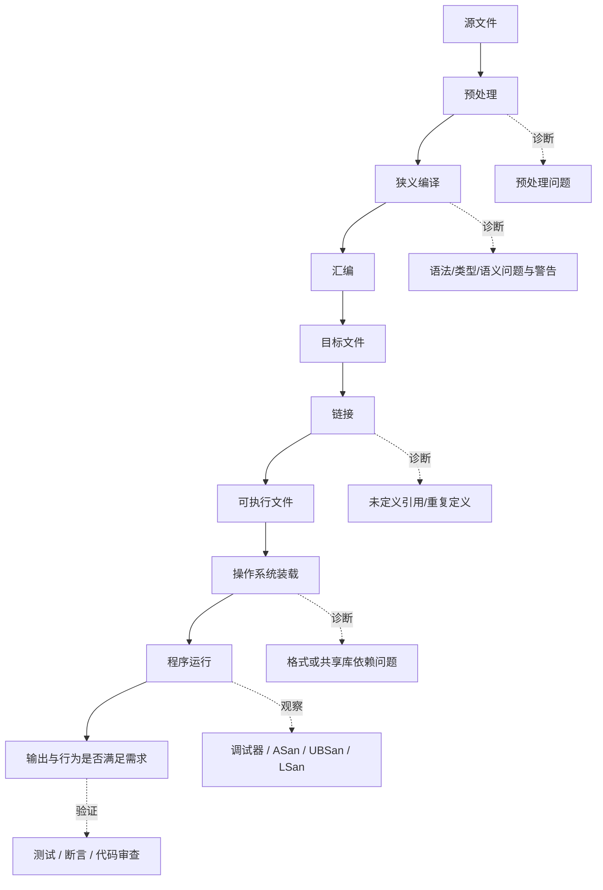

# 第 18 天：警告、调试器、Sanitizer 与错误分类

## 第一遍：先把一个具体问题学会（必学）

> 如果你的基础较弱，今天先只完成这一节和配套练习。下面的“第二遍”是专业细节，不是读懂第一遍的前置条件。

### 1. 今天到底解决什么问题

程序崩溃时，直接盯源码猜往往效率很低。工程流程应该先判断失败阶段，再选择警告、调试器、Sanitizer、测试或日志。

### 2. 先看这几行代码

```cpp
std::vector<int> samples{1, 2, 3};
for (std::size_t i{0}; i <= samples.size(); ++i) {
    std::cout << samples[i] << '\n';
}
```

不要先问“这个术语的完整定义是什么”。先逐行回答：当前已有哪个对象、值或文件；这一行读了什么；这一行改变或生成了什么。

### 3. 沿着同一批对象或文件走一遍

| 顺序 | 你必须能指出的具体变化 |
|---|---|
| 1 | 编译器可接受语法，严格警告不一定证明程序安全 |
| 2 | 程序运行到 `i == size()` 时越界 |
| 3 | 使用 `-g -Og` 便于调试器对应源码 |
| 4 | 使用 AddressSanitizer 重新构建，本次执行会检测许多越界与失效内存访问 |
| 5 | 修复为 `i < samples.size()`，再加入边界测试防止回归 |

如果不能复述上表，就修改一个输入、手写预测并运行 [本课可运行示例](../examples/day-18/debug_target.cpp)；不要靠继续读更多术语解决。

### 4. 只给已经看到的现象命名

| 核心概念 | 先用人话理解 | 回到代码或命令找证据 |
|---|---|---|
| **错误分类** | 先判断问题出在编译、链接、运行还是业务结果。 | 不同工具负责不同证据 |
| **编译器警告** | 编译成功时仍报告可疑代码；应作为待解释问题。 | `-Wall -Wextra -pedantic` |
| **调试器** | 暂停进程、看调用栈、变量和执行位置。 | 断点、step、backtrace |
| **Sanitizer** | 给程序加运行期检查，暴露越界、释放后使用等问题。 | ASan / UBSan |

这些解释是第一遍可用模型。第二遍会补边界和专业规则；补细节不等于推翻这里的主线。

### 5. 先形成一个求职可用回答

> 先把问题分为预处理、编译、链接、装载和运行期，再选工具。警告帮助发现可疑代码但不是语言合法性的完整判定；调试器观察控制流和变量；Sanitizer 通过插桩检测本次执行覆盖到的部分内存或未定义行为；测试验证需求；日志保留现场。没有一个工具能单独证明程序完全正确。

这段话的结构是“具体问题 → 代码/对象/文件发生什么 → 使用哪条规则 → 有什么边界”。不要只背术语。

请直接在问题下写自己的版本：

1. 为什么“零警告”不等于程序没有错误？

   > 

2. ASan、UBSan 和调试器分别最适合解决什么问题？

   > 

### 6. 今天明确不要求什么

不一次学习所有调试器命令；先完成“分类→最小复现→工具证据→修复→回归”。

暂缓不等于删除：第二遍会明确展开，课程计划也标出了对应单元。

### 7. 必须动手完成

- 可运行示例：[debug_target.cpp](../examples/day-18/debug_target.cpp)
- 配套练习：[day-18.md](../exercises/day-18.md)
- 编程任务：对一个越界程序依次使用严格警告、调试构建、GDB 和 ASan，写出每种工具提供了什么证据。
预期结果：

```text
ASan 指出越界访问；修复后输出 1、2、3 且不再报告
```

- 故障实验：开启严格警告记录诊断，再初始化变量。说明警告为什么不是语言规则的完整证明。

第一遍完成标准：

- [ ] 我实际运行了正常示例，而不是只读代码。
- [ ] 我能不看讲义复述上面的状态变化表。
- [ ] 我完成了概念检查、可运行任务和调试任务，并写下面试口述初稿。
- [ ] 我能说出一个当前方案的限制，不把入门模型说成全部规则。

---

## 第二遍：完整专业细节（完成第一遍后再读）

这一部分保留完整语言模型、工具边界和深入实验。第一遍已经能跑、能调试、能口述后再进入；一次只读一个小节，并继续把术语落回代码、对象、文件或诊断。

## 今日目标

学完本单元后，你应能先判断问题发生在预处理、狭义编译、汇编、链接、装载还是运行阶段，再选择编译器诊断、调试器或 Sanitizer；能够构建带调试信息的 C++17 程序，使用 GDB 的断点、单步、变量查看和调用栈命令，并能准确解释 ASan、UBSan 的能力边界。

## 关键术语索引

索引只用于查阅与复习，不能替代正文教学；正文会在术语真正参与分析的位置解释并链接到这里。

| 可点击术语 | 一句话直观解释 |
|---|---|
| [诊断信息](#术语-d18-01-诊断信息) | 工具针对程序问题给出的错误、警告或说明。 |
| [病式程序](#术语-d18-02-病式程序) | 不满足 C++ 语法或可诊断语义规则的程序。 |
| [无需诊断规则](#术语-d18-03-无需诊断规则) | 程序不合法，但实现不一定必须报告。 |
| [编译警告](#术语-d18-04-编译警告) | 编译器认为可疑但仍允许继续构建的提示。 |
| [编译错误](#术语-d18-05-编译错误) | 翻译阶段无法接受当前翻译单元的问题。 |
| [链接错误](#术语-d18-06-链接错误) | 目标文件或库无法组合成所需程序的问题。 |
| [装载错误](#术语-d18-07-装载错误) | 操作系统装载程序及其依赖时失败。 |
| [运行时错误](#术语-d18-08-运行时错误) | 程序启动后发生崩溃、异常终止或非法行为。 |
| [逻辑错误](#术语-d18-09-逻辑错误) | 程序能运行，却没有实现预期需求。 |
| [调试信息](#术语-d18-10-调试信息) | 机器指令与源文件、行号、变量之间的映射信息。 |
| [调试器](#术语-d18-11-调试器) | 控制进程执行并检查状态的工具。 |
| [断点](#术语-d18-12-断点) | 让调试器在指定位置暂停执行的条件。 |
| [单步执行](#术语-d18-13-单步执行) | 一次推进一行或一次函数调用的调试方式。 |
| [调用栈](#术语-d18-14-调用栈) | 当前活动函数调用的动态链条。 |
| [栈帧](#术语-d18-15-栈帧) | 调试器表示一次具体函数调用的上下文。 |
| [Sanitizer](#术语-d18-16-sanitizer) | 通过编译插桩和运行库检查特定错误的工具体系。 |
| [ASan](#术语-d18-17-asan) | 主要检查越界、释放后使用等内存访问错误。 |
| [UBSan](#术语-d18-18-ubsan) | 检查其已实现类别中的未定义行为。 |
| [LSan](#术语-d18-19-lsan) | 在进程结束时报告仍未释放的动态分配。 |
| [插桩](#术语-d18-20-插桩) | 在程序中加入额外检查代码和元数据。 |
| [未初始化读取](#术语-d18-21-未初始化读取) | 在对象没有确定有效值时读取它。 |
| [越界访问](#术语-d18-22-越界访问) | 访问不属于对象或数组合法范围的存储。 |
| [误报与漏报](#术语-d18-23-误报与漏报) | 工具可能报告非目标问题，也可能没有发现真实问题。 |
| [断言](#术语-d18-24-断言) | 运行时检查开发者认为必须成立的条件。 |
| [优化](#术语-d18-25-优化) | 在遵守可观察行为规则下变换程序实现。 |

## 一、完整知识地图



这张图延续第 4、15～17 天的完整构建模型。`g++ file.cpp -o app` 是编译器驱动程序组织多个阶段的命令，不表示源码一步变成可执行文件。

### 问题与主要工具的对应关系

| 问题位置 | 常见现象 | 首选证据 |
|---|---|---|
| 预处理 | 头文件找不到、宏条件错误 | 预处理器诊断、`g++ -E` |
| 狭义编译 | 语法/类型错误、可疑数据流 | 编译器 error/warning/note |
| 汇编 | 极少见的汇编输入或目标配置问题 | 汇编器诊断、`.s` 文件 |
| 链接 | `undefined reference`、`multiple definition` | 链接器诊断、`nm`、`readelf` |
| 装载 | 共享库缺失、格式不兼容 | 装载器信息、`ldd`、系统日志 |
| 运行 | 崩溃、UB、状态错误 | 调试器、Sanitizer、日志 |
| 需求结果 | 输出正确性、边界行为 | 测试、断言、审查 |

## 二、范围标签

### 今天掌握

- 完整错误阶段分类，以及编译错误、链接错误、装载错误、运行时错误、逻辑错误的边界。
- GCC 常用警告选项与“警告不等于标准规则”的准确关系。
- `-g -Og` 调试构建和 GDB 的断点、单步、变量、调用栈流程。
- ASan、UBSan、LSan 的目标、构建方式、报告阅读和能力边界。
- 未初始化读取与越界访问应选择什么工具，为什么一次无报告不能证明安全。

### 先看全貌

- 静态分析、单元测试、覆盖率和代码审查属于互补证据，不由一个 Sanitizer 取代。
- 调试信息格式、ABI 展开、core dump 与逆向级调试今天只定位到工具链中的位置。
- 多线程错误需要 ThreadSanitizer（TSan）或专门并发分析，不能与 ASan 在常见构建中随意混用。

### 后续深入

- 第 32 天：异常、错误码、`optional` 等错误处理机制。
- 第 34 天：测试、静态分析、覆盖率、代码审查和接口契约。
- 第 35 天：数据竞争、并发调试和 TSan。
- 第 33 天：把调试/Sanitizer 选项写入 CMake 构建配置。

## 三、先按阶段分类，再选择工具

当工具报错时，第一问不应是“怎么消掉红字”，而是“哪一个阶段拒绝了什么产物”。

### 3.1 编译器诊断不只等于 error

[诊断信息](#术语-d18-01-诊断信息)的直观解释是：实现针对代码给出的错误、警告或补充说明。专业上，它是实现为满足标准诊断要求或提供额外质量检查而输出的信息；严重级别和文字由工具决定。

一个[病式程序](#术语-d18-02-病式程序)不符合语言规则。多数语法和类型违规属于可诊断规则，编译器必须发出至少一条诊断；但[无需诊断规则](#术语-d18-03-无需诊断规则)意味着某些不合法程序不保证被发现，例如特定跨翻译单元 ODR 违规。

因此必须记住：

> 构建成功只说明这次工具链接受并生成了产物，不证明程序符合全部 C++ 规则，更不证明业务逻辑正确。

### 3.2 警告选项的真实含义

[编译警告](#术语-d18-04-编译警告)是编译器实现提供的可疑代码诊断。推荐学习期基线：

```bash
g++ -std=c++17 -Wall -Wextra -Wpedantic -Wconversion -Wsign-conversion source.cpp -o app
```

- `-Wall`：启用 GCC 认为常用的一组警告，不是“所有警告”。
- `-Wextra`：追加另一组常用警告。
- `-Wpedantic`：诊断所选标准模式不允许的扩展。
- `-Wconversion`、`-Wsign-conversion`：提示部分可能改变值或符号意义的隐式转换。
- `-Werror`：把启用的警告按错误处理，适合受控项目；引入旧项目时可能先逐步治理。

警告必须阅读原因，不要用强制转换、关闭警告或无意义初始化机械消音。

### 3.3 五类常见“错误”不能混称

- [编译错误](#术语-d18-05-编译错误)：翻译单元未成功生成目标文件。
- [链接错误](#术语-d18-06-链接错误)：已有目标文件，但符号解析或重定位等失败。
- [装载错误](#术语-d18-07-装载错误)：可执行文件生成后，操作系统/动态装载器无法建立进程映像。
- [运行时错误](#术语-d18-08-运行时错误)：进程启动后发生异常终止、非法访问等。
- [逻辑错误](#术语-d18-09-逻辑错误)：程序可能正常结束，但结果不符合需求。

`examples/day-18/link_error.cpp` 只有函数声明，没有定义。它能通过狭义编译并生成 `.o`，但最终链接会出现 `undefined reference`：

```bash
g++ -std=c++17 -Wall -Wextra -Wpedantic -c examples/day-18/link_error.cpp -o link_error.o
g++ link_error.o -o link_error
```

## 四、警告实验：未初始化读取与工具边界

[未初始化读取](#术语-d18-21-未初始化读取)的直观解释是“值尚未可靠写入就被使用”。专业上，本例中的自动 `int` 默认初始化后具有不确定值；在 C++17 中读取它产生未定义行为。

```cpp
int main() {
    int value;
    std::cout << value << '\n';
}
```

使用优化后的数据流分析可让 GCC 对这个直接读取给出警告：

```bash
g++ -std=c++17 -O2 -Wall -Wextra -Wpedantic -Wuninitialized \
    examples/day-18/warning_uninitialized.cpp -o warning_uninitialized
```

重要边界：

- 编译器警告是静态近似分析，可能因代码形态、优化级别和版本不同而变化。
- ASan 不是未初始化标量读取检查器。
- UBSan 也不全面检测未初始化读取。
- Clang MemorySanitizer、Valgrind Memcheck 或更强静态分析可补充，但仍不能替代正确初始化和测试。

这就是[误报与漏报](#术语-d18-23-误报与漏报)：没有警告不能推出没有错误；出现报告也要沿数据流寻找根因。

## 五、调试构建与 GDB

### 5.1 `-g` 与 `-Og` 分别做什么

[调试信息](#术语-d18-10-调试信息)让指令地址对应到源码行、类型和变量。`-g` 请求生成它；[优化](#术语-d18-25-优化)则是另一维度。学习期调试构建推荐：

```bash
g++ -std=c++17 -g -Og -Wall -Wextra -Wpedantic \
    examples/day-18/debug_target.cpp -o debug_target
```

`-Og` 保留适合调试的优化；`-O0` 更少优化但不总是最佳调试体验。复现只在发布构建出现的问题时，必须保留实际的优化和宏配置。

可以先确认调试段和地址映射：

```bash
readelf -S debug_target | grep debug
nm -C debug_target | grep weighted_sum
addr2line -e debug_target <指令地址>
```

`<指令地址>` 是命令说明中的参数位置，不是 C++ 代码。

### 5.2 一次完整 GDB 会话

[调试器](#术语-d18-11-调试器)控制被调试进程并检查其状态。以下命令在安装 GDB 的 Linux 环境执行：

```text
gdb ./debug_target
(gdb) break weighted_sum
(gdb) run
(gdb) info args
(gdb) info locals
(gdb) print weight
(gdb) next
(gdb) step
(gdb) backtrace
(gdb) frame 1
(gdb) continue
(gdb) quit
```

[断点](#术语-d18-12-断点)让执行在指定函数或源码位置暂停。[单步执行](#术语-d18-13-单步执行)中，`next` 通常跨过函数调用，`step` 通常进入函数。它们不是 C++ 语句，而是调试器命令。

[调用栈](#术语-d18-14-调用栈)显示当前线程的动态调用链；每次调用对应调试器看到的一个[栈帧](#术语-d18-15-栈帧)。`backtrace` 查看链条，`frame N` 切换查看某次调用的参数和局部变量。优化可能让变量显示为 `<optimized out>`，也可能内联或消除帧。

### 5.3 递归、有限栈资源与调试边界

第 6 天学习了递归结构，第 11 天确认每次递归调用都有各自的形参对象和自动对象；这些对象分别开始和结束生命周期。今天补齐工具层：

- C++ 标准规定函数调用、对象生命周期和可观察行为，但不规定必须使用某种固定大小的机器栈。
- 常见平台会为每个线程提供有限的调用栈空间。递归过深可能耗尽该实现资源；具体上限及表现由操作系统、ABI、编译器和运行配置决定，不能假定一定抛出可捕获的 C++ 异常。
- GDB 中可用 `backtrace 20` 查看最近 20 个帧，使用 `frame N`、`info args`、`info locals` 检查递归参数是否向基例推进。
- C++ 不保证尾调用优化。即使递归调用写在函数末尾，也不能依靠优化来保证常量栈空间；调试构建、插桩和微小代码变化都可能影响优化。

当递归程序因资源耗尽异常终止时，调试重点是：确认基例可达、递归参数单调接近基例、查看重复帧模式，并用迭代算法或显式数据结构评估是否更合适。不能用“把系统栈调大”代替修复缺失基例。

## 六、Sanitizer：让本次执行携带检查

[Sanitizer](#术语-d18-16-sanitizer)不是一个单独的万能工具，而是一组动态分析器。它通过[插桩](#术语-d18-20-插桩)和运行库，在本次执行真正经过的路径上检查已启用类别。

推荐保留帧指针和调试信息以改善报告：

```bash
-g -Og -fno-omit-frame-pointer
```

### 6.1 ASan：越界与失效内存

[越界访问](#术语-d18-22-越界访问)是访问对象合法范围之外的存储。本例中 `values.size()` 为 3，`values[3]` 使用尾后下标，解引用发生未定义行为。

[ASan](#术语-d18-17-asan)通过影子内存和访问检查检测许多越界及释放后使用错误：

```bash
g++ -std=c++17 -g -Og -Wall -Wextra -Wpedantic \
    -fsanitize=address -fno-omit-frame-pointer \
    examples/day-18/asan_out_of_bounds.cpp -o asan_out_of_bounds
./asan_out_of_bounds
```

报告阅读顺序：

1. 先看错误类别，如 `heap-buffer-overflow`。
2. 找第一处属于自己源码的调用帧，而不是只看运行库。
3. 看读/写大小和地址相对合法区域的位置。
4. 回到对象大小、生命周期和下标来源定位根因。

### 6.2 UBSan：已实现类别的未定义行为

[UBSan](#术语-d18-18-ubsan)可检查本次运行触发的部分未定义行为。本例让 `int` 最大值加一，触发有符号整数溢出：

```bash
g++ -std=c++17 -g -Og -Wall -Wextra -Wpedantic \
    -fsanitize=undefined -fno-omit-frame-pointer \
    examples/day-18/ubsan_signed_overflow.cpp -o ubsan_signed_overflow
./ubsan_signed_overflow
```

为了让第一次问题就停止，可按工具支持设置：

```bash
-fno-sanitize-recover=undefined
```

### 6.3 LSan 与组合构建

[LSan](#术语-d18-19-lsan)检查进程结束时不可达的动态分配；在常见 Linux GCC/Clang 配置中通常随 ASan 工作。学习项目常用：

```bash
g++ -std=c++17 -g -Og -Wall -Wextra -Wpedantic \
    -fsanitize=address,undefined -fno-omit-frame-pointer source.cpp -o app_san
```

不同 Sanitizer 的兼容性、平台支持和运行选项由具体编译器决定；TSan 与 ASan 通常不能放在同一个可执行文件中。

## 七、断言、测试与逻辑错误

[断言](#术语-d18-24-断言)把开发者认为必然成立的内部条件写成检查：

```cpp
#include <cassert>

double average(int sum, int count) {
    assert(count > 0);
    return static_cast<double>(sum) / count;
}
```

不要写 `assert(read_input())` 这类依赖副作用的代码，因为定义 `NDEBUG` 后表达式不会求值。外部输入不合法也不应只靠可关闭的断言处理。第 32 天学习错误处理，第 34 天学习测试与接口契约。

逻辑错误不会自动产生编译诊断。例如把加法误写成减法完全可能是合法 C++。发现它需要：明确预期、最小可复现输入、测试或断言、调试器观察实际状态，并与预期逐步比较。

## 八、真实构建、执行与诊断过程

### 8.1 正常调试目标

```bash
g++ -std=c++17 -g -Og -Wall -Wextra -Wpedantic \
    examples/day-18/debug_target.cpp -o debug_target
./debug_target
```

预期输出：

```text
weighted sum: 26
```

真实链路仍是：源文件 → 预处理 → 狭义编译 → 汇编 → 目标文件 → 链接 → 可执行文件 → 装载与运行。`-g` 使目标文件和最终可执行文件额外携带调试映射；它没有删掉任何阶段。

### 8.2 四个故意失败/异常实验

| 文件 | 发生位置 | 预期证据 |
|---|---|---|
| `warning_uninitialized.cpp` | 狭义编译的数据流分析 | `may be used uninitialized` 类警告 |
| `link_error.cpp` | 链接 | `undefined reference` |
| `asan_out_of_bounds.cpp` | 运行时动态检查 | ASan `heap-buffer-overflow` |
| `ubsan_signed_overflow.cpp` | 运行时动态检查 | UBSan `signed integer overflow` |

故意错误程序用于实验，不应作为正常程序运行。Sanitizer 报告的退出码、地址和栈帧编号可能因平台而不同，错误类别和首个用户源码位置才是主要证据。

## 九、常见误区

1. **“有警告就一定不符合标准”**：不对。警告是实现诊断等级，也可能是合法但可疑代码。
2. **“没有警告就是安全”**：不对。警告集合与分析能力有限。
3. **“ASan 能检查所有 UB”**：不对。ASan 主要关注地址相关错误，UBSan 也只覆盖已实现类别。
4. **“Sanitizer 跑一次没报错就证明正确”**：不对。动态分析只检查本次执行路径。
5. **“`-g` 等于 `-O0`”**：不对。调试信息和优化是独立选项。
6. **“崩溃行就是根因行”**：不一定。对象可能更早已被破坏，报告位置只是首次检测点。
7. **“调试器会改变 C++ 规则”**：不对。它观察具体实现的进程状态；暂停和插桩可能影响时序，但不会重新定义语言规则。

## 十、练习入口

独立练习单：[第 18 天练习](../exercises/day-18.md)

先独立作答，再逐条运行命令并把预测与实际结果分开记录。故意错误实验建议在单独终端执行，不要关闭警告或删除 Sanitizer 选项来追求“运行成功”。

## 十一、完成标准

- 能把一个问题归入预处理、狭义编译、汇编、链接、装载、运行或逻辑层。
- 能解释 `-Wall`、`-Wextra`、`-Wpedantic`、`-g`、`-Og`、`-Werror` 各自做什么。
- 能使用 GDB 设置断点、运行、单步、打印变量和查看调用栈。
- 能分别构建 ASan 与 UBSan 实验，并从报告中找到首个用户源码位置。
- 能说明 ASan/UBSan 为什么不能全面检测未初始化读取，也不能证明所有路径安全。
- 能保持编译错误、链接错误、运行时错误和逻辑错误的术语边界。

## 十二、本单元知识缺口结算

- `G14`：教材状态更新为“已发布”。本单元补齐未初始化读取的 C++17 行为、GCC 数据流警告及 ASan/UBSan 不负责全面检测的边界。
- `G18`：教材状态更新为“已发布”。本单元补齐递归的有限平台栈资源、资源耗尽表现、GDB 回溯方法，以及 C++ 不保证尾调用优化的边界。
- `G21`：教材状态仍为“部分已发布”。本单元补齐 ASan 报告阅读与动态检测边界；容器保证和异常处理策略继续在第 28、32 天完成。
- 新增 `G34`：调试器与 Sanitizer 先覆盖单线程本机可执行程序；core dump、远程/多线程调试、TSan、覆盖率及 CMake 集成分别在第 33～35 天补齐。

> 教材发布只表示内容可学习；只有练习完成并经过批改达到标准后，个人学习状态才能更新。

---

## 附录：关键术语卡（查阅用）

###### 术语-d18-01-诊断信息

**诊断信息（diagnostic message，C++ 标准与工具术语）**

- **新手先这样理解：** 工具告诉你“哪里可能不对、为什么不对”。
- **专业上更准确地说：** C++ 实现针对可诊断规则违规必须至少发出一条诊断；具体文字、严重级别和是否继续生成产物由实现决定，`error`、`warning`、`note` 是常见工具分类，不是三种 C++ 运行状态。

###### 术语-d18-02-病式程序

**病式程序（ill-formed program，C++ 标准术语）**

- **新手先这样理解：** 程序不符合 C++ 语言规则。
- **专业上更准确地说：** 病式程序违反语法规则、可诊断语义规则或无需诊断的规则；它不等于“编译器一定显示 error”，因为有些违规无需诊断。

###### 术语-d18-03-无需诊断规则

**病式、无需诊断（ill-formed, no diagnostic required，C++ 标准术语）**

- **新手先这样理解：** 程序已经不合法，但编译器可以没有发现。
- **专业上更准确地说：** 对标准明确标为 no diagnostic required 的违规，实现无需给出诊断；跨翻译单元的某些 ODR 违规就是重要例子，因此“成功构建”不能证明程序符合标准。

###### 术语-d18-04-编译警告

**编译警告（compiler warning，工具术语）**

- **新手先这样理解：** 编译器允许继续，但认为代码值得检查。
- **专业上更准确地说：** 警告是具体实现的诊断等级；启用哪些警告由编译器选项决定。`-Wall` 并不表示开启 GCC 的全部警告，且警告本身不是程序正确性的证明。

###### 术语-d18-05-编译错误

**编译错误（compile error，常见工程口语）**

- **新手先这样理解：** 当前源文件没有成功变成目标文件。
- **专业上更准确地说：** 工程中常把预处理或狭义编译阶段拒绝翻译单元统称为编译错误；分析时仍应区分预处理器与狭义编译器产生的诊断。

###### 术语-d18-06-链接错误

**链接错误（link error，工具链术语）**

- **新手先这样理解：** 各个 `.o` 已经产生，但不能拼成所需程序。
- **专业上更准确地说：** 链接器在符号解析、重定位、库选择或输出生成时失败，例如 `undefined reference` 和 `multiple definition`；它发生在目标文件之后，不是狭义编译错误。

###### 术语-d18-07-装载错误

**装载错误（load-time error，操作系统/运行时术语）**

- **新手先这样理解：** 可执行文件存在，但操作系统没能把它启动起来。
- **专业上更准确地说：** 装载器映射可执行文件及共享库、处理动态依赖和启动环境时可能失败，例如所需共享库不存在；具体表现由操作系统、可执行格式和动态装载器决定。

###### 术语-d18-08-运行时错误

**运行时错误（runtime error，工程统称）**

- **新手先这样理解：** 程序已经启动，执行过程中出了问题。
- **专业上更准确地说：** 它可指未捕获异常、断言失败、操作系统信号、资源耗尽或未定义行为的某次表现；不是一个单一的 C++ 标准行为类别。

###### 术语-d18-09-逻辑错误

**逻辑错误（logic error，工程术语）**

- **新手先这样理解：** 程序没有崩，但答案或行为不符合需求。
- **专业上更准确地说：** 程序可能完全符合 C++ 规则，却实现了错误算法、条件或业务需求；编译器和 Sanitizer 通常不能知道你的需求，主要依靠测试、断言、审查和调试发现。

###### 术语-d18-10-调试信息

**调试信息（debug information，工具链术语）**

- **新手先这样理解：** 它让机器指令还能对应回源码和变量名。
- **专业上更准确地说：** 编译器以 DWARF 等实现格式生成源文件、行号、类型和变量位置元数据；GCC 的 `-g` 请求生成调试信息，它不会自动修复程序，也不等于关闭优化。

###### 术语-d18-11-调试器

**调试器（debugger，开发工具术语）**

- **新手先这样理解：** 它让程序暂停，并查看暂停时的状态。
- **专业上更准确地说：** 调试器借助操作系统调试接口、调试信息和机器状态控制被调试进程，可设置断点、单步、检查寄存器/内存/变量及调用链；GDB 是 Linux 常见实现。

###### 术语-d18-12-断点

**断点（breakpoint，调试器术语）**

- **新手先这样理解：** 运行到指定位置先停下来。
- **专业上更准确地说：** 调试器通过软件陷阱、硬件支持等机制，在位置或条件满足时暂停被调试进程；源码断点最终需映射到可执行指令地址。

###### 术语-d18-13-单步执行

**单步执行（single stepping，调试器术语）**

- **新手先这样理解：** 每次只推进一点，观察状态怎样变化。
- **专业上更准确地说：** 源码级 `step` 通常进入被调用函数，`next` 通常跨过调用；优化可能重排、合并或删除源码对应指令，使源码级单步看起来跳行。

###### 术语-d18-14-调用栈

**调用栈（call stack，常见实现与调试术语）**

- **新手先这样理解：** 它显示“当前函数是谁调用进来的”。
- **专业上更准确地说：** 调试器回溯当前线程活动调用的动态链条；C++ 标准规定函数调用语义，但不强制平台必须用连续的机器栈实现，尾调用和优化也会影响回溯。

###### 术语-d18-15-栈帧

**栈帧（stack frame，ABI/调试器术语）**

- **新手先这样理解：** 调用栈中某一次函数调用的查看窗口。
- **专业上更准确地说：** 调试器把一次活动调用呈现为 frame，其中可含参数、局部变量、返回位置和保存状态；实际机器布局由 ABI、编译器与优化决定。

###### 术语-d18-16-sanitizer

**Sanitizer（动态分析工具体系）**

- **新手先这样理解：** 它让程序带着额外检查运行，出错时给出报告。
- **专业上更准确地说：** 编译器通过插桩并链接相应运行库，在实际执行到受监控操作时检查特定错误类别；它只观察本次执行覆盖的路径，不是形式证明。

###### 术语-d18-17-asan

**AddressSanitizer（ASan，动态分析工具）**

- **新手先这样理解：** 它主要抓越界和使用已经失效的内存。
- **专业上更准确地说：** ASan 使用影子内存与插桩检测堆/栈/全局对象的多类越界、释放后使用等错误；它不会保证发现所有非法访问，也不负责一般逻辑错误。

###### 术语-d18-18-ubsan

**UndefinedBehaviorSanitizer（UBSan，动态分析工具）**

- **新手先这样理解：** 它检查“本次运行走到的、它支持的未定义行为”。
- **专业上更准确地说：** UBSan 针对已启用且已实现的类别插入检查，例如有符号溢出和部分非法转换；不是所有 C++ 未定义行为都可检测，未触发路径也不会报告。

###### 术语-d18-19-lsan

**LeakSanitizer（LSan，动态分析工具）**

- **新手先这样理解：** 程序结束时检查动态内存还有没有失去释放机会。
- **专业上更准确地说：** LSan 扫描可达指针并报告不可达分配，Linux 上常与 ASan 集成；可达但业务上不应保留的内存可能不被视为泄漏。

###### 术语-d18-20-插桩

**插桩（instrumentation，编译与分析工具术语）**

- **新手先这样理解：** 编译器在原程序周围加入检查动作。
- **专业上更准确地说：** 插桩是在编译或二进制处理阶段加入检查、记录或覆盖率逻辑；会改变性能、内存布局和时序，因此 Sanitizer 构建不应被当作发布性能数据。

###### 术语-d18-21-未初始化读取

**未初始化读取（uninitialized read，C++ 对象模型与工具术语）**

- **新手先这样理解：** 程序在值还没被正确写入前就使用了它。
- **专业上更准确地说：** C++17 中读取默认初始化后具有不确定值的自动标量对象通常产生未定义行为；GCC 数据流警告可能发现部分路径，但 ASan 和 UBSan 并不负责全面检测此类读取。

###### 术语-d18-22-越界访问

**越界访问（out-of-bounds access，C++ 内存安全术语）**

- **新手先这样理解：** 下标或指针跑出了对象真正拥有的元素范围。
- **专业上更准确地说：** 通过解引用访问数组/对象允许范围之外的存储通常是未定义行为；形成尾后指针可合法，但不能解引用。`vector::operator[]` 不做边界保证性检查，ASan 可检测许多实际越界访问。

###### 术语-d18-23-误报与漏报

**误报与漏报（false positive / false negative，分析工具术语）**

- **新手先这样理解：** 工具可能“报了但不是目标问题”，也可能“有问题却没报”。
- **专业上更准确地说：** 静态分析会在不完整路径信息下权衡误报；动态分析只覆盖实际执行路径，天然可能漏报。Sanitizer 报告通常指向真实的受监控违规，但根因可能早于报告位置。

###### 术语-d18-24-断言

**断言（assertion，程序验证术语）**

- **新手先这样理解：** 开发者把“这里必须成立”写成运行时检查。
- **专业上更准确地说：** 标准宏 `assert(expression)` 在表达式为假时输出诊断并调用 `std::abort`；定义 `NDEBUG` 会关闭标准断言，因此不能用它承载必须始终执行的输入校验或副作用。

###### 术语-d18-25-优化

**优化（optimization，编译器术语）**

- **新手先这样理解：** 编译器改变实现方式，让程序更快或更小。
- **专业上更准确地说：** 对有定义的程序，优化须保持抽象机要求的可观察行为；含未定义行为的路径不受该保证保护。优化会影响变量可见性和单步体验，调试常用 `-Og`，复现发布问题也需测试实际优化级别。

---
