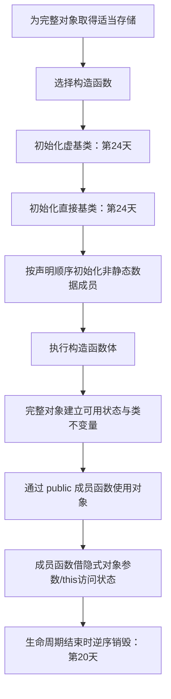

# 第 19 天：构造函数、成员初始化列表与 `this`

## 第一遍：先把一个具体问题学会（必学）

> 如果你的基础较弱，今天先只完成这一节和配套练习。下面的“第二遍”是专业细节，不是读懂第一遍的前置条件。

### 1. 今天到底解决什么问题

创建一个 `Joint` 对象时，成员不是先随便存在、再在构造函数体里赋值。成员初始化列表决定子对象怎样从一开始就建立。

### 2. 先看这几行代码

```cpp
class Joint {
public:
    Joint(std::string name, double angle)
        : name_{std::move(name)}, angle_{angle} {}

    double angle() const { return angle_; }

private:
    std::string name_;
    double angle_{};
};
```

不要先问“这个术语的完整定义是什么”。先逐行回答：当前已有哪个对象、值或文件；这一行读了什么；这一行改变或生成了什么。

### 3. 沿着同一批对象或文件走一遍

| 顺序 | 你必须能指出的具体变化 |
|---|---|
| 1 | 为完整 `Joint` 对象取得存储 |
| 2 | 按类中声明顺序初始化 `name_`、`angle_` 等子对象 |
| 3 | 执行构造函数体 |
| 4 | 构造完成后对象应满足类不变量 |
| 5 | `const` 成员函数通过只读对象调用，不能普通地修改成员 |

如果不能复述上表，就修改一个输入、手写预测并运行 [本课可运行示例](../examples/day-19/main.cpp)；不要靠继续读更多术语解决。

### 4. 只给已经看到的现象命名

| 核心概念 | 先用人话理解 | 回到代码或命令找证据 |
|---|---|---|
| **构造函数** | 对象初始化时运行并建立有效状态。 | `Joint(...)` |
| **成员初始化列表** | 在进入构造函数体前直接初始化基类和成员。 | : name_{...}, limit_{...} |
| **初始化顺序** | 成员按类中声明顺序初始化，不按列表书写顺序。 | 编译器重排警告 |
| **this** | 非静态成员函数中指向当前对象的指针。 | `this->name_` |

这些解释是第一遍可用模型。第二遍会补边界和专业规则；补细节不等于推翻这里的主线。

### 5. 先形成一个求职可用回答

> 构造函数负责按照类规则建立对象；成员初始化列表初始化基类和成员子对象，不是先默认构造再赋值。实际顺序由成员声明顺序决定，不由列表书写顺序决定。`this` 指向当前调用对象，尾随 `const` 限定隐式对象参数。好的构造函数在对象可见前建立不变量，`explicit` 用于阻止意外隐式转换。

这段话的结构是“具体问题 → 代码/对象/文件发生什么 → 使用哪条规则 → 有什么边界”。不要只背术语。

请直接在问题下写自己的版本：

1. 成员初始化列表与在构造函数体中赋值有什么本质区别？

   > 

2. 为什么调整初始化列表顺序不能改变成员真实构造顺序？

   > 

### 6. 今天明确不要求什么

不展开继承构造和委托构造全部边界；先保证成员初始化顺序和对象不变量。

暂缓不等于删除：第二遍会明确展开，课程计划也标出了对应单元。

### 7. 必须动手完成

- 可运行示例：[main.cpp](../examples/day-19/main.cpp)
- 配套练习：[day-19.md](../exercises/day-19.md)
- 编程任务：实现 `Joint` 类：构造时接收名称和角度，拒绝超范围角度，提供 `const` 读取接口。
预期结果：

```text
合法角度构造成功；200 度构造抛出异常或按你声明的策略拒绝
```

- 故障实验：虽然列表先写 `raw_`，实际仍按声明顺序初始化。找出读取尚未初始化成员的风险，并通过调整成员声明或初始化表达式修复。

第一遍完成标准：

- [ ] 我实际运行了正常示例，而不是只读代码。
- [ ] 我能不看讲义复述上面的状态变化表。
- [ ] 我完成了概念检查、可运行任务和调试任务，并写下面试口述初稿。
- [ ] 我能说出一个当前方案的限制，不把入门模型说成全部规则。

---

## 第二遍：完整专业细节（完成第一遍后再读）

这一部分保留完整语言模型、工具边界和深入实验。第一遍已经能跑、能调试、能口述后再进入；一次只读一个小节，并继续把术语落回代码、对象、文件或诊断。

## 今日目标

学完本单元后，你应能设计一个保持有效状态的简单类，准确解释完整对象、成员子对象和构造函数之间的关系；能够使用默认成员初始化器、成员初始化列表、委托构造、`explicit` 和 `const` 成员函数，并能说明成员真实初始化顺序、`this` 的类型及跨翻译单元静态初始化风险。

## 关键术语索引

索引只用于查阅与复习，不能替代正文教学；正文会在术语真正参与推导的位置解释并链接到这里。

| 可点击术语 | 一句话直观解释 |
|---|---|
| [封装](#术语-d19-01-封装) | 把状态与维护状态的操作组织在同一类型中。 |
| [访问控制](#术语-d19-02-访问控制) | 规定哪些代码可以直接使用类成员。 |
| [类不变量](#术语-d19-03-类不变量) | 每次公开操作完成后对象必须保持的条件。 |
| [构造函数](#术语-d19-04-构造函数) | 初始化类对象及其子对象的特殊成员函数。 |
| [默认构造函数](#术语-d19-05-默认构造函数) | 无需实参即可调用的构造函数。 |
| [用户声明构造函数](#术语-d19-06-用户声明构造函数) | 由程序员在类中声明的构造函数。 |
| [成员初始化列表](#术语-d19-07-成员初始化列表) | 在进入构造函数体前指定基类和成员初始化方式。 |
| [默认成员初始化器](#术语-d19-08-默认成员初始化器) | 写在非静态数据成员声明处的后备初始化器。 |
| [初始化顺序](#术语-d19-09-初始化顺序) | 子对象按语言规定而非列表书写顺序构造。 |
| [委托构造函数](#术语-d19-10-委托构造函数) | 让同一个类的一个构造函数调用另一个构造函数。 |
| [转换构造函数](#术语-d19-11-转换构造函数) | 可参与从其他类型到类类型转换的构造函数。 |
| [`explicit`](#术语-d19-12-explicit) | 限制构造函数或转换函数参与隐式转换。 |
| [`this` 指针](#术语-d19-13-this指针) | 非静态成员函数中指向当前对象的隐式指针。 |
| [`const` 成员函数](#术语-d19-14-const成员函数) | 承诺不通过普通成员接口修改当前对象的成员函数。 |
| [非静态成员函数](#术语-d19-15-非静态成员函数) | 以某个类对象为调用对象并拥有 `this` 的函数。 |
| [完整对象](#术语-d19-16-完整对象) | 不是其他对象子对象的最外层对象。 |
| [子对象](#术语-d19-17-子对象) | 作为另一对象组成部分而存在的对象。 |
| [对象生命周期开始](#术语-d19-18-对象生命周期开始) | 存储和初始化条件满足后对象开始存在的语言时刻。 |
| [默认初始化](#术语-d19-19-默认初始化) | 不写初始化器时由声明形式触发的初始化。 |
| [值初始化](#术语-d19-20-值初始化) | 使用空括号或空花括号等形式触发的初始化类别。 |
| [聚合](#术语-d19-21-聚合) | 满足标准条件、可按成员直接聚合初始化的类型。 |
| [静态数据成员](#术语-d19-22-静态数据成员) | 属于类但不嵌入每个对象的成员。 |
| [函数局部静态对象](#术语-d19-23-函数局部静态对象) | 首次执行到声明时初始化并具有静态存储期的对象。 |
| [静态初始化顺序问题](#术语-d19-24-静态初始化顺序问题) | 跨翻译单元静态对象构造依赖顺序不可靠的问题。 |
| [构造函数体](#术语-d19-25-构造函数体) | 子对象初始化完成后才执行的复合语句。 |
| [隐式声明](#术语-d19-26-隐式声明) | 满足条件时由编译器为类声明特殊成员函数。 |

## 一、完整知识地图



必须保留两层对象：`Joint shoulder` 是完整对象；其中 `name_`、`lower_limit_` 等是成员子对象。构造函数不是“给一片原始内存随便赋值”，而是语言规定的子对象初始化流程。

### 构建链路仍然完整

本单元采用头文件声明与 `.cpp` 定义：

```text
joint.hpp 被预处理包含进 main.cpp / joint.cpp
    ↓
两个翻译单元分别经历预处理、狭义编译、汇编
    ↓
main.o 与 joint.o
    ↓
链接为可执行文件
    ↓
操作系统装载并运行，构造局部 Joint 对象
```

“调用构造函数”描述运行期对象初始化，不能替代源码到可执行文件的构建阶段。

## 二、范围标签

### 今天掌握

- 封装、访问控制和类不变量的关系。
- 完整对象、成员子对象、存储、初始化与生命周期开始。
- 构造函数、默认构造函数、默认成员初始化器和成员初始化列表。
- 成员按声明顺序初始化，构造函数体在成员初始化之后执行。
- 委托构造、`explicit`、`this`、链式调用和 `const` 成员函数。
- 非局部静态对象跨翻译单元构造依赖的风险与函数局部静态替代结构。

### 先看全貌

- 构造只是完整资源管理协议的开始；析构、异常离开构造和 RAII 尚未展开。
- 编译器可能隐式声明特殊成员函数，但默认行为是否适合拥有资源的类需结合复制/移动语义判断。
- 基类与成员的完整初始化次序包括虚基类和直接基类，今天的示例没有继承。

### 后续深入

- 第 20 天：析构函数、构造失败、RAII 与逆序清理。
- 第 21 天：复制构造、复制赋值与 Rule of Three。
- 第 22 天：移动构造、移动赋值与 `std::move`。
- 第 24 天：基类子对象、继承构造顺序、虚函数和多态。
- 第 32 天：构造函数的异常与错误处理策略。
- 第 33 天：跨翻译单元静态初始化、库边界和 CMake 配置闭环。

## 三、封装不是“把字段写成 private”

[封装](#术语-d19-01-封装)的直观目标是把状态与维护规则放在一起；专业上，它让调用者依赖稳定接口而不是内部表示。[访问控制](#术语-d19-02-访问控制)只决定源代码能否直接访问成员，不会加密内存或自动验证状态。

```cpp
class Joint {
public:
    Joint(const std::string& name, double lower, double upper);
    Joint& set_position(double position);
    double position() const;

private:
    std::string name_;
    double lower_;
    double upper_;
    double position_;
};
```

[类不变量](#术语-d19-03-类不变量)是构造完成及公开操作边界处必须保持的条件。例如：

```text
lower_ <= upper_
lower_ <= position_ <= upper_
```

构造函数建立这些条件，`set_position` 维护它们。示例用 `assert` 表达学习期内部前置条件；不可信输入、异常保证和发布构建策略到第 32、34 天深入。

## 四、对象构造的真实过程

### 4.1 完整对象与子对象

执行：

```cpp
Joint shoulder{"shoulder", -90.0, 120.0};
```

`shoulder` 是[完整对象](#术语-d19-16-完整对象)，因为它不是其他对象的一部分；内部的 `std::string name_` 和三个 `double` 是[子对象](#术语-d19-17-子对象)。每个类类型成员先按自己的构造规则初始化。

[对象生命周期开始](#术语-d19-18-对象生命周期开始)不是“分到地址”这么简单。专业上，需要适当存储，并满足该类型的初始化条件；成员子对象先开始生命周期，构造流程完成后完整对象才建立设计要求的可用状态。

### 4.2 构造函数做什么

[构造函数](#术语-d19-04-构造函数)是初始化类对象的特殊成员函数，但顺序不是先进入花括号：

1. 为完整对象取得存储。
2. 选择并进入构造流程。
3. 按规则初始化基类和成员子对象。
4. 执行[构造函数体](#术语-d19-25-构造函数体)。
5. 构造正常完成，对象可按接口使用。

构造函数没有返回类型，连 `void` 也不能写。它可以重载，但不能是 `const` 或 `static` 成员函数。

## 五、成员初始化列表不是“提前赋值”

[成员初始化列表](#术语-d19-07-成员初始化列表)直接选择成员如何初始化：

```cpp
Joint::Joint(const std::string& name, double lower, double upper)
    : name_{name}, lower_{lower}, upper_{upper}, position_{lower} {
    assert(lower_ <= upper_);
}
```

进入函数体时，四个成员都已初始化。对比：

```cpp
Joint::Joint(const std::string& name) {
    name_ = name;
}
```

第二种写法中 `name_` 先默认构造成空 `std::string`，随后才执行复制赋值；这是“初始化一次，再赋值一次”，不是同一件事。const 成员、引用成员和没有可用默认构造函数的成员更不能靠函数体补救。

### 5.1 默认成员初始化器是后备方案

[默认成员初始化器](#术语-d19-08-默认成员初始化器)写在成员声明处：

```cpp
double lower_limit_{-180.0};
double upper_limit_{180.0};
double position_{0.0};
```

某构造函数未在初始化列表中指定该成员时，使用这里的初始化器；若列表写了 `position_{lower_limit}`，本次构造就忽略 `position_{0.0}`。

### 5.2 成员按声明顺序初始化

[初始化顺序](#术语-d19-09-初始化顺序)由类定义决定：成员按声明先后初始化，列表顺序不能改变它。

`initialization_order.cpp` 故意把列表顺序写反：

```cpp
class Robot {
public:
    Robot() : motor_{"motor"}, controller_{"controller"} {}
private:
    TraceMember controller_;
    TraceMember motor_;
};
```

实际仍先输出 `construct controller`，再输出 `construct motor`。`-Wreorder` 会提醒列表顺序与真实顺序不同。若一个成员初始化器读取声明在它之后的尚未初始化成员，可能产生未定义行为。

## 六、默认构造、默认初始化和值初始化

[默认构造函数](#术语-d19-05-默认构造函数)是无需实参即可调用的构造函数。[默认初始化](#术语-d19-19-默认初始化)是初始化类别，例如：

```cpp
Sensor sensor;
```

对类类型，它需要通过重载决议找到可调用构造函数。`default_constructor_error.cpp` 中只有 `explicit Sensor(int)`，所以不能无参数构造。

一旦声明任何[用户声明构造函数](#术语-d19-06-用户声明构造函数)，编译器不会再按“类没有用户声明构造函数”的条件自动提供默认构造函数。可以明确表达选择：

```cpp
Sensor() = default;       // 请求默认实现；仍可能因成员而被定义为删除
Sensor(const Sensor&) = delete; // 禁止相应操作，复制规则第21天学习
```

[隐式声明](#术语-d19-26-隐式声明)是编译器根据特殊成员规则替类声明函数，不等于“所有类总有默认构造函数”。

[值初始化](#术语-d19-20-值初始化)常由 `Sensor{}` 等形式触发，但不能机械记成“全部清零”；类的构造函数类别、是否用户提供以及成员类型都会影响精确过程。

## 七、委托构造减少重复初始化逻辑

[委托构造函数](#术语-d19-10-委托构造函数)把一个构造入口交给同类另一个构造函数：

```cpp
Joint::Joint(const std::string& name)
    : Joint{name, -180.0, 180.0} {}
```

目标构造函数先初始化整个对象并执行函数体，然后执行委托构造函数体。委托初始化器必须是该列表中的唯一初始化器，不能一边委托一边再次写成员初始化器，也不能形成委托环。

## 八、`explicit` 控制隐式转换入口

[转换构造函数](#术语-d19-11-转换构造函数)可让其他类型的表达式建立类对象。若一参数构造函数没有限制，下面可能发生隐式转换：

```cpp
void calibrate(Joint joint);
// calibrate(std::string{"wrist"}); // 可能借构造函数隐式转换
```

使用 [`explicit`](#术语-d19-12-explicit)：

```cpp
explicit Joint(const std::string& name);
```

调用者应明确直接初始化：

```cpp
Joint wrist{"wrist"};
```

`explicit` 不表示构造函数私有，也不禁止直接构造；它限制特定隐式转换与复制初始化路径。

## 九、`this`、隐式对象与链式调用

[非静态成员函数](#术语-d19-15-非静态成员函数)针对调用对象执行，并具有隐式对象参数。[`this` 指针](#术语-d19-13-this指针)直观上指向当前对象；专业上，它是成员函数语境中由语言提供的指针表达式，不是你在形参表中声明的普通参数。

```cpp
Joint& Joint::set_position(double position) {
    this->position_ = position;
    return *this;
}
```

- `this->position_` 明确访问当前对象成员；无同名遮蔽时写 `position_` 等价且更常见。
- `*this` 是当前对象的左值表达式。
- 返回 `Joint&` 让第二次调用继续作用于同一个对象：

```cpp
shoulder.set_position(15.0).set_position(30.0);
```

静态成员函数没有调用对象，因此没有 `this`。[静态数据成员](#术语-d19-22-静态数据成员)也不是每个完整对象中的子对象。

## 十、`const` 成员函数支持只读对象

[`const` 成员函数](#术语-d19-14-const成员函数)把调用对象视为 const：

```cpp
double Joint::position() const {
    return position_;
}
```

因此可通过 `const Joint&` 调用：

```cpp
const Joint& observed{shoulder};
std::cout << observed.position();
```

普通成员函数与 const 成员函数可以基于尾随 cv 限定重载。`const` 成员函数不能直接修改普通非静态数据成员；`mutable`、逻辑 const、线程安全和缓存设计以后在接口设计与并发单元深入。

## 十一、聚合与构造函数不是同一模型

[聚合](#术语-d19-21-聚合)是满足标准条件的类或数组，可按元素/成员进行聚合初始化：

```cpp
struct Point {
    double x;
    double y;
};

Point p{1.0, 2.0};
```

`struct` 不必然是聚合，`class` 也不是“有构造函数”的同义词。C++17 对用户提供、继承或 `explicit` 构造函数、访问权限、虚函数等有聚合条件；不同标准版本条件有变化。`Joint` 通过构造函数维护不变量，不按公开成员聚合初始化。

## 十二、跨翻译单元静态对象的构造依赖

[静态初始化顺序问题](#术语-d19-24-静态初始化顺序问题)的直观风险是：两个 `.cpp` 的命名空间作用域对象互相依赖，却没有可靠的跨文件构造先后。

```cpp
// config.cpp
Config global_config{load_path()};

// controller.cpp
Controller controller{global_config};
```

不能仅凭链接命令中文件顺序推断 C++ 保证的动态初始化顺序。一个常用结构是通过[函数局部静态对象](#术语-d19-23-函数局部静态对象)按首次使用初始化：

```cpp
const Config& config() {
    static const Config instance{"robot.conf"};
    return instance;
}
```

这能让构造发生在第一次控制经过声明时，并避免直接依赖另一个翻译单元中非局部对象的动态初始化先后。它不是所有全局状态问题的万能解法；销毁顺序、依赖环、并发和构建配置分别在第 20、33、35 天继续。

## 十三、`std::string` 成员在构造中发生了什么

`name_{name}` 初始化的是一个 `std::string` 类类型成员子对象，不是把文本字节直接塞进 `Joint` 的某个裸数组。它会调用 `std::string` 的相应构造操作，并由该对象管理自身资源。

今天只需要确认：

- `name_` 有独立的类对象生命周期。
- 从 `const std::string& name` 初始化 `name_` 会建立成员自己的字符串值。
- `Joint` 完成构造后，`name_` 是其成员子对象。

`std::string` 的资源释放、复制成本、移动语义和模板身份将在第 20～22、27～28 天继续，不能把今天的观察称为完整字符串实现模型。

## 十四、真实构建与运行实验

### 14.1 分离编译主示例

```bash
g++ -std=c++17 -Wall -Wextra -Wpedantic -Iexamples/day-19 \
    -c examples/day-19/joint.cpp -o joint.o
g++ -std=c++17 -Wall -Wextra -Wpedantic -Iexamples/day-19 \
    -c examples/day-19/main.cpp -o main.o
g++ main.o joint.o -o day19_main
./day19_main
```

预期输出：

```text
shoulder: 30
wrist limits: -180, 180
```

安全检查：

```bash
g++ -std=c++17 -g -Og -Wall -Wextra -Wpedantic \
    -fsanitize=address,undefined -fno-omit-frame-pointer \
    -Iexamples/day-19 examples/day-19/main.cpp examples/day-19/joint.cpp \
    -o day19_san
./day19_san
```

### 14.2 初始化顺序实验

```bash
g++ -std=c++17 -Wall -Wextra -Wpedantic -Wreorder \
    examples/day-19/initialization_order.cpp -o initialization_order
./initialization_order
```

预期编译器报告列表顺序与成员声明顺序不一致，运行输出：

```text
construct controller
construct motor
```

### 14.3 私有成员访问错误

```bash
g++ -std=c++17 -Wall -Wextra -Wpedantic \
    examples/day-19/private_access_error.cpp -o private_access_error
```

预期在狭义编译阶段报告 `speed_` 是私有成员。对象仍真实包含该成员；访问控制限制的是源代码访问。

### 14.4 缺少默认构造函数

```bash
g++ -std=c++17 -Wall -Wextra -Wpedantic \
    examples/day-19/default_constructor_error.cpp -o default_constructor_error
```

预期报告没有与零实参调用匹配的 `Sensor` 构造函数。不要为了“让它编译”盲目增加无意义默认状态；是否提供默认构造取决于类型是否存在合理默认状态。

## 十五、常见误区

1. **“构造函数体负责初始化成员”**：不准确。成员在进入函数体前已经初始化。
2. **“初始化列表从左到右决定成员顺序”**：错误。非静态成员按声明顺序初始化。
3. **“声明了带参数构造函数，编译器还会自动给无参构造”**：错误。
4. **“`explicit` 禁止构造对象”**：错误。它主要限制隐式转换和部分复制初始化。
5. **“`this` 是用户写进形参表的指针”**：错误。它来自非静态成员函数的隐式对象语义。
6. **“`const` 成员函数意味着整个程序永远不能改对象”**：错误。它限制通过本次 const 接口进行的普通成员修改。
7. **“`private` 让成员在内存中不可见”**：错误。它是语言访问控制，不是加密或进程隔离。
8. **“所有 `struct` 都是聚合”**：错误。聚合资格由标准条件决定。
9. **“全局对象按链接命令顺序构造”**：不能作为 C++ 语言保证。

## 十六、练习入口

独立练习单：[第 19 天练习](../exercises/day-19.md)

先预测初始化顺序和错误阶段，再执行命令。警告实验不要为了消音交换成员声明；应先判断成员之间的真实依赖，再让初始化列表与声明顺序一致。

## 十七、完成标准

- 能从存储、成员子对象初始化、构造函数体到完整对象可用状态描述构造过程。
- 能区分默认成员初始化器、成员初始化列表和函数体内赋值。
- 能预测成员初始化顺序，并解释为什么由声明顺序统一决定。
- 能判断默认构造函数是否存在，合理使用 `= default`、`= delete` 和 `explicit`。
- 能解释 `this`、`*this`、链式调用和 `const` 成员函数。
- 能写出并维护一个简单类不变量。
- 能识别跨翻译单元静态初始化依赖，并写出函数局部静态访问结构。

## 十八、本单元知识缺口结算

- `G06`：教材状态更新为“已发布”。本单元补齐完整对象、成员子对象、存储、初始化、值与生命周期开始的关系。
- `G08`：教材状态更新为“已发布”。本单元补齐类成员的默认成员初始化器、成员初始化列表、默认/值初始化及初始化与赋值边界。
- `G09`：教材状态保持“部分已发布”。本单元补充 `std::string` 成员子对象的构造；析构、复制、移动、模板和容器关系待第 20～22、27～28 天。
- `G26`：教材状态保持“部分已发布”。本单元补充封装、构造、`this`、const 成员和对象构造顺序；析构、特殊成员、继承与多态待第 20～24 天。
- `G33`：教材状态保持“部分已发布”。本单元补充跨翻译单元非局部对象构造依赖与函数局部静态替代结构；销毁与工程配置待第 20、33 天。

> 教材发布只表示内容可学习；只有练习完成并经过批改达到标准后，个人学习状态才能更新。

---

## 附录：关键术语卡（查阅用）

###### 术语-d19-01-封装

**封装（encapsulation，面向对象设计术语）**

- **新手先这样理解：** 把数据和保证数据有效的操作放进同一个类，不让外部随意破坏状态。
- **专业上更准确地说：** 封装通过类型接口、访问控制和不变量管理隐藏实现决策；`private` 是实现封装的机制之一，但仅把字段改成私有并不会自动形成良好抽象。

###### 术语-d19-02-访问控制

**访问控制（access control，C++ 标准术语）**

- **新手先这样理解：** `public`、`protected`、`private` 决定某处代码能否直接使用成员名。
- **专业上更准确地说：** 访问控制在名称查找和重载决议等步骤之后检查所选声明是否可访问；它限制源代码访问，不是运行时内存安全边界。`class` 默认私有，`struct` 默认公有。

###### 术语-d19-03-类不变量

**类不变量（class invariant，设计与验证术语）**

- **新手先这样理解：** 对象只要处于可观察的正常状态，就必须一直满足的条件。
- **专业上更准确地说：** 类不变量是构造完成后、公开成员操作边界处应成立的状态约束；构造函数建立它，成员函数维护它。异常和并发下的精确保证分别在第 32、35 天深入。

###### 术语-d19-04-构造函数

**构造函数（constructor，C++ 标准术语）**

- **新手先这样理解：** 创建类对象时，它负责决定各个组成部分怎样开始。
- **专业上更准确地说：** 构造函数是没有返回类型、名称与类名相同的特殊成员函数；调用时先初始化虚基类、直接基类和非静态数据成员，再执行构造函数体。今天的类没有继承，基类阶段第 24 天展开。

###### 术语-d19-05-默认构造函数

**默认构造函数（default constructor，C++ 标准术语）**

- **新手先这样理解：** 不给实参也能调用的构造函数。
- **专业上更准确地说：** 默认构造函数是可用空实参列表调用的构造函数；它可以无参数，也可以所有参数都有默认实参。编译器是否隐式声明它取决于类中已有的构造函数声明。

###### 术语-d19-06-用户声明构造函数

**用户声明构造函数（user-declared constructor，C++ 标准概念）**

- **新手先这样理解：** 程序员自己在类里写出了构造函数声明。
- **专业上更准确地说：** 只要构造函数由用户声明，包括 `= default` 或 `= delete` 的声明，就属于用户声明；这会影响默认构造函数和其他特殊成员的隐式生成规则。“用户提供”是更窄的标准概念，不能随意互换。

###### 术语-d19-07-成员初始化列表

**成员初始化列表（member-initializer-list，C++ 标准术语）**

- **新手先这样理解：** 冒号后的列表直接告诉各成员用什么开始，而不是先造好再赋值。
- **专业上更准确地说：** 构造函数定义中的 ctor-initializer 为直接/虚基类或非静态数据成员选择初始化器；实际执行顺序由类定义中的子对象顺序规定，不由列表顺序规定。

###### 术语-d19-08-默认成员初始化器

**默认成员初始化器（default member initializer，C++ 标准术语）**

- **新手先这样理解：** 成员声明旁边写一个通用默认值，构造函数没另行指定时就使用它。
- **专业上更准确地说：** 非静态数据成员的花括号或等号初始化器，在某构造函数的成员初始化列表未显式初始化该成员时使用；若列表显式指定，该默认成员初始化器对本次构造被忽略。

###### 术语-d19-09-初始化顺序

**初始化顺序（initialization order，C++ 对象模型规则）**

- **新手先这样理解：** 成员按照类中声明的先后构造，冒号后换顺序也改变不了。
- **专业上更准确地说：** 完整对象构造依次处理虚基类、直接基类、按声明顺序排列的非静态数据成员，最后执行构造函数体；统一顺序保证销毁时可按相反顺序进行。

###### 术语-d19-10-委托构造函数

**委托构造函数（delegating constructor，C++ 标准术语）**

- **新手先这样理解：** 简短构造函数把真正的初始化工作交给同一个类的另一个构造函数。
- **专业上更准确地说：** 若成员初始化列表唯一的类或成员初始化器指名本类，则目标构造函数先完成对象初始化和函数体，随后执行委托构造函数体；委托链不能形成递归循环。

###### 术语-d19-11-转换构造函数

**转换构造函数（converting constructor，C++ 标准术语）**

- **新手先这样理解：** 某些构造函数允许编译器把其他类型的值转成这个类的对象。
- **专业上更准确地说：** 未由 `explicit` 排除且满足调用条件的构造函数可参与隐式转换序列；它不局限于恰好一个形参的语法形式，带默认实参的多形参构造函数也可能符合。

###### 术语-d19-12-explicit

**`explicit`（C++ 关键字与说明符）**

- **新手先这样理解：** 要求调用者明确写出“我要构造这个类型”，避免意外自动转换。
- **专业上更准确地说：** `explicit` 构造函数不作为某些复制初始化和隐式转换的候选，但仍可用于直接初始化、显式转换等语境；C++20 扩展了条件 `explicit`，本课程 C++17 主线今天不使用。

###### 术语-d19-13-this指针

**`this` 指针（this pointer，C++ 标准术语）**

- **新手先这样理解：** 它指向当前正在调用成员函数的那个对象。
- **专业上更准确地说：** 在非静态成员函数体中，`this` 是指向调用对象的 prvalue 指针；在 `Joint` 的普通成员中类型可理解为 `Joint* const` 这一不可重新赋值的隐式参数效果，在 `const` 成员中指向 `const Joint`。标准描述有精确类型规则，不能把 `this` 当作普通可赋值局部指针。

###### 术语-d19-14-const成员函数

**`const` 成员函数（const-qualified member function，C++ 标准术语）**

- **新手先这样理解：** 它可以观察 `const` 对象，但不能通过普通成员直接修改对象状态。
- **专业上更准确地说：** 尾随 `const` 限定隐式对象参数，使 `this` 指向 const 类对象；函数不能修改非 `mutable` 非静态数据成员，也不能调用仅接受非 const 对象的成员函数。

###### 术语-d19-15-非静态成员函数

**非静态成员函数（non-static member function，C++ 标准术语）**

- **新手先这样理解：** 它必须针对某个对象调用，并能直接访问该对象成员。
- **专业上更准确地说：** 非静态成员函数拥有隐式对象参数，可使用 `this`；成员函数体中的非静态成员名通常隐式通过当前对象解析。静态成员函数没有 `this`。

###### 术语-d19-16-完整对象

**完整对象（complete object，C++ 标准术语）**

- **新手先这样理解：** 最外层那个独立对象，例如局部变量 `shoulder`。
- **专业上更准确地说：** 完整对象不是任何其他对象的子对象；它可包含基类子对象、成员子对象和数组元素子对象。完整类型与完整对象是两个不同概念。

###### 术语-d19-17-子对象

**子对象（subobject，C++ 标准术语）**

- **新手先这样理解：** 作为另一个对象组成部分存在的对象，例如 `Joint` 内部的 `std::string name_`。
- **专业上更准确地说：** 子对象包括成员子对象、基类子对象和数组元素；各自具有类型、存储和生命周期，但存储归属于完整对象或包含对象的整体布局。

###### 术语-d19-18-对象生命周期开始

**对象生命周期开始（lifetime begins，C++ 对象模型术语）**

- **新手先这样理解：** 不是有一块内存就算对象已经能用；还要完成语言规定的初始化条件。
- **专业上更准确地说：** 对象生命周期在获得适当对齐和大小的存储且初始化完成（包括无实际初始化的情形）后按规则开始；类对象的子对象先建立，最派生对象构造完成后才完整建立其不变量。

###### 术语-d19-19-默认初始化

**默认初始化（default-initialization，C++ 标准术语）**

- **新手先这样理解：** 声明对象却不写初始化器时触发的规则。
- **专业上更准确地说：** 对类类型，默认初始化会进行构造函数重载决议并调用所选构造函数；对自动存储期的内置标量，通常不执行初始化，读取不确定值的边界已在第 11、18 天学习。

###### 术语-d19-20-值初始化

**值初始化（value-initialization，C++ 标准术语）**

- **新手先这样理解：** `T{}` 或某些 `T()` 形式要求按值初始化规则建立对象。
- **专业上更准确地说：** 值初始化对类类型涉及默认初始化，并在特定默认构造函数条件下先零初始化；详细结果取决于类型是否为类、构造函数是否用户提供等，不能统一简化成“全部清零”。

###### 术语-d19-21-聚合

**聚合（aggregate，C++ 标准术语）**

- **新手先这样理解：** 满足一组限制的类或数组可以按组成成员直接用花括号初始化。
- **专业上更准确地说：** C++17 聚合类需无用户提供、继承或 `explicit` 构造函数等并满足访问、基类、虚函数等条件；标准版本会改变具体条件，不能把所有 `struct` 都称为聚合。

###### 术语-d19-22-静态数据成员

**静态数据成员（static data member，C++ 标准术语）**

- **新手先这样理解：** 它属于类这个范围，但每个对象里不各自放一份。
- **专业上更准确地说：** `static` 数据成员不是任何类对象的子对象，具有静态存储期；其声明、定义与 C++17 inline 变量规则需满足 ODR。它没有 `this`。

###### 术语-d19-23-函数局部静态对象

**函数局部静态对象（function-local static object，C++ 对象模型术语）**

- **新手先这样理解：** 第一次调用函数走到声明时构造，以后复用同一个对象。
- **专业上更准确地说：** 块作用域 `static` 对象具有静态存储期；若需要动态初始化，则首次控制经过声明时执行，C++11 起并发首次进入的初始化按标准同步，递归重入边界和并发细节第 35 天深入。

###### 术语-d19-24-静态初始化顺序问题

**静态初始化顺序问题（static initialization order problem，工程术语）**

- **新手先这样理解：** 不同 `.cpp` 的全局对象互相依赖时，可能有人先用到了还没构造好的对象。
- **专业上更准确地说：** 具有静态存储期的非局部对象先经历静态初始化，再按规则进行动态初始化；不同翻译单元间的动态初始化顺序通常不能由源文件直观保证，依赖会造成未定义或错误状态风险。精确分类与构建配置第 33 天闭环。

###### 术语-d19-25-构造函数体

**构造函数体（constructor body，C++ 语法与对象模型术语）**

- **新手先这样理解：** 花括号里的代码执行时，成员已经初始化完成。
- **专业上更准确地说：** 构造函数复合语句在基类和非静态数据成员初始化之后执行；在函数体赋值不是对成员的首次初始化，const、引用或无默认构造函数的成员必须在初始化阶段正确处理。

###### 术语-d19-26-隐式声明

**隐式声明（implicitly declared，C++ 标准术语）**

- **新手先这样理解：** 你没写某个特殊成员函数，但满足条件时编译器会替类声明它。
- **专业上更准确地说：** C++ 按特殊成员规则隐式声明默认构造、复制/移动构造、复制/移动赋值和析构函数；是否定义为删除、何时生成定义及操作语义由类成员和用户声明共同决定，第 20～22 天逐项展开。

---
