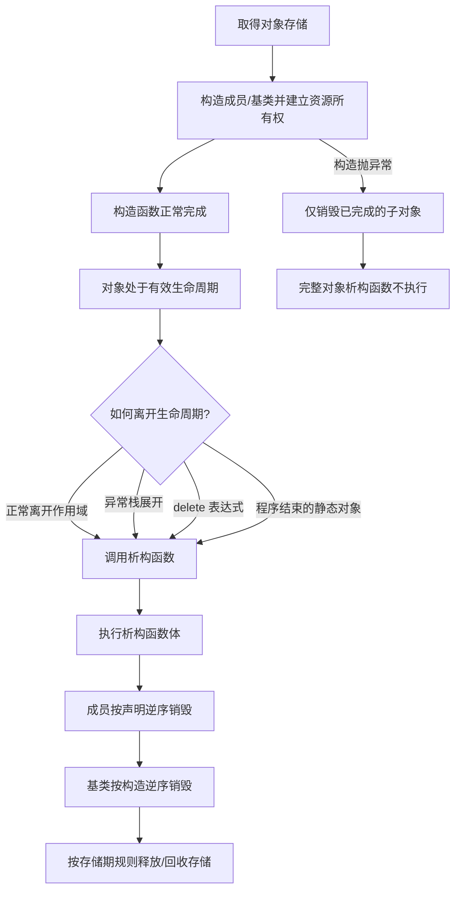

# 第 20 天：析构函数与 RAII

## 第一遍：先把一个具体问题学会（必学）

> 如果你的基础较弱，今天先只完成这一节和配套练习。下面的“第二遍”是专业细节，不是读懂第一遍的前置条件。

### 1. 今天到底解决什么问题

文件、互斥锁、动态缓冲区都不是只需“申请”的资源；无论正常返回还是异常离开，都必须执行配套释放。RAII 把这条协议交给对象。

### 2. 先看这几行代码

```cpp
class SensorFile {
public:
    explicit SensorFile(const std::string& path)
        : stream_{path} {
        if (!stream_) throw std::runtime_error("open failed");
    }

private:
    std::ifstream stream_;
};
```

不要先问“这个术语的完整定义是什么”。先逐行回答：当前已有哪个对象、值或文件；这一行读了什么；这一行改变或生成了什么。

### 3. 沿着同一批对象或文件走一遍

| 顺序 | 你必须能指出的具体变化 |
|---|---|
| 1 | 创建 `SensorFile` 时先构造 `stream_` 成员并尝试打开文件 |
| 2 | 构造成功后，对象拥有文件资源 |
| 3 | 离开作用域时先执行类的析构过程，再逆序销毁成员 |
| 4 | `ifstream` 成员析构自动关闭文件 |
| 5 | 若后续代码抛异常，栈展开仍会销毁已完成构造的自动对象 |

如果不能复述上表，就修改一个输入、手写预测并运行 [本课可运行示例](../examples/day-20/main.cpp)；不要靠继续读更多术语解决。

### 4. 只给已经看到的现象命名

| 核心概念 | 先用人话理解 | 回到代码或命令找证据 |
|---|---|---|
| **析构函数** | 对象生命周期结束时执行清理协议。 | `~Buffer()` |
| **资源** | 需要成对获取与释放的东西，如内存、文件、锁。 | 动态数组 |
| **RAII** | 把资源所有权交给对象：构造成功即持有，析构自动释放。 | 作用域结束自动清理 |
| **异常安全** | 中途失败时仍不泄漏资源并保持对象约束。 | 构造失败时已构造成员自动析构 |

这些解释是第一遍可用模型。第二遍会补边界和专业规则；补细节不等于推翻这里的主线。

### 5. 先形成一个求职可用回答

> RAII 是把资源获取和释放协议绑定到对象生命周期：构造或工厂建立有效资源状态，析构自动释放。析构函数体不是全部销毁过程，函数体之后成员和基类还会按逆序销毁。构造失败时只销毁已经完成构造的子对象。业务类优先使用标准 RAII 成员实现 Rule of Zero，而不是手写重复清理代码。

这段话的结构是“具体问题 → 代码/对象/文件发生什么 → 使用哪条规则 → 有什么边界”。不要只背术语。

请直接在问题下写自己的版本：

1. 为什么 RAII 能正确处理函数中途返回和异常？

   > 

2. 析构函数体执行完后，对象销毁是否已经全部结束？

   > 

### 6. 今天明确不要求什么

不手写复杂异常框架；先让资源由对象持有，所有退出路径自动清理。

暂缓不等于删除：第二遍会明确展开，课程计划也标出了对应单元。

### 7. 必须动手完成

- 可运行示例：[main.cpp](../examples/day-20/main.cpp)
- 配套练习：[day-20.md](../exercises/day-20.md)
- 编程任务：使用标准 RAII 类型编写 `LogWriter`，构造时打开文件，成员析构自动关闭；在函数中途返回时仍不能泄漏资源。
预期结果：

```text
正常写入一行；提前返回和异常路径都由成员自动完成关闭
```

- 故障实验：解释为什么普通代码显式调用析构函数会破坏生命周期协议；改成让作用域或所有者自然结束。

第一遍完成标准：

- [ ] 我实际运行了正常示例，而不是只读代码。
- [ ] 我能不看讲义复述上面的状态变化表。
- [ ] 我完成了概念检查、可运行任务和调试任务，并写下面试口述初稿。
- [ ] 我能说出一个当前方案的限制，不把入门模型说成全部规则。

---

## 第二遍：完整专业细节（完成第一遍后再读）

这一部分保留完整语言模型、工具边界和深入实验。第一遍已经能跑、能调试、能口述后再进入；一次只读一个小节，并继续把术语落回代码、对象、文件或诊断。

## 今日目标

学完本单元后，你应能准确说明析构函数体、成员子对象销毁、对象生命周期结束和存储释放之间的关系；能够解释 RAII 为什么能覆盖正常退出与异常栈展开，能识别构造失败、显式析构、浅复制和静态对象销毁顺序中的风险，并能区分手写资源所有者与 Rule of Zero 类型。

## 关键术语索引

索引只用于查阅与复习，不能替代正文教学；正文会在术语真正参与分析的位置解释并链接到这里。

| 可点击术语 | 一句话直观解释 |
|---|---|
| [析构函数](#术语-d20-01-析构函数) | 对象销毁流程中执行清理工作的特殊成员函数。 |
| [对象销毁](#术语-d20-02-对象销毁) | 执行析构函数并逆序销毁组成对象的过程。 |
| [生命周期结束](#术语-d20-03-生命周期结束) | 对象不再存在、不能继续按原对象使用的语言时刻。 |
| [资源](#术语-d20-04-资源) | 需要按协议取得和归还的程序外部或有限能力。 |
| [RAII](#术语-d20-05-raii) | 把资源所有权绑定到对象生命周期。 |
| [所有者](#术语-d20-06-所有者) | 负责最终释放某项资源的对象或组件。 |
| [释放](#术语-d20-07-释放) | 按资源协议归还资源，不等同于删除指针变量。 |
| [栈展开](#术语-d20-08-栈展开) | 异常传播时退出作用域并销毁已构造自动对象。 |
| [构造失败](#术语-d20-09-构造失败) | 构造函数未正常完成，完整对象未构造成功。 |
| [部分构造对象](#术语-d20-10-部分构造对象) | 构造中已有部分子对象完成、整体尚未成功的状态。 |
| [逆序销毁](#术语-d20-11-逆序销毁) | 子对象按照构造顺序的反向被销毁。 |
| [隐式声明析构函数](#术语-d20-12-隐式声明析构函数) | 满足规则时编译器为类声明的析构函数。 |
| [默认化析构函数](#术语-d20-13-默认化析构函数) | 用 `= default` 请求标准生成行为的析构函数。 |
| [删除析构函数](#术语-d20-14-删除析构函数) | 用 `= delete` 禁止相应析构调用的析构函数。 |
| [`noexcept`](#术语-d20-15-noexcept) | 描述函数异常传播承诺的说明符。 |
| [`std::terminate`](#术语-d20-16-stdterminate) | 程序无法按异常规则继续时调用的终止处理入口。 |
| [自动对象](#术语-d20-17-自动对象) | 通常在离开其块作用域时自动销毁的对象。 |
| [动态对象](#术语-d20-18-动态对象) | 通过动态存储操作创建、需由所有权协议结束的对象。 |
| [资源泄漏](#术语-d20-19-资源泄漏) | 资源仍被占用却失去可靠释放路径。 |
| [浅复制](#术语-d20-20-浅复制) | 只复制资源句柄值而未建立正确共享或独占协议。 |
| [Rule of Zero](#术语-d20-21-ruleofzero) | 让成员类型管理资源，从而不手写特殊成员函数。 |
| [显式析构调用](#术语-d20-22-显式析构调用) | 直接写 `object.~Type()` 请求执行析构函数。 |
| [虚析构函数](#术语-d20-23-虚析构函数) | 支持经基类指针正确销毁派生对象的虚函数机制。 |
| [静态对象销毁顺序](#术语-d20-24-静态对象销毁顺序) | 静态存储期对象在程序结束阶段的销毁先后规则。 |
| [作用域守卫](#术语-d20-25-作用域守卫) | 利用析构函数在离开作用域时执行某项恢复操作。 |
| [异常安全](#术语-d20-26-异常安全) | 操作失败或抛异常时仍保持资源和状态约束。 |

## 一、完整知识地图



析构函数不是“释放所有内存”的同义词。它只执行类型定义的销毁流程；自动对象的存储随后随块退出结束，`delete` 表达式还会解分配动态存储，而静态存储由实现和运行环境按程序终止规则处理。

## 二、范围标签

### 今天掌握

- 析构函数语法，以及析构函数体、成员/基类销毁、生命周期结束和存储释放的边界。
- 成员与局部对象按构造的相反顺序销毁。
- 构造失败时只清理已经完成构造的子对象。
- RAII、所有权、异常栈展开和无泄漏清理。
- 裸资源所有者为什么必须限制复制，以及 Rule of Zero 的设计方向。
- 显式析构调用、析构抛异常和静态对象销毁依赖的风险。

### 先看全貌

- 资源所有者必须同时设计析构、复制和移动；今天示例先删除复制操作，并未完成“可复制资源类”。
- 虚析构函数关系到多态删除，今天只定位规则位置。
- 异常安全包含基本保证、强保证和不抛出保证，今天先掌握 RAII 基础。

### 后续深入

- 第 21 天：复制构造、复制赋值、深复制与 Rule of Three。
- 第 22 天：移动构造、移动赋值、转移所有权与 `std::move`。
- 第 23 天：`unique_ptr`、`shared_ptr`、`weak_ptr` 与现代所有权表达。
- 第 24 天：继承层次中的虚析构与多态删除。
- 第 32 天：异常传播、异常安全等级和错误处理。
- 第 33 天：跨翻译单元静态对象初始化/销毁与工程配置。

## 三、析构函数体不是全部销毁过程

[析构函数](#术语-d20-01-析构函数)直观上是对象结束时执行清理的特殊成员函数；专业上，销毁完整类对象时先执行析构函数体，再自动销毁成员和基类。

```cpp
class Trace {
public:
    ~Trace() {
        std::cout << "destructor body\n";
    }
};
```

它没有返回类型、不能接收普通形参，也不能是 `static`。同一个类只选择一个析构函数，C++17 不允许像普通函数那样按参数重载析构函数。

[对象销毁](#术语-d20-02-对象销毁)包括析构函数体和子对象销毁；[生命周期结束](#术语-d20-03-生命周期结束)意味着原对象不能继续被当作活对象使用。名称离开作用域、生命周期结束、存储期结束仍是三个不同维度。

## 四、真实销毁顺序

第 19 天确认成员按声明顺序构造。本单元的[逆序销毁](#术语-d20-11-逆序销毁)规则是：

1. 执行最外层对象的析构函数体。
2. 非静态数据成员按声明顺序的反向销毁。
3. 直接基类按构造顺序反向销毁。
4. 对最派生对象，虚基类按规则最后逆序销毁。

`destruction_order.cpp` 中真实顺序：

```text
construct controller
construct motor
Robot body
~Robot body
destroy motor
destroy controller
```

统一的构造顺序让语言能够确定反向清理顺序；这也是成员初始化列表不能改变声明顺序的原因之一。

## 五、编译器生成的析构函数也会销毁成员

如果没有用户声明，编译器可按规则提供[隐式声明析构函数](#术语-d20-12-隐式声明析构函数)。它不是“什么都不做”：即使函数体为空，成员对象的析构仍会自动发生。

```cpp
class LogBook {
public:
    ~LogBook() = default;
private:
    std::string name_;
    std::vector<int> samples_;
};
```

[默认化析构函数](#术语-d20-13-默认化析构函数)用 `= default` 明确请求默认规则。若完全不写析构函数，通常更利于 Rule of Zero。成员或基类无法销毁时，隐式/默认化析构可能被定义为删除。

[删除析构函数](#术语-d20-14-删除析构函数)不是“故意泄漏”的工具：需要在作用域末尾销毁该类型对象的代码会因析构不可用而不合法。

## 六、RAII 把资源协议绑定到对象生命周期

[资源](#术语-d20-04-资源)是必须按协议取得和归还的能力；[释放](#术语-d20-07-释放)必须调用与取得方式匹配的操作。[所有者](#术语-d20-06-所有者)负责保证这一释放恰好按协议完成。

[RAII](#术语-d20-05-raii)的完整基础链路是：

```text
构造函数取得资源
→ 只有取得成功才完成对象构造
→ 对象在有效生命周期内独占或共享资源
→ 正常退出或异常栈展开触发析构
→ 析构按协议释放资源
```

`IntBuffer` 直接拥有动态数组：

```cpp
IntBuffer::IntBuffer(std::size_t size)
    : data_{new int[size]{}}, size_{size} {}

IntBuffer::~IntBuffer() {
    delete[] data_;
}
```

这里 `delete[]` 同时结束数组元素生命周期并解分配匹配的动态存储。把 `data_ = nullptr;` 只会改变指针值，不会释放原资源。

### 6.1 自动对象与动态对象

[自动对象](#术语-d20-17-自动对象)在正常离开块或异常展开时按规则自动销毁：

```cpp
{
    IntBuffer local{3};
} // 自动调用 local 的析构函数
```

[动态对象](#术语-d20-18-动态对象)不会因为局部裸指针结束就自动销毁：

```cpp
IntBuffer* dynamic{new IntBuffer{3}};
delete dynamic;
```

`delete dynamic` 先调用 `IntBuffer` 析构函数，再解分配存储。忘记所有权释放会造成[资源泄漏](#术语-d20-19-资源泄漏)。现代代码优先使用局部对象、容器和智能指针，第 23 天深入。

## 七、异常路径为何需要 RAII

[栈展开](#术语-d20-08-栈展开)发生在异常传播退出作用域时，已完全构造的自动对象会被销毁。因此资源不依赖“函数最后一行”清理：

```cpp
void process() {
    IntBuffer buffer{100};
    may_throw();
} // 无论正常返回还是异常向外传播，buffer 都按规则析构
```

[异常安全](#术语-d20-26-异常安全)要求失败时仍满足资源和状态保证。RAII解决“谁负责清理以及何时清理”的基础问题，但一个多步骤业务操作能否回滚仍需第 32 天的保证分析。

[作用域守卫](#术语-d20-25-作用域守卫)把一次回滚或恢复动作放在小对象析构中；C++17 需自行或借库实现，不能直接使用 C++23 `<scope>` 当作本课程可用标准设施。

## 八、构造失败时谁会析构

[构造失败](#术语-d20-09-构造失败)意味着构造函数未正常完成，最外层完整对象没有成功建立。[部分构造对象](#术语-d20-10-部分构造对象)是工程上描述“某些成员已完成”的说法。

`constructor_failure.cpp` 中：

```text
construct first
construct second
Controller body throws
destroy second
destroy first
caught: configuration error
```

`~Controller body` 不执行，因为 `Controller` 构造未完成；已完成的 `second_`、`first_` 成员按反序自动销毁。若某成员构造本身失败，在它之前已构造的成员会清理，该失败成员不算完成构造。

这解释了为什么资源应尽量放进成员 RAII 类型：即使外层构造失败，成员仍能按语言规则清理自己的资源。

## 九、析构函数通常不应传播异常

[`noexcept`](#术语-d20-15-noexcept)表示异常不能从函数向外传播。析构函数的隐式异常说明取决于成员和基类，但工程设计通常要求清理路径不抛出。

若另一个异常已经在[栈展开](#术语-d20-08-栈展开)，某析构函数又让异常逃出，程序会调用 [`std::terminate`](#术语-d20-16-stdterminate)。因此：

- 析构中的关闭/提交失败应按资源语义选择记录、状态查询或显式 `close()` 接口。
- 不能无条件忽略错误，也不能让析构随意抛出。
- 需要报告失败的资源操作应在对象仍活着时提供显式可处理接口，析构作为最后保障。

## 十、手写资源所有者必须面对复制问题

若 `IntBuffer` 使用默认逐成员复制，`data_` 地址会被复制，两个对象都以为自己拥有同一数组。这是危险的[浅复制](#术语-d20-20-浅复制)：一个析构后另一个悬空，最终可能重复释放。

今天先明确禁止复制：

```cpp
IntBuffer(const IntBuffer&) = delete;
IntBuffer& operator=(const IntBuffer&) = delete;
```

这不是完整资源值类型模型。第 21 天实现深复制和 Rule of Three，第 22 天实现移动转移。仅有析构函数而不考虑复制/移动，是手写所有权类最常见的工程陷阱之一。

### 10.1 Rule of Zero 优先

[Rule of Zero](#术语-d20-21-ruleofzero)建议业务类让成员类型管理资源：

```cpp
class LogBook {
private:
    std::string name_;
    std::vector<int> samples_;
};
```

`std::string` 与 `std::vector` 的析构函数管理各自资源，因此 `LogBook` 无需手写析构。这里补齐 `std::string` 资源管理的一环：字符串成员作为类对象子对象，在外层对象销毁时自动析构；其复制、移动与模板身份仍在第 21、22、27 天深入。

## 十一、不要在普通代码中显式调用析构

[显式析构调用](#术语-d20-22-显式析构调用)写作：

```cpp
buffer.~Buffer();
```

这会结束对象生命周期，却不会取消作用域结束时编译器原本安排的隐式销毁。`explicit_destructor_error.cpp` 对拥有动态数组的自动对象显式析构，随后作用域退出再次析构，产生重复释放的未定义行为；ASan 可报告 `double-free`。

显式析构主要服务于 placement new、分配器和底层容器实现；正确重建对象、透明可替换性与 `std::launder` 等规则超出当前单元，不应把这种写法用于普通清理。

## 十二、虚析构先看位置

[虚析构函数](#术语-d20-23-虚析构函数)用于多态基类销毁。若代码会通过基类指针 `delete` 实际派生对象，基类需要合适的虚析构接口，否则可能产生未定义行为。

今天只建立位置：

```text
普通成员对象 → 静态类型决定正常析构链
通过基类指针多态删除 → 需要虚析构规则（第24天）
```

不要把“所有类的析构函数都必须 virtual”当作规则；非多态值类型通常不需要虚析构。

## 十三、静态对象销毁顺序

[静态对象销毁顺序](#术语-d20-24-静态对象销毁顺序)是第 17、19 天初始化问题的另一半。程序结束时，已构造的静态存储期对象会按标准关系销毁，但跨翻译单元的析构依赖不能靠 `.cpp` 文件排列或链接命令直观保证。

危险结构：

```cpp
// logger.cpp 中的静态 logger
// config.cpp 中的静态 config，其析构函数调用 logger
```

若 `logger` 已先销毁，`config` 析构访问它就越过生命周期。函数局部静态可以控制首次构造，但仍需考虑程序结束时的销毁依赖。常见方向包括：消除全局依赖、让依赖对象拥有被依赖对象、显式管理应用生命周期，或在确有理由时采用进程生命周期对象；第 33 天结合工程构建闭环。

## 十四、真实构建、运行与错误实验

### 14.1 分离编译 RAII 主示例

```bash
g++ -std=c++17 -Wall -Wextra -Wpedantic -Iexamples/day-20 \
    -c examples/day-20/int_buffer.cpp -o int_buffer.o
g++ -std=c++17 -Wall -Wextra -Wpedantic -Iexamples/day-20 \
    -c examples/day-20/main.cpp -o main.o
g++ main.o int_buffer.o -o day20_main
./day20_main
```

预期输出：

```text
sum: 60
```

完整构建仍是源文件 → 预处理 → 狭义编译 → 汇编 → 目标文件 → 链接 → 可执行文件 → 装载运行。运行时创建 `IntBuffer` 才进入对象构造/析构过程。

Sanitizer 检查：

```bash
g++ -std=c++17 -g -Og -Wall -Wextra -Wpedantic \
    -fsanitize=address,undefined -fno-omit-frame-pointer \
    -Iexamples/day-20 examples/day-20/main.cpp examples/day-20/int_buffer.cpp \
    -o day20_san
./day20_san
```

### 14.2 销毁顺序实验

```bash
g++ -std=c++17 -Wall -Wextra -Wpedantic \
    examples/day-20/destruction_order.cpp -o destruction_order
./destruction_order
```

先预测再与第 4 节列出的顺序核对。

### 14.3 构造失败清理实验

```bash
g++ -std=c++17 -Wall -Wextra -Wpedantic \
    examples/day-20/constructor_failure.cpp -o constructor_failure
./constructor_failure
```

这是异常机制的最小真实代码，不是伪代码；本单元只观察销毁行为，异常类型、捕获匹配和保证等级第 32 天系统学习。

### 14.4 显式析构导致重复释放

```bash
g++ -std=c++17 -g -Og -Wall -Wextra -Wpedantic \
    -fsanitize=address -fno-omit-frame-pointer \
    examples/day-20/explicit_destructor_error.cpp -o explicit_destructor_error
./explicit_destructor_error
```

预期 ASan 报告 `attempting double-free`。故意错误程序仅用于实验；不要在正常代码中运行或复制其做法。

## 十五、常见误区

1. **“析构函数负责释放对象自身全部存储”**：不准确。析构流程与存储解分配要按存储期和表达式区分。
2. **“没有写析构函数，成员就不会清理”**：错误。隐式析构仍销毁成员。
3. **“把指针设为 `nullptr` 就释放资源”**：错误，原资源可能直接泄漏。
4. **“只要写了析构函数就是 RAII”**：不够。还要在构造成功时建立所有权并设计复制、移动和失败路径。
5. **“异常会跳过所有局部析构”**：错误，栈展开会销毁已构造自动对象。
6. **“外层构造失败会调用外层析构函数”**：错误；只销毁已完成的子对象。
7. **“析构函数抛异常交给外层 catch 就好”**：危险；栈展开期间再次抛出会终止。
8. **“显式调用析构等同于提前安全清理”**：错误，后续隐式析构可能造成未定义行为。
9. **“全局对象肯定按文件顺序反向销毁”**：不能作为跨翻译单元语言保证。

## 十六、练习入口

独立练习单：[第 20 天练习](../exercises/day-20.md)

所有预测题先记录预测再运行。重复释放实验必须使用 ASan；不要因为程序某次“看似没崩”就把未定义行为当作可用结果。

## 十七、完成标准

- 能区分析构函数体、成员/基类销毁、生命周期结束和存储释放。
- 能写出成员构造与逆序销毁的真实顺序。
- 能解释构造失败时为什么外层析构不执行、已构造成员仍清理。
- 能用 RAII 解释正常返回、提前返回和异常路径的统一资源释放。
- 能说明裸资源所有者默认复制为何危险，并选择删除复制或后续实现深复制。
- 能解释 Rule of Zero 为何优先于业务类手写析构。
- 能识别显式析构、析构抛异常和静态对象销毁依赖风险。

## 十八、本单元知识缺口结算

- `G09`：教材状态保持“部分已发布”。本单元补齐 `std::string` 成员随外层对象自动析构和释放自身资源；复制、移动、模板与容器关系待第 21、22、27、28 天。
- `G26`：教材状态保持“部分已发布”。本单元补齐析构函数、逆序销毁、构造失败和生命周期结束；复制移动、继承与多态待第 21～24 天。
- `G28`：教材状态保持“部分已发布”。本单元补齐析构、RAII、所有权、泄漏和 Rule of Zero；复制移动与智能指针待第 21～23 天，容器替代待第 28 天。
- `G33`：教材状态保持“部分已发布”。本单元补齐静态对象跨翻译单元销毁依赖风险；工程生命周期和构建配置待第 33 天。

> 教材发布只表示内容可学习；只有练习完成并经过批改达到标准后，个人学习状态才能更新。

---

## 附录：关键术语卡（查阅用）

###### 术语-d20-01-析构函数

**析构函数（destructor，C++ 标准术语）**

- **新手先这样理解：** 对象要结束时，它执行该类型规定的清理动作。
- **专业上更准确地说：** 析构函数名写作 `~ClassName`，没有返回类型和普通形参；销毁完整对象时先执行析构函数体，再销毁非静态数据成员和基类子对象。C++20 使用“prospective destructor”等更细术语，本课程 C++17 主线不需要该扩展。

###### 术语-d20-02-对象销毁

**对象销毁（object destruction，C++ 对象模型术语）**

- **新手先这样理解：** 对象按类型规则结束并清理它的组成部分。
- **专业上更准确地说：** 类对象销毁包括调用析构函数、按规定顺序销毁成员和基类子对象；它与对象存储随后是否、何时被解分配是相关但不同的步骤。

###### 术语-d20-03-生命周期结束

**生命周期结束（end of lifetime，C++ 标准术语）**

- **新手先这样理解：** 从这一刻起，原对象已经不能当作还活着继续使用。
- **专业上更准确地说：** 类对象生命周期通常在析构函数调用开始或存储被释放/重用等规则触发时结束；生命周期结束与名称离开作用域、存储期结束不是同义词。

###### 术语-d20-04-资源

**资源（resource，工程术语）**

- **新手先这样理解：** 用完必须归还的东西，例如动态内存、文件、锁或套接字。
- **专业上更准确地说：** 资源是按特定 API/协议取得、持有和释放的有限能力；不同资源的无效值、释放函数、共享规则与失败模式不同，不能全部简化成“内存”。

###### 术语-d20-05-raii

**RAII（Resource Acquisition Is Initialization，C++ 工程惯用法）**

- **新手先这样理解：** 资源成功取得就由一个对象接管，对象结束时自动归还。
- **专业上更准确地说：** RAII 在构造成功时建立资源不变量，在析构时释放资源，把词法作用域、正常控制流和异常栈展开统一映射到对象生命周期；名称虽强调 acquisition，核心是所有权与生命周期绑定。

###### 术语-d20-06-所有者

**所有者（owner，所有权模型术语）**

- **新手先这样理解：** 它负责保证资源最终只按协议正确释放。
- **专业上更准确地说：** 所有者承担资源释放责任；独占、共享、借用等协议决定复制、移动与别名规则。裸指针只保存地址，本身不自动表达所有权。

###### 术语-d20-07-释放

**释放（release，资源管理术语）**

- **新手先这样理解：** 按正确方式把资源归还给提供者。
- **专业上更准确地说：** 动态数组由匹配的 `delete[]` 结束元素生命周期并解分配存储，文件由对应关闭 API 释放，互斥锁由解锁操作释放；把指针设成 `nullptr` 不会释放它原来指向的资源。

###### 术语-d20-08-栈展开

**栈展开（stack unwinding，C++ 异常处理术语）**

- **新手先这样理解：** 异常向外传播时，沿途已经构造好的局部对象会被依次销毁。
- **专业上更准确地说：** 搜索到匹配处理器后，异常处理机制退出相应作用域，并销毁已完全构造的自动对象；若没有处理器或违反异常规范，程序可能终止。底层是否使用某种机器栈布局是实现问题。

###### 术语-d20-09-构造失败

**构造失败（failed construction，C++ 对象模型与异常术语）**

- **新手先这样理解：** 构造函数没有正常返回，完整对象没有成功建立。
- **专业上更准确地说：** 构造函数因异常退出时，已完成构造的基类和成员子对象按反序销毁，但该最完整对象的析构函数不执行，因为其构造未完成；对应 `new` 表达式取得的存储会按规则解分配。

###### 术语-d20-10-部分构造对象

**部分构造对象（partially constructed object，工程描述）**

- **新手先这样理解：** 某些成员已经构造，但外层对象还没有成功完成构造。
- **专业上更准确地说：** 这是描述构造进行中状态的工程用语；标准规则逐个管理已构造子对象生命周期。失败清理只销毁已经成功构造的子对象，不调用未完成最外层对象的析构函数。

###### 术语-d20-11-逆序销毁

**逆序销毁（reverse destruction order，C++ 对象模型规则）**

- **新手先这样理解：** 后构造的组成部分先销毁。
- **专业上更准确地说：** 完整对象析构函数体执行后，非静态数据成员按声明顺序的反向销毁，再按规则销毁直接基类和虚基类；数组元素也按下标反向销毁。

###### 术语-d20-12-隐式声明析构函数

**隐式声明析构函数（implicitly-declared destructor，C++ 标准术语）**

- **新手先这样理解：** 你没写析构函数时，满足规则的类仍会由编译器声明一个。
- **专业上更准确地说：** 若用户未声明析构函数，编译器按规则隐式声明；其异常说明、是否被定义为删除以及实际生成定义取决于成员和基类。它仍会触发成员与基类的正常销毁。

###### 术语-d20-13-默认化析构函数

**默认化析构函数（defaulted destructor，C++ 标准术语）**

- **新手先这样理解：** `~T() = default;` 明确请求编译器按默认规则处理。
- **专业上更准确地说：** 显式默认化的析构函数使用隐式定义规则，但属于用户声明；是否用户提供取决于首次声明位置等标准条件，这会影响类型性质和移动操作规则。

###### 术语-d20-14-删除析构函数

**删除析构函数（deleted destructor，C++ 标准术语）**

- **新手先这样理解：** `~T() = delete;` 让需要销毁该对象的代码不合法。
- **专业上更准确地说：** 被定义为删除或不可访问的析构函数会使许多对象创建、临时量和删除表达式语境病式；它不是“让对象永久存在”的安全资源策略。

###### 术语-d20-15-noexcept

**`noexcept`（C++ 关键字与异常说明符）**

- **新手先这样理解：** 它说明函数承诺不让异常向调用者传播。
- **专业上更准确地说：** 若异常离开 `noexcept(true)` 函数，调用 `std::terminate`；隐式析构函数的异常说明由成员和基类析构函数推导，用户定义析构也应保持可验证的不抛出清理策略。

###### 术语-d20-16-stdterminate

**`std::terminate`（C++ 标准库终止函数）**

- **新手先这样理解：** 异常系统遇到无法继续处理的情况时终止程序。
- **专业上更准确地说：** 违反非抛出异常说明、栈展开期间析构再次抛出导致两个活动异常等情况会调用当前 terminate handler；默认处理最终异常终止，不能把它当作正常错误返回。

###### 术语-d20-17-自动对象

**自动对象（automatic object，存储期相关术语）**

- **新手先这样理解：** 普通局部对象通常在离开所在块时自动销毁。
- **专业上更准确地说：** 具有自动存储期的对象存储期与块执行关联；正常离开或异常栈展开时，已构造类对象按规则销毁。作用域描述名称可见性，不等同于存储期或生命周期。

###### 术语-d20-18-动态对象

**动态对象（dynamically allocated object，工程与对象模型术语）**

- **新手先这样理解：** 通过 `new` 创建后，不会因为创建它的局部指针离开作用域就自动销毁。
- **专业上更准确地说：** `new` 表达式取得动态存储并创建对象；匹配的 `delete` 表达式调用析构并解分配存储。局部裸指针销毁不影响所指对象，所有权必须另行表达。

###### 术语-d20-19-资源泄漏

**资源泄漏（resource leak，工程术语）**

- **新手先这样理解：** 程序占着资源，却已经没有可靠办法归还它。
- **专业上更准确地说：** 泄漏是所有权协议失败导致资源未释放；内存泄漏只是其中一类。进程退出时操作系统回收部分资源，也不意味着长时间运行中的泄漏可接受。

###### 术语-d20-20-浅复制

**浅复制（shallow copy，工程术语）**

- **新手先这样理解：** 两个对象只复制了同一个地址，都以为自己负责释放。
- **专业上更准确地说：** 对裸资源句柄逐成员复制会复制句柄值而非复制资源或共享协议；两个独占所有者可能重复释放，一个释放后另一个悬空。复制语义和 Rule of Three 第 21 天完整展开。

###### 术语-d20-21-ruleofzero

**Rule of Zero（零法则，C++ 工程准则）**

- **新手先这样理解：** 优先让标准资源类型做清理，自己的业务类不手写析构、复制和移动。
- **专业上更准确地说：** 若类成员已经正确实现资源管理，外层类可依赖隐式特殊成员函数组合语义，避免直接拥有裸资源；它是设计准则，不是 C++ 语法规则。

###### 术语-d20-22-显式析构调用

**显式析构调用（explicit destructor call，C++ 语法术语）**

- **新手先这样理解：** 代码直接写 `object.~Type()` 手动结束对象。
- **专业上更准确地说：** 显式调用析构函数会结束相应对象生命周期；若之后正常控制流再次隐式销毁同一自动对象而没有合法重建对象，行为未定义。它主要用于底层存储管理，不是普通 RAII 用法。

###### 术语-d20-23-虚析构函数

**虚析构函数（virtual destructor，C++ 标准术语）**

- **新手先这样理解：** 通过基类指针删除派生对象时，它让正确的派生析构链被调用。
- **专业上更准确地说：** 若通过指向基类的指针执行 `delete`，基类析构函数通常必须为 virtual 才能对实际派生对象进行正确动态销毁；精确多态删除规则第 24 天展开。

###### 术语-d20-24-静态对象销毁顺序

**静态对象销毁顺序（destruction of static objects，C++ 对象模型术语）**

- **新手先这样理解：** 程序结束时全局/静态对象也会析构，但跨 `.cpp` 的依赖顺序可能危险。
- **专业上更准确地说：** 已完成动态初始化的静态存储期对象按与其初始化关系相联系的规则销毁；跨翻译单元依赖不能靠直观文件顺序保证，析构期间访问已销毁对象会出错。

###### 术语-d20-25-作用域守卫

**作用域守卫（scope guard，工程模式）**

- **新手先这样理解：** 创建一个小对象，离开作用域时自动执行恢复动作。
- **专业上更准确地说：** 作用域守卫利用 RAII 在析构中执行回滚、解锁或清理；C++17 可由专用类/库实现，C++23 标准化了 `<scope>` 工具，今天不把后续标准设施冒充 C++17。

###### 术语-d20-26-异常安全

**异常安全（exception safety，C++ 工程与库设计术语）**

- **新手先这样理解：** 操作中途失败时，资源不泄漏、对象不落入破坏状态。
- **专业上更准确地说：** 异常安全讨论无泄漏和状态保证，常分为不抛出、强保证、基本保证等层次；RAII是基础机制，但接口操作是否回滚仍需逐项设计，第 32 天系统学习。

---
