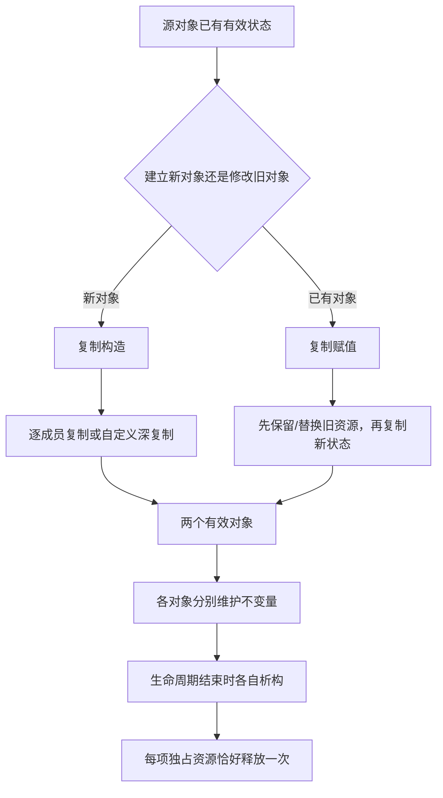

# 第 21 天：拷贝构造、拷贝赋值与 Rule of Three

## 今日目标

学完本单元后，你应能区分“用已有对象初始化新对象”和“给已存在对象赋新值”，准确解释复制构造函数、复制赋值运算符、形参对象与实参之间的关系；能够识别拥有资源类的浅复制错误，实现深复制、自赋值安全和具强异常保证的复制赋值，并判断何时采用 Rule of Three、禁止复制或 Rule of Zero。

## 关键术语索引

索引只用于查阅与复习；完整定义位于表格后，正文会在概念真正参与推导的位置解释或链接。

| 可点击术语 | 一句话直观解释 |
|---|---|
| [复制构造函数](#术语-d21-01-复制构造函数) | 用已有同类对象初始化一个新对象。 |
| [复制赋值运算符](#术语-d21-02-复制赋值运算符) | 把来源对象的值赋给已经存在的对象。 |
| [特殊成员函数](#术语-d21-03-特殊成员函数) | 编译器按专门规则声明或生成的一组类成员函数。 |
| [隐式复制操作](#术语-d21-04-隐式复制操作) | 编译器在满足规则时为类生成的逐成员复制操作。 |
| [逐成员复制](#术语-d21-05-逐成员复制) | 按成员各自的复制规则依次复制子对象。 |
| [浅复制](#术语-d21-06-浅复制) | 只复制指针值，使两个对象指向同一资源。 |
| [深复制](#术语-d21-07-深复制) | 为副本建立独立资源并复制资源内容。 |
| [值语义](#术语-d21-08-值语义) | 对象复制后各自代表可独立修改的值。 |
| [所有权](#术语-d21-09-所有权) | 明确谁负责最终释放资源的责任关系。 |
| [自赋值](#术语-d21-10-自赋值) | 赋值目标和来源是同一个对象。 |
| [copy-and-swap](#术语-d21-11-copy-and-swap) | 先复制到临时对象，再交换状态完成赋值。 |
| [异常安全保证](#术语-d21-12-异常安全保证) | 操作失败时对象状态和资源应满足的承诺。 |
| [强异常保证](#术语-d21-13-强异常保证) | 操作失败时目标对象保持原值。 |
| [Rule of Three](#术语-d21-14-rule-of-three) | 手写析构、复制构造、复制赋值之一时通常审查三者。 |
| [Rule of Zero](#术语-d21-15-rule-of-zero) | 让资源成员自己管理资源，外层类不手写特殊成员。 |
| [删除函数](#术语-d21-16-删除函数) | 用 `= delete` 明确禁止某个调用。 |
| [不可复制类型](#术语-d21-17-不可复制类型) | 明确不允许由一个对象复制出另一个对象的类型。 |
| [形参对象](#术语-d21-18-形参对象) | 按值传参时为本次调用建立的参数对象。 |
| [复制省略](#术语-d21-19-复制省略) | 语言允许或要求省去某些复制/移动对象的构造。 |
| [资源句柄](#术语-d21-20-资源句柄) | 用于访问文件、内存或系统对象的值或对象。 |
| [别名](#术语-d21-21-别名) | 两个表达式或指针可指向同一对象或资源。 |
| [返回 `*this`](#术语-d21-22-返回-this) | 赋值后返回当前对象引用以匹配内置赋值语义。 |
| [`noexcept`](#术语-d21-23-noexcept) | 声明函数不应让异常逃离的异常说明。 |
| [资源不变量](#术语-d21-24-资源不变量) | 对象有效状态下资源指针、大小和所有权必须一致。 |

###### 术语-d21-01-复制构造函数

**复制构造函数（copy constructor，C++ 标准术语）**

- **新手先这样理解：** 已有一个对象，现在要创建另一个内容相同的新对象。
- **专业上更准确地说：** 复制构造函数是第一个形参为 `X&`、`const X&`、`volatile X&` 或 `const volatile X&` 且其余形参有默认实参的非模板构造函数；常见形式为 `X(const X&)`。

###### 术语-d21-02-复制赋值运算符

**复制赋值运算符（copy assignment operator，C++ 标准术语）**

- **新手先这样理解：** 左边对象已经活着，现在用右边对象替换它的值。
- **专业上更准确地说：** 复制赋值运算符是名为 `operator=` 的非静态非模板成员函数，具有一个同类相关形参；常见形式为 `X& operator=(const X&)`。它不开始目标对象的生命周期。

###### 术语-d21-03-特殊成员函数

**特殊成员函数（special member function，C++ 标准术语）**

- **新手先这样理解：** 编译器对构造、复制、移动和销毁专门处理的一组函数。
- **专业上更准确地说：** 默认构造函数、复制/移动构造函数、复制/移动赋值运算符和析构函数属于特殊成员函数；其隐式声明、删除及生成受其他成员声明和子对象能力影响。

###### 术语-d21-04-隐式复制操作

**隐式复制操作（课程统称，对应 implicitly-declared/defined copy operations）**

- **新手先这样理解：** 没有自己写复制函数时，编译器在规则允许下替类生成。
- **专业上更准确地说：** 编译器可能隐式声明复制构造和复制赋值；它们可能被定义、定义为删除或弃用，具体取决于成员/基类及用户声明的特殊成员。不能假定所有类都可复制。

###### 术语-d21-05-逐成员复制

**逐成员复制（memberwise copy，C++ 对象模型术语）**

- **新手先这样理解：** 外层类按顺序让每个成员执行自己的复制操作。
- **专业上更准确地说：** 隐式定义的复制操作对直接基类和非静态数据成员按规定顺序执行复制；类成员调用其复制操作，标量成员复制其值。对裸指针，复制的是地址值而非所指资源。

###### 术语-d21-06-浅复制

**浅复制（shallow copy，工程术语）**

- **新手先这样理解：** 两个对象只复制了同一个地址，误以为各自拥有资源。
- **专业上更准确地说：** 浅复制通常指复制句柄/指针而未复制所管理资源；它本身不总错误，但若两个对象都声称独占并释放同一资源，就违反所有权协议并导致重复释放等未定义行为。

###### 术语-d21-07-深复制

**深复制（deep copy，工程术语）**

- **新手先这样理解：** 副本获得自己的资源，内容相同但存储独立。
- **专业上更准确地说：** 深复制为目标建立独立资源并复制源资源表示，使两个对象按设计具有独立所有权；是否需要深复制由类型语义决定，并非所有指针成员都应复制所指对象。

###### 术语-d21-08-值语义

**值语义（value semantics，设计术语）**

- **新手先这样理解：** 复制后像两个 `int` 一样，各自修改互不影响。
- **专业上更准确地说：** 值语义类型以值表示抽象状态，复制通常产生等值而独立的对象；身份型资源、共享所有权或不可复制对象可采用不同语义，接口必须明确。

###### 术语-d21-09-所有权

**所有权（ownership，资源管理术语）**

- **新手先这样理解：** 谁负责保证资源最终只被正确释放一次。
- **专业上更准确地说：** 所有权是资源生命周期责任协议，不是裸指针类型自带的语言属性；独占、共享和观察关系需要由类接口、RAII 类型或文档表达。

###### 术语-d21-10-自赋值

**自赋值（self-assignment，赋值操作术语）**

- **新手先这样理解：** `object = object`，左右最终是同一个对象。
- **专业上更准确地说：** 复制赋值的源对象可与目标对象相同或别名到同一对象；实现必须保持有效结果，不能先销毁源状态再读取它。

###### 术语-d21-11-copy-and-swap

**copy-and-swap（复制并交换，工程惯用法）**

- **新手先这样理解：** 先做一个安全副本，成功后再把新旧状态交换。
- **专业上更准确地说：** 赋值先构造临时副本，再用不抛异常的交换提交状态；临时对象随后析构旧资源。它常自然处理自赋值并提供强异常保证，但可能增加分配或复制成本。

###### 术语-d21-12-异常安全保证

**异常安全保证（exception safety guarantee，工程术语）**

- **新手先这样理解：** 操作中途失败时，资源不能泄漏，对象不能半坏。
- **专业上更准确地说：** 常见层级包括无泄漏且不变量保持的基本保证、失败不改变可观察状态的强保证，以及不抛异常保证；具体接口应说明承诺，第 32 天系统学习异常传播。

###### 术语-d21-13-强异常保证

**强异常保证（strong exception guarantee，工程术语）**

- **新手先这样理解：** 操作失败，看起来就像这次操作没有发生。
- **专业上更准确地说：** 若操作抛出异常，目标对象保持调用前可观察状态；copy-and-swap 在复制临时对象成功前不修改目标，因此可实现该保证，前提是提交交换不抛异常。

###### 术语-d21-14-rule-of-three

**Rule of Three（三法则，C++ 工程规则）**

- **新手先这样理解：** 如果类自己管资源并手写析构，通常也要认真处理两种复制操作。
- **专业上更准确地说：** C++11 前形成的设计经验：用户定义析构、复制构造或复制赋值之一通常表明资源协议需要三者共同审查。它不是编译器强制同时声明三者的语法规则。

###### 术语-d21-15-rule-of-zero

**Rule of Zero（零法则，现代 C++ 设计规则）**

- **新手先这样理解：** 让 `vector`、`string`、智能指针等成员管理资源，外层类不手写复制和析构。
- **专业上更准确地说：** 将资源所有权委托给具有正确特殊成员语义的成员类型，使外层类采用隐式特殊成员；这减少手写协议错误，但仍需确认隐式复制/移动符合外层抽象语义。

###### 术语-d21-16-删除函数

**删除函数（deleted function，C++ 标准术语）**

- **新手先这样理解：** 函数名存在，但任何选择到它的调用都明确不允许。
- **专业上更准确地说：** 声明后写 `= delete` 的函数参与名称查找和重载决议；若成为最佳匹配，程序病式并需诊断。它适合表达不可复制类型。

###### 术语-d21-17-不可复制类型

**不可复制类型（non-copyable type，工程术语）**

- **新手先这样理解：** 一个对象不能直接复制成另一个对象。
- **专业上更准确地说：** 复制构造和/或复制赋值不可访问或被删除的类型不可按相应方式复制；独占系统句柄、互斥量等常具有这种语义。第 22 天学习它们如何只移动。

###### 术语-d21-18-形参对象

**形参对象（parameter object，C++ 对象模型术语）**

- **新手先这样理解：** 按值调用函数时，函数内部得到本次调用自己的参数对象。
- **专业上更准确地说：** 非引用形参是函数调用建立的对象，由相应实参初始化；传入类左值通常需要复制构造。`const T&` 形参是引用绑定，不创建被引用类型的副本。

###### 术语-d21-19-复制省略

**复制省略（copy elision，C++ 标准术语）**

- **新手先这样理解：** 某些看似要复制临时对象的代码，语言允许或要求直接构造最终对象。
- **专业上更准确地说：** 标准在特定语境允许省略类对象复制/移动；C++17 对部分 prvalue 初始化规定保证省略。它不会把普通左值复制 `IntBuffer b{a};` 消除掉。

###### 术语-d21-20-资源句柄

**资源句柄（resource handle，系统与工程术语）**

- **新手先这样理解：** 程序用来找到某项资源的地址、编号或包装对象。
- **专业上更准确地说：** 裸指针、文件描述符、操作系统 HANDLE 或 RAII 包装类都可充当句柄；复制句柄是否复制所有权取决于资源协议，不能从整数或指针的按位复制推断。

###### 术语-d21-21-别名

**别名（aliasing，C++ 对象访问术语）**

- **新手先这样理解：** 不同名称、引用或指针最终指向同一个对象。
- **专业上更准确地说：** 当两个表达式指定同一对象或重叠存储时存在别名关系；自赋值不只来自文字相同，`target = alias` 也可能让源目标身份相同。

###### 术语-d21-22-返回-this

**返回 `*this`（赋值运算符惯例）**

- **新手先这样理解：** 赋值完成后返回左侧对象自己，支持 `a = b = c`。
- **专业上更准确地说：** 成员赋值运算符通常返回 `X&` 并 `return *this;`，与内置赋值表达式返回左操作数左值的使用方式一致；语言允许其他返回类型，但会破坏惯用接口。

###### 术语-d21-23-noexcept

**`noexcept`（C++ 关键字与异常说明）**

- **新手先这样理解：** 函数承诺不让异常离开。
- **专业上更准确地说：** 若异常逃出 `noexcept(true)` 函数，程序调用 `std::terminate`；将交换标成 `noexcept` 需要其所有成员交换确实不抛异常。它不是“编译器自动吞掉异常”。

###### 术语-d21-24-资源不变量

**资源不变量（resource invariant，设计术语）**

- **新手先这样理解：** 大小、指针和释放责任必须始终互相匹配。
- **专业上更准确地说：** `IntBuffer` 的有效状态要求 `size_ == 0` 时允许 `data_ == nullptr`，`size_ > 0` 时 `data_` 指向至少 `size_` 个 `int` 且由本对象独占；构造、复制、赋值和析构必须共同维护。

---

## 一、完整知识地图



复制操作处在完整对象生命周期中：复制构造开始一个新对象的生命周期；复制赋值不创建新目标对象，而是在目标已存活时改变其值。它们最终必须与析构协议一致。

## 二、范围标签

### 今天掌握

- 复制构造与复制赋值的触发条件及对象身份差异。
- 隐式逐成员复制、裸指针浅复制与资源所有权冲突。
- 深复制、资源不变量、自赋值和返回 `*this`。
- copy-and-swap、基本/强异常安全保证的入门判断。
- Rule of Three、删除复制操作和 Rule of Zero。
- 按值形参对象与 `const T&` 引用形参的复制差异。

### 先看全貌

- 特殊成员函数相互影响的规则还包括移动操作和析构函数；今天先完整处理复制侧。
- 标准容器和字符串已经实现复制/移动及分配器协议，今天观察值语义，不展开模板与复杂度细节。
- 异常保证依赖每个子操作是否抛异常；今天用 `new[]` 和 `noexcept swap` 建立可验证模型。

### 后续深入

- 第 22 天：移动构造、移动赋值、右值引用与 `std::move`。
- 第 23 天：`unique_ptr`、`shared_ptr` 与所有权表达。
- 第 27～28 天：模板、容器复制/移动复杂度、分配器及重分配。
- 第 32 天：异常传播与异常安全保证系统化。

## 三、复制构造与复制赋值不能混称

[复制构造函数](#术语-d21-01-复制构造函数)用于初始化新对象：

```cpp
IntBuffer original{3};
IntBuffer constructed{original};
IntBuffer also_constructed = original;
```

后两行都建立新对象，`=` 出现在声明中仍是初始化，不是赋值。

[复制赋值运算符](#术语-d21-02-复制赋值运算符)作用于已经存在的目标：

```cpp
IntBuffer assigned{1};
assigned = original;
```

`assigned` 原来的资源必须安全处理，然后对象继续同一段生命周期。标准惯用签名：

```cpp
IntBuffer(const IntBuffer& other);
IntBuffer& operator=(const IntBuffer& other);
```

这里 `other` 是 `const` 引用形参，允许读取源对象但不建立一个额外 `IntBuffer` 形参副本。

## 四、编译器生成的逐成员复制

[特殊成员函数](#术语-d21-03-特殊成员函数)可能被编译器隐式声明。[隐式复制操作](#术语-d21-04-隐式复制操作)通常执行[逐成员复制](#术语-d21-05-逐成员复制)：

- `std::string` 成员调用字符串自己的复制操作。
- `std::vector<int>` 成员调用向量自己的复制操作。
- `int*` 成员只复制地址值。

最后一项不会自动复制动态数组。如果外层对象把裸指针当作独占所有权，隐式复制会让两个对象都以为自己应该 `delete[]` 同一个地址。

## 五、浅复制为何导致重复释放

[浅复制](#术语-d21-06-浅复制)不是“复制得不够深”的模糊说法，而是资源协议层的状态：

```text
first.data_  ─┐
               ├──> 同一块动态数组
second.data_ ─┘
```

`BadBuffer second{first};` 的隐式复制构造只复制指针值。两个析构函数随后都执行 `delete[]`，第二次释放同一动态分配产生未定义行为。这里还形成了资源[别名](#术语-d21-21-别名)，但接口没有表达共享所有权。

[所有权](#术语-d21-09-所有权)是释放责任协议；裸指针不会自动告诉编译器它是所有者还是观察者。[资源句柄](#术语-d21-20-资源句柄)可复制，不代表底层资源应被双重释放。

## 六、深复制建立独立资源

[深复制](#术语-d21-07-深复制)为副本分配自己的数组：

```cpp
IntBuffer::IntBuffer(const IntBuffer& other)
    : size_{other.size_},
      data_{other.size_ == 0 ? nullptr : new int[other.size_]} {
    if (size_ != 0) {
        std::copy(other.data_, other.data_ + other.size_, data_);
    }
}
```

此后修改副本元素不影响源对象，类型表现出[值语义](#术语-d21-08-值语义)。构造函数必须保持[资源不变量](#术语-d21-24-资源不变量)：非零大小对应独占且足够大的数组，零大小不进行空指针算术或解引用。

若分配抛出异常，完整 `IntBuffer` 尚未构造完成，析构函数不会针对它执行；已完成的成员子对象按第 20 天规则清理。由于裸数组分配尚未交给已构造 RAII 成员，代码必须保持“分配成功后才记录所有权”的简单顺序。

## 七、复制赋值必须保护原有对象

错误思路是：先释放目标资源，再尝试分配并复制。如果分配失败，目标对象已失去原值，甚至可能留下不一致指针和大小。

本单元采用 [copy-and-swap](#术语-d21-11-copy-and-swap)：

```cpp
IntBuffer& IntBuffer::operator=(const IntBuffer& other) {
    if (this == &other) {
        return *this;
    }
    IntBuffer temporary{other};
    swap(temporary);
    return *this;
}
```

真实状态变化：

1. `temporary` 深复制源对象；若分配失败，目标尚未改变。
2. `swap` 以不抛异常方式交换大小和指针。
3. 目标拥有新资源，临时对象拥有旧资源。
4. 临时对象离开作用域，析构并释放旧资源。

这提供[强异常保证](#术语-d21-13-强异常保证)：复制失败时目标维持原值。它属于更广的[异常安全保证](#术语-d21-12-异常安全保证)体系，第 32 天继续。

`swap` 标为 [`noexcept`](#术语-d21-23-noexcept)，因为交换 `std::size_t` 与裸指针不会抛异常。若成员类型的交换可能抛出，就不能无条件作此承诺。

## 八、自赋值与返回 `*this`

[自赋值](#术语-d21-10-自赋值)不只来自 `a = a`；引用或指针别名也可能让源目标是同一对象：

```cpp
IntBuffer& alias{assigned};
assigned = alias;
```

`this == &other` 可快速返回。即使移除该检查，完整 copy-and-swap 仍会先建立独立副本，因此可正确处理自赋值，但会做一次不必要复制。

[返回 `*this`](#术语-d21-22-返回-this)让赋值表达式返回左侧对象引用：

```cpp
a = b = c;
```

先执行 `b = c` 并返回 `b`，再把 `b` 赋给 `a`。

## 九、按值传参会建立形参对象

```cpp
void print_first(IntBuffer buffer);
print_first(original);
```

`buffer` 是本次调用的[形参对象](#术语-d21-18-形参对象)，由左值实参 `original` 复制构造；函数返回时形参析构。若函数只观察对象，应考虑：

```cpp
void print_first(const IntBuffer& buffer);
```

这绑定引用，不复制 `IntBuffer`。选择按值还是引用需要结合语义和成本；第 22 天会看到按值参数如何利用移动。

[复制省略](#术语-d21-19-复制省略)不会自动消除普通左值实参到按值形参的必要复制。C++17 对某些 prvalue 初始化保证直接构造，但不能把“编译器可能优化”当作接口成本模型。

## 十、Rule of Three、禁止复制与 Rule of Zero

[Rule of Three](#术语-d21-14-rule-of-three)是设计审查规则：类一旦手写析构、复制构造或复制赋值之一，通常意味着它直接管理资源，三者必须一起审查。它不是语法要求，也不保证三者写出来就正确。

若资源具有唯一身份，深复制没有合理含义，应把类型设计成[不可复制类型](#术语-d21-17-不可复制类型)：

```cpp
UniqueHandle(const UniqueHandle&) = delete;
UniqueHandle& operator=(const UniqueHandle&) = delete;
```

[删除函数](#术语-d21-16-删除函数)仍参与重载决议，但选中它会使程序在狭义编译阶段被诊断。第 22 天会为这类对象提供移动所有权。

现代 C++ 更优先考虑 [Rule of Zero](#术语-d21-15-rule-of-zero)：

```cpp
class Samples {
private:
    std::string name_;
    std::vector<int> values_;
};
```

`string` 和 `vector` 自己管理资源并提供值语义复制，外层类通常无需手写析构和复制操作。但仍应确认外层抽象是否真的应复制；含互斥量或身份资源的类不会因使用标准成员就自动具有值语义。

## 十一、`std::string` 与 `std::vector` 的复制模型

今天补齐的层次是：复制外层对象时，字符串和向量成员调用自身复制操作，副本拥有独立的逻辑值；修改副本元素不会修改源容器的元素。

暂不把它称为完整容器模型：

- 小字符串优化是实现选择，不是语言保证。
- `vector` 复制通常需要按元素复制并可能分配，但精确复杂度和分配器传播第 28 天学习。
- 移动后状态、重分配和指针/引用/迭代器失效在第 22、28 天深入。

## 十二、真实构建、运行与内存实验

### 12.1 分离编译主示例

```bash
g++ -std=c++17 -Wall -Wextra -Wpedantic -Iexamples/day-21 \
    -c examples/day-21/int_buffer.cpp -o int_buffer.o
g++ -std=c++17 -Wall -Wextra -Wpedantic -Iexamples/day-21 \
    -c examples/day-21/main.cpp -o main.o
g++ main.o int_buffer.o -o day21_main
./day21_main
```

预期输出：

```text
original: 10, 20
constructed: 99
assigned: 77
parameter copy: 10
```

完整构建仍是：头文件被预处理包含 → 两个翻译单元分别狭义编译和汇编 → 两个目标文件 → 链接 → 可执行文件 → 操作系统装载运行。复制构造发生在运行期，不能代替构建阶段。

安全检查：

```bash
g++ -std=c++17 -g -Og -Wall -Wextra -Wpedantic \
    -fsanitize=address,undefined -fno-omit-frame-pointer \
    -Iexamples/day-21 examples/day-21/main.cpp examples/day-21/int_buffer.cpp \
    -o day21_san
./day21_san
```

### 12.2 浅复制重复释放实验

```bash
g++ -std=c++17 -g -Og -Wall -Wextra -Wpedantic \
    -fsanitize=address -fno-omit-frame-pointer \
    examples/day-21/shallow_copy_error.cpp -o shallow_copy_error
./shallow_copy_error
```

预期 ASan 报告 `double-free`。具体地址和栈帧编号是实现与本次运行信息，不属于 C++ 保证。

### 12.3 删除复制操作实验

```bash
g++ -std=c++17 -Wall -Wextra -Wpedantic \
    examples/day-21/deleted_copy_error.cpp -o deleted_copy_error
```

预期在狭义编译阶段报告使用了已删除的复制构造函数；不会生成目标可执行程序。

## 十三、常见误区

1. **“声明里有 `=` 就是复制赋值”**：错误。`X b = a;` 是初始化新对象。
2. **“复制指针会自动复制所指数组”**：错误。内置指针复制只复制地址值。
3. **“浅复制一定错误”**：不准确。观察指针或明确共享协议可以复制；错误来自语义和所有权不匹配。
4. **“写析构函数就够了”**：错误。默认复制可能造成重复释放。
5. **“自赋值只会写成 `a = a`”**：错误。别名也可能使源目标同一。
6. **“copy-and-swap 永远最快”**：错误。它简化正确性与异常安全，但可能产生额外分配。
7. **“`= delete` 表示函数不存在”**：错误。它存在于候选与诊断规则中，但不可调用。
8. **“Rule of Three 是标准强制规则”**：错误。它是工程设计经验。
9. **“Rule of Zero 表示类没有复制行为”**：错误。外层类通常使用成员生成的隐式复制行为。
10. **“传 `const T&` 会复制一个 const 对象”**：错误。引用形参绑定到实参对象。

## 十四、练习入口

独立练习单：[第 21 天练习](../exercises/day-21.md)

先画资源指向关系，再编译运行。故意浅复制程序只能在 Sanitizer 实验中使用，不要把一次“没崩溃”当作合法证据。

## 十五、完成标准

- 能根据目标对象是否已存在区分复制构造与复制赋值。
- 能解释隐式逐成员复制为何会复制裸指针地址。
- 能画出浅复制和深复制后的资源所有权图。
- 能实现深复制构造和自赋值安全的复制赋值。
- 能说明 copy-and-swap 如何提供强异常保证及其成本。
- 能选择 Rule of Three、删除复制或 Rule of Zero。
- 能解释按值形参对象与 `const T&` 引用形参的差异。

## 十六、本单元知识缺口结算

- `G09`：保持“部分已发布”。本单元补齐 `std::string` 的外层对象复制和值语义；移动、模板身份和容器关系待第 22～23、27～28 天。
- `G16`：保持“部分已发布”。本单元补齐类对象按值传参时的形参复制、引用形参不复制及生命周期边界；移动、转发引用和引用折叠待第 22、27 天。
- `G20`：保持“部分已发布”。本单元补齐 `std::vector` 作为成员时的复制和值语义；移动、复杂度、分配器、重分配与失效规则待第 22、27～28 天。
- `G28`：保持“部分已发布”。本单元补齐拥有动态资源类的深复制、复制赋值、异常安全、Rule of Three 与 Rule of Zero；移动和智能指针待第 22～23 天，容器替代待第 28 天。

> 教材发布只表示内容可学习；个人状态只有在练习经过批改并达到完成标准后才能更新。
