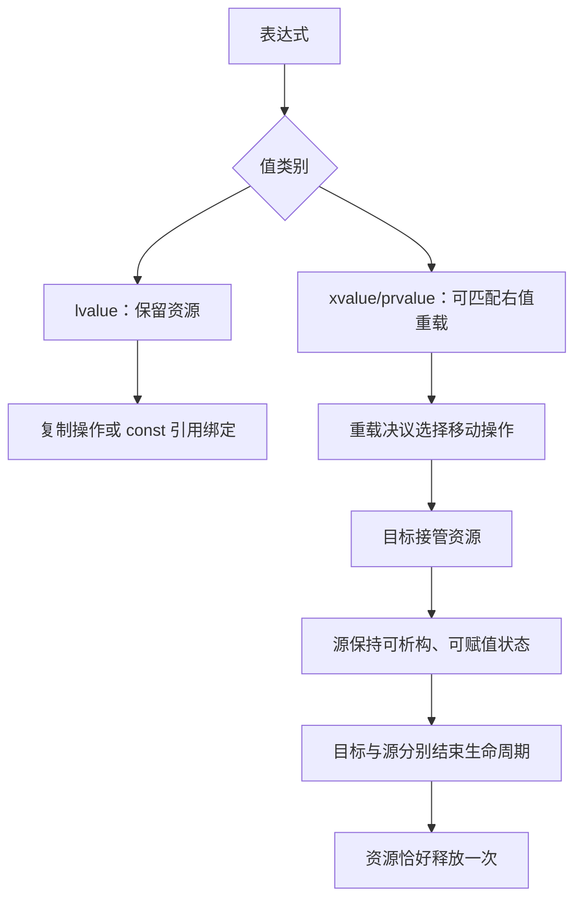

# 第 22 天：移动语义、右值引用与 `std::move`

## 第一遍：先把一个具体问题学会（必学）

> 如果你的基础较弱，今天先只完成这一节和配套练习。下面的“第二遍”是专业细节，不是读懂第一遍的前置条件。

### 1. 今天到底解决什么问题

函数返回一个大型缓冲区时，我们希望转交它的资源，而不是复制全部元素。但 `std::move` 本身并不搬数据，它只是允许选择移动操作。

### 2. 先看这几行代码

```cpp
std::vector<double> source{1.0, 2.0, 3.0};
std::vector<double> target{std::move(source)};
// target 获得元素；source 仍有效，但一般状态不可假定
```

不要先问“这个术语的完整定义是什么”。先逐行回答：当前已有哪个对象、值或文件；这一行读了什么；这一行改变或生成了什么。

### 3. 沿着同一批对象或文件走一遍

| 顺序 | 你必须能指出的具体变化 |
|---|---|
| 1 | `std::move(source)` 只是把表达式转换成可绑定右值引用的形式 |
| 2 | 重载决议选择 `vector` 的移动构造函数 |
| 3 | 目标对象接管或以类型允许的方式取得资源 |
| 4 | 来源对象仍可析构和重新赋值；其他状态遵守类型保证 |
| 5 | 移动构造通常标记 `noexcept`，有助于容器在重分配时选择移动 |

如果不能复述上表，就修改一个输入、手写预测并运行 [本课可运行示例](../examples/day-22/main.cpp)；不要靠继续读更多术语解决。

### 4. 只给已经看到的现象命名

| 核心概念 | 先用人话理解 | 回到代码或命令找证据 |
|---|---|---|
| **左值与右值** | 表达式类别影响能否识别为可复用对象或可被转移资源的来源。 | 具名对象通常是左值 |
| **移动构造/赋值** | 从来源接管资源以建立新对象或替换旧对象。 | `Buffer b{std::move(a)}` |
| **std::move** | 只把表达式转换成可供移动重载选择的形式，本身不搬资源。 | 真正转移发生在移动操作中 |
| **移后状态与 noexcept** | 来源仍须可析构、可赋值；标准容器是否优先移动常受 noexcept 影响。 | 不要假设所有移后对象为空 |

这些解释是第一遍可用模型。第二遍会补边界和专业规则；补细节不等于推翻这里的主线。

### 5. 先形成一个求职可用回答

> `std::move` 不执行移动，只做类型转换，使移动构造或移动赋值有机会被选择。真正的资源转移由类型的移动操作实现。被移动对象必须仍可析构和赋值，但具体值通常只保证有效而未指定，除非类型给出更强保证。优先 Rule of Zero；手写资源所有者时移动赋值还要先处理目标旧资源并保持异常安全。

这段话的结构是“具体问题 → 代码/对象/文件发生什么 → 使用哪条规则 → 有什么边界”。不要只背术语。

请直接在问题下写自己的版本：

1. 为什么从 `const` 对象使用 `std::move` 往往仍然复制？

   > 

2. `noexcept` 为什么会影响 `vector` 重分配策略？

   > 

### 6. 今天明确不要求什么

不把 `std::move` 当性能开关；先确认对象资源、来源状态和移动是否真的被选中。

暂缓不等于删除：第二遍会明确展开，课程计划也标出了对应单元。

### 7. 必须动手完成

- 可运行示例：[main.cpp](../examples/day-22/main.cpp)
- 配套练习：[day-22.md](../exercises/day-22.md)
- 编程任务：比较一个大型 `std::vector<double>` 的复制构造与移动构造，并只依赖标准保证判断来源对象后续可做什么。
预期结果：

```text
`copied` 和 `moved` 都有 1000 个元素；来源对象仍可清空、赋值和析构
```

- 故障实验：这通常选择复制而非移动。根据 `const` 来源与移动构造参数类型解释原因，不要只说“编译器没优化”。

第一遍完成标准：

- [ ] 我实际运行了正常示例，而不是只读代码。
- [ ] 我能不看讲义复述上面的状态变化表。
- [ ] 我完成了概念检查、可运行任务和调试任务，并写下面试口述初稿。
- [ ] 我能说出一个当前方案的限制，不把入门模型说成全部规则。

---

## 第二遍：完整专业细节（完成第一遍后再读）

这一部分保留完整语言模型、工具边界和深入实验。第一遍已经能跑、能调试、能口述后再进入；一次只读一个小节，并继续把术语落回代码、对象、文件或诊断。

## 今日目标

学完本单元后，你应能区分 lvalue、xvalue 与 prvalue，准确说明右值引用和 `std::move` 的作用；能够为独占动态资源类实现移动构造与移动赋值，保持源对象可析构、可赋值，并解释 `noexcept` 如何影响标准容器的操作选择，以及 Rule of Five 与 Rule of Zero 的边界。

## 关键术语索引

索引只用于查阅与复习；正文会在术语真正参与推导的位置解释或链接到同一个真实标题。

| 可点击术语 | 一句话直观解释 |
|---|---|
| [移动语义](#术语-d22-01-移动语义) | 把可转移资源从源对象交给目标对象。 |
| [移动构造函数](#术语-d22-02-移动构造函数) | 用右值来源初始化新对象并转移状态。 |
| [移动赋值运算符](#术语-d22-03-移动赋值运算符) | 让已有目标释放旧状态并接管来源状态。 |
| [右值引用](#术语-d22-04-右值引用) | 以 `T&&` 形式绑定可被移动来源的引用。 |
| [lvalue](#术语-d22-05-lvalue) | 有稳定身份、可再次通过表达式找到的值类别。 |
| [xvalue](#术语-d22-06-xvalue) | 有身份但资源允许被复用的将亡值。 |
| [prvalue](#术语-d22-07-prvalue) | 用于初始化对象或计算操作数的纯右值。 |
| [`std::move`](#术语-d22-08-stdmove) | 把表达式转换为允许匹配移动重载的 xvalue。 |
| [重载决议](#术语-d22-09-重载决议) | 从可行函数中选出最佳匹配。 |
| [被移动对象](#术语-d22-10-被移动对象) | 资源可能已转出的源对象。 |
| [有效但未指定状态](#术语-d22-11-有效但未指定状态) | 对象仍满足类型要求，但具体值不能假定。 |
| [资源转移](#术语-d22-12-资源转移) | 改变资源所有者而不复制资源内容。 |
| [自移动赋值](#术语-d22-13-自移动赋值) | 移动赋值的源和目标是同一对象。 |
| [`noexcept`](#术语-d22-14-noexcept) | 承诺异常不会逃出函数。 |
| [回退复制](#术语-d22-15-回退复制) | 为保持保证而选择复制而非可能抛出的移动。 |
| [Rule of Five](#术语-d22-16-rule-of-five) | 资源类需一起审查析构、复制和移动五个操作。 |
| [Rule of Zero](#术语-d22-17-rule-of-zero) | 让资源成员管理特殊成员，外层类不手写。 |
| [返回值优化](#术语-d22-18-返回值优化) | 在特定返回场景直接构造最终对象。 |
| [转发引用](#术语-d22-19-转发引用) | 依赖类型推导、能保留实参值类别的 `T&&`。 |
| [移动后复用](#术语-d22-20-移动后复用) | 给被移动对象重新赋值或调用有明确前置条件的操作。 |

## 一、完整知识地图



[移动语义](#术语-d22-01-移动语义)并没有跳过对象模型：目标对象仍需构造或已存在，源对象生命周期通常仍继续，最终两者都按析构规则结束。直观上它把可转移资源交给目标；专业上，具体移动效果由所选特殊成员及各子对象的移动规则决定。

## 二、范围标签

### 今天掌握

- lvalue、xvalue、prvalue 与普通右值引用绑定。
- `std::move` 是转换，资源转移发生在选中的移动操作中。
- 移动构造、移动赋值、源对象重置和自移动安全。
- 被移动对象的有效状态、标准库“有效但未指定”与自定义强保证。
- `noexcept` 对容器重分配选择的影响。
- Rule of Five、删除复制和 Rule of Zero。

### 先看全貌

- 返回对象可能触发保证复制省略、NRVO、移动或复制，不能用单一口诀描述全部情况。
- 标准容器的移动复杂度还受分配器传播和元素类型影响。
- 模板中的 `T&&` 可能是转发引用，不等同于本单元普通右值引用。

### 后续深入

- 第 23 天：智能指针的独占、共享和观察所有权。
- 第 27 天：类型推导、引用折叠、转发引用与 `std::forward`。
- 第 28 天：容器移动复杂度、分配器、重分配及迭代器失效。
- 第 32 天：异常传播与 `noexcept` 设计。

## 三、值类别决定可绑定的重载

普通变量名 `buffer` 是 [lvalue](#术语-d22-05-lvalue)，表示有身份且未被标记为可复用资源。`IntBuffer{3}` 是 [prvalue](#术语-d22-07-prvalue)，用于初始化结果。`std::move(buffer)` 是 [xvalue](#术语-d22-06-xvalue)：仍指示同一对象，但允许资源被复用。

[右值引用](#术语-d22-04-右值引用)常见形式：

```cpp
IntBuffer&& reference{IntBuffer{3}};
```

注意：表达式 `reference` 有名字，所以它本身是 lvalue。若要再次传给移动重载，需要明确 `std::move(reference)`。

## 四、`std::move` 不执行移动

[`std::move`](#术语-d22-08-stdmove)只把表达式转换成 xvalue。随后由[重载决议](#术语-d22-09-重载决议)选择复制或移动候选：

```cpp
IntBuffer destination{std::move(source)};
```

资源真正转移发生在 `IntBuffer(IntBuffer&&)` 函数体中。如果类型没有移动构造，或者更合适的候选是复制，`std::move` 也不会凭空生成移动。

## 五、移动构造：接管并清空源所有权

[移动构造函数](#术语-d22-02-移动构造函数)为新对象建立状态：

```cpp
IntBuffer::IntBuffer(IntBuffer&& other) noexcept
    : size_{other.size_}, data_{other.data_} {
    other.size_ = 0;
    other.data_ = nullptr;
}
```

[资源转移](#术语-d22-12-资源转移)的真实内存状态：

```text
移动前：source.data_ ──> 动态数组
移动后：destination.data_ ──> 同一动态数组
        source.data_ == nullptr
```

没有复制数组元素。源必须放弃所有权，否则两个析构函数会重复释放。

## 六、移动赋值：先处理目标旧资源

[移动赋值运算符](#术语-d22-03-移动赋值运算符)作用于已存在对象：

```cpp
IntBuffer& IntBuffer::operator=(IntBuffer&& other) noexcept {
    if (this != &other) {
        delete[] data_;
        size_ = other.size_;
        data_ = other.data_;
        other.size_ = 0;
        other.data_ = nullptr;
    }
    return *this;
}
```

顺序是：释放目标原资源 → 接管源句柄 → 清空源所有权。`this != &other` 保护[自移动赋值](#术语-d22-13-自移动赋值)。移动赋值不创建新的目标对象，也不重新开始其生命周期。

## 七、被移动对象还能做什么

[被移动对象](#术语-d22-10-被移动对象)仍在其原生命周期内。标准库通常保证[有效但未指定状态](#术语-d22-11-有效但未指定状态)：可以析构、赋新值，其他调用必须满足前置条件，不能猜测具体内容一定为空。

本课程的 `IntBuffer` 提供更强的自定义后置条件：移动后 `size() == 0` 且指针为空。因此可以观察大小，也可[移动后复用](#术语-d22-20-移动后复用)：

```cpp
source = IntBuffer{2};
```

不要把 `IntBuffer` 的“移动后为空”推广为所有 `string` 或 `vector` 的标准保证。

## 八、从 const 对象通常复制

```cpp
const Tracker source;
Tracker target{std::move(source)};
```

`std::move(source)` 的类型是 `const Tracker&&`。普通移动构造 `Tracker(Tracker&&)` 不能丢掉 const，因此不可行；`Tracker(const Tracker&)` 可以绑定该表达式，示例输出 `copy`。移动通常需要修改源以解除所有权，所以普通移动参数不是 const。

## 九、`noexcept` 与标准容器

移动裸指针和整数不抛异常，因此两个移动操作声明 [`noexcept`](#术语-d22-14-noexcept)。`vector` 扩容时旧元素必须迁移到新存储；若元素移动可能抛出且复制可用，为维护异常保证，实现可能[回退复制](#术语-d22-15-回退复制)。

不能为了“让 vector 移动”谎报 `noexcept`：异常一旦逃出该函数，程序会 `std::terminate`。应从成员操作证明不抛，而不是靠愿望标注。

## 十、返回对象不总会移动

```cpp
IntBuffer make_buffer() {
    IntBuffer result{3};
    return result;
}
```

[返回值优化](#术语-d22-18-返回值优化)可能让 `result` 直接构造在调用者目标位置；命名返回值优化（NRVO）是允许的优化。若未省略且条件满足，返回局部对象可隐式选择移动。C++17 对直接返回 prvalue 的部分场景保证省略，但不要为了“促使移动”写 `return std::move(result);`，它可能妨碍 NRVO。

## 十一、Rule of Five 与 Rule of Zero

[Rule of Five](#术语-d22-16-rule-of-five)要求直接管理资源的类共同审查：析构、复制构造、复制赋值、移动构造、移动赋值。用户声明析构或复制操作会影响移动操作的隐式声明，因此不能假定“编译器总会补移动”。

生产代码优先 [Rule of Zero](#术语-d22-17-rule-of-zero)：使用 `vector`、`string` 和智能指针成员，让资源类型组合正确特殊成员。是否允许复制仍由抽象语义决定。

模板中的 `T&&` 可能是[转发引用](#术语-d22-19-转发引用)，依赖类型推导、引用折叠与 `std::forward`；今天的 `IntBuffer&&` 已确定类型，是普通右值引用，第 27 天再完整学习。

## 十二、`std::string` 与 `std::vector` 的移动边界

今天可以确认：移动字符串或向量通常允许其资源被目标复用，源保持标准规定的有效但未指定状态。但不能宣称：

- 移动一定是常数复杂度；分配器条件可能影响容器移动赋值。
- 源一定为空。
- 所有指针、引用或迭代器都保持有效；具体规则第 28 天学习。

## 十三、真实构建与错误实验

### 13.1 分离编译主示例

```bash
g++ -std=c++17 -Wall -Wextra -Wpedantic -Iexamples/day-22 \
    -c examples/day-22/int_buffer.cpp -o int_buffer.o
g++ -std=c++17 -Wall -Wextra -Wpedantic -Iexamples/day-22 \
    -c examples/day-22/main.cpp -o main.o
g++ main.o int_buffer.o -o day22_main
./day22_main
```

预期输出：

```text
source size: 0
destination size: 0
assigned: 10, 30
reused source size: 2
vector size: 2
```

构建仍完整经历预处理、狭义编译、汇编、目标文件、链接、可执行文件、装载和运行；移动操作发生在运行时对象语义中。

安全检查：

```bash
g++ -std=c++17 -g -Og -Wall -Wextra -Wpedantic \
    -fsanitize=address,undefined -fno-omit-frame-pointer \
    -Iexamples/day-22 examples/day-22/main.cpp examples/day-22/int_buffer.cpp \
    -o day22_san
./day22_san
```

### 13.2 const 来源实验

```bash
g++ -std=c++17 -Wall -Wextra -Wpedantic \
    examples/day-22/const_move_copies.cpp -o const_move_copies
./const_move_copies
```

预期输出 `copy`，证明 `std::move` 不保证选中移动构造。

### 13.3 错误移动实验

`bad_move_error.cpp` 转移指针后没有清空源，两个对象都释放同一数组：

```bash
g++ -std=c++17 -g -Og -Wall -Wextra -Wpedantic \
    -fsanitize=address -fno-omit-frame-pointer \
    examples/day-22/bad_move_error.cpp -o bad_move_error
./bad_move_error
```

预期 ASan 报告 `double-free`。具体地址、退出码和栈帧不是语言保证。

## 十四、常见误区

1. **“`std::move` 会移动对象”**：错误；它只进行值类别转换。
2. **“右值引用变量表达式仍是右值”**：错误；有名字的变量表达式是 lvalue。
3. **“移动后源对象生命周期结束”**：错误；通常仍需安全析构或赋值。
4. **“所有被移动对象都为空”**：错误；标准库一般只保证有效但未指定。
5. **“移动一定比复制快”**：错误；由类型实现、资源和分配器决定。
6. **“const 对象也能正常转移所有权”**：通常错误；普通移动需修改源。
7. **“`noexcept` 会吞掉异常”**：错误；异常逃出会终止程序。
8. **“返回局部对象必须写 `std::move`”**：错误；可能妨碍 NRVO。
9. **“写了析构，编译器一定生成移动”**：错误；特殊成员声明相互影响。

## 十五、练习入口

独立练习单：[第 22 天练习](../exercises/day-22.md)

先画出移动前后的两个指针和所有权，再运行错误实验。不要以“程序没崩”为移动实现正确的证据。

## 十六、完成标准

- 能区分 lvalue、xvalue、prvalue 与普通右值引用。
- 能复述 `std::move` 只转换、不转移资源。
- 能实现移动构造、移动赋值、源重置和自移动保护。
- 能说明标准库有效但未指定状态与自定义后置条件的区别。
- 能解释 const 来源为何通常复制、`noexcept` 为何影响容器。
- 能区分返回值优化与移动，并选择 Rule of Five 或 Rule of Zero。

## 十七、本单元知识缺口结算

- `G09`：保持“部分已发布”。补齐 `std::string` 外层移动及移动后状态边界；模板身份、智能指针关系和容器细节待第 23、27～28 天。
- `G16`：保持“部分已发布”。补齐类对象移动、右值引用、const 来源与按值接收移动基础；转发引用和引用折叠待第 27 天。
- `G20`：保持“部分已发布”。补齐 `std::vector` 移动、`noexcept` 与重分配选择的基础；复杂度、分配器和失效规则待第 27～28 天。
- `G28`：保持“部分已发布”。补齐拥有资源对象的移动构造/赋值、Rule of Five 和源状态；智能指针与容器替代待第 23、28 天。

> 教材发布不等于学习完成；个人状态只有在练习经过批改并达到标准后才能更新。

---

## 附录：关键术语卡（查阅用）

###### 术语-d22-01-移动语义

**移动语义（move semantics，C++ 标准机制与工程术语）**

- **新手先这样理解：** 不复制整块资源，而是把控制资源的句柄交给新对象。
- **专业上更准确地说：** 类的移动特殊成员从右值来源初始化或赋值目标；具体效果由类型实现决定，可能转移资源，也可能逐成员移动甚至复制。语言不保证“移动一定更快”。

###### 术语-d22-02-移动构造函数

**移动构造函数（move constructor，C++ 标准术语）**

- **新手先这样理解：** 创建新对象时接管源对象可转移的资源。
- **专业上更准确地说：** 移动构造函数第一个形参为 `X&&`、`const X&&` 等同类右值引用且其余形参有默认实参；常见形式为 `X(X&&)`，它开始目标对象生命周期。

###### 术语-d22-03-移动赋值运算符

**移动赋值运算符（move assignment operator，C++ 标准术语）**

- **新手先这样理解：** 目标已经存在，先处理旧资源，再接管源资源。
- **专业上更准确地说：** 移动赋值是接受同类右值引用相关形参的非静态 `operator=`；它不开始目标生命周期，必须维护目标和源的有效状态及自移动边界。

###### 术语-d22-04-右值引用

**右值引用（rvalue reference，C++ 标准术语）**

- **新手先这样理解：** `T&&` 可绑定临时对象或显式标为可移动的对象。
- **专业上更准确地说：** 非转发语境的 `T&&` 可绑定到相应右值；引用本身不是新对象，也不自动移动。命名后的右值引用变量表达式本身是 lvalue。

###### 术语-d22-05-lvalue

**lvalue（左值，C++ 值类别）**

- **新手先这样理解：** 有稳定身份，之后还能通过名字或表达式找到它。
- **专业上更准确地说：** lvalue 是 glvalue 的一种，指示具有身份且非 xvalue 的对象或函数。普通变量名表达式通常是 lvalue，即使变量类型为 `T&&`。

###### 术语-d22-06-xvalue

**xvalue（将亡值，C++ 值类别）**

- **新手先这样理解：** 对象仍有身份，但其资源可被移动操作复用。
- **专业上更准确地说：** xvalue 是指示对象或位域且其资源可被复用的 glvalue；`std::move(object)` 通常产生 xvalue，不执行资源转移本身。

###### 术语-d22-07-prvalue

**prvalue（纯右值，C++ 值类别）**

- **新手先这样理解：** 用来计算或初始化结果的临时性值表达式。
- **专业上更准确地说：** prvalue 初始化对象/位域或计算运算符操作数；C++17 的临时量实质化和值类别规则不能简单等同于“没有地址的临时对象”。

###### 术语-d22-08-stdmove

**`std::move`（标准库函数模板）**

- **新手先这样理解：** 它把对象标记为“接下来允许被移动重载处理”。
- **专业上更准确地说：** `std::move` 进行类似 `static_cast<remove_reference_t<T>&&>(value)` 的转换，产生 xvalue；只有随后选中的构造、赋值或函数实现才可能转移资源。

###### 术语-d22-09-重载决议

**重载决议（overload resolution，C++ 标准术语）**

- **新手先这样理解：** 编译器在复制版和移动版等候选中选择最匹配函数。
- **专业上更准确地说：** 名称查找得到候选后，语言依据参数绑定和转换序列等规则选择最佳可行函数；xvalue 通常可优先匹配 `T&&`，const xvalue 则不能绑定普通 `T&&`。

###### 术语-d22-10-被移动对象

**被移动对象（moved-from object，工程术语）**

- **新手先这样理解：** 资源可能已经交出去，但对象还没有自动消失。
- **专业上更准确地说：** 移动操作的源对象生命周期通常仍继续；其后置状态由具体类型规定。析构和重新赋值必须安全，其他操作需满足该类型说明的前置条件。

###### 术语-d22-11-有效但未指定状态

**有效但未指定状态（valid but unspecified state，标准库术语）**

- **新手先这样理解：** 对象没坏，但不能猜里面具体还有什么值。
- **专业上更准确地说：** 对象不变量成立且可按类型规定调用操作，但标准未指定其具体状态；标准库对象移动后通常具有此状态，某个自定义类型可提供更强后置条件。

###### 术语-d22-12-资源转移

**资源转移（resource transfer，所有权工程术语）**

- **新手先这样理解：** 目标接管指针，源放弃释放责任。
- **专业上更准确地说：** 对独占资源，移动操作将句柄和所有权关联转给目标，并把源调整为不会重复释放的有效状态；它不等同于复制底层内容。

###### 术语-d22-13-自移动赋值

**自移动赋值（self-move-assignment，工程术语）**

- **新手先这样理解：** `object = std::move(object)`，源目标其实同一个。
- **专业上更准确地说：** 移动赋值实现可能收到身份相同的源目标；自定义资源类应明确处理，常用 `this != &other` 防止先释放后接管同一资源。

###### 术语-d22-14-noexcept

**`noexcept`（C++ 关键字与异常说明）**

- **新手先这样理解：** 函数承诺不会把异常传播出去。
- **专业上更准确地说：** 异常若逃出非抛出函数会调用 `std::terminate`；移动函数只有在所有执行路径确实不抛时才应标记。标准容器可借此选择保持异常保证的策略。

###### 术语-d22-15-回退复制

**回退复制（copy fallback，标准库实现策略术语）**

- **新手先这样理解：** 移动可能抛异常时，容器可能改用复制来保护旧数据。
- **专业上更准确地说：** `vector` 重分配等操作可依据元素移动是否 `noexcept` 及复制是否可用选择复制，以维持异常保证；具体条件由容器操作的标准要求决定。

###### 术语-d22-16-rule-of-five

**Rule of Five（五法则，现代 C++ 工程规则）**

- **新手先这样理解：** 直接管理资源时，析构、两种复制和两种移动要一起审查。
- **专业上更准确地说：** C++11 后的设计经验：用户定义任一资源相关特殊成员通常需要审查析构、复制构造/赋值、移动构造/赋值；它不是要求所有类都手写五个函数的语言规则。

###### 术语-d22-17-rule-of-zero

**Rule of Zero（零法则，现代 C++ 工程规则）**

- **新手先这样理解：** 用标准资源成员，让编译器组合正确复制和移动。
- **专业上更准确地说：** 外层类把资源所有权委托给 `vector`、`string`、智能指针等 RAII 成员，从而通常无需用户定义特殊成员；仍需确认生成的复制/移动符合抽象语义。

###### 术语-d22-18-返回值优化

**返回值优化（Return Value Optimization, RVO，C++ 标准机制/工程名称）**

- **新手先这样理解：** 返回对象时可能直接在最终位置构造，连移动都不发生。
- **专业上更准确地说：** 复制省略在特定返回/初始化场景允许省略复制移动，C++17 对部分 prvalue 场景保证直接构造；NRVO 对命名局部返回仍是允许而非普遍强制。

###### 术语-d22-19-转发引用

**转发引用（forwarding reference，C++ 标准库/模板术语）**

- **新手先这样理解：** 某些模板中的 `T&&` 能接左值也能接右值，并保留原值类别。
- **专业上更准确地说：** 转发引用是满足特定类型推导条件的 cv-unqualified 模板参数右值引用等；它依赖引用折叠和 `std::forward`，不同于已经确定类型的 `IntBuffer&&`。第 27 天深入。

###### 术语-d22-20-移动后复用

**移动后复用（reuse after move，工程术语）**

- **新手先这样理解：** 先给源对象一个新值，再继续正常使用。
- **专业上更准确地说：** 被移动对象可析构或赋值；调用其他成员前必须满足其前置条件。自定义 `IntBuffer` 明确把源置为空，因此 `size()` 可读为 0，但不能把此保证推广到所有类型。

---
