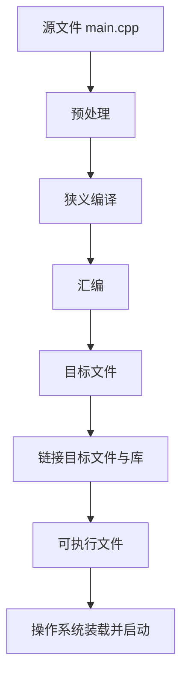

# 第 1 天批改：程序、源代码、编译与运行

批改日期：2026-07-28  
结论：**达标，可以进入第 2 天**  
参考得分：**9 / 10**

> 说明：练习 4 的关键报错尚未填写，因此保留为补充项；它不影响你进入下一单元。

## 逐题反馈

### 练习 1：预测输出

你的预测内容正确：

```text
Robot
Learning
```

代码中的字符串并没有在 `Learning` 后输出空格。你填写时出现的行尾空格大概率只是编辑造成的，不影响你对换行的理解。

**得分：2 / 2**

### 练习 2：修改程序

你的代码正确：

```cpp
#include <iostream>

int main() {
    std::cout << "Robot learning started!\n";
    return 0;
}
```

已使用 C++17 和常用警告选项实际编译运行，输出符合要求。

**得分：2 / 2**

### 练习 3：独立编写

你的程序结构完整，三条输出语句和换行均正确。已实际编译运行，结果为：

```text
Name: HaoxiangLian
Direction: Robotics
Day: 1
```

**得分：2 / 2**

### 练习 4：制造并修复错误

“关键报错”处目前为空，无法确认你是否完成了记录。

请补做一次：删除某条 `std::cout` 语句末尾的分号，编译后把包含 `error:` 的关键一行记录在原练习文件中。不同编译器的文字可能不同，重点是学会从错误信息中找到文件、行号和错误原因。

**得分：0 / 1（补充后可改为 1 / 1）**

### 练习 5：用自己的话解释

你的五个回答方向均正确。

更准确的说法如下：

1. **源代码**：程序员编写、便于人阅读的代码文本。
2. **编译器**：检查并翻译 C++ 源代码，最终帮助生成计算机能够执行的程序。
3. **可执行文件**：编译、链接成功后得到的、可以由操作系统启动的程序文件。
4. **`main`**：C++ 程序开始执行的入口函数。
5. **重新编译的原因**：修改的只是源代码；旧可执行文件不会自动变化，必须重新编译才能生成包含新改动的可执行文件。

其中第 4 题建议把“程序运行时跑的主函数”改成“程序开始执行的入口函数”，表达会更准确。

**得分：3 / 3**

## 总结

你已经掌握了第 1 天最重要的主线：

> `.cpp` 源代码 → 编译器处理 → 生成可执行文件 → 运行

接下来只需补充练习 4 的错误信息记录。第 2 天可以正式开始学习变量、类型、初始化和表达式。


## 反馈

我觉得你给我安排的学习内容是阉割版的，比如说：源码如何变成可执行程序：

flowchart TD
    A["源文件 main.cpp"] --> B["预处理：展开头文件和宏"]
    B --> C["编译：语法、类型检查与优化"]
    C --> D["汇编：生成机器指令"]
    D --> E["目标文件：代码、符号表、重定位信息"]
    E --> F["链接：解析符号并修正地址"]
    F --> G["可执行文件"]

而你给我的学习内容是直接源文件编译就得到了可执行文件，我感觉你对我的学习内容做了阉割和简化，虽然我是一个初学者，但是这是我不希望的。

---

## 对学习者反馈的反思与整改

反馈指出：第 1 天把“源文件经过编译得到可执行文件”称作完整过程，隐藏了预处理、狭义编译、汇编、目标文件和链接。这个批评成立。

### 我的问题

1. **把命令层面的简写当成了知识层面的完整模型。**  
   `g++ main.cpp -o main` 看起来是一条命令，但通常是编译器驱动程序组织多个工具和阶段完成构建。我没有及时区分“广义编译/构建”和“狭义编译阶段”。

2. **把“降低入门门槛”错误地做成了“删除节点”。**  
   初学者确实不必在第一天掌握符号表和重定位，但应当先看见完整路线，并知道哪些部分今天只作概览。

3. **只有延后承诺，没有补全账本。**  
   原计划虽然把预处理和链接安排在后面，却没有逐项记录第 1 天欠下了哪些知识，也无法检查后续是否真正补齐。

4. **固定 28 天的形式压过了知识完整性。**  
   为了控制单元数量，我把若干本应独立展开的主题合并，增加了再次过度简化的风险。

### 整改决定

- 课程由 28 个单元扩展为 36 个单元，不再为了凑固定天数合并关键主题。
- 第 4 天设为专门补全课，实际观察：
  - 预处理结果
  - 汇编代码
  - 目标文件
  - 链接过程
  - 可执行文件及装载运行
- 第 15、16、17、33 天继续深化头文件与翻译单元、符号与重定位、链接属性与 ODR、CMake 与库。
- 新建 `COVERAGE_MAP.md`，登记第 1～3 天所有暂缓内容、补全单元、教材状态和学习状态。
- 今后每篇讲义都必须明确区分“今天掌握”“先看全貌”“后续深入”。
- 类比、近似说法和伪代码必须显式标注，不能冒充语言规则或编译器真实实现。

### 修正后的核心表述



更准确地说：

> 一条 `g++` 构建命令可以替我们依次组织多个阶段；并不是 `.cpp` 文件在一个不可分割的“编译步骤”后直接变成可执行文件。

这次反馈不只作为一条批改备注保留，而是已经转化为学习计划、追踪表和每日发布规则的长期约束。
